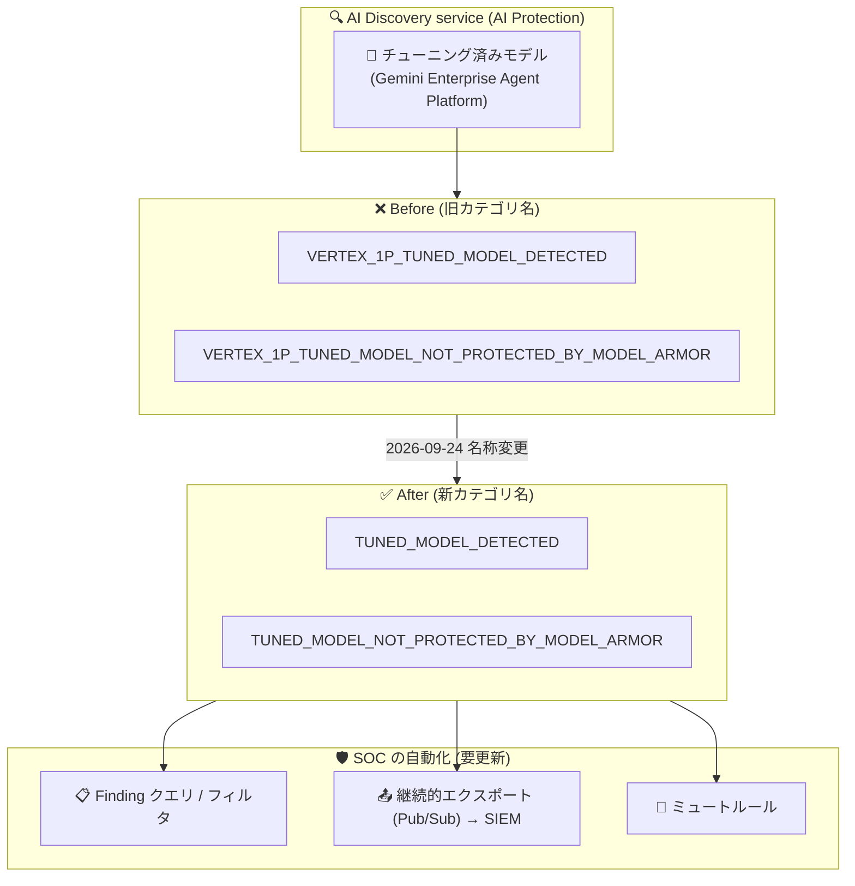

# Security Command Center: AI Protection の Finding カテゴリ名変更 (VERTEX_1P_ プレフィックス廃止)

**リリース日**: 2026-09-24

**サービス**: Security Command Center (AI Protection)

**機能**: AI Protection Finding カテゴリ名の変更

**ステータス**: 変更 (Changed)

📊 [このアップデートのインフォグラフィックを見る](https://takech9203.github.io/google-cloud-news-summary/20260924-scc-ai-protection-finding-renames.html)

## 概要

Security Command Center の AI Protection において、チューニング済みモデルに関する 2 つの Finding カテゴリ名が変更されました。AI Protection がチューニング済みモデル (tuned model) を検出することを明確にし、レガシーな `VERTEX_1P_` プレフィックスを削除することが目的です。

- `VERTEX_1P_TUNED_MODEL_DETECTED` → `TUNED_MODEL_DETECTED`
- `VERTEX_1P_TUNED_MODEL_NOT_PROTECTED_BY_MODEL_ARMOR` → `TUNED_MODEL_NOT_PROTECTED_BY_MODEL_ARMOR`

これらの Finding は、AI Protection の検出サービスである AI Discovery service が生成するもので、Gemini Enterprise Agent Platform 上のチューニング済み基盤モデルの検出と、そのモデルが Model Armor で保護されているかどうかを示します。

**このアップデートで最も注意すべき点は、機能追加ではなく「名前の変更」であるがゆえの運用影響です。** SOC チームが旧カテゴリ名 (`VERTEX_1P_*`) に依存した Finding フィルタ、ミュートルール、Pub/Sub への継続的エクスポート、SIEM 側の検知ルールなどを構成している場合、名前変更後は該当 Finding がマッチしなくなり、検知漏れや通知欠落が発生する可能性があります。旧名称を参照している自動化の棚卸しと更新を推奨します。

**アップデート前の課題**

- カテゴリ名に `VERTEX_1P_` (Vertex AI ファーストパーティ) というレガシーなプレフィックスが付いており、現在の AI Protection の検出対象 (Gemini Enterprise Agent Platform 上のモデル) を正確に反映していなかった
- 名前からは「チューニング済みモデルを検出する」という機能の意図が読み取りにくかった
- 同系統の Finding (例: `GEMINI_MODEL_DETECTED`、旧 `VERTEX_AI_MODEL_DETECTED`) と命名規則が不揃いだった

**アップデート後の改善**

- カテゴリ名が `TUNED_MODEL_*` となり、AI Protection がチューニング済みモデルを検出することが名前から明確になった
- レガシーな `VERTEX_1P_` プレフィックスが削除され、命名が簡潔になった
- Gemini モデル系 Finding (`GEMINI_MODEL_DETECTED` など) と一貫した命名体系に整理された

## アーキテクチャ図



AI Discovery service が生成するチューニング済みモデル関連の Finding カテゴリ名が変更されるため、旧名称でフィルタしている SOC 側の自動化 (クエリ、エクスポート、ミュートルール) は新名称への更新が必要です。

## サービスアップデートの詳細

### 変更されたカテゴリ名 (Before/After)

| 旧カテゴリ名 | 新カテゴリ名 | Finding クラス | 内容 |
|--------------|--------------|----------------|------|
| `VERTEX_1P_TUNED_MODEL_DETECTED` | `TUNED_MODEL_DETECTED` | Observation | チューニング済み基盤モデルが Gemini Enterprise Agent Platform で検出され、Model Armor で保護されている |
| `VERTEX_1P_TUNED_MODEL_NOT_PROTECTED_BY_MODEL_ARMOR` | `TUNED_MODEL_NOT_PROTECTED_BY_MODEL_ARMOR` | Vulnerability | 検出されたチューニング済みモデルが Model Armor で保護されていない |

### 主要ポイント

1. **命名の明確化**
   - AI Protection がチューニング済みモデル (tuned model) を検出することを名前で明示
   - レガシーな `VERTEX_1P_` プレフィックスを削除

2. **命名体系の統一**
   - 公式ドキュメント上、Gemini モデル系の Finding も同様に旧名称 (`VERTEX_AI_MODEL_DETECTED` → `GEMINI_MODEL_DETECTED`、`VERTEX_AI_MODEL_NOT_PROTECTED_BY_MODEL_ARMOR` → `GEMINI_MODEL_NOT_PROTECTED_BY_MODEL_ARMOR`) からの変更が記載されており、AI Discovery service の Finding 全体で命名が整理されている

3. **検出内容自体は変更なし**
   - リリースノートに記載されているのはカテゴリ名の変更のみで、検出ロジックや Finding クラス (Observation / Vulnerability) の変更は発表されていない

## SOC チームへの運用影響 (重要)

このような Finding カテゴリ名の変更は、カテゴリ名の文字列に依存する以下の構成に影響し得ます。旧名称 `VERTEX_1P_*` を参照している設定は、新名称にマッチしなくなるため確認が必要です。

### 影響を受け得る構成

- **Finding クエリ / 保存済みフィルタ**: Security Command Center の Findings ページや API (`category="..."` フィルタ) で旧カテゴリ名を指定しているクエリ
- **継続的エクスポート (Continuous Exports)**: Pub/Sub への継続的エクスポートはカテゴリなどの属性で Finding をフィルタできるため、旧名称でフィルタしているエクスポートは新名称の Finding を送信しない
- **ミュートルール**: カテゴリ名を条件にした静的 / 動的ミュートルールは新名称の Finding にマッチしなくなり、ミュート対象だった Finding が再びアクティブとして通知される可能性がある
- **下流の SIEM / SOAR / チケット連携**: エクスポート先 (SIEM の検知ルール、SOAR のプレイブック、ダッシュボード) で旧カテゴリ名の文字列マッチを行っている場合、検知・集計から漏れる

### 推奨アクション

1. 組織内の Finding フィルタ、継続的エクスポート、ミュートルールを対象に `VERTEX_1P_` の文字列を検索する
2. 該当する設定を新名称 (`TUNED_MODEL_DETECTED`、`TUNED_MODEL_NOT_PROTECTED_BY_MODEL_ARMOR`) に更新する (移行期間の安全策として新旧両方の名称を OR 条件で含めることも検討)
3. SIEM / SOAR 側のルール・ダッシュボードも同様に更新する
4. 更新後、対象 Finding が想定どおりエクスポート・通知されることをテストする

## 技術仕様

### 対象 Finding の仕様

| 項目 | 詳細 |
|------|------|
| 検出サービス | AI Discovery service (AI Protection の組み込み検出サービス) |
| 検出対象 | Gemini Enterprise Agent Platform 上のチューニング済み基盤モデル |
| 検出の仕組み | Cloud Monitoring のデータを使用してモデルを検出し、Model Armor による保護状態を判定 |
| Finding クラス | `TUNED_MODEL_DETECTED`: Observation / `TUNED_MODEL_NOT_PROTECTED_BY_MODEL_ARMOR`: Vulnerability |
| 対応サービスティア | AI Discovery service は Premium および Enterprise (非推奨) ティアで利用可能 |
| 料金ティア | 両 Finding とも Premium ティア |

### フィルタ更新の例

継続的エクスポートや Finding クエリでカテゴリを指定している場合の更新例:

```
# 旧 (マッチしなくなる)
category="VERTEX_1P_TUNED_MODEL_NOT_PROTECTED_BY_MODEL_ARMOR"

# 新
category="TUNED_MODEL_NOT_PROTECTED_BY_MODEL_ARMOR"

# 移行期間中の安全策 (新旧両方をカバー)
category="TUNED_MODEL_NOT_PROTECTED_BY_MODEL_ARMOR" OR category="VERTEX_1P_TUNED_MODEL_NOT_PROTECTED_BY_MODEL_ARMOR"
```

## メリット

### ビジネス面

- **命名の分かりやすさ向上**: 「チューニング済みモデルの検出」という機能の意図がカテゴリ名から直接読み取れるようになり、監査やレポーティング時の説明コストが下がる
- **レガシー用語の整理**: `VERTEX_1P_` という内部的・歴史的なプレフィックスが排除され、現行のプロダクト体系 (Gemini Enterprise Agent Platform、AI Protection) と整合する

### 技術面

- **命名規則の一貫性**: AI Discovery service の他の Finding (`GEMINI_MODEL_*`) と統一された命名体系になり、フィルタやルールの設計がしやすくなる
- **将来の拡張への布石**: プロダクト名に依存しない汎用的な名前 (`TUNED_MODEL_*`) となり、検出対象の拡張時にも名前が実態と乖離しにくい

## デメリット・制約事項

### 考慮すべき点

- **既存の自動化が破損するリスク**: 旧カテゴリ名の文字列に依存するフィルタ、ミュートルール、継続的エクスポート、SIEM ルールは更新しない限り新名称の Finding にマッチしない (本レポート「SOC チームへの運用影響」参照)
- **命名変更の周知が必要**: SOC / セキュリティ運用チームだけでなく、Finding を参照するダッシュボードやレポートの利用者にも変更を周知する必要がある
- リリースノートには旧名称の Finding の互換動作 (エイリアスなど) に関する記載はないため、旧名称を前提とした運用は継続しないことを推奨

## ユースケース

### ユースケース 1: SOC の検知パイプラインの棚卸し

**シナリオ**: SOC チームが Security Command Center の Finding を Pub/Sub 経由で SIEM にエクスポートし、`VERTEX_1P_TUNED_MODEL_NOT_PROTECTED_BY_MODEL_ARMOR` を条件に「保護されていない AI モデル」のアラートを発報している。

**実装例**:
```
1. 継続的エクスポートのフィルタを確認し、旧カテゴリ名を新名称に更新
2. SIEM 側の検知ルール・ダッシュボードのカテゴリ名を更新
3. テスト用に Finding のアクティブ状態を切り替え、Pub/Sub 経由で通知が届くことを確認
```

**効果**: 名称変更に起因するアラートの欠落を防ぎ、Model Armor 未保護のチューニング済みモデルの検知を継続できる。

### ユースケース 2: チューニング済みモデルの保護状況の可視化

**シナリオ**: AI ガバナンス担当者が、組織内の Gemini Enterprise Agent Platform 上のチューニング済みモデルのうち、Model Armor で保護されていないものを定期的に確認したい。

**効果**: 新名称 `TUNED_MODEL_NOT_PROTECTED_BY_MODEL_ARMOR` (Vulnerability) でフィルタすることで、未保護モデルを一覧化し、Model Armor テンプレートの設定によって修復できる。

## 料金

今回の変更はカテゴリ名の変更のみであり、料金への影響はありません。対象の Finding は Security Command Center の Premium ティアで提供されます。詳細は [Security Command Center の料金ページ](https://cloud.google.com/security-command-center/pricing) を参照してください。

## 関連サービス・機能

- **AI Protection**: Security Command Center の AI ワークロード保護機能。AI Discovery service、Compliance Manager フレームワーク、Model Armor、Risk Engine で構成される
- **Model Armor**: AI モデルへのプロンプト / レスポンスを保護するサービス。`TUNED_MODEL_NOT_PROTECTED_BY_MODEL_ARMOR` の修復には Model Armor テンプレートの設定が必要
- **Gemini Enterprise Agent Platform**: AI Discovery service がチューニング済みモデルを検出する対象プラットフォーム
- **Cloud Monitoring**: AI Discovery service がモデル検出に使用するデータソース
- **Pub/Sub**: Finding の継続的エクスポート先。カテゴリ名変更時はエクスポートフィルタの更新が必要

## 参考リンク

- 📊 [インフォグラフィック](https://takech9203.github.io/google-cloud-news-summary/20260924-scc-ai-protection-finding-renames.html)
- [公式リリースノート](https://docs.cloud.google.com/release-notes#September_24_2026)
- [AI Protection overview](https://docs.cloud.google.com/security-command-center/docs/ai-protection-overview)
- [AI Discovery service findings](https://docs.cloud.google.com/security-command-center/docs/concepts-vulnerabilities-findings#aip-ds-findings)
- [Finding のエクスポート (継続的エクスポート)](https://docs.cloud.google.com/security-command-center/docs/how-to-export-data)
- [Model Armor テンプレートの作成と管理](https://docs.cloud.google.com/model-armor/manage-templates)
- [料金ページ](https://cloud.google.com/security-command-center/pricing)

## まとめ

AI Protection のチューニング済みモデル関連 Finding のカテゴリ名から `VERTEX_1P_` プレフィックスが削除され、`TUNED_MODEL_*` という明確な名称に変更されました。機能面の変更はありませんが、旧名称に依存するフィルタ、ミュートルール、継続的エクスポート、SIEM ルールは新名称にマッチしなくなるため、SOC チームは早急に `VERTEX_1P_` を参照する設定を棚卸しし、新名称へ更新することを推奨します。

---

**タグ**: #SecurityCommandCenter #AIProtection #ModelArmor #セキュリティ #SOC #Finding #GeminiEnterpriseAgentPlatform
