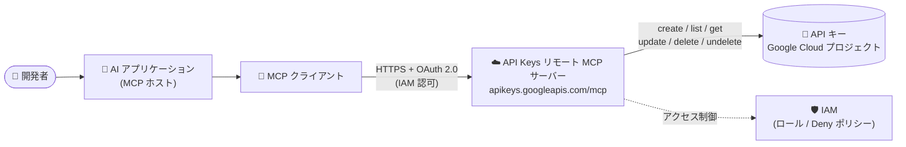

# API Keys API: リモート MCP サーバー (Preview)

**リリース日**: 2026-09-25

**サービス**: API Keys API

**機能**: API Keys リモート Model Context Protocol (MCP) サーバー

**ステータス**: Preview

📊 [このアップデートのインフォグラフィックを見る](https://takech9203.github.io/google-cloud-news-summary/20260925-api-keys-api-remote-mcp-server-preview.html)

## 概要

API Keys API のリモート Model Context Protocol (MCP) サーバーが Preview として利用可能になりました。AI アプリケーション (Claude、Gemini CLI、Cursor などの MCP ホスト) からこのリモート MCP サーバーに接続することで、Google Cloud プロジェクト内の API キーの作成、確認、制限の設定、ライフサイクル管理を自然言語で実行できるようになります。

MCP はAI アプリケーションと外部システムの接続を標準化するオープンソースプロトコルです。Google Cloud のリモート MCP サーバーはサービス側のインフラストラクチャ上で動作し、HTTP エンドポイントを提供するため、ローカルに MCP サーバーをインストール・運用する必要がありません。API Keys MCP サーバーはグローバルエンドポイント `https://apikeys.googleapis.com/mcp` で提供されます。

対象ユーザーは、AI エージェントやコーディングアシスタントを開発ワークフローに組み込んでいる開発者・プラットフォームエンジニアです。API キーの発行・制限・ローテーションといった定型的な管理作業をエージェントに委譲でき、IAM による認証・認可のもとで安全に運用できます。

**アップデート前の課題**

- AI アプリケーションから API キーを管理するには、gcloud CLI や REST API (apikeys.googleapis.com) を呼び出すカスタムツールやスクリプトを個別に実装する必要があった
- API キーの作成・制限設定・削除などの操作を、Google Cloud コンソールや CLI で手動実行する必要があった
- エージェントに API キー管理機能を持たせる標準的な方法がなく、ツール定義を自前で保守する必要があった

**アップデート後の改善**

- MCP 対応の AI アプリケーションから、標準プロトコル経由で API キーの作成・取得・更新・削除・復元・ルックアップが可能になった
- リモート MCP サーバーとして提供されるため、ローカル MCP サーバーのインストールや運用が不要になった
- OAuth 2.0 と IAM による認証・認可が組み込まれており、エージェントの操作を既存の IAM 権限モデルで制御できるようになった

## アーキテクチャ図



AI アプリケーション内の MCP クライアントが、OAuth 2.0 と IAM で認証・認可されたうえでリモート MCP サーバーのグローバルエンドポイントに接続し、公開されているツール経由でプロジェクト内の API キーを操作します。

## サービスアップデートの詳細

### 主要機能

1. **API キーのライフサイクル管理ツール**
   - `apikeys_create_key`: 指定したプロジェクトに新しい API キーを作成 (制限の指定も可能)
   - `apikeys_update_key`: 既存キーのメタデータ、制限、表示名を更新
   - `apikeys_delete_key` / `apikeys_undelete_key`: キーの削除と、削除後 30 日以内の復元

2. **API キーの検査・参照ツール**
   - `apikeys_list_keys`: プロジェクトが所有する API キーをメタデータ・制限情報付きで一覧表示
   - `apikeys_get_key`: 特定の API キーのメタデータを取得 (キー文字列自体は返さない)
   - `apikeys_get_key_string`: 実際のシークレットである API キー文字列を取得 (機密情報として扱う必要あり)
   - `apikeys_lookup_key`: キー文字列から親プロジェクトとリソース名を特定

3. **リモート MCP サーバーとしての提供**
   - グローバルエンドポイント `https://apikeys.googleapis.com/mcp` で提供され、ローカルへのインストールが不要
   - `tools/list` メソッドによる MCP ディスカバリーに対応し、AI アプリケーションがツール仕様を動的に取得可能

## 技術仕様

### MCP サーバーの仕様

| 項目 | 詳細 |
|------|------|
| エンドポイント | `https://apikeys.googleapis.com/mcp` (グローバル) |
| プロトコル | Model Context Protocol (Streamable HTTP) |
| 認証・認可 | OAuth 2.0 + IAM (すべての Google Cloud ID をサポート) |
| 提供ツール数 | 8 (list / get / get_key_string / create / update / delete / undelete / lookup) |
| ステータス | Preview |

### ツール仕様の取得例

```bash
curl --location 'https://apikeys.googleapis.com/mcp' \
  --header 'content-type: application/json' \
  --header 'accept: application/json, text/event-stream' \
  --data '{
    "method": "tools/list",
    "jsonrpc": "2.0",
    "id": 1
  }'
```

### 関連する IAM ロール

API Keys は IAM でアクセスを管理します。API キー操作に関連する主な事前定義ロールは以下のとおりです。

| ロール | 権限の概要 |
|------|------|
| `roles/serviceusage.apiKeysViewer` | キーの取得・一覧表示・ルックアップ・キー文字列の取得 |
| `roles/serviceusage.apiKeysAdmin` | 上記に加え、キーの作成・更新・削除・復元 |

## 設定方法

### 前提条件

1. Google Cloud プロジェクトと、API キー操作に必要な IAM 権限 (例: `roles/serviceusage.apiKeysAdmin`)
2. MCP サーバーの有効化と認証の設定 (詳細は [Enable or disable MCP servers](https://docs.cloud.google.com/mcp/enable-disable-mcp-servers) および [Authenticate to MCP servers](https://docs.cloud.google.com/mcp/authenticate-mcp) を参照)

### 手順

#### ステップ 1: アクセストークンの取得

```bash
gcloud auth print-access-token
```

OAuth 2.0 ベアラートークンを取得します (デフォルトの有効期限は 1 時間)。

#### ステップ 2: AI アプリケーションに MCP サーバーを設定

```json
{
  "servers": [
    {
      "name": "API Keys MCP Server",
      "uri": "https://apikeys.googleapis.com/mcp",
      "headers": {
        "Authorization": "Bearer TOKEN",
        "x-goog-user-project": "PROJECT_ID"
      }
    }
  ]
}
```

AI アプリケーションの設定ファイルに MCP サーバーエントリを追加します。`TOKEN` はベアラートークン、`PROJECT_ID` は対象プロジェクト ID に置き換えます。

## メリット

### ビジネス面

- **運用作業の効率化**: API キーの発行・制限設定・削除といった定型作業を AI エージェント経由で実行でき、手作業を削減できる
- **ガバナンスの維持**: OAuth 2.0 と IAM に基づく認証・認可により、エージェントによる操作も既存のアクセス制御・監視の枠組みで管理できる

### 技術面

- **標準プロトコルによる統合**: MCP という標準プロトコルで接続するため、カスタムツールの実装・保守が不要
- **リモート提供による運用負荷ゼロ**: サーバーは Google のインフラストラクチャ上で動作し、ローカルの MCP サーバー運用が不要
- **キー文字列と メタデータの分離**: `get_key` はキー文字列を返さず、シークレット取得は `get_key_string` に分離されているため、最小権限での運用がしやすい

## デメリット・制約事項

### 制限事項

- Preview 段階の機能であり、GA 前に仕様が変更される可能性がある
- 削除した API キーを復元できるのは削除後 30 日以内

### 考慮すべき点

- `apikeys_get_key_string` は実際のシークレット (API キー文字列) を返すため、極めて機密性の高い操作として扱い、エージェントに付与する権限を慎重に設計する必要がある
- MCP ツールを使用するエージェントには専用の ID を作成し、リソースへのアクセスを制御・監視することが推奨されている
- IAM Deny ポリシーによる MCP 利用の制御や、Model Armor による MCP リクエスト/レスポンスのサニタイズ (プロンプトインジェクション、機密データ漏えい、ツールポイズニング対策) の併用を検討する

## ユースケース

### ユースケース 1: AI コーディングアシスタントによる API キーのセットアップ自動化

**シナリオ**: 新しいアプリケーションの開発時に、必要な API に制限された API キーの作成をコーディングアシスタントに依頼する。

**実装例**:
```
「このプロジェクトに Maps API 専用の API キーを作成して、
 API 制限を設定したうえでキー文字列を教えて」
→ エージェントが apikeys_create_key (制限付き) → apikeys_get_key_string を実行
```

**効果**: コンソール操作や gcloud コマンドの手順を覚えることなく、制限付きキーの発行までを対話で完結できる。

### ユースケース 2: API キーの棚卸しとガバナンス確認

**シナリオ**: セキュリティレビューの一環として、プロジェクト内の API キーの一覧と各キーの制限設定を AI エージェントに確認させる。

**効果**: `apikeys_list_keys` でメタデータと制限情報を一括取得し、制限が未設定のキーの検出やクリーンアップ (削除・30 日以内の復元) までを対話的に実施できる。

## 料金

このアップデートに固有の料金情報は、リリースノートおよび確認できたドキュメントには記載されていません。詳細は [API Keys API ドキュメント](https://docs.cloud.google.com/api-keys/docs)を参照してください。

## 利用可能リージョン

API Keys API MCP サーバーはグローバル MCP エンドポイント (`https://apikeys.googleapis.com/mcp`) として提供されます。

## 関連サービス・機能

- **Google Cloud MCP サーバー群**: Google Cloud は複数のサービスでリモート MCP サーバーを提供しており、API Keys MCP サーバーはその 1 つ。対応サービスの一覧は [Supported products](https://docs.cloud.google.com/mcp/supported-products) を参照
- **IAM (Identity and Access Management)**: MCP ツール呼び出しの認可と、Deny ポリシーによる MCP 利用の制御を担う
- **Model Armor**: MCP リクエスト/レスポンスをスキャンし、プロンプトインジェクションや機密データ漏えいなどのリスク軽減を支援
- **Agent Registry**: Google Cloud の MCP サーバーの管理に利用できる

## 参考リンク

- 📊 [インフォグラフィック](https://takech9203.github.io/google-cloud-news-summary/20260925-api-keys-api-remote-mcp-server-preview.html)
- [公式リリースノート](https://docs.cloud.google.com/release-notes#September_25_2026)
- [API Keys MCP リファレンス](https://docs.cloud.google.com/api-keys/docs/reference/mcp)
- [Google Cloud MCP servers overview](https://docs.cloud.google.com/mcp/overview)
- [Authenticate to MCP servers](https://docs.cloud.google.com/mcp/authenticate-mcp)
- [API Keys のアクセス制御](https://docs.cloud.google.com/api-keys/docs/access-control)

## まとめ

API Keys API のリモート MCP サーバーにより、AI エージェントから標準プロトコル経由で API キーのライフサイクル全体を安全に管理できるようになりました。AI エージェントを開発・運用ワークフローに組み込んでいるチームは、まず Preview 環境で `tools/list` によるツール確認と IAM 権限設計から始め、キー文字列取得の権限は最小限に絞った運用を検討することを推奨します。

---

**タグ**: #APIKeysAPI #MCP #ModelContextProtocol #AIエージェント #Preview #セキュリティ #IAM
