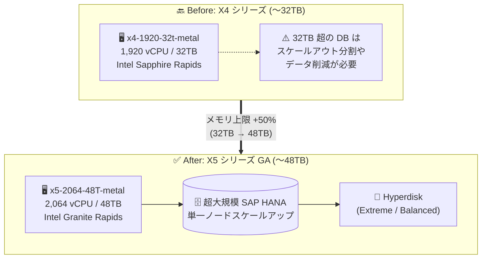

# Compute Engine: X5 シリーズ メモリ最適化ベアメタルマシンタイプの一般提供 (GA)

**リリース日**: 2026-09-25

**サービス**: Compute Engine

**機能**: X5 シリーズ メモリ最適化ベアメタルマシンタイプ (最大 48 TB メモリ)

**ステータス**: GA (一般提供)

📊 [このアップデートのインフォグラフィックを見る](https://takech9203.github.io/google-cloud-news-summary/20260925-compute-engine-x5-memory-optimized-ga.html)

## 概要

Compute Engine の新しいメモリ最適化マシンシリーズ「X5」が一般提供 (GA) になりました。X5 シリーズは、従来の X4 メモリ最適化マシンタイプの上限だった 32 TB メモリの壁を打ち破り、最大 48 TB (49,152 GB) という超大容量メモリ構成を提供します。CPU プラットフォームには Intel Granite Rapids を採用し、最大 2,064 vCPU を利用できます。

X5 シリーズは、単一ノード (スケールアップ構成) でミッションクリティカルなデータベースを容易に拡張したいという、最大規模の SAP HANA および RISE with SAP のユーザーを主な対象としています。前日 (2026-09-24) には X5 シリーズが SAP HANA スケールアップ (OLAP / OLTP) と SAP NetWeaver 向けに SAP 認定を取得したことが発表されており ([関連レポート](2026-09-24-sap-x5-bare-metal-certification.md))、今回の GA と合わせて、超大規模 SAP システムを Google Cloud で本番稼働させるための基盤が正式に整いました。

**アップデート前の課題**

- メモリ最適化ベアメタルの最大構成は X4 シリーズ (Intel Sapphire Rapids、最大 1,920 vCPU / 32 TB メモリ) であり、32 TB を超えるメモリを必要とするインメモリデータベースを単一ノードで稼働できなかった
- 32 TB を超える SAP HANA データベースは、スケールアウト構成への分割やデータ削減 (アーカイブ、データティアリング) を検討する必要があった
- Intel Granite Rapids 世代の CPU をメモリ最適化ベアメタルで利用する選択肢がなかった

**アップデート後の改善**

- 最大 48 TB メモリ / 2,064 vCPU の X5 ベアメタルインスタンスが GA となり、X4 比で 50% 大きいメモリ構成を単一ノードで利用可能になった
- 超大規模な SAP HANA データベースを、スケールアウト分割せずシンプルなスケールアップ構成のまま単一ノードで拡張できるようになった
- RISE with SAP の大規模ユーザーも、最大構成 (x5-2064-48T-metal) を SAP 管理のワークロードとして利用できるようになった

## アーキテクチャ図



X4 シリーズではメモリ上限 32 TB を超えるデータベースの単一ノード稼働が不可能でしたが、X5 シリーズの GA により最大 48 TB のスケールアップ構成が可能になりました。

## サービスアップデートの詳細

### 主要機能

1. **最大 48 TB メモリの超大容量構成**
   - 最上位の x5-2064-48T-metal は 2,064 vCPU / 49,152 GB (48 TB) メモリを提供
   - X4 シリーズの最大構成 (32 TB) から 50% のメモリ容量増
   - 12 TB / 16 TB / 24 TB / 32 TB / 48 TB の 5 つの事前定義マシンタイプを用意

2. **Intel Granite Rapids CPU プラットフォーム**
   - X4 (Intel Sapphire Rapids、第 4 世代 Xeon) より新しい世代の CPU を採用
   - vCPU 数も最大 1,920 から 2,064 に増加

3. **SAP HANA / RISE with SAP 向けの単一ノードスケールアップ**
   - 最大規模の SAP HANA および RISE with SAP ユーザーが、ミッションクリティカルなデータベースを単一ノードで容易にスケールアップ可能
   - 最大構成の x5-2064-48T-metal は、RISE with SAP プログラムで SAP が管理するワークロード向けに提供

## 技術仕様

### X5 マシンタイプ一覧

| マシンタイプ | vCPU | メモリ | CPU プラットフォーム |
|------|------|------|------|
| x5-688-12T-metal | 688 | 12,288 GB (12 TB) | Intel Granite Rapids |
| x5-688-16T-metal | 688 | 16,384 GB (16 TB) | Intel Granite Rapids |
| x5-1376-24T-metal | 1,376 | 24,576 GB (24 TB) | Intel Granite Rapids |
| x5-1376-32T-metal | 1,376 | 32,768 GB (32 TB) | Intel Granite Rapids |
| x5-2064-48T-metal | 2,064 | 49,152 GB (48 TB) | Intel Granite Rapids |

### X4 シリーズとの比較

| 項目 | X4 シリーズ | X5 シリーズ (今回 GA) |
|------|------|------|
| CPU プラットフォーム | Intel Sapphire Rapids | Intel Granite Rapids |
| 最大 vCPU | 1,920 | 2,064 |
| 最大メモリ | 32 TB | 48 TB (+50%) |
| 提供形態 | ベアメタル (事前定義タイプのみ) | ベアメタル (事前定義タイプのみ) |
| ブロックストレージ | Hyperdisk のみ | Hyperdisk のみ (ブートボリューム含む) |

### SAP HANA で利用する場合の OS 要件

| OS | 対応バージョン |
|------|------|
| SLES for SAP | 15 SP7 以降 |
| RHEL for SAP | 10.0 以降 |

## 設定方法

### 前提条件

1. X5 マシンシリーズが利用可能なリージョン / ゾーンを確認する ([利用可能なリージョンとゾーン](https://docs.cloud.google.com/compute/docs/regions-zones#available))
2. X5 に対応した OS イメージを選択する ([OS の詳細](https://docs.cloud.google.com/compute/docs/images/os-details))
3. ベアメタルインスタンスの料金・発注について、必要に応じて Google Cloud アカウントチームに確認する
4. x5-2064-48T-metal (48 TB) を利用する場合は、RISE with SAP プログラムでの SAP 管理ワークロードであることを確認する

### 手順

#### ステップ 1: マシンタイプの選定

ワークロードのメモリ要件に基づき、12 TB〜48 TB の 5 タイプから選定します。SAP HANA の場合は [SAP HANA プランニングガイドの X5 セクション](https://docs.cloud.google.com/sap/docs/sap-hana-planning-guide#x5-memory-optimized) を参照してサイジングします。

#### ステップ 2: X5 ベアメタルインスタンスの作成

```bash
# 例: X5 ベアメタルインスタンスの作成 (ブートディスクは Hyperdisk Balanced)
gcloud compute instances create memory-optimized-x5-01 \
    --zone=ZONE \
    --machine-type=x5-688-12T-metal \
    --image-family=OS_IMAGE_FAMILY \
    --image-project=OS_IMAGE_PROJECT \
    --boot-disk-type=hyperdisk-balanced
```

X5 では Hyperdisk のみが利用可能なため、ブートボリュームを含むすべてのディスクに Hyperdisk を指定します。

#### ステップ 3: データベース用ストレージの構成

SAP HANA などのデータベースの data / log ボリューム用に Hyperdisk ボリュームを作成してアタッチし、各製品のデプロイメントガイドに従ってインストールします。

## メリット

### ビジネス面

- **超大規模基幹システムのクラウド移行の実現**: 32 TB を超えるインメモリデータベースをオンプレミス大型アプライアンスから、構成変更なしで Google Cloud に移行できる
- **RISE with SAP 戦略との整合**: 最大 48 TB 構成が RISE with SAP に対応しており、SAP マネージドのクラウド移行戦略の受け皿になる
- **データ成長への長期的な備え**: 現在 32 TB 近辺で稼働するシステムに、+50% のスケールアップ余地を確保できる

### 技術面

- **単一ノードスケールアップによる運用簡素化**: スケールアウト分割に伴うテーブル分散設計・ノード間通信のチューニングが不要
- **最新世代 CPU による性能向上**: Intel Granite Rapids は X4 の Sapphire Rapids より新しい世代で、vCPU 数も最大 2,064 に増加
- **Hyperdisk による柔軟なストレージ性能**: IOPS / スループットをワークロードに合わせて独立に調整可能

## デメリット・制約事項

### 制限事項

- ブロックストレージは Hyperdisk のみ (Persistent Disk は利用不可、ブートボリュームも Hyperdisk が必要)
- 提供リージョン / ゾーンが限定される
- 事前定義マシンタイプのみで、カスタムマシンシェイプは利用不可
- 対応 OS イメージが限定される (SAP HANA の場合は SLES for SAP 15 SP7 以降または RHEL for SAP 10.0 以降)
- 最大構成の x5-2064-48T-metal は、RISE with SAP プログラムで SAP が管理するワークロード向け

### 考慮すべき点

- ベアメタルインスタンスの一般的な特性 (ライブマイグレーション非対応、起動時間が長いなど、同種の X4 シリーズと同様の挙動) を事前に検証すること
- ベアメタルの料金・発注は Google Cloud アカウントチームへの確認が推奨される (X4 と同様の提供モデル)
- SAP で利用する場合は、SAP 認定状況 (2026-09-24 発表) と SAP Note の最新情報を確認すること

## ユースケース

### ユースケース 1: 32 TB 超の SAP HANA (S/4HANA) の単一ノード移行

**シナリオ**: オンプレミスの大型アプライアンスで稼働する 32 TB 超の S/4HANA データベースを、スケールアウト分割せずに Google Cloud に移行したい。

**実装例**:
```
- データベース層: RISE with SAP 経由で x5-2064-48T-metal (48 TB)
- ストレージ: Hyperdisk Extreme (data / log)、Hyperdisk Balanced (boot / shared)
- アプリケーション層: SAP NetWeaver 認定マシンタイプ
```

**効果**: スケールアップ構成を維持したまま移行でき、データ分割やアプリケーション改修の工数を回避できる。

### ユースケース 2: X4 上の大規模 SAP HANA の基盤刷新とスケールアップ余地の確保

**シナリオ**: X4 (32 TB) の上限近くで稼働する SAP HANA について、データ増加に備えて基盤を刷新したい。

**効果**: Granite Rapids 世代への CPU 刷新と同時に、メモリ上限が 48 TB へ拡大し、スケールアウト移行を回避しつつ数年分のデータ成長に対応できる。

## 料金

X5 ベアメタルマシンタイプの公開料金は執筆時点で確認できませんでした。同種の X4 ベアメタルと同様に、料金・発注については Google Cloud アカウントチームへの問い合わせが案内されています。最新情報は以下を参照してください。

- [Compute Engine の料金](https://cloud.google.com/compute/all-pricing)
- [確約利用割引 (CUD)](https://docs.cloud.google.com/compute/docs/committed-use-discounts/purchase-commitments)

## 利用可能リージョン

X5 マシンシリーズは一部のゾーン / リージョンでのみ利用可能です。最新の提供状況は [利用可能なリージョンとゾーン](https://docs.cloud.google.com/compute/docs/regions-zones#available) を参照してください。

## 関連サービス・機能

- **Compute Engine メモリ最適化マシンファミリー (X4 / M4N / M4 / M3 / M2 / M1)**: X5 はメモリ最適化ファミリーの最上位シリーズで、X4 (最大 32 TB) の後継となる第 5 世代ベアメタル
- **Google Cloud Hyperdisk**: X5 で唯一利用可能なブロックストレージ。ワークロードに応じて IOPS / スループットを調整可能
- **SAP on Google Cloud**: X5 シリーズは SAP HANA スケールアップ (OLAP / OLTP) と SAP NetWeaver で SAP 認定済み (2026-09-24 発表、[関連レポート](2026-09-24-sap-x5-bare-metal-certification.md))
- **RISE with SAP**: 最大構成の x5-2064-48T-metal は RISE with SAP プログラムで SAP が管理するワークロード向けに提供

## 参考リンク

- 📊 [インフォグラフィック](https://takech9203.github.io/google-cloud-news-summary/20260925-compute-engine-x5-memory-optimized-ga.html)
- [公式リリースノート](https://docs.cloud.google.com/release-notes#September_25_2026)
- [Compute Engine メモリ最適化マシンファミリー](https://docs.cloud.google.com/compute/docs/memory-optimized-machines)
- [SAP HANA プランニングガイド: X5 メモリ最適化ベアメタルマシンタイプ](https://docs.cloud.google.com/sap/docs/sap-hana-planning-guide#x5-memory-optimized)
- [SAP 認定アプリケーション: X5 メモリ最適化ベアメタルマシンタイプ](https://docs.cloud.google.com/sap/docs/certifications-sap-apps#sap-certified-x5)
- [利用可能なリージョンとゾーン](https://docs.cloud.google.com/compute/docs/regions-zones#available)
- [Compute Engine の料金](https://cloud.google.com/compute/all-pricing)

## まとめ

X5 シリーズの GA により、Compute Engine のメモリ最適化ベアメタルは最大 48 TB メモリ / 2,064 vCPU (Intel Granite Rapids) へと拡大し、X4 の 32 TB 上限を 50% 上回る単一ノードスケールアップが可能になりました。32 TB 超の SAP HANA を運用中、またはデータ増加を見込む企業は、提供リージョン・対応 OS・SAP 認定状況を確認のうえ、移行や基盤刷新の候補として評価することを推奨します。48 TB 構成 (x5-2064-48T-metal) は RISE with SAP プログラムでの利用が前提となる点に注意してください。

---

**タグ**: Compute Engine, X5, メモリ最適化, ベアメタル, Intel Granite Rapids, SAP HANA, RISE with SAP, Hyperdisk, GA
