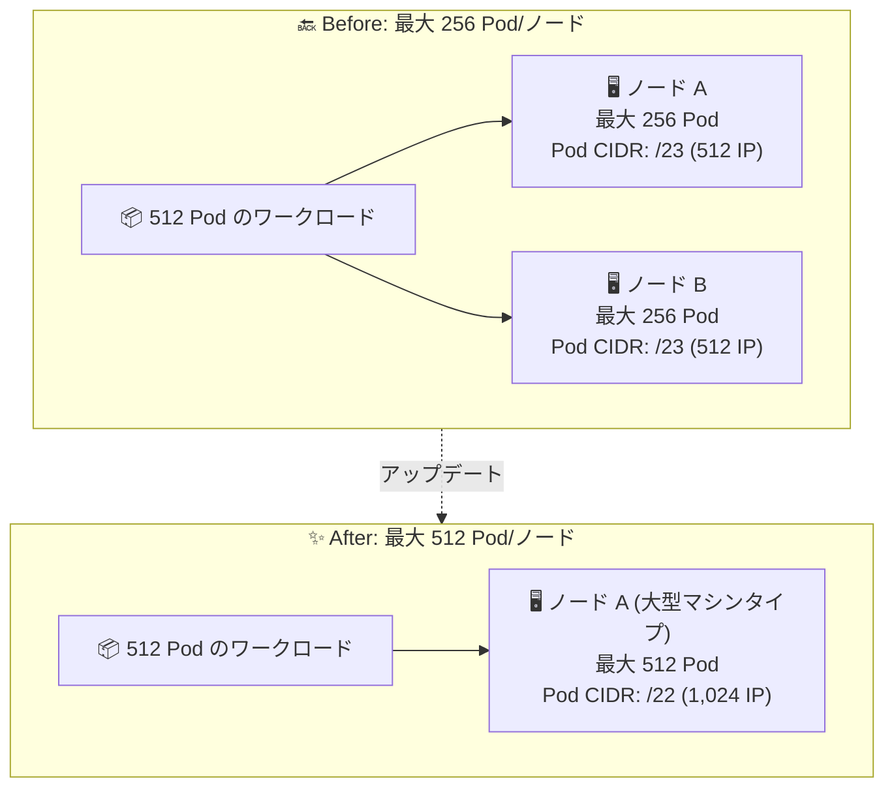

# Google Kubernetes Engine: ノードあたり最大 512 Pod のサポート

**リリース日**: 2026-09-25

**サービス**: Google Kubernetes Engine (GKE)

**機能**: ノードあたり最大 Pod 数の 512 への拡大

**ステータス**: Feature

📊 [このアップデートのインフォグラフィックを見る](https://takech9203.github.io/google-cloud-news-summary/20260925-gke-512-pods-per-node.html)

## 概要

GKE Standard クラスタで、ノードあたりの最大 Pod 数が従来の上限 256 から 512 に拡大されました。ノードあたり 257〜512 Pod に設定されたノードには、/22 の Pod CIDR ブロック (1,024 個の IP アドレス) が割り当てられます。

GKE ではノードごとに Pod 用の IP アドレス範囲 (CIDR ブロック) が割り当てられ、その CIDR ブロックのサイズはノードあたりの最大 Pod 数に対応します。CIDR ブロックには常に最大 Pod 数の 2 倍以上のアドレスが含まれるため、Pod の追加・削除時の IP アドレス再利用を抑制できる設計になっています。今回のアップデートにより、大規模なノード (高 vCPU・大容量メモリ) 上でより高い Pod 密度を実現できるようになり、ノード数を抑えたクラスタ設計が可能になります。

このアップデートは、大型マシンタイプを使用して多数の軽量な Pod を集約したいユーザーや、ノード数の削減によって運用オーバーヘッドやシステムコンポーネントのフットプリントを抑えたいユーザーに有用です。

**アップデート前の課題**

- 以前は GKE Standard クラスタのノードあたり最大 Pod 数は 256 が上限だった (割り当て CIDR は最大 /23 = 512 アドレス)
- 大型マシンタイプ (多 vCPU・大容量メモリ) のノードでも、Pod 密度の上限により計算リソースを使い切れないケースがあった
- 多数の軽量 Pod を稼働させる場合、Pod 密度の上限に達するとノード数を増やす必要があり、ノード管理のオーバーヘッドが増加していた

**アップデート後の改善**

- ノードあたり最大 512 Pod まで設定可能になり、大型ノードへの Pod 集約度を最大 2 倍に高められる
- 257〜512 Pod に設定したノードには /22 Pod CIDR ブロック (1,024 IP アドレス) が自動的に割り当てられる
- 同じ Pod 数のワークロードをより少ないノードで稼働でき、ノード数削減によるクラスタ管理の簡素化が可能になる

## アーキテクチャ図



従来は 512 Pod のワークロードに最大 Pod 数 256 のノードが 2 台必要だったのに対し、アップデート後は最大 Pod 数 512 (/22 Pod CIDR、1,024 IP アドレス) の大型ノード 1 台に集約できることを示しています。

## サービスアップデートの詳細

### 主要機能

1. **ノードあたり最大 Pod 数の上限拡大 (256 → 512)**
   - GKE Standard クラスタで、クラスタ作成時 (`--default-max-pods-per-node`) またはノードプール作成時 (`--max-pods-per-node`) に最大 512 まで設定可能
   - デフォルト値は従来どおり 110 Pod/ノード (この場合 /24 CIDR が割り当てられる)
   - ノードプールレベルの設定はクラスタレベルのデフォルト値をオーバーライドする

2. **/22 Pod CIDR ブロックの割り当て**
   - 257〜512 Pod に設定されたノードには /22 CIDR ブロック (1,024 IP アドレス) が割り当てられる
   - CIDR ブロックは常に最大 Pod 数の 2 倍以上のアドレスを含み、Pod の入れ替わり時の IP アドレス再利用を抑制する

3. **Pod 密度とノード数のトレードオフ設計**
   - 最大 Pod 数を大きくするとノードあたりの消費 IP アドレス空間が増えるため、Pod セカンダリ範囲内で確保できるノード数は減少する
   - Pod IP アドレスが不足した場合は、不連続マルチ Pod CIDR で Pod IP アドレス範囲を追加できる

## 技術仕様

### 最大 Pod 数と Pod CIDR 割り当ての対応表

| ノードあたり最大 Pod 数 | ノードあたり CIDR 範囲 | IP アドレス数 |
|------|------|------|
| 8 | /28 | 16 |
| 9 – 16 | /27 | 32 |
| 17 – 32 | /26 | 64 |
| 33 – 64 | /25 | 128 |
| 65 – 128 | /24 | 256 |
| 129 – 256 | /23 | 512 |
| **257 – 512 (新規)** | **/22** | **1,024** |

### 関連する制限・仕様

| 項目 | 詳細 |
|------|------|
| 対象クラスタ | GKE Standard クラスタ (VPC ネイティブ) |
| デフォルト値 | 110 Pod/ノード |
| ハードリミット | 512 Pod/ノード (システム Pod を含む) |
| Autopilot クラスタ | 対象外 (ワークロードの Pod 密度に基づき 8〜256 の範囲で自動設定) |
| 設定タイミング | クラスタ作成時またはノードプール作成時のみ (作成後は変更不可) |
| 前提となる想定 | 512 Pod/ノードの上限は Pod あたり平均 2 コンテナ以下を想定。コンテナ数が多い場合は実質上限が下がる可能性がある |
| 推奨リソース | Pod 10 個あたり 1 vCPU 以上のワーカーノードを推奨 |

## 設定方法

### 前提条件

1. GKE Standard クラスタであること (Autopilot は対象外)
2. VPC ネイティブクラスタであること (エイリアス IP を使用)
3. 最大 Pod 数はクラスタまたはノードプールの作成時にのみ設定可能 (作成後の変更は不可)

### 手順

#### ステップ 1: クラスタ作成時にデフォルト最大 Pod 数を設定

```bash
gcloud container clusters create CLUSTER_NAME \
    --enable-ip-alias \
    --default-max-pods-per-node=512 \
    --location=COMPUTE_LOCATION
```

`--default-max-pods-per-node` に最大 512 まで指定できます。省略した場合のデフォルトは 110 です。

#### ステップ 2: 既存クラスタに新しいノードプールを作成して設定

```bash
gcloud container node-pools create POOL_NAME \
    --cluster=CLUSTER_NAME \
    --max-pods-per-node=512
```

ノードプールレベルの `--max-pods-per-node` はクラスタレベルのデフォルト値をオーバーライドします。既存クラスタでは、新規ノードプールの作成によって高密度構成を導入できます。

## メリット

### ビジネス面

- **ノード数の削減による運用効率化**: 同じ Pod 数をより少ないノードで稼働できるため、ノードのアップグレードや監視などの管理オーバーヘッドを削減できる
- **大型マシンタイプの活用度向上**: 高 vCPU・大容量メモリのノードで Pod 密度の上限がボトルネックになりにくくなり、リソース活用率を高められる

### 技術面

- **Pod 密度の柔軟な設計**: 軽量な Pod を多数稼働させるワークロードで、ノードあたり最大 512 Pod まで集約可能
- **一貫した IP 割り当て設計**: 従来と同じ「最大 Pod 数の 2 倍以上の IP を割り当てる」設計が維持され、Pod の入れ替わり時の IP 再利用が抑制される

## デメリット・制約事項

### 制限事項

- 最大 Pod 数はクラスタ・ノードプールの作成後に変更できない (既存ノードプールに適用するには新規ノードプールの作成が必要)
- Autopilot クラスタは対象外 (最大 Pod 数は 8〜256 の範囲で自動設定され、変更不可)
- 512 Pod/ノードの上限にはシステム Pod (kube-proxy など kube-system 名前空間の Pod) も含まれる
- ノードプールの Pod セカンダリ範囲には最低 /24 の CIDR ブロックが必要

### 考慮すべき点

- ノードあたりの CIDR が /22 (1,024 IP) と大きくなるため、Pod セカンダリ範囲の IP アドレス消費が増加する。クラスタの最大ノード数は「Pod セカンダリ範囲のサイズ ÷ ノードあたり CIDR」で決まるため、IP アドレス計画の見直しが必要
- Pod セカンダリ範囲のサイズはクラスタ作成後に変更できないため、将来の成長を見込んだサイズ設計が重要 (不足時は不連続マルチ Pod CIDR で追加可能)
- 高密度ノードでは Pod あたりのリソース要求とノード容量のバランスに注意が必要。大規模デプロイでは負荷テストの実施が推奨されている
- ワーカーノードは Pod 10 個あたり 1 vCPU 以上が推奨される (512 Pod なら 52 vCPU 以上が目安)

## ユースケース

### ユースケース 1: 大型マシンタイプへの軽量マイクロサービスの高密度集約

**シナリオ**: 多数の軽量なマイクロサービス Pod を稼働させており、従来は 256 Pod/ノードの上限のため大型マシンタイプの CPU・メモリを使い切れず、ノード数が増加していた。

**実装例**:
```bash
# 高密度ノードプールを作成 (最大 512 Pod/ノード)
gcloud container node-pools create high-density-pool \
    --cluster=my-cluster \
    --machine-type=n2-standard-64 \
    --max-pods-per-node=512
```

**効果**: ノードあたりの Pod 集約度が最大 2 倍になり、同じワークロードをより少ないノードで稼働できる。ノード管理のオーバーヘッドとシステムコンポーネントの重複を削減できる。

### ユースケース 2: ノード数上限に近づいた大規模クラスタの密度向上

**シナリオ**: クラスタのノード数が増加し、ノードプールあたりのノード数上限や VPC の制約に近づいている。Pod 総数は維持しつつノード数を抑えたい。

**効果**: Pod 密度を上げることでノード数の増加を抑制し、クラスタのスケーラビリティ上の制約 (ノード数上限、ロードバランサのノード制限など) への到達を先送りできる。

## 料金

このアップデート自体に固有の追加料金はアナウンスされていません。GKE Standard クラスタの通常の料金体系 (クラスタ管理手数料 + ノードの Compute Engine リソース料金) が適用されます。ノードあたりの Pod 密度を高めてノード数を削減できる場合、ノードのリソース活用率向上を通じてコスト効率の改善が期待できます。

詳細は [GKE 料金ページ](https://cloud.google.com/kubernetes-engine/pricing) を参照してください。

## 利用可能リージョン

リリースノートにはリージョンの制限は記載されていません。詳細は [公式ドキュメント](https://docs.cloud.google.com/kubernetes-engine/docs/how-to/flexible-pod-cidr) を参照してください。

## 関連サービス・機能

- **VPC (エイリアス IP / VPC ネイティブクラスタ)**: 最大 Pod 数の設定は VPC ネイティブクラスタが前提。Pod セカンダリ範囲のサイズと最大 Pod 数の組み合わせでクラスタの最大ノード数が決まる
- **不連続マルチ Pod CIDR**: Pod IP アドレスが不足した場合に、追加の Pod IP アドレス範囲をクラスタに追加できる機能
- **GKE クラスタオートスケーラー / ノードプール**: 最大 Pod 数はノードプール単位で設定でき、ワークロード特性に応じた密度の異なるノードプールを使い分けられる
- **Network Analyzer (GKE IP 使用状況インサイト)**: GKE の IP アドレス使用率を可視化し、IP アドレス計画の見直しに活用できる

## 参考リンク

- 📊 [インフォグラフィック](https://takech9203.github.io/google-cloud-news-summary/20260925-gke-512-pods-per-node.html)
- [公式リリースノート](https://docs.cloud.google.com/release-notes#September_25_2026)
- [ドキュメント: ノードあたり最大 Pod 数の構成 (Flexible Pod CIDR)](https://docs.cloud.google.com/kubernetes-engine/docs/how-to/flexible-pod-cidr)
- [ドキュメント: GKE のクォータと上限](https://docs.cloud.google.com/kubernetes-engine/quotas)
- [ドキュメント: 大規模クラスタの計画](https://docs.cloud.google.com/kubernetes-engine/docs/concepts/planning-large-clusters)
- [料金ページ](https://cloud.google.com/kubernetes-engine/pricing)

## まとめ

GKE Standard クラスタのノードあたり最大 Pod 数が 256 から 512 に倍増し、大型マシンタイプへのワークロード集約とノード数削減が可能になりました。高密度構成では /22 Pod CIDR (1,024 IP) が割り当てられるため IP アドレス消費が増加します。導入を検討する際は、Pod セカンダリ範囲のサイズ設計と「Pod 10 個あたり 1 vCPU 以上」の推奨を踏まえたノードサイジングを確認することをおすすめします。

---

**タグ**: #GoogleKubernetesEngine #GKE #Kubernetes #Networking #PodCIDR #Scalability #VPC
