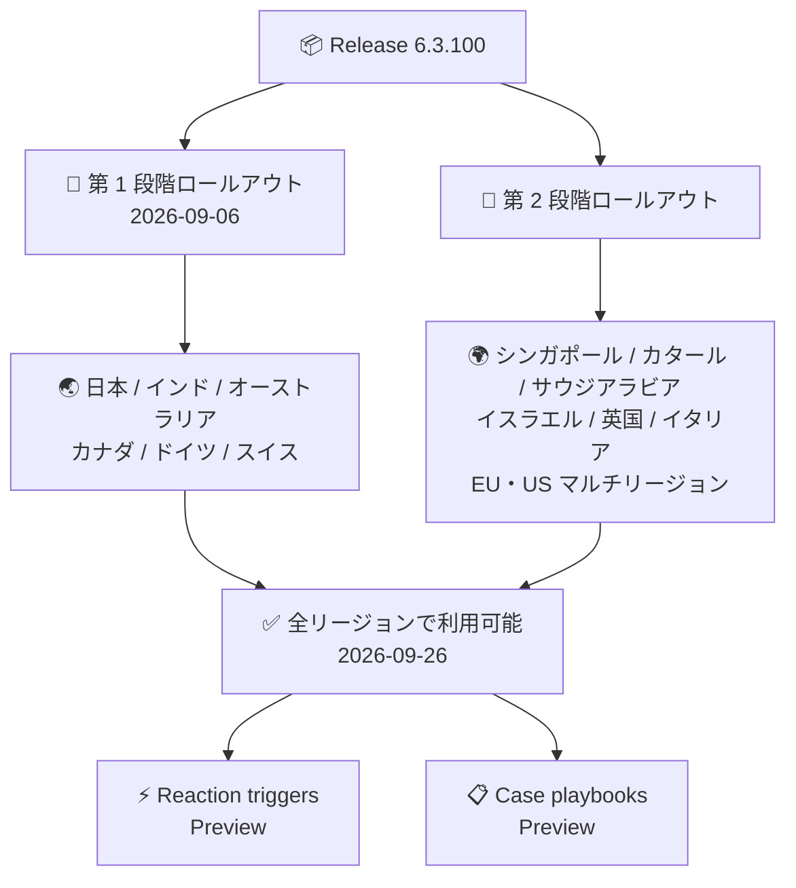

# Google SecOps SOAR: Release 6.3.100 が全リージョンで利用可能に

**リリース日**: 2026-09-26

**サービス**: Google SecOps SOAR

**機能**: Release 6.3.100 の全リージョン展開完了

**ステータス**: Announcement (リリース本体は全リージョン展開完了、含まれる新機能は Preview)

📊 [このアップデートのインフォグラフィックを見る](https://takech9203.github.io/google-cloud-news-summary/20260926-google-secops-soar-6-3-100-all-regions.html)

## 概要

2026 年 9 月 26 日、Google SecOps SOAR の Release 6.3.100 がすべてのリージョンで利用可能になりました。Release 6.3.100 は 2026 年 9 月 6 日に第 1 段階のリージョン (日本、インド、オーストラリア、カナダ、ドイツ、スイス) へのロールアウトが開始されており、今回のアナウンスにより第 2 段階のリージョン (シンガポール、カタール、サウジアラビア、イスラエル、英国、イタリア、EU マルチリージョン、US マルチリージョン) を含む全リージョンへの展開が完了しました。

Release 6.3.100 には、社内および顧客からの報告に基づくバグ修正に加えて、Preview 機能として「Reaction triggers (リアクショントリガー)」と「Case playbooks (ケースプレイブック)」の 2 つの新機能が含まれています。これらの機能は SOC (Security Operations Center) チームのインシデント対応の自動化と効率化を大きく前進させるものです。

対象ユーザーは、Google SecOps SOAR をスタンドアロンプラットフォームとして利用している顧客、および Google SecOps 内の SOAR コンポーネントを利用しているすべての顧客です。

**アップデート前の課題**

- 2026 年 9 月 6 日以降、Release 6.3.100 は第 1 段階のリージョンのみで利用可能であり、US・EU マルチリージョンなど第 2 段階のリージョンの顧客は新機能とバグ修正を利用できなかった
- プレイブックは取り込み時 (ingestion) のトリガーが中心で、調査中のケースやアラートのリアルタイムな更新 (担当者変更、タグ追加など) に応答して自動起動する仕組みがなかった
- プレイブックや手動アクションは個々のアラート単位での実行が基本であり、ケース全体に対する一括対応ができず、調査中に冗長な操作が発生していた

**アップデート後の改善**

- 全リージョンの顧客が Release 6.3.100 のバグ修正と新機能を利用できるようになった
- Reaction triggers (Preview) により、ケース担当者・ケースタグ・アラート優先度の変更や新規エンティティの追加といったリアルタイムの更新に応答してプレイブックを自動起動できるようになった
- Case playbooks (Preview) により、個々のアラートではなくケースコンテナ全体に対してプレイブックや手動アクションを実行できるようになり、対応タスクの集約と冗長な操作の削減が可能になった

## アーキテクチャ図

Google SecOps SOAR の 2 段階ロールアウトが完了し、Release 6.3.100 に含まれるバグ修正と 2 つの Preview 機能が全リージョンで利用可能になった流れを示しています。

## サービスアップデートの詳細

### 主要機能

1. **全リージョンへの展開完了**
   - Release 6.3.100 が第 2 段階のリージョンを含むすべてのリージョンで利用可能になった
   - このリリースには社内および顧客からの報告に基づくバグ修正が含まれる
   - アップデートは自動適用されるため、顧客側での作業は不要

2. **Reaction triggers (Preview)**
   - 取り込み後 (post-ingestion) のトリガーとして機能し、進行中の調査におけるケースやアラートのリアルタイム更新に応答してプレイブックを自動起動できる
   - トリガー対象の例: ケース担当者の変更、ケースタグの変更、アラート優先度の変更、新規エンティティの追加
   - 詳細: [Use reaction triggers in playbooks](https://docs.cloud.google.com/chronicle/docs/soar/respond/working-with-playbooks/using-reaction-triggers-in-playbooks)

3. **Case playbooks (Preview)**
   - 個々のアラートではなく、ケースコンテナ全体に対してプレイブックの実行や手動アクションの実行が可能
   - 対応タスクを集約し、調査中の冗長な操作を削減できる
   - 詳細: [Case playbooks overview](https://docs.cloud.google.com/chronicle/docs/soar/respond/working-with-playbooks/case-playbooks)

## 技術仕様

### リリース展開プラン (2 段階ロールアウト)

| 項目 | 詳細 |
|------|------|
| ロールアウト方式 | 2 段階 (第 2 段階は第 1 段階の 1 週間後が標準) |
| メンテナンスウィンドウ | 毎週日曜日 13:00 - 17:00 (GMT+2) |
| 第 1 段階リージョン | 日本、インド、オーストラリア、カナダ、ドイツ、スイス |
| 第 2 段階リージョン | シンガポール、カタール、サウジアラビア、イスラエル、英国 (ロンドン)、イタリア、EU (マルチリージョン)、US (マルチリージョン) |
| 6.3.100 第 1 段階開始 | 2026 年 9 月 6 日 |
| 6.3.100 全リージョン利用可能 | 2026 年 9 月 26 日 |

自身のリージョン割り当てが不明な場合は、Google SecOps の担当者に問い合わせてください。

## メリット

### ビジネス面

- **全リージョンでの機能均一化**: US・EU マルチリージョンを含むすべての顧客が同一バージョンのバグ修正と新機能を利用でき、グローバルに展開する SOC 運用でリージョン間の機能差がなくなる
- **対応工数の削減**: Case playbooks によりケース単位での一括対応が可能になり、アナリストの冗長な操作を削減できる

### 技術面

- **リアルタイム自動化の強化**: Reaction triggers により、調査中のケース状態の変化をトリガーとした自動対応フローを構築できる
- **顧客作業不要のアップデート**: リリースはメンテナンスウィンドウ中に自動適用されるため、バージョンアップ作業やダウンタイム計画の管理が不要

## デメリット・制約事項

### 制限事項

- Reaction triggers と Case playbooks はいずれも Preview 段階の機能であり、GA 前に仕様が変更される可能性がある

### 考慮すべき点

- リリースの適用は毎週日曜日 13:00 - 17:00 (GMT+2) のメンテナンスウィンドウ中に行われるため、この時間帯の運用への影響を考慮しておく
- Preview 機能を本番の対応フローに組み込む場合は、動作検証を十分に行った上で段階的に導入することを推奨

## 利用可能リージョン

Release 6.3.100 は全リージョンで利用可能です。リージョンの段階分けの詳細は [Release plan for Google SecOps](https://docs.cloud.google.com/chronicle/docs/soar/overview-and-introduction/soar-gradual-release) を参照してください。

## 関連サービス・機能

- **Google SecOps (SIEM)**: SOAR は Google SecOps プラットフォームの対応 (Response) コンポーネントとして、SIEM の検知結果からケース・アラートを生成しプレイブックで自動対応する
- **プレイブック (Playbooks)**: 今回の Reaction triggers と Case playbooks は、いずれも SOAR のプレイブック機能を拡張するもの

## 参考リンク

- 📊 [インフォグラフィック](https://takech9203.github.io/google-cloud-news-summary/20260926-google-secops-soar-6-3-100-all-regions.html)
- [公式リリースノート (Google Cloud)](https://docs.cloud.google.com/release-notes#September_26_2026)
- [Google SecOps SOAR リリースノート (Release 6.3.100 の詳細)](https://docs.cloud.google.com/chronicle/docs/soar/release-notes#September_06_2026)
- [Release plan for Google SecOps (段階的リリース計画)](https://docs.cloud.google.com/chronicle/docs/soar/overview-and-introduction/soar-gradual-release)
- [Use reaction triggers in playbooks](https://docs.cloud.google.com/chronicle/docs/soar/respond/working-with-playbooks/using-reaction-triggers-in-playbooks)
- [Case playbooks overview](https://docs.cloud.google.com/chronicle/docs/soar/respond/working-with-playbooks/case-playbooks)

## まとめ

Google SecOps SOAR Release 6.3.100 の全リージョン展開が完了し、バグ修正に加えて Reaction triggers と Case playbooks (いずれも Preview) がすべての顧客に提供されました。SOC チームは、ケースのリアルタイム更新をトリガーとしたプレイブックの自動起動や、ケース単位での一括対応の検証を開始し、インシデント対応フローの自動化強化を検討することを推奨します。

---

**タグ**: #GoogleSecOps #SOAR #セキュリティ #リリース #プレイブック #自動化
