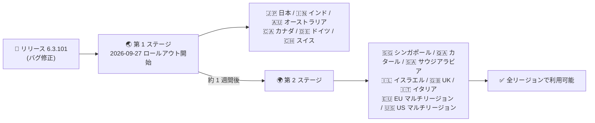

# Google SecOps SOAR: リリース 6.3.101 の第 1 フェーズリージョンへのロールアウト開始

**リリース日**: 2026-09-27

**サービス**: Google SecOps SOAR

**機能**: リリース 6.3.101 (バグ修正リリース)

**ステータス**: Announcement (段階的ロールアウト中)

📊 [このアップデートのインフォグラフィックを見る](https://takech9203.github.io/google-cloud-news-summary/20260927-google-secops-soar-6-3-101-rollout.html)

## 概要

Google SecOps SOAR のリリース 6.3.101 が、第 1 フェーズのリージョンへのロールアウトを開始しました。本リリースは内部バグ修正および顧客報告によるバグ修正 (internal and customer bug fixes) を含むメンテナンスリリースであり、新機能の追加は発表されていません。

Google SecOps SOAR のリリースは、公式ドキュメント「[Release plan for Google SecOps](https://docs.cloud.google.com/chronicle/docs/soar/overview-and-introduction/soar-gradual-release)」に定義された 2 段階の段階的ロールアウト (gradual release) プロセスに従って展開されます。アップデートは毎週日曜日のメンテナンスウィンドウ (13:00〜17:00 GMT+2) に適用され、第 2 ステージのリージョンは第 1 ステージの 1 週間後にアップグレードされます。このリリースプランは、Google SecOps SOAR をスタンドアロンプラットフォームとして利用している顧客と、Google SecOps 内の SOAR コンポーネントとして利用している顧客の両方に適用されます。

セキュリティ運用 (SOC) チームにとって、SOAR プラットフォームはインシデント対応の自動化基盤であるため、自リージョンへの適用タイミングとメンテナンスウィンドウを把握しておくことが運用上重要です。

## アーキテクチャ図

Google SecOps SOAR の段階的ロールアウトの流れ。第 1 ステージの 6 リージョンから展開が始まり、約 1 週間後に第 2 ステージの残りのリージョンへ展開されます。

## サービスアップデートの詳細

### 主要な内容

1. **リリース 6.3.101 のロールアウト開始**
   - 2026 年 9 月 27 日より第 1 フェーズのリージョンへの展開を開始
   - 内部バグ修正および顧客報告によるバグ修正を含む
   - 新機能の追加はアナウンスされていない

2. **段階的ロールアウトプロセス**
   - リリースは 2 段階 (2-stage) で展開される
   - アップデートはメンテナンスウィンドウ (毎週日曜日 13:00〜17:00 GMT+2) 中に実施される
   - 第 2 ステージのリージョンは第 1 ステージの 1 週間後にアップグレードされる

## 技術仕様

### ロールアウトステージとリージョン

| ステージ | 対象リージョン | 適用タイミング |
|------|------|------|
| 第 1 ステージ | 日本、インド、オーストラリア、カナダ、ドイツ、スイス | 2026-09-27 週から展開開始 |
| 第 2 ステージ | シンガポール、カタール、サウジアラビア、イスラエル、UK (ロンドン)、イタリア、EU (マルチリージョン)、US (マルチリージョン) | 第 1 ステージの 1 週間後 |

### メンテナンスウィンドウ

| 項目 | 詳細 |
|------|------|
| 実施曜日 | 毎週日曜日 |
| 時間帯 | 13:00〜17:00 (GMT+2) |
| 適用対象 | スタンドアロンの Google SecOps SOAR および Google SecOps 内の SOAR コンポーネント |

## メリット

### ビジネス面

- **プラットフォームの安定性向上**: 顧客から報告されたバグの修正が含まれており、SOC 運用の信頼性が向上する
- **予測可能なリリースサイクル**: 毎週日曜日の固定メンテナンスウィンドウにより、運用チームは事前に影響を見込んだ計画が立てられる

### 技術面

- **段階的展開によるリスク低減**: 第 1 ステージで問題が検出された場合、第 2 ステージへの展開前に対処できるため、全リージョンへの影響を抑えられる
- **追加作業不要**: マネージドサービスとして自動的に適用されるため、顧客側でのアップグレード作業は不要

## デメリット・制約事項

### 考慮すべき点

- リージョンによって適用タイミングが最大 1 週間程度ずれるため、複数リージョンでテナントを運用している場合はバージョン差異が一時的に発生する
- 本リリースの個別のバグ修正内容 (修正された具体的な不具合) はリリースノートに記載されていない
- 自組織のテナントが割り当てられているリージョンが不明な場合は、Google SecOps の担当者に確認する必要がある

## 利用可能リージョン

第 1 ステージ (日本、インド、オーストラリア、カナダ、ドイツ、スイス) から展開が開始され、第 2 ステージ (シンガポール、カタール、サウジアラビア、イスラエル、UK (ロンドン)、イタリア、EU マルチリージョン、US マルチリージョン) は約 1 週間後に適用されます。詳細は [Release plan for Google SecOps](https://docs.cloud.google.com/chronicle/docs/soar/overview-and-introduction/soar-gradual-release) を参照してください。

## 関連サービス・機能

- **Google SecOps (Chronicle)**: SOAR は Google SecOps プラットフォームの対応 (Respond) コンポーネントとして、SIEM の検知結果に基づく自動対応を担う
- **Google Cloud Status Dashboard**: Google SecOps SOAR のサービスステータスは [status.cloud.google.com/security](https://status.cloud.google.com/security/) で確認できる

## 参考リンク

- 📊 [インフォグラフィック](https://takech9203.github.io/google-cloud-news-summary/20260927-google-secops-soar-6-3-101-rollout.html)
- [公式リリースノート](https://docs.cloud.google.com/release-notes#September_27_2026)
- [Google SecOps SOAR リリースノート](https://docs.cloud.google.com/chronicle/docs/soar/release-notes)
- [Release plan for Google SecOps (段階的ロールアウト)](https://docs.cloud.google.com/chronicle/docs/soar/overview-and-introduction/soar-gradual-release)

## まとめ

Google SecOps SOAR 6.3.101 は内部および顧客報告のバグ修正を含むメンテナンスリリースで、第 1 フェーズのリージョン (日本を含む) から段階的に展開されます。SOC 運用チームは、自リージョンの適用タイミング (第 1 ステージか第 2 ステージか) と毎週日曜日のメンテナンスウィンドウを確認し、運用計画に反映することを推奨します。

---

**タグ**: Google SecOps, SOAR, リリース 6.3.101, バグ修正, 段階的ロールアウト, セキュリティ運用
