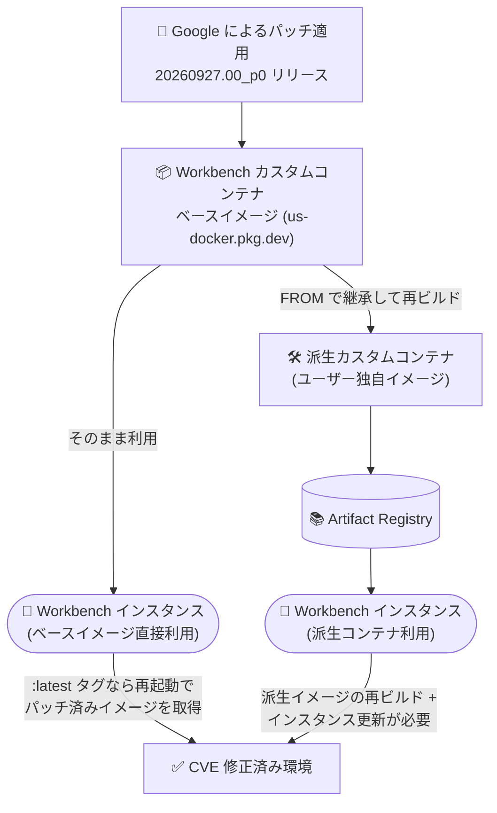

# Agent Platform Workbench: カスタムコンテナイメージの一括セキュリティパッチ (20260927.00_p0)

**リリース日**: 2026-09-28

**サービス**: Agent Platform Workbench (Gemini Enterprise Agent Platform)

**機能**: カスタムコンテナイメージの一括セキュリティパッチ (20260927.00_p0 リリース)

**ステータス**: Change / Security

📊 [このアップデートのインフォグラフィックを見る](https://takech9203.github.io/google-cloud-news-summary/20260928-agent-platform-workbench-security-patch.html)

## 概要

Agent Platform Workbench (Gemini Enterprise Agent Platform のノートブックコンポーネント) のカスタムコンテナイメージに対して、新しいイメージリリース 20260927.00_p0 が公開されました。このリリースには以下の 2 つの変更が含まれます。

1. アップストリーム依存関係からの最新パッケージのインストール
2. Workbench カスタムコンテナイメージに含まれる Critical および High 深刻度の CVE を修正する一括セキュリティパッチ

Workbench のカスタムコンテナイメージは、JupyterLab ベースのノートブック環境を提供するベースイメージであり、ユーザーはこのイメージをそのまま利用するか、これをベースに派生 (derivative) コンテナを構築してインスタンスを実行します。今回のリリースは新機能の追加ではなく、コンテナイメージ内に蓄積していた既知の脆弱性をまとめて解消するセキュリティ目的のリリースです。Workbench インスタンスを利用するすべての組織、特にセキュリティコンプライアンス要件 (脆弱性スキャンの合格基準など) を持つ組織にとって重要なアップデートです。

なお、本リリースについて個別の CVE ID のリストやセキュリティブレティンは公開されていません。リリースノートで確認できるのは「Critical および High 深刻度の CVE を修正する一括パッチ」という記述のみです。

**アップデート前の課題**

- 従来のカスタムコンテナイメージには、アップストリームパッケージ由来の Critical / High 深刻度の既知脆弱性 (CVE) が残存していた
- コンテナイメージの脆弱性スキャンを実施している組織では、ベースイメージ由来の検出項目が残り、コンプライアンス対応の負担となっていた

**アップデート後の改善**

- 一括セキュリティパッチにより、カスタムコンテナイメージ内の Critical および High 深刻度の CVE が修正された
- アップストリーム依存関係が最新パッケージに更新され、イメージ全体の鮮度が向上した
- 最新イメージ (`:latest` タグ) を参照するインスタンスは、再起動またはアップグレードするだけでパッチ適用済み環境に移行できる

## アーキテクチャ図



パッチ適用済みベースイメージから各インスタンスへの反映経路を示しています。ベースイメージを `:latest` タグで直接利用しているインスタンスは再起動でパッチが反映されますが、派生コンテナを利用している場合はユーザー側での再ビルドと更新が必要です。

## サービスアップデートの詳細

### 主要な変更点

1. **アップストリーム依存パッケージの更新**
   - コンテナイメージに含まれる OS パッケージ・言語パッケージなどのアップストリーム依存関係を最新版に更新
   - 定期的なイメージリリースの一環として実施

2. **Critical / High 深刻度 CVE の一括修正**
   - Workbench カスタムコンテナイメージ内で検出されていた Critical および High 深刻度の CVE を一括で修正 (bulk security patch)
   - 個別の CVE リストは公開されていない (リリースノート上は一括パッチとしてのみ記載)

### Workbench カスタムコンテナのイメージファミリー

Agent Platform Workbench のカスタムコンテナ (Ubuntu ベース) には、以下のイメージファミリーが存在し、それぞれ個別のイメージリリースノートページで更新が公開されています。

| イメージファミリー | 内容 | ステータス |
|------|------|------|
| workbench-container | Python 3.10 標準イメージ | Active |
| workbench-container-slim | Python 3.10 スリムイメージ | Active |
| workbench-container-2606 | Python 3.12 標準イメージ | Active |
| workbench-container-slim-2606 | Python 3.12 スリムイメージ | Active |

Python 3.12 ベースイメージは以下の URI で提供されています。

- `us-docker.pkg.dev/workbench-images/gcr.io/workbench-container-2606:latest`
- `us-docker.pkg.dev/workbench-images/gcr.io/workbench-container-slim-2606:latest`

## パッチの適用方法

セキュリティパッチはイメージの新リリースとして提供されるため、稼働中のインスタンスに反映するにはイメージの更新が必要です。

### ベースイメージを直接利用している場合

インスタンスは初回起動時に `custom-container-payload` メタデータの URI からイメージを取得します。`:latest` タグを利用している場合、**再起動のたびにコンテナが最新イメージに更新**されるため、インスタンスの再起動でパッチが反映されます。

### 派生カスタムコンテナを利用している場合

ベースイメージを `FROM` で継承した独自イメージを利用している場合は、以下の手順が必要です。

#### ステップ 1: 派生イメージの再ビルドとプッシュ

```bash
gcloud auth configure-docker REGION-docker.pkg.dev
docker build -t REGION-docker.pkg.dev/PROJECT_ID/REPOSITORY_NAME/IMAGE_NAME .
docker push REGION-docker.pkg.dev/PROJECT_ID/REPOSITORY_NAME/IMAGE_NAME:latest
```

パッチ適用済みの最新ベースイメージを取得して再ビルドします (`docker build --pull` の利用でベースイメージの再取得を確実にできます)。

#### ステップ 2: インスタンスのコンテナイメージを更新

```bash
gcloud workbench instances update INSTANCE_NAME \
  --container-repository=CONTAINER_URI \
  --container-tag=CONTAINER_TAG
```

Terraform の場合は `google_workbench_instance` リソースの `container_image` フィールドを、Notebooks API の場合は `instances.patch` メソッドで `gce_setup.container_image` を更新します。

### 自動アップグレードの活用

Workbench インスタンスでは、インスタンス作成時に自動アップグレード (auto upgrade) を有効化し、指定した定期スケジュール (`notebook-upgrade-schedule` メタデータ、unix-cron 形式) でアップグレード可否をチェック・適用させることも可能です。コンテナベースのインスタンスの場合、アップグレードで OS が更新され、Dockerfile が `:latest` タグを参照していれば最新イメージが利用されます。

## メリット

### ビジネス面

- **コンプライアンス対応の簡素化**: Critical / High 深刻度の CVE が一括修正されるため、脆弱性管理基準 (パッチ適用 SLA など) への準拠が容易になる
- **運用負荷の軽減**: ベースイメージ側の脆弱性を Google が修正するため、ユーザー側での個別パッケージ更新作業が不要

### 技術面

- **セキュアなノートブック環境**: データサイエンティストが利用する JupyterLab 環境の攻撃対象領域が縮小される
- **依存関係の鮮度維持**: アップストリームパッケージが最新化され、脆弱性以外のバグ修正・互換性改善も取り込まれる

## デメリット・制約事項

### 制限事項

- 個別の CVE ID リストやセキュリティブレティンは公開されておらず、修正対象の脆弱性を個別に特定することはできない
- パッチは自動では稼働中インスタンスに適用されない。反映にはインスタンスの再起動 (ベースイメージ直接利用かつ `:latest` タグの場合) または派生イメージの再ビルドと更新が必要

### 考慮すべき点

- 派生カスタムコンテナを利用している場合、ベースイメージのパッチはユーザーが再ビルドするまで反映されない。定期的な再ビルドパイプラインの整備を推奨
- カスタムコンテナでは `/home/USER` ディレクトリ以外への変更はエフェメラルであり、再起動で失われる。パッケージの永続化は Dockerfile への組み込みが必要
- アップグレード時の後方互換性は保証されないため、事前のデータバックアップが推奨される

## 料金

今回のアップデートはセキュリティパッチであり、料金体系への影響はありません。Workbench インスタンスの利用料金 (コンピュート、ストレージ等) は従来どおりです。詳細は料金ページを参照してください。

- [Vertex AI / Workbench の料金](https://cloud.google.com/vertex-ai/pricing)

## 関連サービス・機能

- **Artifact Registry**: 派生カスタムコンテナイメージの保存先。パッチ適用済みベースイメージからの再ビルド後にプッシュする
- **Artifact Analysis (コンテナスキャン)**: 派生イメージの脆弱性スキャンに利用でき、パッチ適用後の残存脆弱性の確認に有効
- **Compute Engine (Shielded VM)**: Workbench インスタンスの基盤。Secure Boot などと組み合わせてセキュリティ姿勢を強化できる
- **Cloud Logging**: Workbench の JupyterLab クライアントサイドログの転送先 (直近のイメージリリースで追加された機能)

## 参考リンク

- 📊 [インフォグラフィック](https://takech9203.github.io/google-cloud-news-summary/20260928-agent-platform-workbench-security-patch.html)
- [公式リリースノート (Google Cloud)](https://docs.cloud.google.com/release-notes#September_28_2026)
- [Agent Platform Workbench イメージリリースノート一覧](https://docs.cloud.google.com/gemini-enterprise-agent-platform/notebooks/workbench/instances/release-notes-image)
- [カスタムコンテナを使用したインスタンスの作成](https://docs.cloud.google.com/gemini-enterprise-agent-platform/notebooks/workbench/instances/create-custom-container)
- [Workbench インスタンスのアップグレード](https://docs.cloud.google.com/gemini-enterprise-agent-platform/notebooks/workbench/instances/upgrade)
- [イメージのバージョニングとライフサイクル](https://docs.cloud.google.com/gemini-enterprise-agent-platform/notebooks/workbench/instances/image-versioning)

## まとめ

Agent Platform Workbench のカスタムコンテナイメージに対する Critical / High 深刻度 CVE の一括セキュリティパッチです。ベースイメージを `:latest` タグで直接利用している場合はインスタンスの再起動を、派生カスタムコンテナを利用している場合はベースイメージからの再ビルドとインスタンス更新を早期に実施し、パッチ適用済み環境への移行を推奨します。

---

**タグ**: #AgentPlatformWorkbench #GeminiEnterprise #Security #CVE #ContainerImage #JupyterLab #Notebooks
