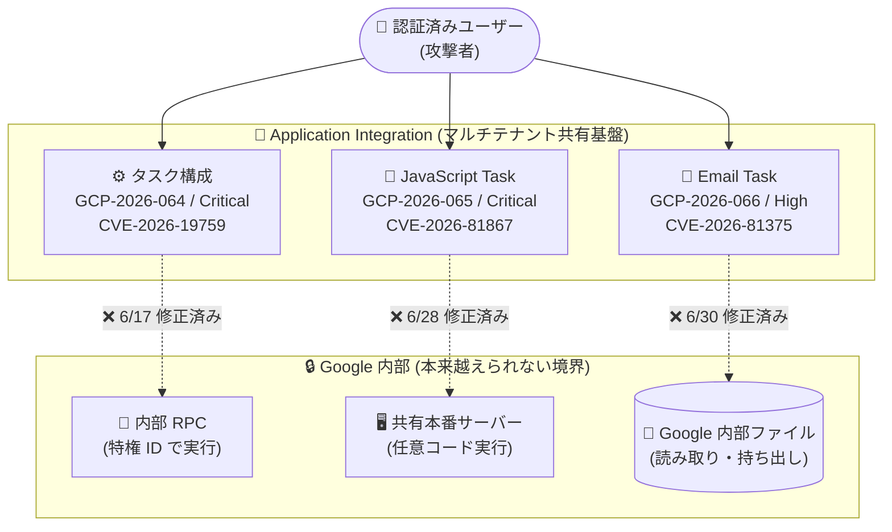

# Application Integration: セキュリティ情報 3 件 (GCP-2026-064 / 065 / 066)

**リリース日**: 2026-09-28

**サービス**: Application Integration

**機能**: セキュリティ脆弱性の修正 (Email Task / JavaScript Task / タスク構成)

**ステータス**: セキュリティ情報 (すべて修正済み・顧客対応不要)

📊 [このアップデートのインフォグラフィックを見る](https://takech9203.github.io/google-cloud-news-summary/20260928-application-integration-security-bulletins.html)

## 概要

Google Cloud は 2026 年 9 月 28 日、iPaaS サービスである Application Integration に関する 3 件のセキュリティ情報 (GCP-2026-064、GCP-2026-065、GCP-2026-066) を公開した。いずれも認証済みユーザーが Application Integration のタスク機能を悪用して、本来アクセスできない Google 内部リソースに到達し得る脆弱性であり、深刻度は Critical が 2 件、High が 1 件である。

3 件の脆弱性はすべて 2026 年 6 月中 (6 月 17 日、6 月 28 日、6 月 30 日) にサーバーサイドで修正済みであり、**顧客側の対応は不要**である。Application Integration はフルマネージドのサーバーレスサービスであるため、パッチ適用は Google 側で完結している。

対象は Application Integration を利用しているすべてのユーザーであり、Solutions Architect としては、マネージドサービスにおけるマルチテナント境界のリスクと Google の対応プロセスを把握しておくことが重要である。

**修正前に存在していた脆弱性**

- **GCP-2026-064 (Critical)**: タスク構成における Incorrect Authorization (不適切な認可) の脆弱性。認証済みユーザーが内部専用のタスクタイプを使用し、Google 内部の本番ネットワークから特権 ID で任意の内部 RPC を実行できた
- **GCP-2026-065 (Critical)**: JavaScript Task における Deserialization of Untrusted Data (信頼できないデータのデシリアライゼーション) の脆弱性。標準権限を持つ認証済みユーザーが、細工したスクリプトを使用して共有本番サーバー上で任意のコードを実行できた
- **GCP-2026-066 (High)**: Email Task コンポーネントにおける Confused Deputy (混乱した代理) の脆弱性。認証済み攻撃者が細工した添付ファイルパスを使用して、任意の Google 内部ファイルを読み取り・持ち出しできた

**修正後の状態**

- GCP-2026-064 は 2026 年 6 月 17 日に修正済み
- GCP-2026-065 は 2026 年 6 月 28 日に修正済み
- GCP-2026-066 は 2026 年 6 月 30 日に修正済み
- 3 件とも顧客側のアクションは不要 (No customer action is required)

## アーキテクチャ図

3 件の脆弱性はいずれも、認証済みユーザーが Application Integration のタスク機能を経由して Google 内部のセキュリティ境界を越え得るものだった。点線で示した攻撃経路はすべて 2026 年 6 月中の修正により遮断されている。

## サービスアップデートの詳細

### 3 件のセキュリティ情報

1. **GCP-2026-064: タスク構成における Incorrect Authorization (Critical)**
   - Application Integration の 2026 年 6 月 17 日より前のバージョンのタスク構成で発見された不適切な認可の脆弱性
   - 認証済みユーザーが内部専用 (internal-only) のタスクタイプを使用し、Google 内部の本番ネットワークから特権 ID の下で任意の内部 RPC を実行できた
   - CVE: [CVE-2026-19759](https://cve.mitre.org/cgi-bin/cvename.cgi?name=CVE-2026-19759)
   - 2026 年 6 月 17 日に修正済み。顧客対応不要

2. **GCP-2026-065: JavaScript Task における Deserialization of Untrusted Data (Critical)**
   - Application Integration の 2026 年 6 月 28 日より前のバージョンの JavaScript Task で発見された、信頼できないデータのデシリアライゼーションの脆弱性
   - 標準権限を持つ認証済みユーザーが、特別に細工したスクリプトを使用して共有本番サーバー上で任意のコードを実行できた
   - CVE: [CVE-2026-81867](https://cve.mitre.org/cgi-bin/cvename.cgi?name=CVE-2026-81867)
   - 2026 年 6 月 28 日に修正済み。顧客対応不要

3. **GCP-2026-066: Email Task における Confused Deputy (High)**
   - Application Integration の 2026 年 6 月 30 日より前のバージョンの Email Task コンポーネントで発見された Confused Deputy の脆弱性
   - 認証済み攻撃者が、細工した添付ファイルパスを使用して任意の Google 内部ファイルを読み取り、持ち出すことができた
   - CVE: [CVE-2026-81375](https://cve.mitre.org/cgi-bin/cvename.cgi?name=CVE-2026-81375)
   - 2026 年 6 月 30 日に修正済み。顧客対応不要

## 技術仕様

### 脆弱性サマリー

| 項目 | GCP-2026-064 | GCP-2026-065 | GCP-2026-066 |
|------|--------------|--------------|--------------|
| 公開日 | 2026-09-28 | 2026-09-28 | 2026-09-28 |
| 深刻度 | Critical | Critical | High |
| CVE | CVE-2026-19759 | CVE-2026-81867 | CVE-2026-81375 |
| 脆弱性タイプ | Incorrect Authorization | Deserialization of Untrusted Data | Confused Deputy |
| 影響コンポーネント | タスク構成 | JavaScript Task | Email Task |
| 影響バージョン | 2026-06-17 より前 | 2026-06-28 より前 | 2026-06-30 より前 |
| 修正日 | 2026-06-17 | 2026-06-28 | 2026-06-30 |
| 顧客対応 | 不要 | 不要 | 不要 |
| 攻撃の前提 | 認証済みユーザー | 標準権限の認証済みユーザー | 認証済み攻撃者 |

## デメリット・制約事項

### 考慮すべき点

- 3 件とも攻撃には Application Integration に対する認証済みアクセスが前提となる。IAM による最小権限の原則に基づき、Application Integration の権限付与状況を定期的にレビューすることが望ましい
- Application Integration の JavaScript Task については、2026 年 6 月 25 日にも Rhino エンジン起因の脆弱性 (GCP-2026-044 / CVE-2025-0982) が公表されており、2025 年 1 月以前に公開した統合に Rhino 依存のタスクが残っていないか確認が推奨されている (現在は V8 エンジンに完全移行済みで、Rhino での実行はブロックされる)
- 修正はいずれもサーバーサイドで完了しているため、統合の再公開や再デプロイなどの顧客側作業は発生しない

## 関連サービス・機能

- **JavaScript Task (V8 エンジン)**: 統合内でカスタム JavaScript コードを実行するタスク。2025 年 1 月以降は Google 製の V8 エンジンのみを使用し、旧 Rhino エンジンは 2026 年 3 月 30 日に完全非推奨化・実行ブロック済み
- **Send Email Task**: 統合からカスタムメール通知を送信するタスク。今回の GCP-2026-066 の対象コンポーネント
- **Cloud IAM**: Application Integration へのアクセスは IAM の事前定義ロール・権限で制御される。認証済みユーザーが前提の脆弱性であるため、権限管理が防御の第一線となる
- **Cloud Logging / Cloud Monitoring**: 統合の実行ログの記録と監視に使用でき、異常な実行の検知に活用できる

## 参考リンク

- 📊 [インフォグラフィック](https://takech9203.github.io/google-cloud-news-summary/20260928-application-integration-security-bulletins.html)
- [公式リリースノート (2026 年 9 月 28 日)](https://docs.cloud.google.com/release-notes#September_28_2026)
- [Google Cloud セキュリティ情報 GCP-2026-064](https://cloud.google.com/support/bulletins#gcp-2026-064)
- [Google Cloud セキュリティ情報 GCP-2026-065](https://cloud.google.com/support/bulletins#gcp-2026-065)
- [Google Cloud セキュリティ情報 GCP-2026-066](https://cloud.google.com/support/bulletins#gcp-2026-066)
- [Application Integration セキュリティ情報一覧](https://docs.cloud.google.com/application-integration/docs/security-bulletins)
- [Application Integration 概要](https://docs.cloud.google.com/application-integration/docs/overview)
- [JavaScript Task の構成](https://docs.cloud.google.com/application-integration/docs/configure-javascript-task)
- [Send Email Task の構成](https://docs.cloud.google.com/application-integration/docs/configure-send-email-task)

## まとめ

Application Integration で Critical 2 件・High 1 件の脆弱性が公表されたが、いずれも 2026 年 6 月中にサーバーサイドで修正済みであり、顧客側の対応は不要である。ただし 3 件とも認証済みユーザーによる悪用が前提であったことから、Application Integration に対する IAM 権限の最小化と、統合実行ログの監視体制を改めて見直す良い機会となる。

---

**タグ**: Application Integration, セキュリティ, 脆弱性, CVE-2026-19759, CVE-2026-81867, CVE-2026-81375, GCP-2026-064, GCP-2026-065, GCP-2026-066, iPaaS
