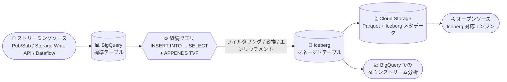

# BigQuery: 継続クエリの出力を Apache Iceberg マネージドテーブルに直接書き込み可能に

**リリース日**: 2026-09-28

**サービス**: BigQuery

**機能**: 継続クエリ (Continuous Queries) から Apache Iceberg マネージドテーブルへの書き込み

**ステータス**: 提供開始 (Feature)

📊 [このアップデートのインフォグラフィックを見る](https://takech9203.github.io/google-cloud-news-summary/20260928-bigquery-continuous-queries-iceberg-tables.html)

## 概要

BigQuery の継続クエリ (Continuous Queries) が生成する出力行を、Apache Iceberg マネージドテーブルに直接書き込めるようになりました。継続クエリは、BigQuery に到着するストリーミングデータをリアルタイムに分析・変換し続ける SQL ステートメントであり、今回のアップデートにより `INSERT` DML ステートメントを使用するだけで、その処理結果をオープンフォーマットのレイクハウス (Iceberg マネージドテーブル) へ継続的に書き込めます。

これにより、BigQuery 上のストリーミングデータに対するリアルタイムのリバース ETL、データエンリッチメント、フィルタリングの結果を、Cloud Storage 上の Iceberg 形式で保持できます。Iceberg マネージドテーブルはオープンな Apache Iceberg フォーマットでデータを保存するため、BigQuery 以外のエンジン (オープンソースの Iceberg 対応エンジンなど) からも同じデータを利用でき、レイクハウスアーキテクチャを採用する組織にとってストリーミング処理とオープンフォーマットの橋渡しとなるアップデートです。

書き込み先の指定は通常の BigQuery テーブルへの `INSERT INTO` と完全に同一の構文で行えます。接続 (Google Cloud リソース接続) やストレージバケットの設定は宛先テーブル側に定義されているため、SQL ステートメント内で接続やバケットのオプションを指定する必要はありません。

**アップデート前の課題**

- 継続クエリの出力先は BigQuery テーブル、Pub/Sub トピック、Bigtable テーブル、Spanner テーブルなどに限られており、Apache Iceberg マネージドテーブルへ直接書き込むことができなかった
- ストリーミングデータの処理結果をオープンフォーマットのレイクハウスに反映するには、BigQuery テーブルへ書き込んだ後に別途エクスポートするなど、追加のステップが必要だった

**アップデート後の改善**

- 継続クエリの `INSERT` DML ステートメントで、Iceberg マネージドテーブルを宛先として直接指定できるようになった
- BigQuery のストリーミングデータをリアルタイムに処理し、そのままオープンフォーマットのレイクハウスに継続的に書き込めるようになった
- 構文は通常の BigQuery テーブルへの書き込みと同一で、接続やバケットのオプションを SQL 内で指定する必要がない

## アーキテクチャ図



ストリーミングデータが BigQuery 標準テーブルに到着すると、継続クエリがリアルタイムに変換・フィルタリングし、その結果を `INSERT` DML で Iceberg マネージドテーブルへ書き込みます。データは Cloud Storage 上にオープンな Iceberg フォーマットで保存されるため、BigQuery と外部エンジンの両方から利用できます。

## サービスアップデートの詳細

### 主要機能

1. **INSERT DML による Iceberg マネージドテーブルへの継続書き込み**
   - 継続クエリの出力行を `INSERT INTO` ステートメントで Iceberg マネージドテーブルに直接書き込める
   - 構文は標準の BigQuery テーブルへの書き込みと同一
   - 接続情報やレイクハウスのストレージ設定は宛先テーブル側に定義されるため、SQL ステートメント内での指定は不要

2. **リアルタイムのリバース ETL・データエンリッチメント**
   - BigQuery に書き込まれるイベントデータを SQL 関数や ML モデルでリアルタイムに変換・エンリッチし、オープンフォーマットのレイクハウスへ反映できる
   - `APPENDS` TVF の `start_timestamp` により、処理を開始する時点を指定可能

3. **オープンフォーマットレイクハウスとの統合**
   - Iceberg マネージドテーブルは Cloud Storage 上に Parquet データと Iceberg メタデータを保存する
   - `EXPORT TABLE METADATA` によるメタデータスナップショットの作成と組み合わせることで、外部の Iceberg 対応エンジンからもデータを参照できる

## 技術仕様

### Iceberg マネージドテーブルへ書き込む際の要件

| 項目 | 詳細 |
|------|------|
| 宛先テーブル | 継続クエリの作成前に Iceberg マネージドテーブルが存在している必要がある |
| クエリ構文 | 標準の BigQuery テーブルへの `INSERT` と同一。接続・バケットオプションの指定は不要 |
| 実行アカウントの権限 | 宛先テーブル、Google Cloud リソース接続、基盤の Cloud Storage バケットに対する権限が必要 |
| 予約 (Reservation) | Enterprise または Enterprise Plus エディションの予約と `CONTINUOUS` ジョブタイプの予約割り当てが必要 (オンデマンド課金は非対応) |
| データソースとしての Iceberg | Iceberg マネージドテーブルは継続クエリの**ソース**としては非対応 (宛先としてのみ対応) |
| 実行時間 | ユーザーアカウント実行は最大 2 日間、サービスアカウント実行は最大 150 日間 |

### 必要な IAM 権限・ロール

継続クエリから Iceberg マネージドテーブルへ書き込むには、BigQuery の権限 (`bigquery.jobs.create`、`bigquery.tables.updateData` など) に加えて、以下が必要です。

| 対象 | 必要なロール / 権限 |
|------|---------------------|
| 継続クエリの実行アカウント | Iceberg マネージドテーブルに関連付けられたリソース接続を使用するための **BigQuery Connection User (`roles/bigquery.connectionUser`)** |
| 接続に関連付けられたサービスアカウント | 基盤の Cloud Storage バケットに対する権限 (例: `roles/storage.objectUser` および `roles/storage.legacyBucketReader`) |

### SQL 例

```sql
INSERT INTO `myproject.real_time_taxi_streaming.transformed_taxirides`
SELECT
  timestamp,
  meter_reading,
  ride_status,
  passenger_count,
  ST_Distance(
    ST_GeogPoint(pickup_longitude, pickup_latitude),
    ST_GeogPoint(dropoff_longitude, dropoff_latitude)) AS euclidean_trip_distance,
  SAFE_DIVIDE(meter_reading, passenger_count) AS cost_per_passenger
FROM
  APPENDS(TABLE `myproject.real_time_taxi_streaming.taxirides`,
    -- APPENDS TVF の start_timestamp で処理開始時点を指定
    CURRENT_TIMESTAMP() - INTERVAL 10 MINUTE)
WHERE
  ride_status = 'dropoff';
```

宛先の `myproject.real_time_taxi_streaming.transformed_taxirides` を Iceberg マネージドテーブル名に置き換えるだけで、Iceberg マネージドテーブルへの書き込みになります。構文は標準テーブルと同一です。

## 設定方法

### 前提条件

1. Enterprise または Enterprise Plus エディションの予約を作成し、`CONTINUOUS` ジョブタイプの予約割り当てを作成する (オートスケーリングとアイドルスロット共有を利用可能)
2. 宛先の Iceberg マネージドテーブルを事前に作成しておく
3. 実行アカウントに必要な IAM 権限 (BigQuery 権限 + `roles/bigquery.connectionUser`) を付与し、接続のサービスアカウントに Cloud Storage バケットの権限を付与する

### 手順

#### ステップ 1: 予約と CONTINUOUS 割り当ての作成

Enterprise / Enterprise Plus エディションの予約を作成し、`CONTINUOUS` ジョブタイプの予約割り当てを作成します。`CONTINUOUS` 割り当てに関連付けられた予約は最大 500 スロットに制限されます。

#### ステップ 2: 継続クエリの実行 (サービスアカウント使用)

```bash
bq query --project_id=PROJECT_ID --use_legacy_sql=false \
  --continuous=true \
  --connection_property=service_account=SERVICE_ACCOUNT_EMAIL \
  'INSERT INTO `myproject.mydataset.my_iceberg_table`
   SELECT ...
   FROM APPENDS(TABLE `myproject.mydataset.source_table`,
     CURRENT_TIMESTAMP() - INTERVAL 10 MINUTE)'
```

サービスアカウントで実行した継続クエリは最大 150 日間実行でき、コンソールやターミナルを閉じてもクエリの実行は中断されません。

## メリット

### ビジネス面

- **レイクハウス戦略との整合**: ストリーミング処理の結果をオープンな Iceberg フォーマットで保持できるため、特定エンジンへのロックインを避けつつリアルタイムデータ活用が可能
- **パイプラインの簡素化**: BigQuery テーブルへの書き込みと別途のエクスポート処理を組み合わせる必要がなく、1 つの SQL ステートメントでストリーミング処理からレイクハウス反映までを完結できる

### 技術面

- **同一構文での宛先切り替え**: 標準 BigQuery テーブルと Iceberg マネージドテーブルで `INSERT INTO` の構文が同一のため、既存の継続クエリの宛先変更が容易
- **SQL のみで実現**: Dataflow などの別のストリーミング処理基盤を構築せずに、SQL だけでリアルタイムの変換・書き込みパイプラインを構築できる
- **自動テーブル管理**: Iceberg マネージドテーブルはコンパクション、クラスタリング、ガベージコレクションなどの自動テーブル管理を提供する

## デメリット・制約事項

### 制限事項

- 宛先の Iceberg マネージドテーブルは、継続クエリの作成前に存在している必要がある
- Iceberg マネージドテーブルは継続クエリの**データソース**としては使用できない (宛先としてのみサポート)
- 継続クエリはオンデマンド課金モデルをサポートせず、Enterprise / Enterprise Plus エディションの `CONTINUOUS` 予約割り当てが必須
- `CONTINUOUS` 割り当てに関連付けられた予約は最大 500 スロット (上限緩和は問い合わせが必要)
- 継続クエリでは `INSERT` 以外の DML、DDL、ユーザー定義関数、外部テーブルなど一部の SQL 機能が使用できない

### 考慮すべき点

- 一時的な問題により継続クエリの一部が自動再処理され、出力に重複データが発生する可能性があるため、ダウンストリームシステムは重複を許容する設計にする
- 継続クエリのアウトプットウォーターマーク遅延が 48 時間を超えるとジョブが失敗する。再実行時は `APPENDS` 関数で停止時点から処理を再開できる
- 新しい継続クエリの実行には 1 ジョブあたり 10 スロットのしきい値が必要。スロットオートスケーリングの利用が推奨される
- ユーザーアカウントでの実行は最大 2 日間のため、長期運用にはサービスアカウント (最大 150 日間) を使用する

## ユースケース

### ユースケース 1: リアルタイムのリバース ETL によるレイクハウスへのデータ反映

**シナリオ**: タクシー配車サービスのイベントデータが Storage Write API 経由で BigQuery に書き込まれている。乗車完了 (dropoff) イベントのみを抽出し、移動距離や乗客あたりコストを計算した上で、他の分析エンジンからも参照可能な Iceberg マネージドテーブルに継続的に反映したい。

**実装例**:
```sql
INSERT INTO `myproject.lakehouse.transformed_taxirides`  -- Iceberg マネージドテーブル
SELECT timestamp, meter_reading, ride_status, passenger_count,
  ST_Distance(
    ST_GeogPoint(pickup_longitude, pickup_latitude),
    ST_GeogPoint(dropoff_longitude, dropoff_latitude)) AS euclidean_trip_distance,
  SAFE_DIVIDE(meter_reading, passenger_count) AS cost_per_passenger
FROM APPENDS(TABLE `myproject.real_time_taxi_streaming.taxirides`,
  CURRENT_TIMESTAMP() - INTERVAL 10 MINUTE)
WHERE ride_status = 'dropoff';
```

**効果**: ストリーミングデータの変換結果がリアルタイムでオープンフォーマットのレイクハウスに反映され、BigQuery と外部の Iceberg 対応エンジンの双方でダウンストリーム分析が可能になる。

### ユースケース 2: リアルタイムのデータエンリッチメントとフィルタリング

**シナリオ**: BigQuery に到着する生イベントストリームから、SQL 関数によるフィルタリング・エンリッチメントをリアルタイムに実施し、クレンジング済みデータのみを Iceberg マネージドテーブルへ書き込んで、レイクハウス上のデータ品質を担保したい。

**効果**: バッチ変換の完了を待たずに、クレンジング・エンリッチ済みデータが継続的にレイクハウスへ供給され、データ鮮度が向上する。

## 料金

継続クエリは Enterprise / Enterprise Plus エディションの予約 (スロット時間単位の容量課金) で実行され、オンデマンド課金モデルはサポートされません。

Iceberg マネージドテーブル側の料金は以下で構成されます。

| 項目 | 課金内容 |
|------|----------|
| ストレージ | データはすべて Cloud Storage に保存され、Cloud Storage の料金が適用される (BigQuery 固有のストレージ料金はなし) |
| ストレージ最適化 | コンパクション、クラスタリング、ガベージコレクションなどの自動テーブル管理は Data Compute Unit (DCU) 単位で秒単位課金 |
| クエリとジョブ | 通常の BigQuery と同様に、オンデマンド (読み取りバイト数) または容量課金 (スロット時間) が適用される |

詳細は [BigQuery の料金](https://cloud.google.com/bigquery/pricing) および [BigLake (Iceberg マネージドテーブル) の料金](https://cloud.google.com/products/biglake/pricing) を参照してください。

## 関連サービス・機能

- **Apache Iceberg マネージドテーブル (BigLake)**: 今回の書き込み先。Cloud Storage 上にオープンな Iceberg フォーマットでデータを保存し、自動テーブル管理を提供する
- **Cloud Storage**: Iceberg マネージドテーブルのデータ (Parquet) とメタデータの保存先
- **Pub/Sub**: BigQuery サブスクリプションによる Iceberg マネージドテーブルへのストリーミング取り込みや、継続クエリのエクスポート先としても利用可能
- **Bigtable / Spanner**: 継続クエリのその他の出力先。低レイテンシのアプリケーションサービング向けのリバース ETL に利用される
- **BigQuery Reservations**: 継続クエリの実行に必要な `CONTINUOUS` ジョブタイプの予約割り当てを管理する

## 参考リンク

- 📊 [インフォグラフィック](https://takech9203.github.io/google-cloud-news-summary/20260928-bigquery-continuous-queries-iceberg-tables.html)
- [公式リリースノート](https://docs.cloud.google.com/release-notes#September_28_2026)
- [継続クエリの概要](https://docs.cloud.google.com/bigquery/docs/continuous-queries-introduction)
- [継続クエリの作成 (Iceberg マネージドテーブルへの書き込み)](https://docs.cloud.google.com/bigquery/docs/continuous-queries#write-bigquery)
- [Apache Iceberg マネージドテーブルの作成と使用](https://docs.cloud.google.com/bigquery/docs/biglake-iceberg-tables-in-bigquery)
- [BigQuery の料金](https://cloud.google.com/bigquery/pricing)

## まとめ

BigQuery 継続クエリの出力先に Apache Iceberg マネージドテーブルが加わり、SQL だけでストリーミングデータのリアルタイム処理結果をオープンフォーマットのレイクハウスへ継続的に反映できるようになりました。レイクハウスアーキテクチャを採用している、または検討している組織は、既存の継続クエリの宛先を Iceberg マネージドテーブルへ切り替えるだけで移行できるため、まずは `CONTINUOUS` 予約割り当てと宛先テーブル・権限の準備から検証を始めることを推奨します。

---

**タグ**: BigQuery, Continuous Queries, Apache Iceberg, BigLake, レイクハウス, ストリーミング, リバース ETL, INSERT DML
