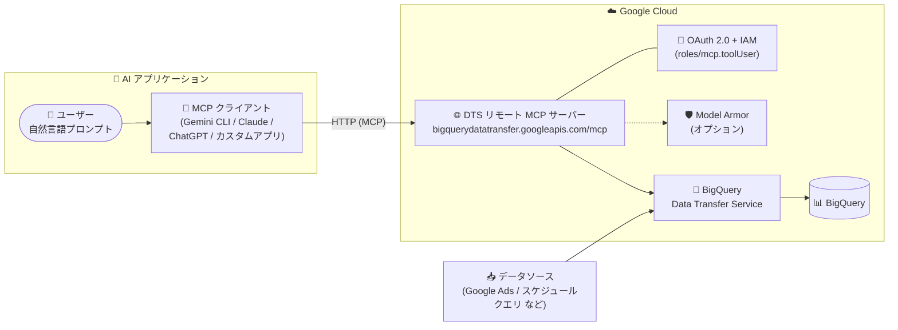

# BigQuery: Data Transfer Service MCP サーバーが GA に

**リリース日**: 2026-09-28

**サービス**: BigQuery (Data Transfer Service)

**機能**: BigQuery Data Transfer Service リモート MCP サーバー

**ステータス**: GA (一般提供)

📊 [このアップデートのインフォグラフィックを見る](https://takech9203.github.io/google-cloud-news-summary/20260928-bigquery-dts-mcp-server-ga.html)

## 概要

BigQuery Data Transfer Service (DTS) のリモート Model Context Protocol (MCP) サーバーが一般提供 (GA) になりました。MCP は、LLM や AI アプリケーション・エージェントが外部データソースやサービスに接続する方法を標準化するプロトコルです。この MCP サーバーを利用すると、Gemini CLI、ChatGPT、Claude、独自開発のカスタムアプリケーションなどの AI アプリケーションから、自然言語プロンプトで BigQuery Data Transfer Service の操作を実行できます。

リモート MCP サーバーは Google のインフラストラクチャ上で動作し、HTTP エンドポイント (`https://bigquerydatatransfer.googleapis.com/mcp`) を提供します。ローカルに MCP サーバーをインストール・運用する必要はなく、BigQuery Data Transfer Service API を有効化するだけで利用可能になります。認証・認可は OAuth 2.0 と IAM で行われ、Model Armor によるプロンプト/レスポンス保護 (オプション) や集中監査ロギングなど、Google Cloud のガバナンス機能と統合されています。

データ転送構成の作成・管理、転送実行の監視、データソースの確認といった DTS の運用タスクを AI エージェント経由で自動化したいデータエンジニアや、エージェントワークフローを構築する開発者が主な対象です。

**アップデート前の課題**

- BigQuery Data Transfer Service の操作 (転送構成の作成・更新、転送実行の監視、失敗時のログ確認など) は、コンソール、gcloud/bq CLI、API を通じて行う必要があった
- AI エージェントから DTS を操作するには、API を呼び出すカスタムツールを自前で実装・保守する必要があった
- ローカル MCP サーバーを利用する場合、各マシンへのインストールと運用・アップデートの管理が必要だった

**アップデート後の改善**

- Google が運用するマネージドなリモート MCP サーバーに HTTP で接続するだけで、AI アプリケーションから自然言語で DTS を操作できるようになった
- データソースの一覧・詳細確認、転送構成の作成・管理、転送実行の一覧・詳細確認、データソース認証情報の有効性チェックが MCP ツールとして標準提供された
- OAuth 2.0 + IAM による細粒度の認可、Model Armor 保護 (オプション)、集中監査ロギングが利用でき、GA としてエンタープライズ用途で利用しやすくなった

## アーキテクチャ図



AI アプリケーション内の MCP クライアントが HTTP でリモート MCP サーバーに接続し、OAuth 2.0 + IAM で認証・認可された MCP ツール呼び出しを通じて BigQuery Data Transfer Service を操作します。DTS は各種データソースから BigQuery へのデータ転送を実行します。

## サービスアップデートの詳細

### 主要機能

1. **データソースの検出と確認**
   - 利用可能なデータソースの一覧取得と詳細確認
   - データソースに必要な構成パラメータの確認
   - データソースに対する有効な認証情報が存在するかのチェック

2. **転送構成の管理**
   - 自然言語プロンプトによるデータ転送構成の作成・更新・確認・削除
   - プロジェクト・リージョン内の転送構成の一覧取得

3. **転送実行の管理とトラブルシューティング**
   - 単一日付の手動転送実行の開始、日付範囲を指定したバックフィルのトリガー
   - 転送実行のステータス監視と転送ログの確認による失敗原因の調査

4. **マネージドなリモートエンドポイント**
   - Google インフラ上で動作する HTTP エンドポイントを提供 (ローカルへのインストール不要)
   - BigQuery Data Transfer Service API を有効化すると MCP サーバーも有効になる
   - Model Armor によるプロンプト/レスポンス保護 (オプション) と集中監査ロギングに対応

## 技術仕様

### MCP サーバーの接続情報

| 項目 | 詳細 |
|------|------|
| サーバー名 | BigQuery Data Transfer Service MCP server |
| エンドポイント | `https://bigquerydatatransfer.googleapis.com/mcp` |
| トランスポート | HTTP (リモート MCP サーバー) |
| 認証 | OAuth 2.0 + IAM (API キーは非対応) |
| OAuth スコープ | `https://www.googleapis.com/auth/bigquery` |
| 必要な IAM ロール | MCP Tool User (`roles/mcp.toolUser`) — 権限: `mcp.tools.call` |
| プロトコル | MCP バージョン 2026-07-28 (ステートレスコア) 対応 |

### ステートレスコア (MCP 2026-07-28)

MCP バージョン 2026-07-28 では、MCP は双方向のステートフルなプロトコルからステートレスなプロトコルに変わりました。各リクエストは自己記述的で、`initialize`/`initialized` ハンドシェイクや `Mcp-Session-Id` は不要です。プロトコルバージョンヘッダーなどの必須ヘッダーに加え、MCP サーバーが定義するカスタムヘッダー (例: リージョンやプロジェクト ID の指定) がツールの入力スキーマから HTTP ヘッダーにミラーされます。

### ツール一覧の取得

`tools/list` メソッドは認証不要で呼び出せます。

```
POST /mcp HTTP/1.1
Host: bigquerydatatransfer.googleapis.com
Content-Type: application/json

{
  "jsonrpc": "2.0",
  "method": "tools/list"
}
```

利用可能な MCP ツールの詳細は [BigQuery Data Transfer Service MCP リファレンス](https://docs.cloud.google.com/bigquery/docs/reference/datatransfer/mcp) を参照してください。

## 設定方法

### 前提条件

1. BigQuery Data Transfer Service API を有効化する (新規プロジェクトでは自動的に有効。API を有効化すると MCP サーバーも有効になる)
2. MCP ツールを呼び出すプリンシパルに MCP Tool User ロール (`roles/mcp.toolUser`) を付与する

### 手順

#### ステップ 1: IAM ロールの付与

MCP サーバーを利用するプロジェクトで、ユーザーまたはエージェント用の ID に `roles/mcp.toolUser` を付与します。エージェントが MCP ツールを使用する場合は、アクセス制御と監視のためにエージェント専用の ID を作成することが推奨されています。

#### ステップ 2: MCP クライアントの設定

AI アプリケーションでリモート MCP サーバーの追加・接続設定を行い、以下を入力します。

- サーバー名: BigQuery Data Transfer Service MCP server
- サーバー URL: `https://bigquerydatatransfer.googleapis.com/mcp`
- トランスポート: HTTP
- 認証情報: Google Cloud 認証情報、OAuth クライアント ID とシークレット、またはエージェント ID と認証情報

Web ベースのアプリケーション (および一部のデスクトップアプリケーション) では、認証用のクライアント ID とシークレットを作成する際にリダイレクト URI の許可リスト登録が必要です。カスタムリダイレクト URI はサポートされていません。

#### ステップ 3 (オプション): Model Armor による保護の有効化

Model Armor のフロア設定で MCP サニタイズを有効化すると、MCP ツール呼び出しとレスポンスをプロジェクト全体で一貫したフィルタで検査・ブロックできます。

```bash
gcloud model-armor floorsettings update \
  --full-uri='projects/PROJECT_ID/locations/global/floorSetting' \
  --enable-floor-setting-enforcement=TRUE \
  --add-integrated-services=GOOGLE_MCP_SERVER \
  --google-mcp-server-enforcement-type=INSPECT_AND_BLOCK \
  --enable-google-mcp-server-cloud-logging \
  --malicious-uri-filter-settings-enforcement=ENABLED
```

## メリット

### ビジネス面

- **運用の効率化**: 転送構成の管理や失敗した転送のトラブルシューティングを自然言語で実行でき、DTS 運用の工数を削減できる
- **エージェントワークフローへの組み込み**: 標準プロトコル (MCP) によって、Gemini CLI、Claude、ChatGPT、カスタムエージェントなど幅広い AI アプリケーションから同じ方法で DTS を利用できる
- **GA による本番利用**: 一般提供となり、本番環境のワークフローへの組み込みを検討しやすくなった

### 技術面

- **マネージドエンドポイント**: ローカル MCP サーバーの構築・運用が不要で、Google が運用する HTTP エンドポイントに接続するだけで利用できる
- **セキュリティとガバナンス**: OAuth 2.0 + IAM による細粒度の認可、Model Armor による保護 (オプション)、集中監査ロギングに対応
- **ステートレス設計**: MCP 2026-07-28 仕様に基づくステートレスなリクエスト処理で、セッション管理が不要

## デメリット・制約事項

### 制限事項

- API キーによる認証はサポートされない (OAuth 2.0 + IAM のみ)
- カスタムスキームのリダイレクト URI はサポートされない
- ツール呼び出し時にアクセスするリソースによっては、追加の OAuth スコープが必要になる場合がある

### 考慮すべき点

- エージェントに付与する権限は最小限にし、MCP ツールを使用するエージェントには専用の ID を作成してアクセスを制御・監視することが推奨されている
- Model Armor のフロア設定は Vertex AI などほかの統合サービスにも影響するため、変更時は MCP 以外への影響も考慮する必要がある
- 自然言語による操作は転送構成の削除など破壊的操作も含むため、IAM とガバナンス設計が重要

## ユースケース

### ユースケース 1: 自然言語によるデータソース確認と転送構成の管理

**シナリオ**: データエンジニアが、新しいデータソースからの転送を設定する前に、利用可能なデータソースと認証情報の有効性を確認したい。

**実装例 (プロンプト)**:
```
List all available data sources in project PROJECT_ID and location LOCATION,
and check if I have valid credentials for the google_ads data source.
```

**効果**: コンソールや CLI を行き来せずに、対話的にデータソースの確認から転送構成の作成までを完了できる。

### ユースケース 2: バックフィルの実行

**シナリオ**: 過去の特定期間のデータを再転送する必要がある。

**実装例 (プロンプト)**:
```
Start a manual transfer run for transfer configuration TRANSFER_CONFIG_ID
in project PROJECT_ID and location LOCATION
for the date range from 2026-01-01 to 2026-01-07.
```

**効果**: 日付範囲を指定したバックフィルを自然言語で即座にトリガーできる。

### ユースケース 3: 失敗した転送のトラブルシューティング

**シナリオ**: 定期転送が失敗しており、原因を迅速に特定したい。

**実装例 (プロンプト)**:
```
Check the status of the latest transfer runs for configuration TRANSFER_CONFIG_ID
in project PROJECT_ID. If any runs failed, show me the transfer logs
and explain what went wrong.
```

**効果**: 転送実行のステータス確認、ログの取得、原因の説明までを AI エージェントが一括で実施し、障害対応時間を短縮できる。

## 料金

MCP サーバー自体の個別料金は公式ドキュメントに記載がありません。BigQuery Data Transfer Service の料金はデータソースにより異なります。詳細は [BigQuery Data Transfer Service の料金ページ](https://cloud.google.com/bigquery/pricing#bqdts) を参照してください。

## 関連サービス・機能

- **BigQuery Data Transfer Service**: MCP サーバーの操作対象。Google Ads やスケジュールクエリなど各種データソースから BigQuery へのデータ転送を管理する
- **IAM**: MCP ツール呼び出しの認可を担う。`roles/mcp.toolUser` の付与が必要
- **Model Armor**: MCP ツール呼び出しとレスポンスに対するプロンプト/レスポンス保護 (オプション)
- **Gemini CLI / Claude / ChatGPT などの AI アプリケーション**: MCP クライアントとして本サーバーに接続し、自然言語で DTS を操作する
- **Google Cloud MCP サーバー群**: Google Cloud は各サービス向けのリモート MCP サーバーを提供しており、集中ディスカバリや監査ロギングなど共通のガバナンス機能を備える

## 参考リンク

- 📊 [インフォグラフィック](https://takech9203.github.io/google-cloud-news-summary/20260928-bigquery-dts-mcp-server-ga.html)
- [公式リリースノート](https://docs.cloud.google.com/release-notes#September_28_2026)
- [ドキュメント: Use the BigQuery Data Transfer Service remote MCP server](https://docs.cloud.google.com/bigquery/docs/use-transfer-service-mcp)
- [BigQuery Data Transfer Service MCP リファレンス](https://docs.cloud.google.com/bigquery/docs/reference/datatransfer/mcp)
- [Google Cloud MCP servers overview](https://docs.cloud.google.com/mcp/overview)
- [料金ページ (BigQuery Data Transfer Service)](https://cloud.google.com/bigquery/pricing#bqdts)

## まとめ

BigQuery Data Transfer Service のリモート MCP サーバーが GA となり、AI エージェントから自然言語で DTS の転送構成管理・実行監視・トラブルシューティングを行う構成を本番環境で検討しやすくなりました。まずは `roles/mcp.toolUser` の付与と MCP クライアントの接続設定を行い、データソースの一覧取得や転送実行のステータス確認といった読み取り系の操作から試すことを推奨します。エージェント専用 ID の作成と Model Armor の適用によるガバナンス設計も併せて検討してください。

---

**タグ**: BigQuery, Data Transfer Service, MCP, Model Context Protocol, AI エージェント, GA, Gemini CLI, IAM, Model Armor
