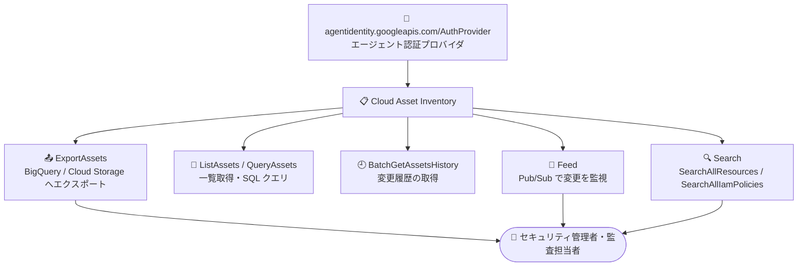

# Cloud Asset Inventory: Agent Identity API の AuthProvider リソースタイプに対応

**リリース日**: 2026-09-28

**サービス**: Cloud Asset Inventory

**機能**: Agent Identity API (agentidentity.googleapis.com/AuthProvider) リソースタイプのサポート

**ステータス**: 一般公開 (Publicly Available)

📊 [このアップデートのインフォグラフィックを見る](https://takech9203.github.io/google-cloud-news-summary/20260928-cloud-asset-inventory-agent-identity-authprovider.html)

## 概要

Cloud Asset Inventory が、Agent Identity API のリソースタイプ **`agentidentity.googleapis.com/AuthProvider`** に対応しました。ExportAssets、ListAssets、BatchGetAssetsHistory、QueryAssets、Feed、Search (SearchAllResources / SearchAllIamPolicies) の各 API を通じて、AuthProvider リソースのメタデータを取得・監視・分析できるようになります。

Agent Identity API の AuthProvider は、AI エージェントの外部ツール認証を仲介する「Agent Identity auth manager」の中核リソースです。特定のサードパーティアプリケーションに対する認証タイプ (API キー、OAuth クライアント ID / シークレット、エンドユーザーの OAuth 委任) と認証情報を定義し、IAM によってアクセスが制御されます。エージェントは自身の SPIFFE ID を使って auth manager に認証します。

今回のアップデートにより、組織・フォルダ・プロジェクト全体に存在する AuthProvider リソースを、他の Google Cloud リソースと同じ仕組みで棚卸し・検索・変更監視できるようになり、AI エージェント基盤のガバナンスとセキュリティ運用が強化されます。対象ユーザーは、AI エージェントを運用する組織のセキュリティ管理者、クラウド管理者、監査担当者です。

**アップデート前の課題**

- AuthProvider リソースは Cloud Asset Inventory の対象外だったため、組織横断でのインベントリ取得 (エクスポート、一覧、検索) に含めることができなかった
- AuthProvider の構成変更履歴を BatchGetAssetsHistory で追跡したり、Feed で変更をリアルタイムに監視したりすることができなかった
- AuthProvider に付与された IAM ポリシーを SearchAllIamPolicies で横断的に調査できず、エージェント認証基盤の権限監査に個別の確認作業が必要だった

**アップデート後の改善**

- ExportAssets により AuthProvider を含むアセットスナップショットを BigQuery や Cloud Storage にエクスポートし、SQL で分析できるようになった
- Feed (Pub/Sub 連携) により AuthProvider の作成・変更・削除をほぼリアルタイムに検知できるようになった
- SearchAllResources / SearchAllIamPolicies により、組織全体の AuthProvider リソースとその IAM ポリシーを横断検索できるようになった
- BatchGetAssetsHistory により AuthProvider の変更履歴を取得し、構成変更の監査が可能になった

## アーキテクチャ図



Agent Identity API の AuthProvider リソースが Cloud Asset Inventory の各 API から利用可能になり、エクスポート・履歴取得・変更監視・横断検索を通じてエージェント認証基盤を統合的に管理できます。

## サービスアップデートの詳細

### 主要機能

1. **エクスポート・一覧取得への対応 (ExportAssets / ListAssets / QueryAssets)**
   - AuthProvider を含むアセットスナップショットを BigQuery テーブルや Cloud Storage にエクスポート可能
   - QueryAssets により SQL でアセットを直接クエリ可能
   - 組織・フォルダ・プロジェクトの各スコープでインベントリを取得できる

2. **変更履歴・変更監視への対応 (BatchGetAssetsHistory / Feed)**
   - BatchGetAssetsHistory で AuthProvider の変更履歴を取得し、構成変更を監査できる
   - Feed を作成すると、AuthProvider の作成・更新・削除イベントを Pub/Sub トピックに通知できる

3. **検索 API への対応 (SearchAllResources / SearchAllIamPolicies)**
   - SearchAllResources で組織全体から AuthProvider リソースを横断検索できる
   - SearchAllIamPolicies で AuthProvider に設定された IAM ポリシー (例: `roles/agentidentity.user` の付与状況) を検索できる

## 技術仕様

### 対象リソースタイプと対応 API

| 項目 | 詳細 |
|------|------|
| リソースタイプ | `agentidentity.googleapis.com/AuthProvider` |
| 提供元 API | Agent Identity API (`agentidentity.googleapis.com`) |
| リソース名形式 | `projects/{PROJECT_ID}/locations/{LOCATION}/authProviders/{AUTH_PROVIDER_NAME}` |
| 対応する Cloud Asset Inventory API | ExportAssets、ListAssets、BatchGetAssetsHistory、QueryAssets、Feed、SearchAllResources、SearchAllIamPolicies |

### AuthProvider リソースの役割

- Agent Identity auth manager において、サードパーティアプリケーションへのアウトバウンド認証 (API キー、OAuth クライアント ID / シークレット、エンドユーザー OAuth 委任) を定義する
- IAM でアクセス制御され、エージェントは Agent SPIFFE ID で認証する
- エンドユーザーのアクセスイベントはエージェントの SPIFFE ID に紐付けて記録され、ガバナンスを容易にする

## 設定方法

### 前提条件

1. Cloud Asset Inventory API が有効化されていること
2. Cloud Asset Inventory API を呼び出す適切なロール (例: `roles/cloudasset.viewer`) が付与されていること

### 手順

#### ステップ 1: AuthProvider リソースを検索する

```bash
gcloud asset search-all-resources \
  --scope="organizations/ORGANIZATION_ID" \
  --asset-types="agentidentity.googleapis.com/AuthProvider"
```

組織全体の AuthProvider リソースを横断検索します。

#### ステップ 2: BigQuery にエクスポートして分析する

```bash
gcloud asset export \
  --organization="ORGANIZATION_ID" \
  --content-type=resource \
  --asset-types="agentidentity.googleapis.com/AuthProvider" \
  --bigquery-table="projects/PROJECT_ID/datasets/DATASET_ID/tables/TABLE_NAME" \
  --output-bigquery-force
```

AuthProvider のスナップショットを BigQuery にエクスポートし、SQL で分析できます。

#### ステップ 3: Feed で変更を監視する

```bash
gcloud asset feeds create auth-provider-feed \
  --organization="ORGANIZATION_ID" \
  --asset-types="agentidentity.googleapis.com/AuthProvider" \
  --content-type=resource \
  --pubsub-topic="projects/PROJECT_ID/topics/TOPIC_NAME"
```

AuthProvider の作成・変更・削除イベントを Pub/Sub で受け取れます。

## メリット

### ビジネス面

- **ガバナンスの強化**: AI エージェントが利用する外部認証設定を組織横断で可視化し、シャドー化を防止できる
- **監査対応の効率化**: 変更履歴と IAM ポリシー検索により、監査時のエビデンス収集を効率化できる

### 技術面

- **統合的なインベントリ管理**: 他の Google Cloud リソースと同一の仕組み (エクスポート、検索、Feed) で AuthProvider を管理できる
- **リアルタイム検知**: Feed と Pub/Sub の連携により、認証プロバイダの意図しない変更を即座に検知し、自動対応につなげられる

## デメリット・制約事項

### 考慮すべき点

- Cloud Asset Inventory の一部リソースタイプには分析 API (Policy Analyzer など) の対応に制限がある。AuthProvider の対応範囲は今回発表された API (Export、List、BatchGetAssetsHistory、Query、Feed、Search) である
- BigQuery エクスポートには制限事項がある (クラスタ化テーブル非対応、同一宛先への 15 分以内の連続エクスポート拒否など)
- Agent Identity API 自体は IAM Connectors API (`iamconnectors.googleapis.com`) からの移行期にあり、レガシー API から移行中の環境ではリソース名の対応関係 (`connectors/` → `authProviders/`) に注意が必要

## ユースケース

### ユースケース 1: AI エージェント認証基盤の定期棚卸し

**シナリオ**: 複数プロジェクトで AI エージェントを運用する組織が、各プロジェクトに作成された AuthProvider (外部 SaaS への OAuth / API キー設定) を定期的に棚卸しし、不要な認証設定を特定したい。

**実装例**:
```bash
gcloud asset export \
  --organization="ORGANIZATION_ID" \
  --content-type=resource \
  --asset-types="agentidentity.googleapis.com/AuthProvider" \
  --bigquery-table="projects/sec-audit/datasets/asset_inventory/tables/auth_providers"
```

**効果**: BigQuery 上で SQL による棚卸しレポートを自動生成でき、未使用・重複した認証プロバイダの整理につながる。

### ユースケース 2: 認証プロバイダ変更のリアルタイム検知

**シナリオ**: セキュリティチームが、エージェントの外部認証設定 (AuthProvider) の作成や変更を検知し、承認済みの構成かどうかを自動チェックしたい。

**効果**: Feed + Pub/Sub + Cloud Run functions の組み合わせで、未承認の AuthProvider 作成を即座に検知・通知でき、セキュリティインシデントの予防につながる。

### ユースケース 3: エージェント権限の IAM 監査

**シナリオ**: 監査担当者が、どのプリンシパル (エージェントの SPIFFE ID やユーザー) に `roles/agentidentity.user` が付与されているかを組織全体で確認したい。

**効果**: SearchAllIamPolicies により AuthProvider への IAM 付与状況を横断検索でき、最小権限の原則に沿った権限見直しが容易になる。

## 料金

Cloud Asset Inventory の利用料金および BigQuery / Pub/Sub など連携先サービスの料金については、公式ドキュメントを参照してください。

- [Cloud Asset Inventory ドキュメント](https://cloud.google.com/asset-inventory/docs/overview)

## 関連サービス・機能

- **Agent Identity (IAM)**: AI エージェントに SPIFFE ID ベースのアイデンティティを付与し、auth manager (AuthProvider) で外部ツール認証を仲介するサービス。今回のアップデートの対象リソースの提供元
- **BigQuery**: ExportAssets のエクスポート先。アセットスナップショットを SQL で分析できる
- **Pub/Sub**: Feed の通知先。AuthProvider の変更イベントをリアルタイムに配信する
- **VPC Service Controls**: Agent Identity API はサービス境界での保護に対応しており、Cloud Asset Inventory による可視化と組み合わせて多層防御を構成できる
- **Cloud Audit Logs**: Agent Identity は監査ログと統合されており、Asset Inventory の変更履歴と合わせて監査証跡を確保できる

## 参考リンク

- 📊 [インフォグラフィック](https://takech9203.github.io/google-cloud-news-summary/20260928-cloud-asset-inventory-agent-identity-authprovider.html)
- [公式リリースノート](https://docs.cloud.google.com/release-notes#September_28_2026)
- [Cloud Asset Inventory でサポートされるアセットタイプ](https://docs.cloud.google.com/asset-inventory/docs/asset-types)
- [Agent Identity API リファレンス](https://docs.cloud.google.com/iam/docs/reference/agentidentity/rest)
- [Agent Identity の概要](https://docs.cloud.google.com/iam/docs/agent-identity-overview)
- [BigQuery へのアセットのエクスポート](https://docs.cloud.google.com/asset-inventory/docs/export-bigquery)

## まとめ

AI エージェントの外部認証を担う Agent Identity API の AuthProvider リソースが Cloud Asset Inventory に統合され、組織全体での棚卸し・変更監視・IAM 監査が可能になりました。AI エージェントを本番運用している組織は、AuthProvider を対象とした Feed の作成と定期エクスポートをセキュリティ運用に組み込むことを推奨します。

---

**タグ**: #CloudAssetInventory #AgentIdentity #IAM #セキュリティ #ガバナンス #AIエージェント
