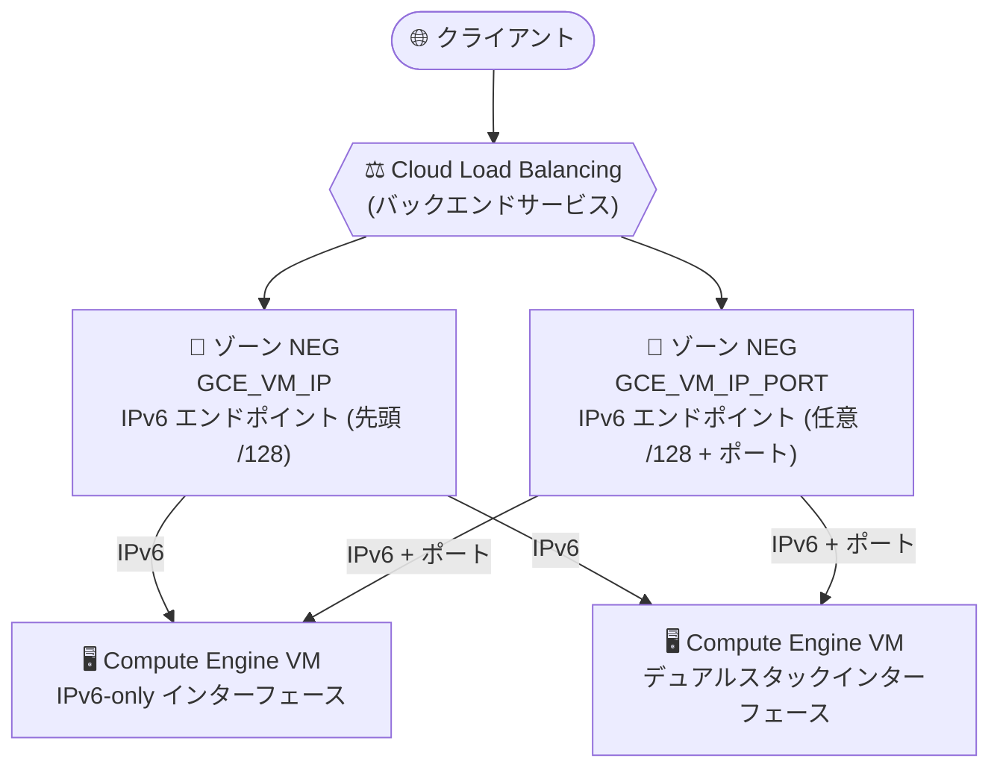

# Cloud Load Balancing: ゾーン NEG の IPv6-only エンドポイント対応 (Preview)

**リリース日**: 2026-09-28

**サービス**: Cloud Load Balancing

**機能**: ゾーンネットワークエンドポイントグループ (NEG) における IPv6-only エンドポイントのサポート

**ステータス**: Preview

📊 [このアップデートのインフォグラフィックを見る](https://takech9203.github.io/google-cloud-news-summary/20260928-cloud-load-balancing-zonal-neg-ipv6-only-endpoints.html)

## 概要

Cloud Load Balancing のゾーンネットワークエンドポイントグループ (NEG) において、`GCE_VM_IP` および `GCE_VM_IP_PORT` エンドポイントタイプが IPv6-only エンドポイントをサポートしました (Preview)。IPv6-only エンドポイントは、IPv6-only またはデュアルスタックの Compute Engine VM ネットワークインターフェースを参照できます。

これまで IPv4 を前提としてきたゾーン NEG のバックエンド構成に、IPv6 アドレスのみを持つエンドポイントを登録できるようになり、IPv6-only の VM をロードバランサーのバックエンドとして利用する道が開かれました。IPv6 への移行を進める企業や、IPv6-only ネットワークの構築を求められる環境 (政府機関要件、アドレス枯渇対策など) に取り組む Solutions Architect にとって重要なアップデートです。

**アップデート前の課題**

- `GCE_VM_IP` エンドポイントは VM ネットワークインターフェースのプライマリ内部 IPv4 アドレスを前提としており、IPv6 アドレスのみでエンドポイントを構成できなかった
- `GCE_VM_IP_PORT` エンドポイントで IPv6 を扱う場合、IPv4 アドレスと組み合わせたデュアルスタックエンドポイントとしての利用が中心で、IPv6-only VM をバックエンドに組み込めなかった
- IPv6-only の Compute Engine VM を作成しても、ゾーン NEG 経由でロードバランサーのバックエンドとして参照する手段がなかった

**アップデート後の改善**

- `GCE_VM_IP` NEG に、VM ネットワークインターフェースに割り当てられた /96 レンジの先頭 IPv6 アドレス (/128) を IPv6-only エンドポイントとして追加できるようになった
- `GCE_VM_IP_PORT` NEG に、/96 レンジ内の任意の IPv6 アドレス (/128) とポートの組み合わせを IPv6-only エンドポイントとして追加できるようになった
- IPv6-only インターフェースとデュアルスタックインターフェースのどちらも IPv6-only エンドポイントの参照先にできるため、IPv6-only VM で構成されたバックエンドへの負荷分散が可能になった

## アーキテクチャ図



ロードバランサーのバックエンドサービスに接続されたゾーン NEG が、IPv6-only エンドポイントを通じて IPv6-only またはデュアルスタックの VM ネットワークインターフェースへトラフィックを分散する構成を示しています。

## サービスアップデートの詳細

### 主要機能

1. **GCE_VM_IP エンドポイントの IPv6-only 対応 (Preview)**
   - VM ネットワークインターフェースに割り当てられた /96 レンジの先頭 IPv6 アドレス (/128) をエンドポイントとして登録可能
   - IPv6-only インターフェースとデュアルスタックインターフェースの両方を参照可能
   - `GCE_VM_IP` NEG では IPv4 と IPv6 を同時に持つデュアルスタックエンドポイントは追加できない (単一の IP アドレスのみ)
   - IP アドレスを省略した場合、IPv6-only インターフェースを参照するエンドポイントには先頭の IPv6 アドレス (/128) が自動選択される

2. **GCE_VM_IP_PORT エンドポイントの IPv6-only 対応 (Preview)**
   - VM ネットワークインターフェースに割り当てられた /96 レンジ内の任意の IPv6 アドレス (/128) とポートの組み合わせをエンドポイントとして登録可能
   - IPv6-only インターフェースとデュアルスタックインターフェースの両方を参照可能
   - ポートを省略した場合は NEG のデフォルトポートが使用される

3. **エンドポイントとインターフェースの互換性**
   - エンドポイントが参照するネットワークインターフェースは、NEG と同じサブネットに存在する必要がある
   - IPv4 エンドポイントは従来通り IPv4-only / デュアルスタックインターフェースに対応し、今回の IPv6 エンドポイント対応により全スタックタイプがカバーされた

## 技術仕様

### エンドポイントタイプ別の対応表

| エンドポイントタイプ | エンドポイント | 対応する VM インターフェース | ステータス |
|------|------|------|------|
| GCE_VM_IP | IPv4 (プライマリ) | IPv4-only / デュアルスタック | GA |
| GCE_VM_IP | IPv6 (/96 レンジの先頭 /128) | IPv6-only / デュアルスタック | **Preview** |
| GCE_VM_IP_PORT | IPv4 (プライマリまたはエイリアス) | IPv4-only / デュアルスタック | GA |
| GCE_VM_IP_PORT | IPv6 (/96 レンジ内の任意の /128) | IPv6-only / デュアルスタック | **Preview** |
| GCE_VM_IP_PORT | IPv4 + IPv6 (デュアルスタックエンドポイント) | デュアルスタック | GA |

### エンドポイントタイプ別の利用可能なロードバランサー

| エンドポイントタイプ | 利用するプロダクト |
|------|------|
| GCE_VM_IP | 内部パススルーネットワークロードバランサー、外部パススルーネットワークロードバランサー |
| GCE_VM_IP_PORT | アプリケーションロードバランサー (グローバル外部 / リージョン外部 / 内部 / クロスリージョン内部)、プロキシネットワークロードバランサー、Cloud Service Mesh |

### ゾーン NEG の主な制約

| 項目 | 詳細 |
|------|------|
| エンドポイントの VM | NEG と同じゾーンに存在する必要がある |
| ネットワーク / サブネット | エンドポイントの IP アドレスは NEG に関連付けられたサブネットに属する必要がある |
| 一意性 (GCE_VM_IP) | NEG 内の各エンドポイントは一意の IP アドレスである必要がある |
| 一意性 (GCE_VM_IP_PORT) | NEG 内の各エンドポイントは一意の IP アドレスとポートの組み合わせである必要がある |
| エンドポイント数 | NEG あたりのエンドポイント数の上限はクォータに従う |

## 設定方法

### 前提条件

1. IPv6 エンドポイントを使用するには、VM のネットワークインターフェースがデュアルスタックまたは IPv6-only サブネットに接続されていること (デュアルスタック / IPv6-only サブネットにはカスタムモード VPC ネットワークが必要)
2. IPv6-only インターフェースはインスタンス作成時にのみ構成可能 (既存インターフェースのスタックタイプを IPv6-only に変更することはできない)
3. IPv6-only インスタンスは Ubuntu および Debian の OS イメージでのみサポートされる

### 手順

#### ステップ 1: GCE_VM_IP ゾーン NEG に IPv6 エンドポイントを追加

```bash
gcloud compute network-endpoint-groups update NEG_NAME \
    --zone=ZONE \
    --add-endpoint 'instance=INSTANCE_NAME,ipv6=IPv6_ADDRESS'
```

`IPv6_ADDRESS` には、VM ネットワークインターフェースに割り当てられた /96 レンジの先頭 IPv6 アドレス (/128) を指定します。IP アドレスを省略した場合、IPv6-only インターフェースでは先頭の IPv6 アドレスが自動選択されます。

#### ステップ 2: GCE_VM_IP_PORT ゾーン NEG に IPv6 エンドポイントを追加

```bash
gcloud compute network-endpoint-groups update NEG_NAME \
    --zone=ZONE \
    --add-endpoint 'instance=INSTANCE_NAME,ipv6=IPv6_ADDRESS,port=PORT'
```

`IPv6_ADDRESS` には /96 レンジ内の任意の IPv6 アドレス (/128) を指定できます。`port` は NEG にデフォルトポートが設定されている場合は省略可能です。

なお、バックエンドサービスの `--ip-address-selection-policy` フィールドを使用すると、バックエンドサービスからバックエンドへ送信するトラフィックタイプ (IPv4 / IPv6) の優先順位を指定できます。

## メリット

### ビジネス面

- **IPv6 移行の推進**: IPv4 アドレスの枯渇対策や IPv6 対応要件のある環境で、IPv6-only の VM 構成をロードバランサー配下で運用できる
- **アドレス管理コストの削減**: バックエンド VM に IPv4 アドレスを割り当てずに構成できるため、内部 IPv4 アドレス空間の設計・管理負担を軽減できる

### 技術面

- **全スタックタイプのカバー**: IPv4-only、デュアルスタック、IPv6-only のいずれの VM インターフェースもゾーン NEG のエンドポイントとして参照可能になった
- **柔軟なエンドポイント指定**: `GCE_VM_IP_PORT` では /96 レンジ内の任意の IPv6 アドレスとポートを指定でき、1 つの VM 上の複数アプリケーションへのきめ細かい負荷分散が可能

## デメリット・制約事項

### 制限事項

- 本機能は Preview のため、本番環境での利用には注意が必要
- `GCE_VM_IP` エンドポイントでは IPv4 と IPv6 を同時に持つデュアルスタックエンドポイントは追加できない (単一 IP アドレスのみ)
- `GCE_VM_IP` の IPv6 エンドポイントは /96 レンジの先頭アドレス (/128) に限定される (任意のアドレスを指定できるのは `GCE_VM_IP_PORT` のみ)
- エンドポイントが参照するネットワークインターフェースは NEG と同じサブネットに存在する必要がある

### 考慮すべき点

- IPv6-only インスタンスは作成時にのみ構成でき、既存インスタンスのインターフェースを IPv6-only に変更することはできない
- IPv6-only インスタンスは Ubuntu / Debian イメージのみサポートされる
- IPv6 アドレスへの受信接続は暗黙の IPv6 上り (ingress) 拒否ファイアウォールルールでブロックされるため、ヘルスチェックやクライアントトラフィックを許可するファイアウォールルールの構成が必要
- デュアルスタック / IPv6-only サブネットにはカスタムモード VPC ネットワークが必要

## ユースケース

### ユースケース 1: IPv6-only バックエンドによる内部パススルーネットワークロードバランサー

**シナリオ**: IPv6 移行を進める組織が、内部向けサービスのバックエンドを IPv6-only VM で構成し、内部パススルーネットワークロードバランサーで負荷分散したい。

**実装例**:
```bash
# GCE_VM_IP ゾーン NEG に IPv6-only VM をエンドポイントとして追加
gcloud compute network-endpoint-groups update my-neg \
    --zone=asia-northeast1-a \
    --add-endpoint 'instance=ipv6-only-vm-1' \
    --add-endpoint 'instance=ipv6-only-vm-2'
```

**効果**: IPv4 アドレスを割り当てない VM 構成のまま、ロードバランサー経由での可用性の高いサービス提供が可能になる。IP アドレスを省略した場合、IPv6-only インターフェースの先頭 IPv6 アドレスが自動選択される。

### ユースケース 2: デュアルスタック環境からの段階的な IPv6 移行

**シナリオ**: 既存のデュアルスタック VM 環境で、ロードバランサーからバックエンドへの通信を段階的に IPv6 へ移行したい。

**効果**: デュアルスタックインターフェースを参照する IPv6-only エンドポイントを `GCE_VM_IP_PORT` NEG に追加し、バックエンドサービスの IP アドレス選択ポリシーと組み合わせることで、アプリケーションを停止せずにバックエンド通信の IPv6 化を検証・移行できる。

## 料金

このアップデートに固有の追加料金に関する記載はリリースノートにありません。Cloud Load Balancing の料金体系については公式の料金ページを参照してください。

- [Cloud Load Balancing の料金](https://cloud.google.com/vpc/network-pricing#lb)

## 関連サービス・機能

- **Compute Engine**: IPv6-only / デュアルスタックのネットワークインターフェースを持つ VM がエンドポイントの参照先となる
- **VPC (Virtual Private Cloud)**: デュアルスタック / IPv6-only サブネットの構成、および IPv6 トラフィックを許可するファイアウォールルールの設定が前提となる
- **GKE (Google Kubernetes Engine)**: `GCE_VM_IP_PORT` エンドポイントは GKE Ingress や Gateway API によるコンテナネイティブ負荷分散でも使用される
- **Cloud Service Mesh**: `GCE_VM_IP_PORT` エンドポイントを持つゾーン NEG を利用するプロダクトの 1 つ

## 参考リンク

- 📊 [インフォグラフィック](https://takech9203.github.io/google-cloud-news-summary/20260928-cloud-load-balancing-zonal-neg-ipv6-only-endpoints.html)
- [公式リリースノート (2026-09-28)](https://docs.cloud.google.com/release-notes#September_28_2026)
- [ゾーンネットワークエンドポイントグループの概要](https://docs.cloud.google.com/load-balancing/docs/negs/zonal-neg-concepts)
- [ゾーン NEG の設定](https://docs.cloud.google.com/load-balancing/docs/negs/setting-up-zonal-negs)
- [VM インターフェースのスタックタイプ](https://docs.cloud.google.com/vpc/docs/multiple-interfaces-concepts#stack-types)
- [Compute Engine インスタンスの IPv6 アドレス構成](https://docs.cloud.google.com/compute/docs/ip-addresses/configure-ipv6-address)
- [料金ページ](https://cloud.google.com/vpc/network-pricing#lb)

## まとめ

ゾーン NEG の IPv6-only エンドポイント対応により、IPv6-only VM を Cloud Load Balancing のバックエンドとして構成できるようになり、Google Cloud 上での IPv6-only アーキテクチャの実現性が大きく向上しました。IPv6 移行を計画している場合は、Preview 段階のうちに検証環境でデュアルスタック / IPv6-only サブネットとあわせて動作確認を進めることを推奨します。

---

**タグ**: Cloud Load Balancing, NEG, IPv6, Compute Engine, ネットワーキング, Preview
