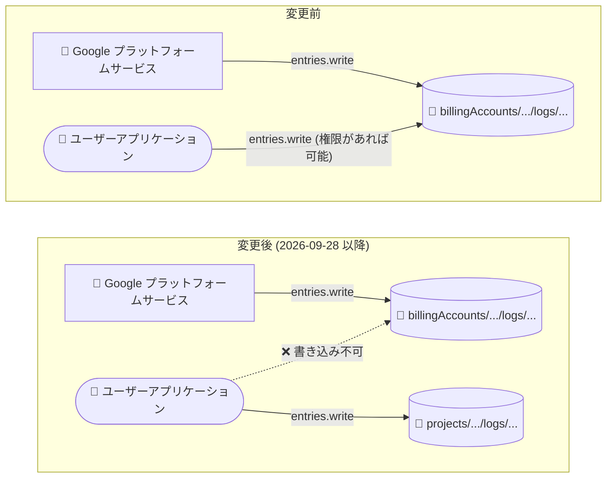

# Cloud Logging: 請求先アカウントへのログ書き込みをプラットフォームサービスのみに制限

**リリース日**: 2026-09-28

**サービス**: Cloud Logging

**機能**: 請求先アカウント (Billing Account) へのログエントリ書き込み制限

**ステータス**: 破壊的変更 (Breaking change)

📊 [このアップデートのインフォグラフィックを見る](https://takech9203.github.io/google-cloud-news-summary/20260928-cloud-logging-billing-account-log-writes-restriction.html)

## 概要

2026 年 9 月 28 日、Cloud Logging に破壊的変更 (Breaking change) が導入されました。今後、請求先アカウント (Billing Account) を親リソースとするログエントリ、すなわち `billingAccounts/[BILLING_ACCOUNT_ID]/logs/[LOG_ID]` という形式の名前を持つログへの書き込みは、Google のプラットフォームサービスのみが実行できるようになります。

Cloud Logging の `entries.write` API は、プロジェクト、組織、請求先アカウント、フォルダの 4 種類のリソースを親としてログエントリを書き込める唯一の API メソッドです。今回の変更により、このうち請求先アカウントを親とする書き込みが、ユーザーやサードパーティのアプリケーションからは実行できなくなります。プロジェクト、組織、フォルダへの書き込みは影響を受けません。

対象ユーザーは、カスタムアプリケーションやスクリプトから `billingAccounts/...` 形式の `logName` を指定して `entries.write` を呼び出しているすべての組織です。該当する実装がある場合は、書き込み先をプロジェクトなど他の親リソースに変更する対応が必要です。

**アップデート前の課題**

- 従来は `logging.logEntries.create` 権限を持っていれば、ユーザーのアプリケーションからも請求先アカウントを親とするログ (`billingAccounts/[BILLING_ACCOUNT_ID]/logs/[LOG_ID]`) にログエントリを書き込むことができた
- 請求先アカウント配下のログには Cloud Billing の監査ログなどプラットフォーム生成のログが保存されるが、同じ場所にユーザー生成のログエントリが混在し得る状態だった

**アップデート後の改善**

- 請求先アカウントへのログ書き込みは Google のプラットフォームサービスに限定され、請求先アカウント配下のログはプラットフォーム生成のログのみとなる
- ユーザー生成のログエントリが混入しなくなることで、請求先アカウント配下のログ (Cloud Billing 監査ログなど) の一貫性が保たれる

## アーキテクチャ図



変更前はユーザーアプリケーションも請求先アカウント配下のログに書き込めましたが、変更後はプラットフォームサービスのみが書き込み可能となり、ユーザーアプリケーションはプロジェクトなど他の親リソースへの書き込みに切り替える必要があります。

## サービスアップデートの詳細

### 主要機能

1. **請求先アカウントへのログ書き込みの制限**
   - `billingAccounts/[BILLING_ACCOUNT_ID]/logs/[LOG_ID]` 形式の名前を持つログへのエントリ書き込みが、プラットフォームサービスのみに制限される
   - `entries.write` API リファレンスにも「Only platform services can write logs to billing accounts」と明記された

2. **他の親リソースへの書き込みは従来どおり**
   - `projects/[PROJECT_ID]/logs/[LOG_ID]`、`organizations/[ORGANIZATION_ID]/logs/[LOG_ID]`、`folders/[FOLDER_ID]/logs/[LOG_ID]` への書き込みは引き続き可能
   - 書き込みには各リソースに対する `logging.logEntries.create` IAM 権限が必要 (従来どおり)

3. **プラットフォーム生成ログへの影響なし**
   - Cloud Billing の監査ログ (管理アクティビティ監査ログ、データアクセス監査ログ) など、Google のプラットフォームサービスが請求先アカウントに書き込むログは今後も生成される

## 技術仕様

### entries.write API と親リソース

| 項目 | 詳細 |
|------|------|
| 対象 API | `POST https://logging.googleapis.com/v2/entries:write` |
| 影響を受ける logName 形式 | `billingAccounts/[BILLING_ACCOUNT_ID]/logs/[LOG_ID]` |
| 影響を受けない logName 形式 | `projects/...`、`organizations/...`、`folders/...` |
| 必要な IAM 権限 | `logging.logEntries.create` (logName で指定したリソースに対して) |
| 1 リクエストあたりのリソース名上限 | 最大 1,000 リソース (プロジェクト、組織、請求先アカウント、フォルダの合計) |
| 変更の種類 | Breaking change (破壊的変更) |

### 影響を受けるリクエストの例

以下のように `logName` に請求先アカウントを指定する `entries.write` リクエストは、ユーザーアプリケーションからは実行できなくなります。

```json
{
  "logName": "billingAccounts/012345-6789AB-CDEF01/logs/my-custom-log",
  "resource": { "type": "global" },
  "entries": [
    { "textPayload": "custom log entry" }
  ]
}
```

## 影響確認と対応方法

### 前提条件

1. 自組織のアプリケーション、スクリプト、ロギングライブラリの設定を確認できること
2. Logs Explorer または Cloud Logging API で請求先アカウント配下のログを閲覧する権限があること

### 手順

#### ステップ 1: 請求先アカウントへ書き込んでいる実装の洗い出し

```bash
# コードベースから billingAccounts/ 形式の logName を検索する例
grep -rE "billingAccounts/[^/]+/logs/" .
```

`entries.write` (各言語のクライアントライブラリや gcloud 経由の呼び出しを含む) で `billingAccounts/...` 形式の `logName` を指定している箇所を特定します。

#### ステップ 2: 書き込み先の変更

```json
{
  "logName": "projects/my-project-id/logs/my-custom-log",
  "resource": { "type": "global" },
  "entries": [
    { "textPayload": "custom log entry" }
  ]
}
```

該当する実装がある場合は、`logName` をプロジェクト、組織、フォルダなど他の親リソースに変更します。書き込み先リソースに対する `logging.logEntries.create` 権限が付与されていることを確認してください。

## メリット

### ビジネス面

- **監査証跡の信頼性向上**: 請求先アカウント配下のログがプラットフォーム生成のログに限定されることで、Cloud Billing の監査ログなどの証跡としての信頼性が高まる

### 技術面

- **ログの一貫性確保**: 請求先アカウント配下のログにユーザー生成エントリが混在しなくなり、ログの出所が明確になる

## デメリット・制約事項

### 制限事項

- ユーザーやサードパーティのアプリケーションは、`billingAccounts/[BILLING_ACCOUNT_ID]/logs/[LOG_ID]` 形式のログにログエントリを書き込めなくなる

### 考慮すべき点

- 破壊的変更 (Breaking change) であるため、請求先アカウントへの書き込みに依存している既存のワークフローは動作しなくなる。該当する実装がないか早急に確認が必要
- 書き込み先を変更する場合、ログの保存場所が変わるため、既存のログベースの指標、アラート、ログシンク (ルーティング) の設定も合わせて見直す必要がある

## ユースケース

### ユースケース 1: 既存アプリケーションの影響調査

**シナリオ**: 組織内の複数チームが Cloud Logging API を利用しており、請求先アカウントを親とするログ書き込みが行われていないか確認したい。

**実装例**:
```bash
# コードリポジトリ内で billingAccounts 形式の logName の利用箇所を検索
grep -rE "billingAccounts/[^/]+/logs/" .
```

**効果**: 破壊的変更の影響範囲を事前に特定し、書き込みエラーによる障害を未然に防止できる。

### ユースケース 2: カスタムログの書き込み先移行

**シナリオ**: 請求関連のカスタムログを `billingAccounts/...` 配下に書き込んでいたアプリケーションを、プロジェクト配下のログに移行する。

**効果**: `projects/[PROJECT_ID]/logs/[LOG_ID]` へ書き込み先を変更することで、変更後も継続してログを記録できる。必要に応じてログシンクで集約先を調整できる。

## 関連サービス・機能

- **Cloud Billing**: 請求先アカウントに対する操作 (アカウント作成、IAM ポリシー変更など) の監査ログは、プラットフォームサービスとして引き続き請求先アカウント配下に書き込まれる
- **Cloud Audit Logs**: 管理アクティビティ監査ログ、データアクセス監査ログは請求先アカウントを親リソースとして生成されるログの代表例
- **ログシンク (Log Router)**: 請求先アカウントを親とするシンク (`billingAccounts/*/sinks`) により、請求先アカウント配下のログを他の宛先へルーティングできる

## 参考リンク

- 📊 [インフォグラフィック](https://takech9203.github.io/google-cloud-news-summary/20260928-cloud-logging-billing-account-log-writes-restriction.html)
- [公式リリースノート](https://docs.cloud.google.com/release-notes#September_28_2026)
- [entries.write API リファレンス](https://docs.cloud.google.com/logging/docs/reference/v2/rest/v2/entries/write)
- [Cloud Billing の監査ログ](https://docs.cloud.google.com/billing/docs/audit-logging)
- [Cloud Logging リリースノート](https://docs.cloud.google.com/logging/docs/release-notes)

## まとめ

今回の破壊的変更により、請求先アカウント (`billingAccounts/...`) へのログエントリ書き込みは Google のプラットフォームサービスのみに制限されます。カスタムアプリケーションから請求先アカウントを親としてログを書き込んでいる場合は動作しなくなるため、該当する実装がないかを早急に確認し、必要に応じて書き込み先をプロジェクトなど他の親リソースへ移行してください。

---

**タグ**: Cloud Logging, Cloud Billing, Breaking Change, entries.write, 監査ログ, IAM
