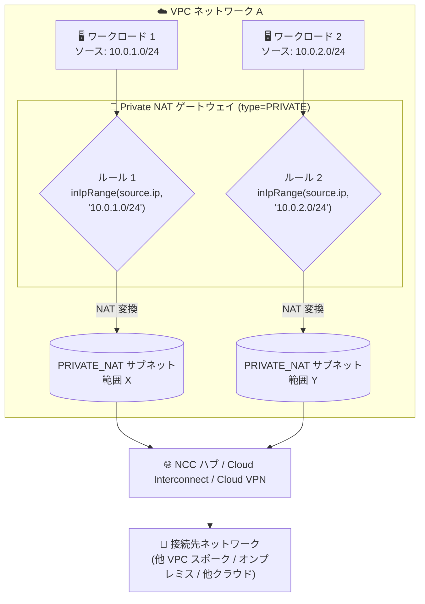

# Cloud NAT: Private NAT 向けソースベース NAT ルール (IPv4) が Preview に

**リリース日**: 2026-09-28

**サービス**: Cloud NAT

**機能**: Private NAT ゲートウェイにおけるソースベース NAT ルール (IPv4) のサポート

**ステータス**: Preview

📊 [このアップデートのインフォグラフィックを見る](https://takech9203.github.io/google-cloud-news-summary/20260928-cloud-nat-private-nat-source-based-nat-rules.html)

## 概要

Cloud NAT の Private NAT ゲートウェイで、IPv4 アドレスを対象としたソースベース NAT ルールが Preview として利用可能になりました。ソースベース NAT ルールを使用すると、パケットの送信元 IPv4 アドレスに基づいて NAT ルールをマッチさせ、送信元ごとに異なる NAT 動作を適用できます。

Private NAT は、NAT 構成タイプ `type=PRIVATE` を使用して、プライベートネットワーク間 (Network Connectivity Center の VPC スポーク間や、Cloud Interconnect / Cloud VPN で接続されたオンプレミス・他クラウドネットワークとの間) のアドレス変換を行う機能です。従来、Public NAT ではソース / デスティネーションベースの NAT ルールがサポートされていましたが、Private NAT の NAT ルールはネクストホップ (NCC ハブや Hybrid 接続経路) に基づくマッチ条件が中心でした。今回のアップデートにより、Private NAT でも送信元 IPv4 アドレス単位できめ細かな NAT 制御が可能になります。

対象ユーザーは、Network Connectivity Center (NCC) による Inter-VPC NAT や、Hybrid NAT を利用してオンプレミス / マルチクラウド環境と Google Cloud を接続しているネットワーク管理者・アーキテクトです。

**アップデート前の課題**

- Private NAT の NAT ルールでは、NCC ハブ (`nexthop.hub`) や Hybrid 接続経路 (`nexthop.is_hybrid`) といったネクストホップベースのマッチ条件が中心で、送信元 IPv4 アドレスに基づいてルールを分けることができなかった
- 送信元のワークロードやサブネットごとに異なる NAT IP 範囲を割り当てるといった、送信元単位のきめ細かな制御は Public NAT のソースベースルールに限られていた

**アップデート後の改善**

- Private NAT ゲートウェイでも、送信元 IPv4 アドレスをマッチ条件とする NAT ルールを定義できるようになった (Preview)
- 送信元 IP アドレス / IP 範囲ごとに異なる NAT 用サブネット範囲 (purpose が `PRIVATE_NAT` のサブネット) を割り当てるといった、送信元単位のトラフィック制御が可能になった

## アーキテクチャ図



Private NAT ゲートウェイが送信元 IPv4 アドレスに基づいて NAT ルールをマッチさせ、送信元ごとに異なる `PRIVATE_NAT` サブネット範囲を使用して接続先ネットワークへトラフィックを送信する構成を示しています。

## サービスアップデートの詳細

### 主要機能

1. **送信元 IPv4 アドレスに基づく NAT ルールのマッチング (Preview)**
   - Private NAT ゲートウェイの NAT ルールで、パケットの送信元 IPv4 アドレスをマッチ条件として指定可能
   - NAT ルールは Common Expression Language (CEL) 構文で記述し、`source.ip` 属性と `==` / `inIpRange()` / `||` 演算子を利用できる

2. **送信元単位での NAT 用アドレス範囲の割り当て**
   - ルールのアクションとして、purpose が `PRIVATE_NAT` のサブネット範囲 (`sourceNatActiveRanges`) を指定し、マッチしたトラフィックに適用する NAT 元アドレス範囲を制御できる
   - 送信元のサブネットやワークロードごとに、接続先ネットワークから見える NAT 後のアドレス範囲を分離できる

3. **既存の Private NAT 構成との組み合わせ**
   - Private NAT がカバーする 2 つの構成 (NCC スポーク間の Inter-VPC NAT、Cloud Interconnect / Cloud VPN 経由の Hybrid NAT) の枠組みの中で利用できる
   - 本アップデートの対象は IPv4 アドレスのソースベースルール

## 技術仕様

### NAT ルールの構成要素

| 項目 | 詳細 |
|------|------|
| ルール記述言語 | Common Expression Language (CEL) |
| ソースマッチ属性 | `source.ip` (パケットの送信元 IP アドレス) |
| 利用可能な演算子 | `inIpRange(x, y)`、`==`、`\|\|` |
| ルール番号 | 0〜65000 の一意な整数 |
| Private NAT のアクション | `sourceNatActiveRanges` (purpose が `PRIVATE_NAT` のサブネットの URL リスト) |
| 対象アドレスファミリー | IPv4 |
| ステータス | Preview |

### マッチ式の例 (ソースベース)

```text
# 特定の送信元 IP アドレスにマッチ
source.ip == '10.0.0.25'

# 送信元 IP 範囲にマッチ
inIpRange(source.ip, '10.0.2.0/24')

# 複数条件の組み合わせ
source.ip == '10.0.0.25' || inIpRange(source.ip, '10.0.2.0/24')
```

なお、NAT ルールでは送信元ベースと宛先ベースの条件を 1 つのルール内で組み合わせることはできません。

## 設定方法

### 前提条件

1. Private NAT ゲートウェイと同じリージョンに、purpose が `PRIVATE_NAT` のサブネットを作成しておく (このサブネットは NAT 専用で、リソースは作成できない)
2. NCC スポーク間 NAT の場合は各 VPC を NCC ハブの VPC スポークとして構成、Hybrid NAT の場合は Cloud Interconnect / Cloud VPN による動的ルーティング構成が必要
3. `roles/compute.networkAdmin` (Compute ネットワーク管理者) 相当の IAM 権限

### 手順

#### ステップ 1: Private NAT 用サブネットの作成

```bash
gcloud compute networks subnets create NAT_SUBNET \
    --network=NETWORK \
    --region=REGION \
    --range=IP_RANGE \
    --purpose=PRIVATE_NAT
```

NAT 変換後の送信元アドレスとして使用される、purpose が `PRIVATE_NAT` のサブネットを作成します。接続先ネットワーク内の既存サブネットと重複しない範囲を指定します。

#### ステップ 2: ソースベース NAT ルールの定義

```yaml
# rules.yaml
rules:
- ruleNumber: 100
  match: "inIpRange(source.ip, '10.0.1.0/24')"
  action:
    sourceNatActiveRanges:
    - projects/PROJECT_ID/regions/REGION/subnetworks/NAT_SUBNET_X
- ruleNumber: 200
  match: "inIpRange(source.ip, '10.0.2.0/24')"
  action:
    sourceNatActiveRanges:
    - projects/PROJECT_ID/regions/REGION/subnetworks/NAT_SUBNET_Y
```

送信元 IPv4 範囲ごとにマッチ条件と、適用する `PRIVATE_NAT` サブネット範囲を定義します。詳細な構成手順は [Private NAT の設定ドキュメント](https://docs.cloud.google.com/nat/docs/set-up-private-nat) および [NAT ルールの設定ドキュメント](https://docs.cloud.google.com/nat/docs/using-nat-rules) を参照してください。

## メリット

### ビジネス面

- **マルチテナント / 部門別のアドレス管理**: 送信元のチームやワークロード単位で NAT 後のアドレス範囲を分離できるため、接続先 (オンプレミスや他 VPC) 側でのアクセス制御や監査の粒度を高められる
- **ハイブリッド接続の運用効率化**: 接続先ネットワークのファイアウォールで送信元範囲ごとの許可ルールを維持しやすくなり、ネットワーク統合や移行時の調整コストを削減できる

### 技術面

- **きめ細かなトラフィック制御**: ネクストホップベースだけでなく送信元 IPv4 アドレスベースの条件が使えるようになり、Public NAT と同様の柔軟なルール設計を Private NAT でも実現できる
- **CEL による宣言的なルール定義**: `source.ip` と `inIpRange()` を組み合わせた表現力の高いマッチ条件を宣言的に管理できる

## デメリット・制約事項

### 制限事項

- 本機能は Preview であり、GA 前の機能に適用される利用条件の下で提供される
- 対象は IPv4 アドレスのソースベースルール
- NAT ルールでは送信元ベースと宛先ベースの条件を 1 つのルールに混在させることはできない
- Private NAT の一般仕様として、TCP / UDP のみサポート (ICMP 等は非対応)、エンドポイントあたり最大 64,000 同時接続、auto モード VPC ネットワークは非対応

### 考慮すべき点

- `PRIVATE_NAT` サブネットは作成後にサイズ変更ができないため、ルールごとに割り当てる NAT 範囲のサイズ (ポート要件) を事前に見積もる必要がある
- ルールを分割すると NAT 範囲ごとにポート容量を確保する必要があるため、ポート枯渇を避ける容量設計が重要

## ユースケース

### ユースケース 1: オンプレミス側ファイアウォールでの送信元別アクセス制御 (Hybrid NAT)

**シナリオ**: 複数チームのワークロードが同一 VPC から Cloud Interconnect 経由でオンプレミスのシステムにアクセスしている。オンプレミス側ファイアウォールで、チームごとに異なる送信元アドレス範囲で許可制御を行いたい。

**実装例**:
```text
ルール 1: inIpRange(source.ip, '10.0.1.0/24') → PRIVATE_NAT サブネット X を使用
ルール 2: inIpRange(source.ip, '10.0.2.0/24') → PRIVATE_NAT サブネット Y を使用
```

**効果**: オンプレミス側では NAT 後のアドレス範囲 X / Y 単位でアクセス制御・監査ができ、チームごとのトラフィックを明確に識別できる。

### ユースケース 2: NCC スポーク間通信での送信元アドレス分離 (Inter-VPC NAT)

**シナリオ**: NCC ハブに接続された複数の VPC スポーク間で、特定の送信元サブネットからのトラフィックのみ専用の NAT 範囲を経由させ、共有サービス VPC 側で送信元を区別したい。

**効果**: 共有サービス側で送信元 NAT 範囲に基づくポリシー適用が可能になり、重複アドレス環境でも送信元の識別性を維持できる。

## 料金

Cloud NAT の料金体系はゲートウェイの利用と処理データ量に基づきます。最新の料金は公式料金ページを参照してください。

- [Cloud NAT 料金ページ](https://cloud.google.com/nat/pricing)

## 関連サービス・機能

- **Network Connectivity Center (NCC)**: Private NAT for NCC スポークでは、NCC ハブに接続された VPC スポーク間 / ハイブリッドスポークとの間の NAT を提供する
- **Cloud Interconnect / Cloud VPN**: Hybrid NAT でオンプレミスや他クラウドと接続する際の接続手段。動的ルーティング (Cloud Router) が必要
- **Cloud Router**: Private NAT ゲートウェイのコントロールプレーンを提供し、ハイブリッド接続の動的ルート学習を担う
- **Cloud NAT (Public NAT)**: インターネット向けの NAT。ソース / デスティネーションベースの NAT ルールを従来からサポートしており、今回のアップデートで Private NAT にもソースベースルールが拡張された

## 参考リンク

- 📊 [インフォグラフィック](https://takech9203.github.io/google-cloud-news-summary/20260928-cloud-nat-private-nat-source-based-nat-rules.html)
- [公式リリースノート](https://docs.cloud.google.com/release-notes#September_28_2026)
- [Cloud NAT ルールの概要](https://docs.cloud.google.com/nat/docs/nat-rules-overview)
- [Private NAT の概要](https://docs.cloud.google.com/nat/docs/private-nat)
- [Private NAT for NCC スポーク](https://docs.cloud.google.com/nat/docs/about-private-nat-for-ncc)
- [Hybrid NAT](https://docs.cloud.google.com/nat/docs/about-hybrid-nat)
- [Private NAT の設定](https://docs.cloud.google.com/nat/docs/set-up-private-nat)
- [料金ページ](https://cloud.google.com/nat/pricing)

## まとめ

Private NAT でソースベース NAT ルール (IPv4) が Preview として利用可能になり、NCC スポーク間やハイブリッド接続環境で送信元単位のきめ細かな NAT 制御が実現できるようになりました。オンプレミスや共有サービス VPC 側で送信元別のアクセス制御・監査を行いたい場合は、`PRIVATE_NAT` サブネットの容量設計と合わせて本機能の検証を始めることをおすすめします。Preview 段階のため、本番適用の前に利用条件と動作を確認してください。

---

**タグ**: `Cloud NAT`, `Private NAT`, `NAT ルール`, `ネットワーキング`, `Network Connectivity Center`, `Hybrid NAT`, `Preview`
