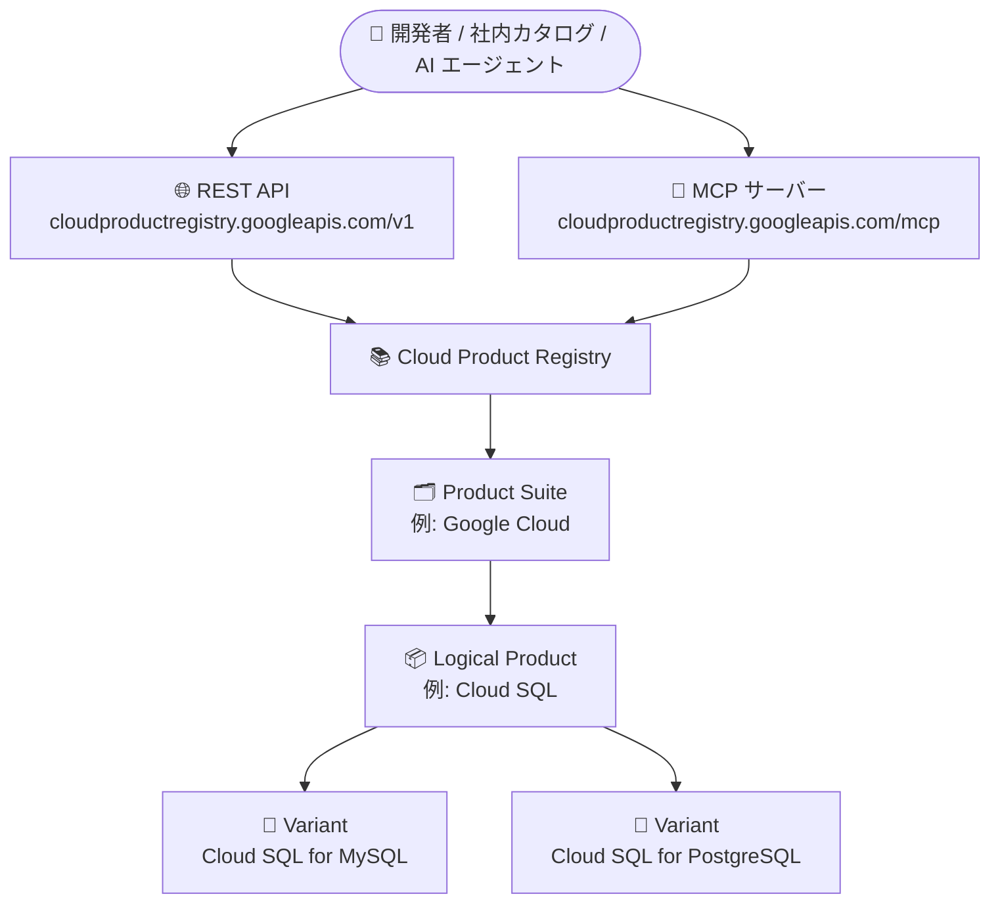

# Cloud Product Registry API: 一般提供 (GA) 開始

**リリース日**: 2026-09-28

**サービス**: Cloud Product Registry API

**機能**: Google Cloud プロダクト階層へのプログラマティックアクセス

**ステータス**: GA (一般提供)

📊 [このアップデートのインフォグラフィックを見る](https://takech9203.github.io/google-cloud-news-summary/20260928-cloud-product-registry-api-ga.html)

## 概要

Cloud Product Registry API が一般提供 (GA) になりました。この API は、Google Cloud のファーストパーティプロダクトに関する「信頼できる唯一の情報源 (authoritative source of truth)」として機能し、Product Suite (プロダクトスイート)、Logical Product (論理プロダクト)、Logical Product Variant (論理プロダクトバリアント) という公式のプロダクト階層にプログラムからアクセスできます。

社内カタログの整備、ガバナンスポリシーの適用、コスト管理ツールの開発などで Google Cloud のプロダクト一覧を扱う場合、これまでは公式の機械可読なプロダクトマスタが存在せず、各社が独自にリストを管理する必要がありました。本 API により、プロダクト名・ID・ライフサイクルステータスといった正確でリアルタイムなデータを REST API および MCP (Model Context Protocol) サーバー経由で取得できます。

対象ユーザーは、社内プロダクトカタログやガバナンス基盤を運用するプラットフォームチーム、Google Cloud のメタデータを扱う ISV・ツールベンダー、AI エージェントから Google Cloud プロダクト情報を参照したい開発者です。

**アップデート前の課題**

- 2026 年 2 月 27 日の Preview リリース以前は、Google Cloud のプロダクト一覧を機械可読な形式で取得する公式 API がなく、社内カタログやガバナンスポリシーの整備には手動でのリスト管理が必要だった
- プロダクトの名称・ID・階層 (スイートとプロダクト、バリアントの関係) について、公式レコードに基づく一貫した参照手段がなかった
- プロダクトの廃止 (Deprecation) や再編 (Restructuring) を追跡する標準的な仕組みがなかった

**アップデート後の改善**

- Cloud Product Registry API が GA となり、本番システムから公式のプロダクト階層 (Product Suites / Logical Products / Logical Product Variants) をプログラムで取得できるようになった
- 各エンティティの名称 (Title)、リソース名 (Name)、ライフサイクルステータスを API で参照できるようになった
- プロダクト再編時には `replaced` / `replacement` フィールドで新しいリソース名を追跡でき、統合の安定性を維持できる
- REST API に加えて MCP リファレンスが提供され、AI エージェントからもプロダクト情報を参照できる

## アーキテクチャ図



Cloud Product Registry は 3 階層のデータモデル (Product Suite → Logical Product → Logical Product Variant) を持ち、REST API と MCP サーバーの 2 つのインターフェースから同じ公式階層を参照できます。

## サービスアップデートの詳細

### 主要機能

1. **3 階層のプロダクトデータモデル**
   - **Product Suite**: 共通ブランドの下にプロダクトをまとめる最上位のグルーピング (例: Google Cloud、Google Workspace、Google Maps)。スイート自体は購入対象ではない
   - **Logical Product**: スイート内の独立したプロダクト (例: Compute Engine、Cloud SQL、Persistent Disk)。単体で購入・利用可能で、専任のプロダクトチームがライフサイクルを管理する
   - **Logical Product Variant**: 主要プロダクトから派生した特化版 (例: Cloud SQL に対する Cloud SQL for MySQL / Cloud SQL for PostgreSQL)。コアアーキテクチャを共有しつつ特定の技術・ユースケース向けに調整されている

2. **REST API (v1)**
   - `productSuites`、`logicalProducts`、`logicalProducts.variants` の 3 リソースに対して `get` / `list` / `lookupEntity` メソッドを提供
   - `lookupEntity` はリソース名 (例: `logicalProducts/{id}`) からエンティティのタイプを事前に知らなくても詳細を取得できる
   - Discovery Document が提供され、クライアントライブラリやツールの自動生成に利用できる

3. **MCP サーバー**
   - エンドポイント `https://cloudproductregistry.googleapis.com/mcp` で MCP ツールを提供
   - `list_product_suites` / `get_product_suite`、`list_logical_products` / `get_logical_product`、`list_logical_product_variants` / `get_logical_product_variant`、`lookup_entity_by_name` の各ツールを利用可能
   - すべて読み取り専用 (Read Only) のツールとして定義されており、AI エージェントから安全にプロダクト情報を参照できる

4. **ライフサイクル管理**
   - **廃止 (Deprecation)**: 廃止されたプロダクト/バリアントは新規販売・登録が制限されるが、既存契約が満了するまで API 上で参照可能
   - **再編 (Restructuring)**: Logical Product がバリアントに再分類される (またはその逆の) 場合、`replaced: true` と `replacement` フィールドで新しいリソース名が通知される

## 技術仕様

### REST リソースとメソッド

| リソース | メソッド | エンドポイント |
|------|------|------|
| `v1.productSuites` | `get` / `list` / `lookupEntity` | `GET /v1/productSuites`, `GET /v1/{name=productSuites/*}` |
| `v1.logicalProducts` | `get` / `list` / `lookupEntity` | `GET /v1/logicalProducts`, `GET /v1/{name=logicalProducts/*}` |
| `v1.logicalProducts.variants` | `get` / `list` / `lookupEntity` | `GET /v1/{parent=logicalProducts/*}/variants` |

### 提供されるメタデータ

| フィールド | 説明 |
|------|------|
| `name` | エンティティのリソース名 (例: `logicalProducts/{logicalProduct}`) |
| `title` | エンティティの公式名称 |
| `lifecycleState` | 現在のリリースステージ (Logical Product / Variant) |
| `productSuite` | 所属する Product Suite への参照 (Logical Product) |
| `variants[]` | 子バリアントへの参照 (Logical Product、出力専用) |
| `replaced` / `replacement` | 再編の有無と再編後のリソース名 (出力専用) |

### アクセス制御とクォータ

| 項目 | 詳細 |
|------|------|
| IAM 権限 | 公開データを提供するため、プロジェクトレベルの追加 IAM 権限は不要 |
| レート制限 | Google Cloud プロジェクト ID 単位で標準的な QPS 制限を適用 |
| 対象範囲 | Google Cloud のコアプロダクトのみ (Google Maps、Google Workspace のプロダクトは対象外) |

## 設定方法

### 手順

#### ステップ 1: REST API で Product Suite を一覧取得

```bash
curl "https://cloudproductregistry.googleapis.com/v1/productSuites"
```

Product Suite の一覧 (`name`、`title`、`logicalProducts[]` など) が返されます。`pageSize` (最大 500) と `pageToken` でページネーションできます。

#### ステップ 2: リソース名からエンティティを検索 (lookupEntity)

```bash
curl "https://cloudproductregistry.googleapis.com/v1/logicalProducts/{logical_product_id}:lookupEntity"
```

エンティティのタイプ (Suite / Product / Variant) を事前に知らなくても、リソース名から詳細を取得できます。

#### ステップ 3: MCP サーバーのツール一覧を確認

```bash
curl --location 'https://cloudproductregistry.googleapis.com/mcp' \
  --header 'content-type: application/json' \
  --header 'accept: application/json, text/event-stream' \
  --data '{ "method": "tools/list", "jsonrpc": "2.0", "id": 1 }'
```

MCP クライアントや AI エージェントから利用できるツールの仕様を確認できます。

## メリット

### ビジネス面

- **信頼できる唯一の情報源**: プロダクト名・ID・階層の公式レコードにアクセスでき、社内カタログやガバナンスポリシーの正確性を担保できる
- **無料で利用可能**: Cloud Product Registry の利用は無料であり、追加コストなしでカタログ整備を自動化できる
- **GA による本番利用**: Pre-GA 提供条件の制約がなくなり、本番システムへの組み込みが可能になった

### 技術面

- **構造化されたデータモデル**: Product Suite / Logical Product / Variant の関係を API でナビゲートでき、独自のマッピング作業が不要になる
- **変更追跡の仕組み**: `replaced` / `replacement` フィールドにより、プロダクト再編時もリソース名の変更を機械的に追跡できる
- **MCP 対応**: AI エージェントやLLM アプリケーションから読み取り専用ツールとして直接プロダクト情報を参照できる
- **簡単な導入**: 公開データのため追加の IAM 権限設定が不要

## デメリット・制約事項

### 制限事項

- 対象は Google Cloud のコアプロダクトのみで、Google Maps と Google Workspace のプロダクトは含まれない
- 提供されるメタデータは名称・リソース名・ライフサイクルステータスなどの基本属性が中心である
- プロジェクト ID 単位の QPS レート制限が適用される

### 考慮すべき点

- 廃止されたエンティティは既存契約の満了まで API 上に残るため、カタログ同期時はライフサイクルステータスの確認が必要
- プロダクト再編 (Logical Product ⇔ Variant の変更) が発生するとリソース名が変わるため、`replaced` / `replacement` フィールドを考慮した実装が推奨される

## ユースケース

### ユースケース 1: 社内プロダクトカタログの自動同期

**シナリオ**: 大企業のプラットフォームチームが、利用許可済み Google Cloud サービスの社内カタログを管理している。従来は新サービスの追加や名称変更を手動で反映していた。

**実装例**:
```bash
# Logical Product の一覧を定期取得して社内カタログと差分同期
curl "https://cloudproductregistry.googleapis.com/v1/logicalProducts?pageSize=500"
```

**効果**: 公式のプロダクト階層と名称に基づいてカタログを自動更新でき、手動メンテナンスの工数と表記ゆれを削減できる。

### ユースケース 2: AI エージェントからのプロダクト情報参照

**シナリオ**: 社内のクラウド利用ガイダンスを行う AI エージェントが、Google Cloud のプロダクト構成 (例: Cloud SQL のバリアント一覧) を正確に回答する必要がある。

**実装例**:
```json
{
  "method": "tools/call",
  "params": {
    "name": "list_logical_product_variants",
    "arguments": { "parent": "logicalProducts/{logical_product_id}" }
  },
  "jsonrpc": "2.0",
  "id": 1
}
```

**効果**: MCP サーバー経由で公式データを参照するため、エージェントの回答がハルシネーションではなく信頼できる情報源に基づくものになる。

### ユースケース 3: ガバナンスポリシーでのプロダクト再編追跡

**シナリオ**: 組織ポリシーやコスト配賦ルールをプロダクト単位で定義しており、プロダクトの廃止・再編がポリシーの不整合を引き起こすリスクがある。

**効果**: `lifecycleState` と `replaced` / `replacement` フィールドを監視することで、廃止・再編を早期に検知し、ポリシー定義を追随させられる。

## 料金

Cloud Product Registry は無料で利用できます。ただし、プロジェクト ID 単位の QPS レート制限が適用されます。

## 関連サービス・機能

- **MCP (Model Context Protocol)**: 本 API は MCP サーバーを提供しており、AI エージェントや LLM アプリケーションから読み取り専用ツールとしてプロダクト階層を参照できる
- **Google Cloud リリースノート (BigQuery 公開データセット)**: プロダクト単位のアップデート情報は BigQuery の `google_cloud_release_notes` 公開データセットからも取得でき、本 API のプロダクトマスタと組み合わせて利用できる

## 参考リンク

- 📊 [インフォグラフィック](https://takech9203.github.io/google-cloud-news-summary/20260928-cloud-product-registry-api-ga.html)
- [公式リリースノート](https://docs.cloud.google.com/release-notes#September_28_2026)
- [Cloud Product Registry 概要](https://docs.cloud.google.com/product-registry/overview)
- [REST API リファレンス](https://docs.cloud.google.com/product-registry/reference/cloudproductregistry-api/rest)
- [MCP リファレンス](https://docs.cloud.google.com/product-registry/reference/cloudproductregistry-api/mcp)
- [Cloud Product Registry リリースノート](https://docs.cloud.google.com/product-registry/release-notes)

## まとめ

Cloud Product Registry API の GA により、Google Cloud プロダクトの公式階層 (Suite / Product / Variant) を無料かつ追加 IAM 設定なしでプログラムから取得できるようになりました。社内カタログやガバナンス基盤を運用しているチームは、手動管理しているプロダクトリストを本 API ベースの自動同期に置き換えることを検討してください。AI エージェントを構築している場合は、MCP サーバー経由での参照も有力な選択肢です。

---

**タグ**: #CloudProductRegistry #API #GA #MCP #ガバナンス #プロダクトカタログ
