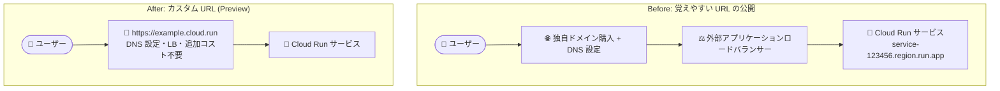

# Cloud Run: カスタム URL (*.cloud.run) の作成 (Preview)

**リリース日**: 2026-09-28

**サービス**: Cloud Run

**機能**: カスタム URL (Custom URLs)

**ステータス**: Preview

📊 [このアップデートのインフォグラフィックを見る](https://takech9203.github.io/google-cloud-news-summary/20260928-cloud-run-custom-urls-preview.html)

## 概要

Cloud Run サービスに対して、`example.cloud.run` のような覚えやすく、グローバルに利用可能なカスタム URL を作成できる機能が Preview として発表されました。DNS の設定、ロードバランサーの構築、追加コストは一切不要です。

これまで Cloud Run サービスにはデプロイ時に `https://SERVICE_NAME-PROJECT_NUMBER.REGION.run.app` という形式の決定論的なデフォルト URL が割り当てられていました。この URL はプロジェクト番号やリージョン名を含むため長く、口頭やドキュメントで共有しにくいという課題がありました。今回のアップデートにより、`https://CUSTOM_URL_DOMAIN.cloud.run` というシンプルな形式の URL を、任意のサブドメイン名で取得してサービスにマッピングできるようになります。

デモやプロトタイプの共有、社内ツールの公開、ハッカソンなど、独自ドメインを用意するほどではないが覚えやすい URL が欲しいケースに適した機能であり、個人開発者からエンタープライズまで幅広いユーザーが対象です。

**アップデート前の課題**

- デフォルト URL (`SERVICE_NAME-PROJECT_NUMBER.REGION.run.app`) は長く、プロジェクト番号やリージョン名を含むため、覚えたり共有したりしにくかった
- 覚えやすい URL でサービスを公開するには、独自ドメインの購入、DNS レコードの設定、外部ロードバランサー (グローバル外部アプリケーションロードバランサー) の構築などが必要だった
- 既存の Cloud Run ドメインマッピング (Preview) は独自ドメインの所有権確認と DNS レコードの更新が必要で、利用可能リージョンも限定されていた

**アップデート後の改善**

- DNS 設定・ロードバランサー・追加コストなしで、`https://CUSTOM_URL_DOMAIN.cloud.run` 形式のシンプルな URL をサービスにマッピングできるようになった
- カスタム URL は標準の `.run.app` URL と同様にどこからでもアクセス可能 (グローバル可用性)
- 新しいリビジョンをデプロイすることなく、カスタム URL のアタッチ・デタッチ・サービス間の移動が柔軟に行えるようになった
- 1 つのサービスに複数のカスタム URL をマッピングできるようになった

## アーキテクチャ図



従来は覚えやすい URL の公開に独自ドメインや外部ロードバランサーの構築が必要でしたが、カスタム URL ではドメインマッピングを 1 つ作成するだけで `*.cloud.run` の URL からサービスに直接ルーティングされます。

## サービスアップデートの詳細

### 主要機能

1. **シンプルな URL 形式**
   - `https://CUSTOM_URL_DOMAIN.cloud.run` というクリーンな形式でサービスを公開できる
   - デフォルト URL (`https://SERVICE_NAME-PROJECT_NUMBER.REGION.run.app`) の代わりに、入力しやすく覚えやすい URL を利用可能

2. **グローバル可用性**
   - カスタム URL は標準の `.run.app` URL と同様に、どこからでもアクセス可能

3. **柔軟なライフサイクル管理**
   - 新しいリビジョンをデプロイすることなく、カスタム URL をサービスにアタッチ・デタッチ・移動できる
   - 1 つのサービスに複数のカスタム URL をマッピング可能

4. **カスタムオーディエンスによる保護**
   - カスタム URL をカスタムオーディエンスとしてサービスに追加し、IAM 認証時の対象 (audience) として利用できる

## 技術仕様

### カスタム URL の仕様

| 項目 | 詳細 |
|------|------|
| URL 形式 | `https://CUSTOM_URL_DOMAIN.cloud.run` |
| サブドメインの長さ | 6〜63 文字 |
| サブドメインの命名規則 | 英数字とハイフンが使用可能な標準 DNS 命名規則に準拠。先頭・末尾にハイフンは使用不可 |
| マッピング上限 | デフォルトでプロジェクトあたり最大 50 ドメイン |
| 一意性 | サブドメインは Google Cloud 全体で一意。他のユーザー・サービスが使用中の場合はエラー |
| 必要な IAM ロール | Cloud Run 管理者 (`roles/run.admin`) |

### デフォルト URL との関係

- カスタム URL はデフォルト URL から完全に独立しており、サービスのデフォルト `.run.app` URL を無効化してもカスタム URL は引き続き有効
- デフォルト URL と異なり、カスタム URL は一時的な無効化ができない。トラフィックの提供を停止するにはマッピングの削除が必要

## 設定方法

### 前提条件

1. 課金が有効になっている Google Cloud プロジェクト
2. gcloud CLI のインストールと初期化
3. Cloud Run 管理者 (`roles/run.admin`) ロール

### 手順

#### ステップ 1: 既存サービスへのカスタム URL のマッピング

```bash
gcloud beta run domain-mappings create \
  --service=SERVICE_NAME \
  --domain=CUSTOM_URL_DOMAIN.cloud.run
```

`SERVICE_NAME` はマッピング先のサービス名、`CUSTOM_URL_DOMAIN` は取得したいサブドメインに置き換えます。複数のカスタム URL をマッピングする場合は、このコマンドをカスタム URL ごとに繰り返し実行します。Google Cloud コンソールの場合は「ドメインマッピング」ページの「Add custom URL」から、新規サービスの場合はデプロイ時の「Custom URLs」セクションから設定できます。

#### ステップ 2: カスタム URL の一覧・詳細確認

```bash
# プロジェクト内のすべてのカスタム URL とドメインマッピングを一覧表示
gcloud beta run domain-mappings list

# 特定のカスタム URL の詳細を表示
gcloud beta run domain-mappings describe \
  --domain=CUSTOM_URL_DOMAIN.cloud.run
```

コンソールでは、サービスの「ネットワーキング」タブの「Endpoints」ラベル配下 (Custom domains セクション) で確認できます。

#### ステップ 3 (オプション): カスタムオーディエンスによるアクセス制限

```bash
gcloud beta run services update SERVICE_NAME \
  --add-custom-audiences=CUSTOM_URL_DOMAIN.cloud.run
```

カスタム URL をカスタムオーディエンスとして追加することで、IAM 認証されたサービスでカスタム URL を有効なオーディエンスとして受け付けられます。

#### カスタム URL の削除・移動

```bash
# カスタム URL マッピングの削除
gcloud beta run domain-mappings delete \
  --domain=CUSTOM_URL_DOMAIN.cloud.run

# 別のサービスへ移動 (削除後に再作成)
gcloud beta run domain-mappings create \
  --service=NEW_SERVICE_NAME \
  --domain=CUSTOM_URL_DOMAIN.cloud.run
```

カスタム URL の直接的な更新コマンドはなく、サービス間の移動は削除して再作成するフローで行います。

## メリット

### ビジネス面

- **追加コスト不要**: DNS 設定、ロードバランサー、独自ドメインの購入なしで覚えやすい URL を利用でき、コストを抑えられる
- **共有の容易さ**: デモ、プロトタイプ、社内ツールなどを覚えやすい URL で即座に共有できる

### 技術面

- **インフラ構築不要**: 外部アプリケーションロードバランサーや DNS レコードの管理が不要で、マッピング作成のみで完結する
- **デプロイ不要の URL 管理**: 新しいリビジョンのデプロイなしで URL のアタッチ・デタッチ・移動が可能
- **グローバル可用性**: 標準の `.run.app` URL と同等のグローバルなアクセス性を確保

## デメリット・制約事項

### 制限事項

- Preview 段階の機能であり、Pre-GA Offerings Terms が適用される (サポートが限定される可能性がある)
- デフォルトでプロジェクトあたり最大 50 ドメインまで
- サブドメインは 6〜63 文字で、一部のサブドメインは予約されており使用できない
- Ingress を「内部」または「内部と Cloud Load Balancing」に制限しているサービスはサポート対象外
- Terraform はカスタム URL に対応していない (Preview の `domain_mapping` リソースの使用は非推奨)
- デフォルト URL のような一時的な無効化はできず、トラフィック停止にはマッピングの削除が必要

### 考慮すべき点

- **ドメインスナイピングのリスク**: マッピングを削除するとそのサブドメインは即座に他のユーザーが取得可能になるため、頻繁な削除は推奨されない
- **サービス削除時の挙動**: 基盤となる Cloud Run サービスを削除してもカスタム URL マッピングは自動的に解放されない。明示的にマッピングを削除する必要がある
- **Google によるドメイン管理**: Google は不正利用防止、商標保護、セキュリティ対応などのためにサブドメインを取り消し・再割り当てする権利を留保している
- **伝播の遅延**: カスタム URL の作成直後は完全に有効になるまで数秒かかることがあり、直後のアクセスは一時的なルーティングエラーになる場合がある
- サブドメインは Google Cloud 全体で一意のため、希望する名前が既に使用されている場合は別の名前を選ぶ必要がある

## ユースケース

### ユースケース 1: デモ・プロトタイプの迅速な共有

**シナリオ**: 開発チームが顧客向けデモアプリケーションを Cloud Run にデプロイし、覚えやすい URL で共有したい。独自ドメインの購入や DNS 設定の手間はかけたくない。

**実装例**:
```bash
gcloud beta run domain-mappings create \
  --service=demo-app \
  --domain=my-product-demo.cloud.run
```

**効果**: 数コマンドで `https://my-product-demo.cloud.run` という覚えやすい URL を取得でき、追加コストなしで顧客に共有できる。

### ユースケース 2: Blue/Green 的なサービス切り替え

**シナリオ**: 覚えやすい URL を維持したまま、提供するサービスの実体を旧バージョンから新バージョンのサービスに切り替えたい。

**効果**: カスタム URL は新しいリビジョンのデプロイなしにサービス間を移動できるため、旧サービスからマッピングを削除して新サービスに再作成するだけで、同じ URL のままトラフィックの向き先を切り替えられる。

## 料金

リリースノートに明記されている通り、カスタム URL の利用に追加コストは発生しません。Cloud Run サービス自体の料金は通常通り適用されます。

- [Cloud Run 料金ページ](https://cloud.google.com/run/pricing)

## 利用可能リージョン

カスタム URL はグローバルに利用可能で、標準の `.run.app` URL と同様にどこからでもアクセスできます。リージョンごとの制限は公式ドキュメントに記載されていません。

## 関連サービス・機能

- **Cloud Run ドメインマッピング (Preview)**: 独自ドメイン (例: `example.com`) をサービスにマッピングする既存機能。独自ドメインの所有権確認と DNS レコード設定が必要で、カスタム URL とは異なり利用可能リージョンが限定される
- **グローバル外部アプリケーションロードバランサー**: 独自 TLS 証明書、Cloud CDN、Google Cloud Armor などの高度な制御が必要な本番環境向けの独自ドメイン公開手段
- **Firebase Hosting**: Cloud Run と組み合わせて独自ドメインを設定するもう 1 つの選択肢
- **カスタムオーディエンス**: IAM で保護された Cloud Run サービスにおいて、カスタム URL を認証トークンの有効なオーディエンスとして構成できる

## 参考リンク

- 📊 [インフォグラフィック](https://takech9203.github.io/google-cloud-news-summary/20260928-cloud-run-custom-urls-preview.html)
- [公式リリースノート](https://docs.cloud.google.com/release-notes#September_28_2026)
- [ドキュメント: Create custom URLs](https://docs.cloud.google.com/run/docs/custom-urls)
- [ドキュメント: Mapping custom domains](https://docs.cloud.google.com/run/docs/mapping-custom-domains)
- [料金ページ](https://cloud.google.com/run/pricing)

## まとめ

Cloud Run のカスタム URL は、DNS 設定・ロードバランサー・追加コストなしで `*.cloud.run` の覚えやすい URL をサービスに付与できる、開発者体験を大きく向上させるアップデートです。デモやプロトタイプの共有、社内ツールの公開など、独自ドメインを用意するほどではないユースケースにすぐに活用できます。まだ Preview 段階のため本番環境への適用は慎重に判断しつつ、`gcloud beta run domain-mappings create` で希望のサブドメインを早めに確保しておくことをおすすめします。

---

**タグ**: #CloudRun #CustomURL #Serverless #Preview #Networking
