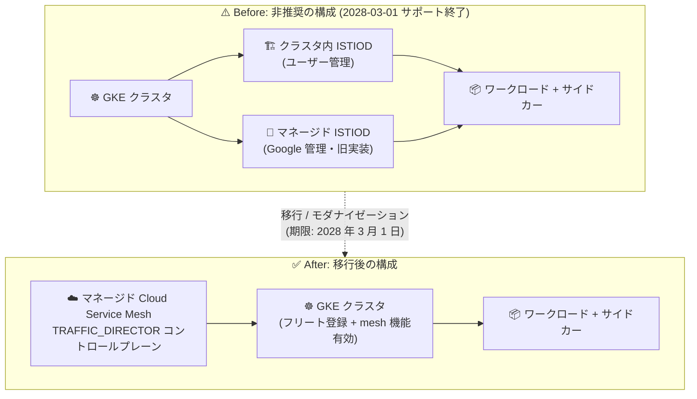

# Cloud Service Mesh: GKE 上の ISTIOD コントロールプレーン (クラスタ内・マネージド) の非推奨化

**リリース日**: 2026-09-28

**サービス**: Cloud Service Mesh

**機能**: ISTIOD コントロールプレーン (クラスタ内およびマネージド) の非推奨化と TRAFFIC_DIRECTOR への移行

**ステータス**: 非推奨 (Deprecated) — サポート終了日: 2028 年 3 月 1 日

📊 [このアップデートのインフォグラフィックを見る](https://takech9203.github.io/google-cloud-news-summary/20260928-cloud-service-mesh-istiod-control-plane-deprecation.html)

## 概要

2026 年 9 月 28 日付で、Google Cloud 上の GKE における Cloud Service Mesh の **ISTIOD コントロールプレーン** に関する 2 件の関連する非推奨化が発表されました。対象は (1) **クラスタ内 (in-cluster) ISTIOD コントロールプレーン** と (2) **マネージド ISTIOD コントロールプレーン** の両方で、いずれもサポート終了日は **2028 年 3 月 1 日** です。

サポート終了後の影響は構成によって異なります。クラスタ内 ISTIOD の場合、GKE 上のクラスタ内コントロールプレーン コンポーネントはアップデート、セキュリティ パッチ、サポートを受けられなくなります。マネージド ISTIOD の場合はさらに深刻で、モダナイゼーション (TRAFFIC_DIRECTOR への移行) が完了していないクラスタ上のワークロード サイドカーは**動作しなくなり、リクエストの送受信ができなくなります**。なお、Google Distributed Cloud (ソフトウェアのみ) 上のクラスタ内 ISTIOD は引き続きサポートされます。

Google Cloud は、Istio API を使用するマネージド Cloud Service Mesh を **TRAFFIC_DIRECTOR コントロールプレーン実装**へ移行 (モダナイゼーション) することを進めており、TRAFFIC_DIRECTOR と互換性のない機能のサポートも終了します。対象ユーザーは、2028 年 3 月 1 日までにマネージド Cloud Service Mesh (TRAFFIC_DIRECTOR コントロールプレーン) への移行、またはクラスタのモダナイゼーションを完了する必要があります。

**アップデート前の課題**

- クラスタ内 ISTIOD では、コントロールプレーンのインストール・アップグレード・スケーリングをユーザー自身が管理する必要があった
- マネージド ISTIOD とマネージド TRAFFIC_DIRECTOR の 2 つのコントロールプレーン実装が併存し、フリートによって実装が異なる状態だった (2024 年 7 月 1 日以降、新規フリートには TRAFFIC_DIRECTOR 実装が提供されている)
- どのコントロールプレーン実装を使用しているかを利用者側で意識する必要があった

**アップデート後の改善 (移行後)**

- マネージド Cloud Service Mesh (TRAFFIC_DIRECTOR) では、コントロールプレーンが Google 管理となり、ユーザーによる ISTIOD コンポーネントの運用が不要になる
- モダナイゼーション完了後、Google が Istiod ベースのコンポーネントをすべて削除し、コントロールプレーン実装が TRAFFIC_DIRECTOR に一本化される
- モダナイゼーションは Google 主導 (デフォルト) と顧客主導の 2 つの方式から選択でき、メンテナンス ウィンドウの活用や事前通知、最低 6 営業日のソーク期間と完了確定前のロールバックがサポートされる

## アーキテクチャ図



GKE 上のクラスタ内 ISTIOD とマネージド ISTIOD の両方が非推奨となり、Google 管理の TRAFFIC_DIRECTOR コントロールプレーン実装への移行が必要になります。

## サービスアップデートの詳細

### 主要機能 (非推奨化の内容)

1. **クラスタ内 ISTIOD コントロールプレーンの非推奨化 (GKE on Google Cloud)**
   - 2026 年 9 月 28 日付で非推奨、2028 年 3 月 1 日にサポート終了
   - サポート終了後、GKE 上のクラスタ内コントロールプレーン コンポーネントはアップデート、セキュリティ パッチ、サポートを受けられなくなる
   - Google Distributed Cloud (ソフトウェアのみ) 上のクラスタ内 ISTIOD は引き続きサポート対象
   - 対象ユーザーは、TRAFFIC_DIRECTOR コントロールプレーンを使用するマネージド Cloud Service Mesh へ 2028 年 3 月 1 日までに移行する必要がある

2. **マネージド ISTIOD コントロールプレーンの非推奨化 (GKE on Google Cloud)**
   - 2026 年 9 月 28 日付で非推奨、2028 年 3 月 1 日にサポート終了
   - サポート終了後、モダナイゼーション未完了のクラスタ上のワークロード サイドカーは動作しなくなり、リクエストの送受信が不可能になる
   - Istio API を使用するマネージド Cloud Service Mesh は TRAFFIC_DIRECTOR コントロールプレーン実装へ移行され、TRAFFIC_DIRECTOR と互換性のない機能のサポートは終了する
   - 対象ユーザーは互換性を確認のうえ、2028 年 3 月 1 日までにクラスタのモダナイゼーションを完了する必要がある

3. **移行先: マネージド TRAFFIC_DIRECTOR コントロールプレーンとモダナイゼーション プロセス**
   - モダナイゼーションには **Google 主導 (デフォルト)** と **顧客主導 (セルフサービス)** の 2 つの方式がある
   - Google 主導では、Google がフリートの互換性を評価し、メンテナンス ウィンドウと事前通知に基づいて組織単位でスケジュールする。組織内に 1 つでも非互換のフリートがあると、組織のモダナイゼーションはブロックされる
   - 顧客主導では、gcloud CLI を使用して Google のスケジュールとは独立に、フリート単位で移行のタイミングを自ら制御できる
   - モダナイゼーション中はデュアル コントロールプレーンが並行稼働し、Deployment (ワークロードとゲートウェイ) は自動的に新コントロールプレーンへ移行する。StatefulSet と DaemonSet のワークロードは手動での再起動が必要
   - 移行後は最低 6 営業日のソーク期間があり、フリートレベルの確定 (finalize) 前であれば完全なロールバックが可能。完了後は Google が Istiod ベースのコンポーネントをすべて削除する

## 技術仕様

### 非推奨化のスケジュールと影響

| 項目 | クラスタ内 ISTIOD | マネージド ISTIOD |
|------|------------------|------------------|
| 非推奨化発表日 | 2026 年 9 月 28 日 | 2026 年 9 月 28 日 |
| サポート終了日 | 2028 年 3 月 1 日 | 2028 年 3 月 1 日 |
| サポート終了後の影響 | アップデート・セキュリティ パッチ・サポートの提供終了 | 未モダナイズ クラスタのサイドカーが動作停止 (リクエスト送受信不可) |
| 対象環境 | GKE on Google Cloud | GKE on Google Cloud |
| 対象外 | Google Distributed Cloud (ソフトウェアのみ) のクラスタ内 ISTIOD | — |
| 必要なアクション | マネージド Cloud Service Mesh (TRAFFIC_DIRECTOR) への移行 | クラスタのモダナイゼーション (互換性確認 + 移行) |

### TRAFFIC_DIRECTOR 実装の主な前提条件・互換性チェック項目

| 項目 | 詳細 |
|------|------|
| フリート登録 | クラスタが mesh 機能を有効化したフリートに登録されている必要がある (レガシー ツールでオンボードした場合は Google が自動登録。クラスタの登録を解除する自動化がある場合は事前に削除が必要) |
| Workload Identity | クラスタおよびノードプールで Workload Identity の有効化が必要 (`WORKLOAD_IDENTITY_REQUIRED` 条件で検出) |
| Istio 構成の互換性 | Istio CRD 構成、Pod アノテーション、MeshConfig 設定、スケール パラメータが評価される (`MODERNIZATION_INCOMPATIBLE_CONFIG` などの条件で検出) |
| 組織ポリシー | `constraints/compute.disableInternetNetworkEndpointGroup` が適用 (enforced: true) されていると、TRAFFIC_DIRECTOR で必要なインターネット NEG の作成がブロックされる |
| Shared VPC | クラスタがサービス プロジェクト、VPC がホスト プロジェクトにある場合、フリート プロジェクトの Cloud Service Mesh サービス エージェントにホスト プロジェクトのファイアウォール ルール管理権限が必要 (ISTIOD では不要だった) |

## 設定方法

### 前提条件

1. 使用中のコントロールプレーン実装 (ISTIOD / TRAFFIC_DIRECTOR) を確認する
2. フリートの互換性チェックを有効化し、モダナイゼーションのブロッカーを把握する

### 手順

#### ステップ 1: フリートのメッシュ状態と互換性を確認する

```bash
gcloud container fleet mesh describe --project FLEET_PROJECT_ID
```

`state.servicemesh.conditions` にフリートレベルの互換性ステータスが表示されます。`MODERNIZATION_COMPATIBLE` であればモダナイゼーション可能、`MODERNIZATION_INCOMPATIBLE` の場合は `membershipStates.servicemesh` 配下の WARNING / ERROR 条件 (例: `MODERNIZATION_INCOMPATIBLE_POD_ANNOTATION`、`WORKLOAD_IDENTITY_REQUIRED`) を確認し、各条件の `documentationLink` に従って解消します。

#### ステップ 2: 非互換の Istio リソースを特定して修正する

```bash
for resource in authorizationpolicies destinationrules envoyfilters gateways \
  peerauthentications proxyconfigs requestauthentications serviceentries \
  sidecars telemetries virtualservices wasmplugins workloadentries workloadgroups; do
  echo "--- Checking $resource ---"
  kubectl get $resource --all-namespaces -o json | \
    jq -r '.items[] | select(.status.conditions != null and any(.status.conditions[];
      .type == "ModernizationCompatible" and .status == "False")) |
      {"kind": .kind, "name": .metadata.name, "namespace": .metadata.namespace,
       "message": [.status.conditions[] | select(.type == "ModernizationCompatible").message]}'
done
```

各リソースの `status.conditions` (type: `ModernizationCompatible`) に非互換の理由が出力されます (例: ServiceEntry の `DNS_ROUND_ROBIN` は未サポートのため `DNS` に変更)。修正後、定期チェックによるステータス更新には最大 24 時間かかります。

#### ステップ 3: モダナイゼーションの方式を選択して実行する

- **Google 主導 (デフォルト)**: Google がフリートの準備完了を判断してスケジュールし、開始前に通知する。GKE のメンテナンス ウィンドウを設定していれば、その時間帯に実行される。クラスタのモダナイズ順序はカスタマイズ可能
- **顧客主導 (セルフサービス)**: 対象フリートが `MODERNIZATION_COMPATIBLE` であることを確認したうえで、gcloud CLI からクラスタ/フリート単位で任意のタイミングで移行をトリガーする

移行中はプロキシを持つワークロードが再起動されます (Kubernetes のベスト プラクティスに従っていればダウンタイムは発生しない想定)。開始後は完了まで実行され、最低 6 営業日のソーク期間中に問題を検知した場合は、確定前であればロールバックをリクエストできます。

## メリット

### ビジネス面

- **運用負荷の削減**: 移行後はコントロールプレーンが完全に Google 管理となり、ISTIOD のアップグレード・パッチ適用・スケーリングといった運用作業が不要になる
- **計画的な移行が可能**: サポート終了まで約 1 年 5 か月の猶予があり、Google 主導/顧客主導の 2 方式から自社の運用に合った移行計画を選択できる

### 技術面

- **段階的で安全な移行プロセス**: デュアル コントロールプレーンの並行稼働、メンテナンス ウィンドウでの実行、6 営業日以上のソーク期間、確定前のロールバック対応により、リスクを抑えた移行が可能
- **互換性の事前検証**: `gcloud container fleet mesh describe` とリソースごとの `ModernizationCompatible` 条件により、移行前にブロッカーを特定・修正できる

## デメリット・制約事項

### 制限事項

- 2028 年 3 月 1 日以降、GKE 上のクラスタ内 ISTIOD はアップデート・セキュリティ パッチ・サポートを受けられない
- 2028 年 3 月 1 日以降、モダナイゼーション未完了のクラスタではサイドカーが動作せず、ワークロードがリクエストを送受信できなくなる (マネージド ISTIOD)
- TRAFFIC_DIRECTOR と互換性のない機能はサポートが終了する (未サポートの Istio API・MeshConfig 設定・アノテーションなどは移行前に修正が必要)
- Google 主導のモダナイゼーションでは、組織内に 1 つでも非互換のフリートがあると組織全体のスケジュールがブロックされる

### 考慮すべき点

- モダナイゼーション時にプロキシを持つワークロードが再起動されるため、PodDisruptionBudget や複数レプリカなど Kubernetes のベスト プラクティスに従った構成にしておく必要がある
- Deployment は自動移行されるが、StatefulSet と DaemonSet は手動での再起動が必要
- Shared VPC 構成では、フリート プロジェクトのサービス エージェントにホスト プロジェクトのファイアウォール ルール管理権限を追加する必要がある (ISTIOD では不要だった新しい要件)
- 組織ポリシー `compute.disableInternetNetworkEndpointGroup` が適用されていると TRAFFIC_DIRECTOR が正常に動作しないため、事前の確認・変更が必要
- クラスタのフリート登録を解除する自動化が存在する場合、モダナイゼーション前に削除する必要がある

## ユースケース

### ユースケース 1: クラスタ内 ISTIOD を運用中のプラットフォーム チーム

**シナリオ**: GKE 上でクラスタ内 ISTIOD (旧 Anthos Service Mesh のクラスタ内コントロールプレーン) を自己管理しており、バージョン アップグレードやセキュリティ パッチの適用を定期的に実施している。

**実装例**:
```bash
# フリートのメッシュ状態を確認し、移行計画の起点とする
gcloud container fleet mesh describe --project FLEET_PROJECT_ID
```

**効果**: 2028 年 3 月 1 日までにマネージド Cloud Service Mesh (TRAFFIC_DIRECTOR) へ移行することで、サポート切れによるセキュリティ リスクを回避し、コントロールプレーン運用 (アップグレード・パッチ適用) から解放される。

### ユースケース 2: マネージド ISTIOD 実装のフリートを利用中のチーム

**シナリオ**: マネージド Cloud Service Mesh を利用しているが、フリートが旧 ISTIOD 実装のまま残っている。サポート終了後はサイドカーが動作しなくなるため、影響が大きい。

**効果**: 互換性チェックを有効化してブロッカー (未サポートの Istio 構成、Workload Identity 未有効化など) を早期に修正し、Google 主導のスケジュールを待つか、顧客主導で自社のリリース カレンダーに合わせて計画的にモダナイゼーションを完了できる。ソーク期間とロールバックにより本番影響を最小化できる。

## 関連サービス・機能

- **Google Kubernetes Engine (GKE)**: 本非推奨化の対象環境。モダナイゼーションは GKE のメンテナンス ウィンドウ設定に従って実行される
- **フリート (GKE Hub / gkehub.googleapis.com)**: TRAFFIC_DIRECTOR 実装はフリート登録と mesh 機能の有効化が必須。互換性ステータスもフリート/メンバーシップ単位で報告される
- **Workload Identity**: TRAFFIC_DIRECTOR への移行の前提条件。未有効の場合は `WORKLOAD_IDENTITY_REQUIRED` エラーとなる
- **Cloud Load Balancing (インターネット NEG)**: TRAFFIC_DIRECTOR 実装はメッシュ外へのルーティングにインターネット NEG を使用するため、関連する組織ポリシーの確認が必要
- **Google Distributed Cloud (ソフトウェアのみ)**: クラスタ内 ISTIOD が引き続きサポートされる環境 (今回の非推奨化の対象外)

## 参考リンク

- 📊 [インフォグラフィック](https://takech9203.github.io/google-cloud-news-summary/20260928-cloud-service-mesh-istiod-control-plane-deprecation.html)
- [公式リリースノート](https://docs.cloud.google.com/release-notes#September_28_2026)
- [マネージド コントロールプレーンのモダナイゼーション](https://docs.cloud.google.com/service-mesh/docs/modernization)
- [Cloud Service Mesh のモダナイゼーション互換性の理解](https://docs.cloud.google.com/service-mesh/docs/migrate/eligibility)
- [マネージド Cloud Service Mesh のサポート対象機能](https://docs.cloud.google.com/service-mesh/docs/supported-features-managed)
- [マネージド コントロールプレーンの概要](https://docs.cloud.google.com/service-mesh/docs/managed-control-plane-overview)

## まとめ

GKE 上の Cloud Service Mesh におけるクラスタ内 ISTIOD とマネージド ISTIOD の両コントロールプレーンが非推奨となり、2028 年 3 月 1 日にサポートが終了します。特にマネージド ISTIOD では、期限までにモダナイゼーションを完了しないとサイドカーが動作しなくなるため、影響は重大です。まずは `gcloud container fleet mesh describe` で使用中の実装と互換性ステータスを確認し、非互換構成の修正と TRAFFIC_DIRECTOR への移行計画の策定を早期に開始することを強く推奨します。

---

**タグ**: #CloudServiceMesh #GKE #Istio #TrafficDirector #Deprecation #ServiceMesh #Migration
