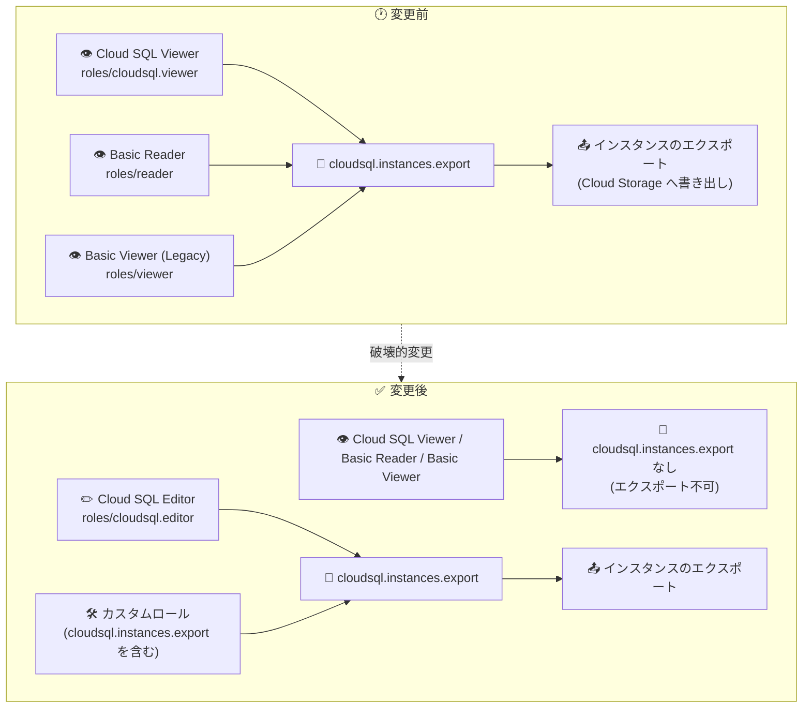

# Cloud SQL: 閲覧系ロールからの cloudsql.instances.export 権限の削除 (破壊的変更)

**リリース日**: 2026-09-28

**サービス**: Cloud SQL (MySQL / PostgreSQL / SQL Server)

**機能**: IAM ロールからの cloudsql.instances.export 権限の削除

**ステータス**: Breaking Change (破壊的変更)

📊 [このアップデートのインフォグラフィックを見る](https://takech9203.github.io/google-cloud-news-summary/20260928-cloud-sql-export-permission-removal.html)

## 概要

Google Cloud は、セキュリティ強化のため、以下の 3 つの IAM ロールから `cloudsql.instances.export` 権限を削除しました。この変更は Cloud SQL for MySQL、Cloud SQL for PostgreSQL、Cloud SQL for SQL Server のすべてに適用されます。

- **Cloud SQL Viewer** (`roles/cloudsql.viewer`)
- **Basic Reader** (`roles/reader`)
- **Basic Viewer (Legacy)** (`roles/viewer`)

`cloudsql.instances.export` は、Cloud SQL インスタンスのデータを Cloud Storage へエクスポートするために必要な権限です。エクスポート操作はデータベースの中身全体を外部 (Cloud Storage バケット) に書き出せる操作であり、「読み取り専用」ロールにこの権限が含まれていることはデータ持ち出し (データエクスフィルトレーション) のリスクとなっていました。今回の変更は最小権限の原則に沿ったセキュリティ改善です。

**これは破壊的変更です。** 上記の閲覧系ロールのみでエクスポート操作 (手動エクスポート、自動化スクリプト、CI/CD パイプラインなど) を行っていたユーザーやサービスアカウントは、変更後にエクスポートが失敗します。エクスポート機能を維持するには、**Cloud SQL Editor (`roles/cloudsql.editor`) ロールの付与、または `cloudsql.instances.export` 権限を含むカスタムロールへの更新が必要**です。

**アップデート前の課題**

- 読み取り専用を意図した Cloud SQL Viewer / Basic Reader / Basic Viewer ロールに、データベース全体を Cloud Storage へ書き出せる `cloudsql.instances.export` 権限が含まれていた
- 閲覧権限しか付与していないつもりのユーザーが、実際にはデータの持ち出しが可能な状態であり、データエクスフィルトレーションのリスクがあった

**アップデート後の改善**

- 閲覧系ロールが名実ともに「読み取り専用」となり、最小権限の原則に沿ったアクセス制御が実現された
- エクスポート操作には Cloud SQL Editor 以上のロール、または明示的に `cloudsql.instances.export` を含むカスタムロールが必要となり、データ持ち出し経路の統制が容易になった

## アーキテクチャ図



変更前は 3 つの閲覧系ロールでインスタンスのエクスポートが可能でしたが、変更後は Cloud SQL Editor ロールまたは `cloudsql.instances.export` を含むカスタムロールが必要になります。

## サービスアップデートの詳細

### 主要な変更点

1. **閲覧系 3 ロールからの `cloudsql.instances.export` 権限の削除**
   - 対象: Cloud SQL Viewer (`roles/cloudsql.viewer`)、Basic Reader (`roles/reader`)、Basic Viewer (Legacy) (`roles/viewer`)
   - これらのロールのみを持つプリンシパル (ユーザー、グループ、サービスアカウント) はインスタンスのエクスポート操作 (`gcloud sql export`、Console のエクスポート、Admin API の `instances.export`) ができなくなる

2. **3 つのデータベースエンジンすべてに適用**
   - Cloud SQL for MySQL、Cloud SQL for PostgreSQL、Cloud SQL for SQL Server で同一の変更が同時に適用される

3. **`cloudsql.backupRuns.export` は影響を受けない**
   - 公式ドキュメントのロール定義によると、バックアップのエクスポートに使用される `cloudsql.backupRuns.export` 権限は、引き続き Cloud SQL Viewer などの閲覧系ロールに含まれる
   - 今回削除されるのはインスタンスデータのエクスポート権限 (`cloudsql.instances.export`) のみ

## 技術仕様

### 変更後の `cloudsql.instances.export` 権限を持つロール

| ロール | `cloudsql.instances.export` | 備考 |
|------|------|------|
| Cloud SQL Admin (`roles/cloudsql.admin`) | ✅ あり | `cloudsql.*` をすべて含む |
| Cloud SQL Editor (`roles/cloudsql.editor`) | ✅ あり | エクスポート維持の推奨移行先 |
| Basic Editor (`roles/editor`) | ✅ あり | `getIamPolicy`/`setIamPolicy` 以外の cloudsql 権限を含む |
| Cloud SQL Viewer (`roles/cloudsql.viewer`) | ❌ 削除 | 読み取り専用 (`cloudsql.backupRuns.export` は保持) |
| Basic Reader (`roles/reader`) | ❌ 削除 | 読み取り専用 |
| Basic Viewer (Legacy) (`roles/viewer`) | ❌ 削除 | 読み取り専用 |

### エクスポート操作に必要な権限 (ユーザー側)

公式ドキュメントによると、Cloud SQL から Cloud Storage へエクスポートするユーザーには以下のいずれかが必要です。

| 選択肢 | 内容 |
|------|------|
| Cloud SQL Editor ロール | `roles/cloudsql.editor` を付与 |
| カスタムロール | `cloudsql.instances.get` と `cloudsql.instances.export` を含める |

また、Cloud SQL インスタンスのサービスアカウントには、エクスポート先バケットに対する `storage.objectAdmin` ロール (または `storage.objects.create` などを含むカスタムロール) が必要です (この要件は従来から変更ありません)。

## 設定方法 (移行手順)

### 前提条件

1. 影響を受けるプリンシパル (閲覧系ロールのみでエクスポートを実行しているユーザー・サービスアカウント) を特定していること
2. IAM ポリシーを変更できる権限 (例: `roles/resourcemanager.projectIamAdmin`) を持っていること

### 手順

#### ステップ 1: 影響を受けるプリンシパルの特定

```bash
# プロジェクトの IAM ポリシーから閲覧系ロールの付与状況を確認
gcloud projects get-iam-policy PROJECT_ID \
  --flatten="bindings[].members" \
  --filter="bindings.role:(roles/cloudsql.viewer OR roles/reader OR roles/viewer)" \
  --format="table(bindings.role, bindings.members)"
```

閲覧系ロールを持つプリンシパルのうち、エクスポート操作 (定期バックアップスクリプト、データパイプラインなど) を実行しているものを洗い出します。Cloud Audit Logs で `cloudsql.instances.export` の実行履歴を確認するのも有効です。

#### ステップ 2 (方法 A): Cloud SQL Editor ロールの付与

```bash
# エクスポートを継続する必要があるプリンシパルに Cloud SQL Editor を付与
gcloud projects add-iam-policy-binding PROJECT_ID \
  --member="serviceAccount:export-sa@PROJECT_ID.iam.gserviceaccount.com" \
  --role="roles/cloudsql.editor"
```

最も簡単な方法ですが、Cloud SQL Editor はエクスポート以外の権限 (インスタンスの更新・再起動など) も含む点に注意してください。

#### ステップ 2 (方法 B): カスタムロールの作成・更新 (最小権限を維持する場合)

```bash
# エクスポートに必要な最小権限のカスタムロールを作成
gcloud iam roles create cloudSqlExporter \
  --project=PROJECT_ID \
  --title="Cloud SQL Exporter" \
  --description="Minimal permissions for Cloud SQL export" \
  --permissions="cloudsql.instances.get,cloudsql.instances.export"

# 既存のカスタムロールに権限を追加する場合
gcloud iam roles update EXISTING_ROLE_ID \
  --project=PROJECT_ID \
  --add-permissions="cloudsql.instances.export"
```

最小権限の原則を維持したい場合は、閲覧系ロールに加えて `cloudsql.instances.export` を含むカスタムロールを付与する方法が推奨されます。

#### ステップ 3: エクスポート動作の確認

```bash
# エクスポートが成功することを確認
gcloud sql export sql INSTANCE_NAME gs://BUCKET_NAME/export-test.sql.gz \
  --database=DATABASE_NAME
```

なお、IAM の権限変更が反映されるまで数分かかる場合があります (Access change propagation)。

## メリット

### ビジネス面

- **データ持ち出しリスクの低減**: 閲覧権限のみのユーザーがデータベース全体を外部に書き出せる経路がなくなり、内部不正・アカウント侵害時の被害範囲が縮小される
- **コンプライアンス対応の強化**: 「読み取り専用」ロールの実態が名称と一致し、監査時の説明が容易になる

### 技術面

- **最小権限の原則の徹底**: エクスポートという書き出し操作が、明示的に許可されたロール・カスタムロールに限定される
- **アクセス統制の明確化**: データエクスポートの実行主体を Cloud SQL Editor またはカスタムロール保有者に限定でき、Audit Logs と組み合わせた統制がしやすくなる

## デメリット・制約事項

### 制限事項

- 閲覧系ロール (Cloud SQL Viewer / Basic Reader / Basic Viewer) のみではインスタンスのエクスポートができなくなる
- この変更は MySQL / PostgreSQL / SQL Server の全エディションに適用され、オプトアウトはアナウンスされていない

### 考慮すべき点

- **既存の自動化への影響**: 閲覧系ロールのサービスアカウントで定期エクスポート (バックアップスクリプト、ETL パイプラインなど) を実行している場合、ジョブが失敗する。早急にロールの見直しが必要
- **Cloud SQL Editor 付与時の権限拡大**: 手軽な移行先である Cloud SQL Editor はインスタンスの更新・再起動・フェイルオーバーなどの権限も含むため、エクスポートのみが目的ならカスタムロールの利用を検討すべき
- **権限伝播の遅延**: IAM 変更の反映には数分かかることがあるため、切り替え作業はエクスポートジョブの実行タイミングを考慮して行う

## ユースケース

### ユースケース 1: 定期エクスポートジョブのサービスアカウント移行

**シナリオ**: Cloud Scheduler + Cloud Run functions から、`roles/cloudsql.viewer` を付与したサービスアカウントで毎晩 `gcloud sql export` を実行していた。今回の変更でジョブが権限エラーで失敗するようになる。

**実装例**:
```bash
# 最小権限カスタムロールを作成して付与 (Viewer は閲覧用にそのまま維持)
gcloud iam roles create cloudSqlExporter \
  --project=PROJECT_ID \
  --permissions="cloudsql.instances.get,cloudsql.instances.export" \
  --title="Cloud SQL Exporter"

gcloud projects add-iam-policy-binding PROJECT_ID \
  --member="serviceAccount:nightly-export@PROJECT_ID.iam.gserviceaccount.com" \
  --role="projects/PROJECT_ID/roles/cloudSqlExporter"
```

**効果**: エクスポートジョブを最小権限のまま復旧でき、インスタンスの変更操作は引き続き許可しない。

### ユースケース 2: 閲覧専用ユーザーの権限棚卸し

**シナリオ**: 監査・閲覧目的で Basic Viewer を広く付与している組織で、今回の変更を機に「誰がデータをエクスポートできるべきか」を棚卸しする。

**効果**: エクスポート可能なプリンシパルが明示的なロール付与に限定され、データ持ち出し経路の可視化と統制が実現する。

## 関連サービス・機能

- **Cloud Storage**: Cloud SQL のエクスポート先。インスタンスのサービスアカウントにバケットへの `storage.objectAdmin` (または相当のカスタムロール) が必要
- **IAM (Identity and Access Management)**: カスタムロールの作成・更新により、最小権限でエクスポート機能を維持できる
- **Cloud Audit Logs**: `cloudsql.instances.export` の実行履歴を確認し、影響を受けるプリンシパルの特定に活用できる

## 参考リンク

- 📊 [インフォグラフィック](https://takech9203.github.io/google-cloud-news-summary/20260928-cloud-sql-export-permission-removal.html)
- [公式リリースノート](https://docs.cloud.google.com/release-notes#September_28_2026)
- [Cloud SQL の IAM ロールとリファレンス (MySQL)](https://docs.cloud.google.com/sql/docs/mysql/iam-roles)
- [Cloud SQL の IAM ロールとリファレンス (PostgreSQL)](https://docs.cloud.google.com/sql/docs/postgres/iam-roles)
- [Cloud SQL の IAM ロールとリファレンス (SQL Server)](https://docs.cloud.google.com/sql/docs/sqlserver/iam-roles)
- [SQL ダンプファイルを使用したエクスポートとインポート](https://docs.cloud.google.com/sql/docs/mysql/import-export/import-export-sql)

## まとめ

Cloud SQL の閲覧系 3 ロール (Cloud SQL Viewer / Basic Reader / Basic Viewer) から `cloudsql.instances.export` 権限が削除される破壊的変更であり、MySQL / PostgreSQL / SQL Server のすべてに適用されます。これらのロールでエクスポートを実行しているユーザーやサービスアカウント (特に自動化ジョブ) は失敗するようになるため、Cloud SQL Editor ロールの付与、または `cloudsql.instances.export` を含むカスタムロールへの更新を早急に実施してください。最小権限を維持したい場合はカスタムロールの利用が推奨されます。

---

**タグ**: #CloudSQL #IAM #セキュリティ #BreakingChange #MySQL #PostgreSQL #SQLServer
