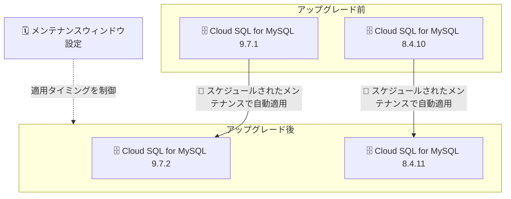

# Cloud SQL for MySQL: マイナーバージョンアップグレード (MySQL 9.7.2 / 8.4.11)

**リリース日**: 2026-09-28

**サービス**: Cloud SQL for MySQL

**機能**: マイナーバージョンアップグレード (9.7.1 → 9.7.2、8.4.10 → 8.4.11)

**ステータス**: Change (変更)

📊 [このアップデートのインフォグラフィックを見る](https://takech9203.github.io/google-cloud-news-summary/20260928-cloud-sql-mysql-minor-version-upgrades.html)

## 概要

Cloud SQL for MySQL において、2 つのメジャーバージョン系列のマイナーバージョンアップグレードが同日に発表されました。MySQL 9.7 系列は 9.7.1 から 9.7.2 に、MySQL 8.4 系列は 8.4.10 から 8.4.11 にアップグレードされます。

これは MySQL コミュニティがリリースした最新マイナーバージョンを Cloud SQL に取り込む定期的なメンテナンスアップデートです。Cloud SQL は、データベースエンジン開発コミュニティによる新しいマイナーバージョンの GA リリースから 3 か月以内にそのバージョンをサポートするポリシーを採用しており、今回のアップデートはこのポリシーに沿ったものです。新規インスタンスは新しいマイナーバージョンで自動的にプロビジョニングされ、既存インスタンスは次回のスケジュールされたメンテナンスロールアウト時に新バージョンへアップグレードされます。

マイナーバージョンには MySQL コミュニティによるバグ修正やセキュリティパッチが含まれるため、Cloud SQL for MySQL 9.7 または 8.4 を利用中のユーザーは、変更内容を MySQL コミュニティのリリースノートで確認しておくことが推奨されます。

## アーキテクチャ図

既存インスタンスは次回のスケジュールされたメンテナンス時に新しいマイナーバージョンへ自動アップグレードされ、適用タイミングはメンテナンスウィンドウの設定で制御できます。

## サービスアップデートの詳細

### 主要な変更点

1. **MySQL 9.7.1 → 9.7.2 へのアップグレード**
   - Cloud SQL for MySQL 9.7 系列の最新マイナーバージョンが 9.7.2 になった
   - 変更内容の詳細は MySQL 9.7 コミュニティリリースノートを参照

2. **MySQL 8.4.10 → 8.4.11 へのアップグレード**
   - Cloud SQL for MySQL 8.4 (LTS) 系列の最新マイナーバージョンが 8.4.11 になった
   - 変更内容の詳細は MySQL 8.4 コミュニティリリースノートを参照

## 技術仕様

### マイナーバージョンアップグレードの適用方法

| 項目 | 詳細 |
|------|------|
| 新規インスタンス | 新しいマイナーバージョンで自動的にプロビジョニング |
| 既存インスタンス | 次回のスケジュールされたメンテナンスロールアウト時に自動アップグレード |
| 適用タイミングの制御 | インスタンスごとにメンテナンスウィンドウ (曜日・時刻) を設定可能 |
| サポートポリシー | コミュニティの GA リリースから 3 か月以内に新マイナーバージョンをサポート |
| 例外 | MySQL 8.0 系列のみ、自動マイナーバージョンアップグレードの有効化が必要 (今回の対象外) |

## デメリット・制約事項

### 考慮すべき点

- 既存インスタンスへの適用はメンテナンスイベントを伴うため、再起動の影響を受けたくない時間帯を避けるようメンテナンスウィンドウを設定しておくことが推奨される
- MySQL はマイナーバージョンのダウングレードをサポートしていないため、アプリケーションへの影響が懸念される場合は事前にコミュニティリリースノートの変更点を確認する
- Cloud SQL が対象マイナーバージョンを決定するため、ユーザー側で個別バージョンの適用可否を選択することはできない (メンテナンスのタイミング制御のみ可能)

## 関連サービス・機能

- **Cloud SQL メンテナンスウィンドウ**: マイナーバージョンアップグレードを含むメンテナンスの実施曜日・時刻をインスタンスごとに制御できる
- **Cloud SQL メンテナンスチェンジログ**: 各メンテナンスバージョンに含まれるマイナーバージョンアップグレードやセキュリティパッチの情報を確認できる

## 参考リンク

- 📊 [インフォグラフィック](https://takech9203.github.io/google-cloud-news-summary/20260928-cloud-sql-mysql-minor-version-upgrades.html)
- [公式リリースノート](https://docs.cloud.google.com/release-notes#September_28_2026)
- [Cloud SQL for MySQL データベースバージョン](https://docs.cloud.google.com/sql/docs/mysql/db-versions)
- [MySQL 9.7 Release Notes (コミュニティ)](https://dev.mysql.com/doc/relnotes/mysql/9.7/en/)
- [MySQL 8.4 Release Notes (コミュニティ)](https://dev.mysql.com/doc/relnotes/mysql/8.4/en/)
- [メンテナンスウィンドウの設定](https://docs.cloud.google.com/sql/docs/mysql/set-maintenance-window)

## まとめ

Cloud SQL for MySQL 9.7 / 8.4 系列の定期的なマイナーバージョンアップグレードであり、既存インスタンスには次回のスケジュールされたメンテナンスで自動適用されます。対象バージョンを利用中の場合は、MySQL コミュニティリリースノートで変更点を確認し、メンテナンスウィンドウが業務影響の少ない時間帯に設定されているかを確認しておくことを推奨します。

---

**タグ**: #CloudSQL #MySQL #MinorVersionUpgrade #Maintenance #Database
