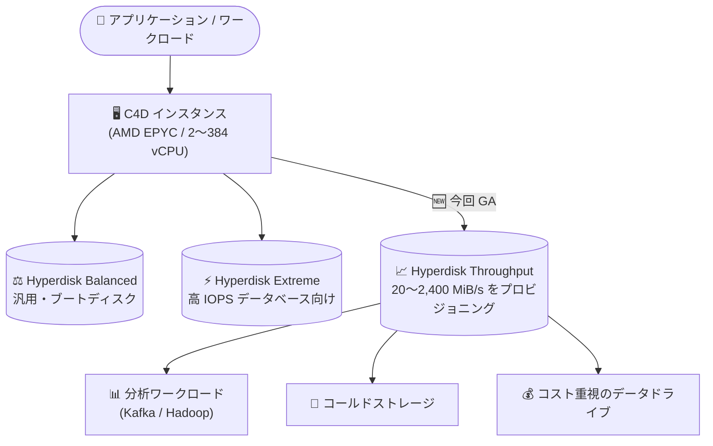

# Compute Engine: C4D マシンシリーズが Hyperdisk Throughput をサポート

**リリース日**: 2026-09-28

**サービス**: Compute Engine

**機能**: C4D マシンシリーズの Hyperdisk Throughput サポート

**ステータス**: 一般提供 (GA)

📊 [このアップデートのインフォグラフィックを見る](https://takech9203.github.io/google-cloud-news-summary/20260928-compute-engine-c4d-hyperdisk-throughput.html)

## 概要

Compute Engine の C4D マシンシリーズで、Hyperdisk Throughput ボリュームのアタッチが一般提供 (GA) になりました。C4D は AMD EPYC プロセッサを搭載した第 4 世代の汎用マシンシリーズで、2 vCPU から 384 vCPU までの幅広い構成を提供しています。

Hyperdisk Throughput は、スループットを重視するコスト効率の高いブロックストレージです。1 ボリュームあたり最大 2,400 MiB/s のスループットをプロビジョニングでき、シーケンシャル I/O と大きなブロックサイズを使うワークロードに適しています。Kafka や Hadoop などの分析ワークロード、コールドストレージ、コスト重視のデータドライブが主なユースケースです。

今回のアップデートにより、C4D ユーザーは Hyperdisk Balanced や Hyperdisk Extreme などの既存の選択肢に加えて、スループット単価の安い Hyperdisk Throughput をワークロード特性に応じて使い分けられるようになりました。

**アップデート前の課題**

- Hyperdisk Throughput のサポート対象マシンシリーズに C4D が含まれておらず、C4D インスタンスでは利用できなかった
- C4D 上の分析ワークロードやコールドデータ用途でも、Hyperdisk Balanced などの他の Hyperdisk タイプを使う必要があり、スループット中心のワークロードに対してコスト最適化の選択肢が限られていた
- 同世代の C4、C4A、C4N では Hyperdisk Throughput が利用できたため、AMD ベースの C4D を選ぶとストレージタイプの選択肢に差があった

**アップデート後の改善**

- C4D インスタンスに Hyperdisk Throughput ボリュームをアタッチできるようになった (GA)
- Kafka / Hadoop などのスループット重視のワークロードやコールドストレージ用途で、容量とスループットを個別にプロビジョニングしてコストを最適化できるようになった
- 第 4 世代マシンシリーズ (C4 / C4A / C4D / C4N / N4 など) の間で、Hyperdisk Throughput を含むストレージ選択肢の一貫性が向上した

## アーキテクチャ図



C4D インスタンスにアタッチできる Hyperdisk タイプに Hyperdisk Throughput が加わり、スループット重視のワークロードをコスト効率よく実行できるようになりました。

## サービスアップデートの詳細

### 主要機能

1. **C4D での Hyperdisk Throughput サポート (GA)**
   - C4D マシンシリーズのインスタンスに Hyperdisk Throughput ボリュームをアタッチ可能になった
   - Hyperdisk Throughput はスループットのみをプロビジョニングする方式で、IOPS は個別に指定できない (プロビジョニングしたスループット 1 MiB/s あたり 4 IOPS、最大 9,600 IOPS が自動的に付与される)

2. **容量とスループットの独立したプロビジョニング**
   - ボリュームサイズ: 2 TiB 〜 32 TiB (デフォルト 2 TiB)
   - スループット: 20 〜 2,400 MiB/s (最小値は容量 1 TiB あたり 5 MiB/s 以上、最大値は容量 1 TiB あたり 90 MiB/s まで)
   - サイズは 6 時間ごと、スループットは 4 時間ごとに変更可能

3. **Hyperdisk Throughput Storage Pools との連携**
   - Hyperdisk Throughput Storage Pools は Hyperdisk Throughput をサポートするマシンシリーズと同じ範囲で利用でき、容量とスループットをプール単位で管理できる

## 技術仕様

### Hyperdisk Throughput の主な仕様

| 項目 | 詳細 |
|------|------|
| ボリュームサイズ | 2 TiB 〜 32 TiB (デフォルト 2 TiB) |
| プロビジョニング可能スループット | 20 〜 2,400 MiB/s (1 ボリュームあたり) |
| 最小スループット | MAX(20, 容量 TiB × 5) MiB/s |
| 最大スループット | MIN(容量 TiB × 90, 2,400) MiB/s |
| IOPS | 個別指定不可。スループット 1 MiB/s あたり 4 IOPS (最大 9,600 IOPS) |
| 読み取りレイテンシ | 平均 10 〜 30 ミリ秒 (HDD ベースのストレージに近いプロファイル) |
| 耐久性 | 99.999% 超 |
| 性能の共有 | 同一インスタンスにアタッチした全 Hyperdisk Throughput ボリュームで性能上限を共有。読み書き半二重 (IOPS / スループット上限は読み取りと書き込みの合計) |
| 最大スループット到達条件 | I/O サイズ 256 KB 以上 |

C4D のマシンタイプごとの詳細な性能上限は、公式ドキュメントの「[Hyperdisk Throughput performance limits](https://cloud.google.com/compute/docs/disks/hyperdisk-perf-limits#throughput)」を参照してください (本レポート執筆時点では、同ページの Hyperdisk Throughput の表への C4D 行の反映を確認できていません。最新の値はドキュメントで確認してください)。

### 容量ごとのプロビジョニング可能スループットの例

| サイズ (TiB) | 最小スループット (MiB/s) | 最大スループット (MiB/s) |
|------|------|------|
| 2 | 20 | 180 |
| 5 | 25 | 450 |
| 10 | 50 | 900 |
| 27 | 135 | 2,400 |
| 32 | 160 | 2,400 |

## 設定方法

### 前提条件

1. C4D インスタンスを利用できるプロジェクトとリージョン / ゾーンであること
2. Hyperdisk Throughput が提供されているリージョン / ゾーンであること ([リージョン一覧](https://cloud.google.com/compute/docs/disks/hd-types/hyperdisk-throughput#supported-regions))

### 手順

#### ステップ 1: Hyperdisk Throughput ボリュームを作成する

```bash
gcloud compute disks create my-throughput-disk \
    --type=hyperdisk-throughput \
    --size=2TiB \
    --provisioned-throughput=180 \
    --zone=ZONE
```

サイズとスループットを指定してボリュームを作成します。省略した場合はデフォルト値 (サイズ 2 TiB、スループットは MIN(90 × 容量 TiB, 2,400) MiB/s) が適用されます。

#### ステップ 2: C4D インスタンスにアタッチする

```bash
gcloud compute instances attach-disk my-c4d-instance \
    --disk=my-throughput-disk \
    --zone=ZONE
```

作成したボリュームを C4D インスタンスにアタッチします。プロビジョニングしたスループットは、4 時間ごとに `gcloud compute disks update` で変更できます。

## メリット

### ビジネス面

- **ストレージコストの最適化**: スループット課金と容量課金が分離されているため、大容量だがアクセス頻度の低いコールドデータや、スループットのみが重要な分析用データドライブのコストを抑えられる
- **第 4 世代シリーズ間の選択肢の一貫性**: C4 / C4A / C4N と同様に C4D でも Hyperdisk Throughput を選択できるようになり、CPU アーキテクチャの選定とストレージタイプの選定を独立して行える

### 技術面

- **ワークロードに応じた性能プロビジョニング**: 容量 (2〜32 TiB) とスループット (20〜2,400 MiB/s) を個別に指定でき、サイズは 6 時間ごと、スループットは 4 時間ごとにオンラインで変更可能
- **シーケンシャル I/O への適合**: 大きなブロックサイズのシーケンシャル I/O に最適化されており、Kafka / Hadoop などの分析基盤のデータドライブに適する

## デメリット・制約事項

### 制限事項

- IOPS を個別にプロビジョニングできない (スループット 1 MiB/s あたり 4 IOPS、最大 9,600 IOPS)
- 読み取りレイテンシは平均 10〜30 ミリ秒と HDD に近いプロファイルであり、低レイテンシが必要なワークロードには不向き
- 最小ボリュームサイズが 2 TiB と大きい
- 第 4 世代インスタンス (C4D を含む) にアタッチした Hyperdisk Throughput ボリュームは、他の第 4 世代インスタンスにのみ付け替え可能。第 1〜3 世代インスタンスに移すには新しいボリュームの作成 (ディスク変換) が必要
- Hyperdisk は リソースベースの確約利用割引 (CUD) と継続利用割引 (SUD) の対象外

### 考慮すべき点

- 性能上限は同一インスタンスにアタッチした全 Hyperdisk Throughput ボリュームで共有される
- 最大スループットに到達するには I/O サイズ 256 KB 以上が必要。IOPS と スループットの上限は読み取り / 書き込みの合計に適用される (半二重)
- ランダム I/O が中心のデータベース用途などでは、Hyperdisk Balanced や Hyperdisk Extreme の方が適している

## ユースケース

### ユースケース 1: C4D 上の Kafka / Hadoop クラスタのデータドライブ

**シナリオ**: AMD EPYC ベースの C4D インスタンスで Kafka ブローカーや Hadoop データノードを運用しており、シーケンシャル書き込み / 読み取りのスループットが性能を左右する。

**実装例**:
```bash
# 10 TiB / 900 MiB/s のデータドライブを作成して C4D にアタッチ
gcloud compute disks create kafka-data-disk \
    --type=hyperdisk-throughput \
    --size=10TiB \
    --provisioned-throughput=900 \
    --zone=ZONE

gcloud compute instances attach-disk kafka-broker-c4d \
    --disk=kafka-data-disk --zone=ZONE
```

**効果**: IOPS 課金なしでスループットのみをプロビジョニングでき、ログ追記型のシーケンシャルワークロードのストレージコストを最適化できる。

### ユースケース 2: コールドデータ・アーカイブ用ボリューム

**シナリオ**: アクセス頻度は低いがブロックストレージとして保持する必要があるデータ (バックアップのステージング、長期保管前のデータなど) を C4D インスタンスから扱う。

**効果**: 容量単価の低い Hyperdisk Throughput に低めのスループット (最小 20 MiB/s) をプロビジョニングすることで、保管コストを最小化しつつ必要時にはスループットを 4 時間ごとに引き上げられる。

## 料金

Hyperdisk Throughput は、プロビジョニングした容量 (GiB 単位 / 月) とプロビジョニングしたスループット (MiB/s 単位 / 月) に対して課金されます。ボリュームがインスタンスにアタッチされていない場合や、インスタンスが停止・サスペンド中でも、削除するまで課金が発生します。

公式料金ページに掲載されている一例 (リージョンにより異なります):

- 容量: $0.006 / GiB / 月
- プロビジョニングスループット: $0.000390411 / MiB/s / 時間 (約 $0.28 / MiB/s / 月)

### 料金例 (上記単価に基づく概算)

| 使用量 | 月額料金 (概算) |
|--------|-----------------|
| 2 TiB + 180 MiB/s | 約 $64 (容量 約 $12.3 + スループット 約 $51.3) |
| 10 TiB + 900 MiB/s | 約 $318 (容量 約 $61.4 + スループット 約 $256.5) |

最新の単価とリージョン別料金は [ディスク料金ページ](https://cloud.google.com/compute/disks-image-pricing#disk) を確認してください。なお、Hyperdisk はリソースベースの確約利用割引 (CUD) および継続利用割引の対象外です。

## 利用可能リージョン

Hyperdisk Throughput および C4D の提供リージョンは、それぞれ公式ドキュメントを参照してください。

- [Hyperdisk Throughput のリージョン別提供状況](https://cloud.google.com/compute/docs/disks/hd-types/hyperdisk-throughput#supported-regions)
- [C4D のリージョンとゾーン](https://cloud.google.com/compute/docs/regions-zones)

## 関連サービス・機能

- **Hyperdisk Balanced / Hyperdisk Extreme / Hyperdisk ML**: C4D で利用できる他の Hyperdisk タイプ。ランダム I/O 中心のデータベースには Balanced / Extreme、ML の読み取り集中型ワークロードには ML が適しており、ワークロード特性に応じて使い分ける
- **Hyperdisk Storage Pools**: Hyperdisk Throughput Storage Pool を使うと、複数ボリュームの容量とスループットをプール単位でまとめてプロビジョニングし、利用効率を高められる
- **Google Kubernetes Engine (GKE)**: GKE でも StorageClass 経由で Hyperdisk Throughput を永続ボリュームとして利用できる

## 参考リンク

- 📊 [インフォグラフィック](https://takech9203.github.io/google-cloud-news-summary/20260928-compute-engine-c4d-hyperdisk-throughput.html)
- [公式リリースノート (2026-09-28)](https://docs.cloud.google.com/release-notes#September_28_2026)
- [About Hyperdisk Throughput](https://cloud.google.com/compute/docs/disks/hd-types/hyperdisk-throughput)
- [Hyperdisk Throughput performance limits](https://cloud.google.com/compute/docs/disks/hyperdisk-perf-limits#throughput)
- [About Hyperdisk](https://cloud.google.com/compute/docs/disks/hyperdisks)
- [ディスク料金ページ](https://cloud.google.com/compute/disks-image-pricing#disk)

## まとめ

C4D マシンシリーズで Hyperdisk Throughput が GA となり、AMD EPYC ベースのインスタンスでもスループット重視・コスト重視のブロックストレージを選択できるようになりました。C4D 上で Kafka / Hadoop などの分析ワークロードやコールドデータを扱っている場合は、既存の Hyperdisk Balanced ボリュームからの移行によるコスト削減効果を試算し、マシンタイプごとの性能上限をドキュメントで確認した上で導入を検討することをおすすめします。

---

**タグ**: Compute Engine, C4D, Hyperdisk, Hyperdisk Throughput, ストレージ, GA
