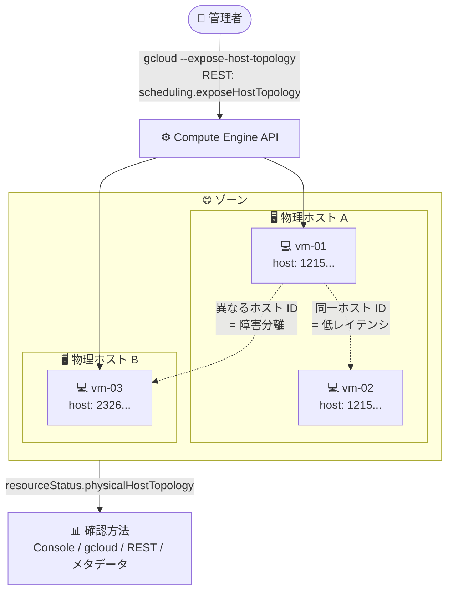

# Compute Engine: ホスト ID 公開によるインスタンス物理配置の確認 (Allowlisted GA)

**リリース日**: 2026-09-28

**サービス**: Compute Engine

**機能**: ホスト ID の公開 (Expose Host ID) とインスタンス近接性 (Instance Proximity) の確認

**ステータス**: Allowlisted GA (利用にはアカウントチームまたはセールスチームへのアクセス申請が必要)

📊 [このアップデートのインフォグラフィックを見る](https://takech9203.github.io/google-cloud-news-summary/20260928-compute-engine-instance-proximity-host-id.html)

## 概要

Compute Engine インスタンスのホスト ID (物理サーバーの識別子) を公開し、Google Cloud 組織内の他のインスタンスとの物理的な位置関係 (近接性) を確認できる機能が Allowlisted GA として提供された。インスタンスの作成時または更新時に `--expose-host-topology` フラグ (REST では `scheduling.exposeHostTopology` フィールド) を指定することで、組織固有にハッシュ化されたホスト ID が `resourceStatus.physicalHostTopology` フィールドに表示されるようになる。

同一ゾーン内でどのインスタンスが同じ物理ホスト上で稼働しているかを把握できるため、レイテンシに敏感なワークロードを物理的に近いインスタンスに配置してネットワーク遅延を最小化したり、逆にインスタンスを別々の物理ホストに分散させてホスト障害の影響範囲を限定し、アプリケーションの信頼性を向上させたりできる。

なお、本機能は Allowlisted GA であり、ホスト ID を公開するにはアカウントチームまたはセールスチームに連絡してアクセスを申請する必要がある。アクセス権がない状態で公開を試みるとリクエストは失敗する。

**アップデート前の課題**

- 物理トポロジ (クラスタ、ブロック、サブブロック、ホストの ID) を確認できるのは、特定の要件を満たすインスタンスに限られていた。具体的には A4X Max / A4X / A4 / A3 Ultra / A3 Mega / A3 High (8 GPU) / A3 Edge / H4D といった特定マシンタイプの利用、コンパクトプレースメントポリシーの指定、または `HIGH_THROUGHPUT` タイプのワークロードポリシーを指定した MIG への所属が必要だった
- 上記の要件を満たさない一般的なインスタンスでは、ホスト ID はデフォルトで非公開であり、複数のインスタンスが同じ物理ホスト上で稼働しているかどうかを確認する手段がなかった

**アップデート後の改善**

- 要件を満たさない一般的なインスタンスでも、ホスト ID を明示的に公開することで、組織固有のホスト ID を確認できるようになった
- 既存インスタンスに対しては再起動なしでホスト ID の公開・非公開を切り替えられる
- 単一インスタンスの作成、一括作成 (create-bulk)、インスタンステンプレートのいずれでもホスト ID の公開を指定できる
- セキュリティ上ホスト ID を公開したくないプロジェクトに対しては、カスタム制約 (Custom Constraints) で公開を禁止できる

## アーキテクチャ図



ホスト ID を公開すると、同じ物理ホスト上のインスタンス (vm-01 と vm-02) は同一のホスト ID を持ち、異なるホスト上のインスタンス (vm-03) とはホスト ID で区別できる。この情報を基にレイテンシ最適化や障害分離の設計判断ができる。

## サービスアップデートの詳細

### 主要機能

1. **ホスト ID の公開・非公開の切り替え**
   - インスタンスの作成時・更新時に `--expose-host-topology` / `--no-expose-host-topology` フラグ (REST では `scheduling.exposeHostTopology`) で制御する
   - 既存インスタンスでは再起動なしで切り替え可能
   - 単一インスタンス作成、一括作成 (`gcloud compute instances create-bulk`)、インスタンステンプレート (グローバル / リージョン) に対応

2. **物理配置の確認 (複数の方法)**
   - Google Cloud コンソール: VM インスタンスの詳細ページの「Basic information」セクションにある「Physical host」フィールドで確認
   - gcloud CLI: `gcloud compute instances describe --flatten=resourceStatus.physicalHostTopology`
   - REST API: `instances.list` / `instances.aggregatedList` で `resourceStatus.physicalHostTopology` フィールドを取得 (複数インスタンスの一括確認に推奨)
   - ゲスト内メタデータ: メタデータキー `physical_host_topology` をクエリしてインスタンス内部から確認

3. **カスタム制約による公開の防止**
   - セキュリティ機密性の高いワークロードを実行するプロジェクトでは、カスタム制約を作成して組織内の 1 つ以上のプロジェクトでホスト ID の公開を禁止できる

## 技術仕様

### 物理トポロジの階層 (physicalHostTopology のサブフィールド)

| フィールド | 説明 |
|------|------|
| `cluster` | インスタンスが存在するクラスタのグローバル名。複数のブロックにまたがるホストの高レベルな論理グループ |
| `block` | ブロックの組織固有 ID。複数のホストをまとめたコレクション |
| `subBlock` | サブブロックの組織固有 ID。単一の物理エンクロージャ内のホストをグループ化したブロック内の物理的細分 |
| `host` | インスタンスが稼働するホストの ID。共有するサブフィールドが多いほど、2 つのインスタンスは物理的に近い |

### ホスト ID のスコープ

| 条件 | ホスト ID のスコープ |
|------|------|
| コンパクトプレースメントポリシーまたはワークロードポリシーを指定したインスタンス | プロジェクト固有 |
| サポート対象マシンシリーズの利用、または本機能でホスト ID を公開したインスタンス | 組織固有 |

### 出力例 (本機能でホスト ID のみを公開した場合)

```json
{
  "resourceStatus": {
    "physicalHostTopology": {
      "block": null,
      "cluster": null,
      "host": "1215168a4ecdfb434fd4d28056589059",
      "subBlock": null
    }
  }
}
```

本機能で公開されるのはホスト ID のみで、`cluster`、`block`、`subBlock` は `null` となる。ホスト ID はハッシュ化された値として `resourceStatus` に表示される。

## 設定方法

### 前提条件

1. Allowlisted GA のため、アカウントチームまたはセールスチームに連絡して本機能へのアクセスを申請する (アクセス権がない場合、公開リクエストは失敗する)
2. 物理配置を確認できるのは実行中 (RUNNING) のインスタンスのみ

### 手順

#### ステップ 1: ホスト ID を公開する

既存インスタンスの場合 (再起動不要):

```bash
gcloud compute instances update INSTANCE_NAME \
    --expose-host-topology \
    --zone=ZONE
```

新規インスタンスの場合:

```bash
gcloud compute instances create INSTANCE_NAME \
    --machine-type=MACHINE_TYPE \
    --expose-host-topology \
    --zone=ZONE
```

非公開に戻す場合は `--no-expose-host-topology` フラグを使用する。

#### ステップ 2: 物理配置を確認する

単一インスタンスの確認:

```bash
gcloud compute instances describe INSTANCE_NAME \
    --flatten=resourceStatus.physicalHostTopology \
    --zone=ZONE
```

複数インスタンスの一括確認 (REST API):

```bash
GET https://compute.googleapis.com/compute/v1/projects/PROJECT_ID/aggregated/instances?fields=items.name,items.machineType,items.resourceStatus.physicalHostTopology&filter=status=RUNNING
```

インスタンス内部からの確認 (Linux):

```bash
curl -s -H "Metadata-Flavor: Google" \
    http://metadata.google.internal/computeMetadata/v1/instance/attributes/physical_host_topology
```

## メリット

### ビジネス面

- **レイテンシ最適化による性能向上**: 物理的に近いインスタンスにレイテンシ重視のジョブを配置するようにアプリケーションやワークロードの設計を調整できる
- **可用性の向上**: インスタンスを別々の物理ホストに分散させることで、ホスト障害がアプリケーションに与える影響を限定できる

### 技術面

- **再起動不要の切り替え**: 既存インスタンスのホスト ID 公開・非公開を再起動なしで変更でき、稼働中のワークロードに影響を与えない
- **多様な確認手段**: コンソール、gcloud、REST API、ゲスト内メタデータの 4 つの方法で確認でき、自動化や運用ツールへの組み込みが容易
- **ガバナンス制御**: カスタム制約により、組織ポリシーとしてホスト ID の公開を禁止でき、セキュリティ要件との両立が可能

## デメリット・制約事項

### 制限事項

- Allowlisted GA のため、利用にはアカウントチームまたはセールスチームへのアクセス申請が必要
- 本機能で公開されるのはホスト ID のみであり、ブロック、サブブロック、クラスタの ID は確認できない (これらはサポート対象マシンタイプなど、既存要件を満たすインスタンスでのみ表示される)
- H4D マシンタイプ、または 8 GPU 構成の A3 High (およびそれ以降の世代) のインスタンスでホスト ID を非公開にしようとしても、Compute Engine はリクエストを無視する
- コンパクトプレースメントポリシーまたはワークロードポリシーを指定したインスタンスで公開設定を無効にしても、プロジェクト固有のホスト ID と物理位置情報は引き続き表示される

### 考慮すべき点

- ホスト ID は物理インフラに関する情報であるため、セキュリティ機密性の高いワークロードを扱うプロジェクトでは、カスタム制約による公開禁止を検討する
- 物理配置を確認できるのは実行中のインスタンスのみであり、停止中のインスタンスでは確認できない

## ユースケース

### ユースケース 1: レイテンシ重視ワークロードの配置最適化

**シナリオ**: 分散処理システムやリアルタイム性の高いアプリケーションで、ノード間通信のレイテンシを最小化したい。

**実装例**:
```bash
# 対象インスタンス群のホスト ID を一括確認し、同一ホスト上のペアを特定
gcloud compute instances list \
    --format="table(name, resourceStatus.physicalHostTopology.host)" \
    --filter="status=RUNNING"
```

**効果**: 同一ホスト ID を持つ (= 物理的に最も近い) インスタンス同士にレイテンシ重視のジョブを割り当てることで、ネットワーク遅延を最小化できる。

### ユースケース 2: 障害分離のためのインスタンス分散確認

**シナリオ**: 冗長構成のアプリケーションで、レプリカが同一の物理ホストに集中していないかを確認し、単一ホスト障害による同時ダウンを防ぎたい。

**効果**: レプリカ群のホスト ID を比較し、同一ホストに複数レプリカが同居している場合は再作成・再配置することで、ホスト障害時の影響範囲を限定し信頼性を向上できる。

## 料金

本アップデートに関する追加料金の情報は Release Notes およびドキュメントに記載されていない。Compute Engine の料金は [料金ページ](https://cloud.google.com/compute/pricing) を参照。

## 関連サービス・機能

- **コンパクトプレースメントポリシー**: インスタンスを物理的に近接配置するためのポリシー。指定するとホスト ID を含む物理トポロジ (プロジェクト固有) がデフォルトで表示される
- **ワークロードポリシー (MIG)**: `HIGH_THROUGHPUT` タイプのワークロードポリシーを指定した MIG に属するインスタンスは、物理トポロジをデフォルトで確認できる
- **組織ポリシー (カスタム制約)**: 特定プロジェクトでのホスト ID 公開を禁止するガバナンス制御に使用
- **インスタンステンプレート / MIG**: テンプレートに `--expose-host-topology` を指定することで、MIG から作成されるインスタンス群のホスト ID を一括で公開できる

## 参考リンク

- 📊 [インフォグラフィック](https://takech9203.github.io/google-cloud-news-summary/20260928-compute-engine-instance-proximity-host-id.html)
- [公式リリースノート](https://docs.cloud.google.com/release-notes#September_28_2026)
- [ドキュメント: View the physical location of a Compute Engine instance](https://docs.cloud.google.com/compute/docs/instances/view-instance-topology)
- [gcloud compute instances create リファレンス](https://docs.cloud.google.com/sdk/gcloud/reference/compute/instances/create)
- [コンパクトプレースメントポリシーの概要](https://docs.cloud.google.com/compute/docs/instances/placement-policies-overview#about-compact-policies)
- [料金ページ](https://cloud.google.com/compute/pricing)

## まとめ

これまで特定のマシンタイプやプレースメントポリシーの利用者に限られていた物理トポロジの可視性が、ホスト ID の公開という形で一般的なインスタンスにも拡大された。レイテンシ最適化や障害分離の設計判断に物理配置情報を活用したい場合は、アカウントチームにアクセスを申請し、`--expose-host-topology` フラグの利用を検討してほしい。セキュリティ要件が厳しいプロジェクトでは、カスタム制約による公開禁止も併せて検討するとよい。

---

**タグ**: Compute Engine, ホスト ID, 物理トポロジ, インスタンス近接性, レイテンシ最適化, 信頼性, Allowlisted GA
