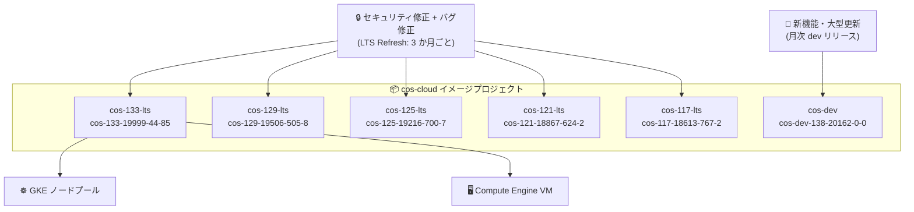

# Container-Optimized OS: LTS Refresh リリース群と新規 dev リリース (2026-09-28)

**リリース日**: 2026-09-28

**サービス**: Container-Optimized OS (COS)

**機能**: LTS Refresh リリース (M117 / M121 / M125 / M129 / M133) + dev リリース (M138)

**ステータス**: Change / Security (LTS Refresh)

📊 [このアップデートのインフォグラフィックを見る](https://takech9203.github.io/google-cloud-news-summary/20260928-container-optimized-os-lts-refresh-releases.html)

## 概要

2026 年 9 月 28 日、Container-Optimized OS (COS) の 6 つの新しいイメージが同時にリリースされました。アクティブな LTS マイルストーン (M117 / M121 / M125 / M129 / M133) 向けの LTS Refresh リリースと、開発中の M138 向け dev リリース (cos-dev-138-20162-0-0) が含まれます。COS は Compute Engine と GKE のノード OS として広く使われる Google 管理のコンテナ実行用 OS であり、これらのリリースはセキュリティ修正、カーネル・コンテナランタイムの更新、アクセラレータ (GPU / TPU / RDMA) 関連の改善を届けるものです。

LTS Refresh リリースは、3 か月ごとに中・低優先度のバグ修正とセキュリティ修正をまとめて提供する定期リリースです。今回のリリース群では、Python・coreutils・Linux カーネルの CVE 修正に加え、rsync 3.5.0 へのアップグレードによる多数の CVE 修正が含まれています。また、CX-9 デバイス検出時の RDMA カーネルモジュール自動ロード、TLS ハンドシェイク前の時刻同期の保証、ベアメタル TPU サポートなど、AI インフラ関連の改善も多く含まれます。

対象ユーザーは、GKE ノードや Compute Engine インスタンスで COS を利用しているすべてのユーザーです。特にセキュリティ修正が多数含まれるため、計画的なロールアウトが推奨されます。

**アップデート前の課題**

- 各 LTS マイルストーンの既存イメージには、Python (CVE-2026-0864、CVE-2026-15308)、coreutils (CVE-2026-56391)、Linux カーネル (CVE-2026-90054)、rsync (CVE-2026-53791 ほか多数) の未修正の脆弱性が含まれていた
- CX-9 デバイス使用時に RDMA カーネルモジュールが自動ロードされなかった
- システム時刻が同期される前に TLS ハンドシェイクが行われ得る問題があった
- DOCA ワークロードの初期化が失敗することがあるバグや、`/tmp` 配下の一時的な efivarfs マウントがブート後も残る問題があった

**アップデート後の改善**

- 全アクティブ LTS マイルストーンに対しセキュリティ修正が適用され、rsync は多数の CVE を修正した 3.5.0 に更新された
- CX-9 デバイス検出時に RDMA カーネルモジュールが自動ロードされるようになった (M133 / M129)
- TLS ハンドシェイク前の時刻同期が保証されるようになった
- ベアメタル TPU のサポートが追加された
- NVIDIA ドライバ v580.178.04 / v595.91.07 のサポート、cos-gpu-installer v2.7.8 への更新、containerd v2.4.1 へのアップグレード (M133 / M138) が行われた
- dev リリース (M138) では CephFS カーネルドライバのロードがサポートされた

## アーキテクチャ図



LTS Refresh リリースは各 LTS イメージファミリーに配信され、GKE ノードプールや Compute Engine インスタンスの OS 更新として適用されます。新機能は cos-dev ファミリーで先行検証されます。

## サービスアップデートの詳細

### リリースされたイメージ一覧

| マイルストーン | イメージ | カーネル | containerd | Docker | 種別 |
|---------------|---------|---------|-----------|--------|------|
| COS 133 LTS | cos-133-19999-44-85 | COS-6.18.48 | v2.4.1 | v29.4.3 | LTS Refresh |
| COS 129 LTS | cos-129-19506-505-8 | COS-6.12.110 | v2.2.7 | v27.5.1 | LTS Refresh |
| COS 125 LTS | cos-125-19216-700-7 | COS-6.12.110 | v2.2.7 | v27.5.1 | LTS Refresh |
| COS 121 LTS | cos-121-18867-624-2 | COS-6.6.157 | v2.0.10 | v27.5.1 | LTS Refresh |
| COS 117 LTS | cos-117-18613-767-2 | COS-6.6.157 | v1.7.34 | v24.0.9 | LTS Refresh |
| COS 138 DEV | cos-dev-138-20162-0-0 | COS-6.18.51 | v2.4.1 | v29.4.3 | dev リリース |

### セキュリティ修正

今回のリリース群には以下のセキュリティ修正が含まれます。

| 対象パッケージ | CVE | 修正内容 |
|---------------|-----|---------|
| dev-lang/python | CVE-2026-0864、CVE-2026-15308 | Python の脆弱性修正 |
| sys-apps/coreutils | CVE-2026-56391 | coreutils の脆弱性修正 |
| Linux カーネル | CVE-2026-90054 | カーネルの脆弱性修正 |
| net-misc/rsync | CVE-2026-53791、CVE-2026-53784、CVE-2026-53786、CVE-2026-53789、CVE-2026-53795、CVE-2026-53797、CVE-2026-53798、CVE-2026-53799、CVE-2026-53800、CVE-2026-53801、CVE-2026-53802、CVE-2026-53803、CVE-2026-70455、CVE-2026-70457、CVE-2026-70459、CVE-2026-70461、CVE-2026-70463 | rsync 3.5.0 へのアップグレードで一括修正 |

### 主要な変更点・修正

1. **アクセラレータ (GPU / TPU / RDMA) 関連の改善**
   - CX-9 デバイス検出時に RDMA カーネルモジュールを自動ロード (M133 / M129)
   - ベアメタル TPU のサポートを追加
   - NVIDIA ドライバ v580.178.04 および v595.91.07 のサポートを追加
   - cos-gpu-installer を v2.7.8 に更新
   - DOCA ワークロードの初期化が失敗することがあるバグを修正

2. **信頼性・セキュリティ基盤の改善**
   - TLS ハンドシェイク前に時刻同期を保証 (証明書検証の失敗リスクを低減)
   - `/tmp` 配下の一時的な efivarfs マウントがブート後も残る問題を修正
   - ca-certificates を v20260601.3.112.5 に更新

3. **コンテナランタイム・カーネルの更新**
   - containerd / containerd-test を v2.4.1 にアップグレード (M133 / M138)
   - M138 (dev) で Linux カーネルを v6.18.51 に更新、CephFS カーネルドライバのロードをサポート

4. **パッケージアップグレード (抜粋)**
   - dev-libs/expat v2.8.4、dev-libs/libxml2 v2.15.4、app-arch/zstd v1.5.7-r1、app-arch/xz-utils v5.8.4、dev-libs/libpcre2 v10.48、dev-libs/libgcrypt v1.12.3-r1、dev-python/pyjwt v2.14.0、app-admin/oslogin v20260902.00、google-guest-configs v20260918.00 など
   - M125 では sysctl 既定値の変更 (net.ipv4.udp_mem: 188034 250715 376068 → 188034 250714 376068)

## 技術仕様

### LTS Refresh リリースとは

| 項目 | 詳細 |
|------|------|
| LTS マイルストーンのサポート期間 | LTS ファミリー導入から 26 か月 |
| 高優先度の修正 | オンデマンドでリリース |
| 中・低優先度の修正 | 3 か月ごとに「LTS Refresh」リリースとしてまとめて提供 |
| 破壊的変更 | LTS サポート期間中は新規の破壊的機能は導入されない |
| イメージファミリー | `cos-[MILESTONE]-lts` (x86)、`cos-arm64-[MILESTONE]-lts` (Arm) |

### 各マイルストーンのサポート期限

| マイルストーン | サポート終了 (予定) |
|---------------|-------------------|
| COS 133 LTS | 2028 年 11 月 |
| COS 129 LTS | 2028 年 7 月 |
| COS 125 LTS | 2028 年 2 月 |
| COS 121 LTS | 2027 年 3 月 |
| COS 117 LTS | 2026 年 9 月 |

## 設定方法

### 手順

#### ステップ 1: 最新イメージの確認

```bash
# アクティブな LTS イメージファミリーの最新イメージを確認
gcloud compute images list --no-standard-images --project=cos-cloud | grep lts
```

#### ステップ 2: 新しいイメージで VM を作成 (Compute Engine の場合)

```bash
gcloud compute instances create my-cos-vm \
  --image=cos-133-19999-44-85 \
  --image-project=cos-cloud \
  --zone=us-central1-a
```

GKE の場合は、ノードの自動アップグレードが有効であれば、クラスタのリリースチャンネルに応じて新しい COS イメージが順次ロールアウトされます。

## メリット

### ビジネス面

- **セキュリティリスクの低減**: Python、coreutils、カーネル、rsync の多数の CVE が修正され、コンプライアンス要件への対応が容易になる
- **予測可能な更新サイクル**: LTS Refresh は 3 か月ごとの定期リリースであり、更新リスクを管理しながら計画的に適用できる

### 技術面

- **AI / HPC ワークロードの安定性向上**: RDMA モジュール自動ロード、ベアメタル TPU サポート、最新 NVIDIA ドライバ対応、DOCA 初期化バグ修正により、アクセラレータ利用時の運用負荷が下がる
- **TLS の信頼性向上**: 時刻同期を TLS ハンドシェイク前に保証することで、ブート直後の証明書検証エラーを防止できる

## デメリット・制約事項

### 考慮すべき点

- LTS Refresh リリースには中・低優先度の修正が含まれるため、リグレッションの可能性がゼロではない。公式ドキュメントでもロールアウト時には注意を払うことが推奨されている
- **COS 117 LTS はサポート終了時期 (2026 年 9 月) を迎えている**。M117 を利用中の場合は、新しいマイルストーン (M121 以降) への移行を早急に計画すべき
- cos-dev-138 は開発中リリースであり、本番環境での利用は非推奨。本番環境には LTS ファミリーのイメージを使用する

## ユースケース

### ユースケース 1: GKE ノードのセキュリティパッチ適用

**シナリオ**: GKE クラスタのノードイメージに COS (containerd) を使用しており、rsync や Python の CVE への対応が必要。

**効果**: ノード自動アップグレードを有効にしておくことで、リリースチャンネル経由で今回の修正を含むイメージが自動適用され、手動パッチ作業なしに脆弱性を解消できる。

### ユースケース 2: GPU / RDMA を使う AI 学習基盤の運用

**シナリオ**: Compute Engine 上で NVIDIA GPU と RDMA (CX-9) を使った分散学習を運用している。

**効果**: 新イメージでは CX-9 検出時に RDMA モジュールが自動ロードされ、NVIDIA ドライバ v580.178.04 / v595.91.07 に対応した cos-gpu-installer v2.7.8 が利用できるため、ドライバ・モジュール管理の手作業が減る。

## 関連サービス・機能

- **Google Kubernetes Engine (GKE)**: COS は GKE ノードのデフォルト OS イメージ (cos_containerd)。ノード自動アップグレードで新イメージが適用される
- **Compute Engine**: COS イメージ (cos-cloud プロジェクト) から VM を直接作成可能
- **Cloud TPU / GPU**: ベアメタル TPU サポートや NVIDIA ドライバ更新により、アクセラレータワークロードの実行基盤として強化

## 参考リンク

- 📊 [インフォグラフィック](https://takech9203.github.io/google-cloud-news-summary/20260928-container-optimized-os-lts-refresh-releases.html)
- [公式リリースノート (2026-09-28)](https://docs.cloud.google.com/release-notes#September_28_2026)
- [Container-Optimized OS リリースノート](https://cloud.google.com/container-optimized-os/docs/release-notes)
- [COS のバージョニングと LTS Refresh リリース](https://docs.cloud.google.com/container-optimized-os/docs/concepts/versioning)
- [COS サポートポリシー](https://docs.cloud.google.com/container-optimized-os/docs/resources/support-policy)

## まとめ

Container-Optimized OS の全アクティブ LTS マイルストーンに対する四半期ごとの LTS Refresh リリースであり、rsync 3.5.0 への更新を含む多数のセキュリティ修正と、RDMA / TPU / GPU 関連の改善が含まれます。GKE・Compute Engine で COS を利用している場合はノードの自動アップグレード設定を確認し、計画的にロールアウトしてください。特に COS 117 LTS はサポート終了時期を迎えているため、利用中の場合は新しいマイルストーンへの移行を優先的に検討すべきです。

---

**タグ**: Container-Optimized OS, COS, LTS Refresh, セキュリティ, CVE, GKE, Compute Engine, containerd, カーネル
