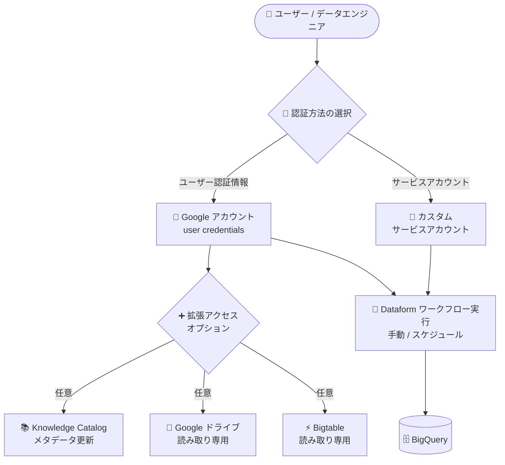

# Dataform: 拡張アクセスオプションとユーザー認証情報による認証が GA

**リリース日**: 2026-09-28

**サービス**: Dataform

**機能**: ワークフローの実行・スケジュール実行における拡張アクセスオプションとユーザー認証情報 (user credentials) 認証

**ステータス**: GA (一般提供)

📊 [このアップデートのインフォグラフィックを見る](https://takech9203.github.io/google-cloud-news-summary/20260928-dataform-extended-access-user-credentials-ga.html)

## 概要

Dataform のワークフロー実行およびスケジュール実行において、**拡張アクセスオプション (Extended access options)** と **ユーザー認証情報 (Google アカウントの user credentials) による認証**が一般提供 (GA) になりました。

この機能により、ワークフローの手動実行 (開発ワークスペースからの実行) やワークフロー構成 (workflow configuration) によるスケジュール実行の際に、カスタムサービスアカウントの代わりに、自分の Google アカウントのユーザー認証情報で BigQuery ジョブを実行できます。さらに「拡張アクセスオプション」として、Knowledge Catalog・Google ドライブ・Bigtable への追加スコープを選択でき、外部データソースを参照するワークフローもユーザー権限のもとで実行できます。

サービスアカウントの発行・管理が制限されている組織や、個々のユーザーの IAM 権限に基づいた最小権限でのデータ変換パイプライン実行を求めるデータエンジニアリングチームにとって、認証設計の選択肢が広がるアップデートです。

**アップデート前の課題**

- ワークフローの実行はサービスアカウントの権限に依存しており、実行者個人の IAM 権限を反映した実行にはサービスアカウントの追加設定が必要だった
- カスタムサービスアカウントを利用する場合、Dataform サービスエージェントへの Service Account Token Creator / Service Account User ロールの付与など、事前の IAM 設定が必要だった
- Google ドライブ上の外部テーブルや Bigtable など、BigQuery 以外のデータソースへのアクセススコープを実行時に柔軟に選択する手段が GA として提供されていなかった

**アップデート後の改善**

- 手動実行・スケジュール実行の両方で「Execute with user credentials (ユーザー認証情報で実行)」を選択し、自分の Google アカウントの権限でワークフローを実行できるようになった
- 拡張アクセスオプションにより、Knowledge Catalog (メタデータ更新)、Google ドライブ (読み取り専用)、Bigtable (読み取り専用) の追加スコープを実行時に選択できるようになった
- これらの機能が GA となり、本番環境のワークフロー構成でも安心して利用できるようになった

## アーキテクチャ図

Dataform ワークフローの実行時に、カスタムサービスアカウントに加えて Google アカウントのユーザー認証情報を選択でき、必要に応じて Knowledge Catalog・Google ドライブ・Bigtable への拡張アクセススコープを付与できます。

## サービスアップデートの詳細

### 主要機能

1. **ユーザー認証情報 (user credentials) によるワークフロー実行**
   - 開発ワークスペースからの手動実行時に「Execute with user credentials」を選択すると、自分の Google アカウントの権限で BigQuery ジョブが実行される
   - ワークフロー構成 (スケジュール実行) でも「Execute with my user credentials」を選択可能
   - 初回はユーザーの Google アカウントの承認 (authorize) が必要

2. **拡張アクセスオプション (Extended access options)**
   - ユーザー認証情報での実行時に、ワークフローが必要とする追加スコープを選択できる
     - **Knowledge Catalog**: Google Cloud Knowledge Catalog のメタデータ更新を許可
     - **Google ドライブ**: Google ドライブ ファイルへの読み取り専用アクセスを許可
     - **Bigtable**: Bigtable データへの読み取り専用アクセスを許可

3. **サービスアカウント方式との併用**
   - 従来どおり「Execute with selected service account」でカスタムサービスアカウントも選択可能
   - ワークフロー構成では、デフォルトの Dataform サービスエージェントでのワークフロー実行はできず、カスタムサービスアカウントまたはユーザー認証情報のいずれかを使用する

## 技術仕様

### ユーザー認証情報に必要な BigQuery IAM ロール

Dataform での認証に使用する Google アカウントには、サービスエージェントやカスタムサービスアカウントと同様に、以下の BigQuery ロールが必要です。

| ロール | 用途 |
|------|------|
| BigQuery Data Editor (`roles/bigquery.dataEditor`) | 読み取り / 書き込みが必要なプロジェクト (通常はリポジトリをホストするプロジェクト) |
| BigQuery Data Viewer (`roles/bigquery.dataViewer`) | 読み取り専用アクセスが必要なプロジェクト |
| BigQuery Job User (`roles/bigquery.jobUser`) | Dataform リポジトリをホストするプロジェクト |
| BigQuery Data Owner (`roles/bigquery.dataOwner`) | BigQuery データセットをクエリする場合 |

### 拡張アクセスオプションのスコープ

| オプション | アクセス内容 |
|------|------|
| Knowledge Catalog | Knowledge Catalog のメタデータ更新 |
| Google ドライブ | Google ドライブ ファイルへの読み取り専用アクセス |
| Bigtable | Bigtable データへの読み取り専用アクセス |

## 設定方法

### 前提条件

1. Dataform リポジトリと開発ワークスペースが作成済みであること
2. 実行に使用する Google アカウントに、必要な BigQuery IAM ロール (Job User、Data Editor、Data Viewer など) が付与されていること
3. 手動実行には Dataform Editor (`roles/dataform.editor`) ロールなどの権限が必要

### 手順

#### ステップ 1: 手動実行でユーザー認証情報を選択する

1. Google Cloud コンソールで Dataform の開発ワークスペースに移動する
2. **Start execution** > **Actions** > **Multiple actions** をクリック
3. **Authentication** セクションで **Execute with user credentials** を選択
4. 必要に応じて **Extended access options** で Knowledge Catalog / Google Drive / Bigtable のスコープを選択
5. 実行対象のアクションを選択して **Start execution** をクリックし、Google アカウントを承認する

#### ステップ 2: ワークフロー構成 (スケジュール実行) でユーザー認証情報を選択する

1. リポジトリの **Releases & Scheduling** に移動し、**Workflow configurations** セクションで **Create** をクリック
2. 構成 ID とリリース構成を指定
3. **Authentication** セクションで **Execute with my user credentials** を選択し、必要に応じて拡張アクセスオプションを選択
4. スケジュール頻度 (unix-cron 形式) とタイムゾーンを設定
5. **Create** をクリックし、Google アカウントを承認する

## メリット

### ビジネス面

- **最小権限の徹底**: 実行者個人の IAM 権限に基づいてワークフローが実行されるため、過剰な権限を持つ共有サービスアカウントへの依存を減らせる
- **監査性の向上**: 誰の認証情報でワークフローが実行されたかが明確になり、ガバナンス要件への対応が容易になる

### 技術面

- **セットアップの簡素化**: カスタムサービスアカウントの作成や、Dataform サービスエージェントへのトークン作成権限付与といった事前設定なしにワークフローを実行できる
- **外部データソースへの柔軟なアクセス**: Google ドライブ上の外部テーブルや Bigtable の外部データを参照するワークフローを、実行時にスコープを選択するだけで実行できる

## デメリット・制約事項

### 制限事項

他のユーザーの認証情報を悪用した操作を防ぐため、以下の制限が適用されます。

- 別の Google アカウントのユーザー認証情報が紐付いたワークフロー構成を変更するには、自分のユーザー認証情報を付け直すか、カスタムサービスアカウント認証に変更する必要がある
- 別のユーザーの認証情報が紐付いたワークフロー構成から参照されているリリース構成のコンパイル結果は変更できない
- ユーザー認証情報での認証と、スケジュール付きリリース構成の参照は併用できない
  - スケジュール付きリリース構成を参照するワークフロー構成をユーザー認証情報に設定できない
  - ユーザー認証情報のワークフロー構成が参照するリリース構成にスケジュールを追加できない

### 考慮すべき点

- ユーザー認証情報での実行を選択した場合、初回に Google アカウントの承認 (OAuth 認可) が必要
- 実行に使用する Google アカウントに BigQuery の各種ロールを付与する必要があり、退職・異動などでアカウントが無効化されるとスケジュール実行に影響するため、本番の定期実行にはサービスアカウントとの使い分けを検討する

## ユースケース

### ユースケース 1: サービスアカウント発行が制限された組織でのワークフロー実行

**シナリオ**: セキュリティポリシーによりサービスアカウントキーやカスタムサービスアカウントの発行が厳しく管理されている組織で、データアナリストが自分の権限の範囲で Dataform ワークフローを実行したい。

**効果**: ユーザー認証情報での実行により、サービスアカウントの新規発行なしに、本人の IAM 権限に基づく最小権限でワークフローを実行できる。

### ユースケース 2: Google ドライブ上のデータを参照する変換パイプライン

**シナリオ**: Google スプレッドシートを外部テーブルとして参照する BigQuery 変換ワークフローを Dataform で実行したい。

**効果**: 拡張アクセスオプションで Google ドライブ (読み取り専用) スコープを選択することで、ユーザーの権限で Google ドライブ上のファイルを参照するワークフローを実行できる。

## 料金

Dataform 自体は無料のサービスです。ただし、ワークフローが実行する BigQuery ジョブなど、連携するサービスの利用に対しては課金が発生します。詳細は [Dataform の料金ページ](https://cloud.google.com/dataform/pricing) を参照してください。

## 関連サービス・機能

- **BigQuery**: Dataform ワークフローの実行基盤。ユーザー認証情報またはサービスアカウントの権限で BigQuery ジョブが実行される
- **IAM (Identity and Access Management)**: ユーザー認証情報での実行に必要な BigQuery ロールの付与や、サービスアカウント利用時の権限管理に使用
- **Knowledge Catalog**: 拡張アクセスオプションでメタデータ更新を許可できる対象サービス
- **Bigtable / Google ドライブ**: 拡張アクセスオプションで読み取り専用アクセスを許可できる外部データソース

## 参考リンク

- 📊 [インフォグラフィック](https://takech9203.github.io/google-cloud-news-summary/20260928-dataform-extended-access-user-credentials-ga.html)
- [公式リリースノート](https://docs.cloud.google.com/release-notes#September_28_2026)
- [ドキュメント: ワークフロー実行のトリガー](https://docs.cloud.google.com/dataform/docs/trigger-execution)
- [ドキュメント: ワークフロー実行のスケジュール設定](https://docs.cloud.google.com/dataform/docs/schedule-runs)
- [ドキュメント: Dataform のアクセス制御](https://docs.cloud.google.com/dataform/docs/access-control)
- [料金ページ](https://cloud.google.com/dataform/pricing)

## まとめ

Dataform ワークフローの実行・スケジュール実行において、ユーザー認証情報による認証と拡張アクセスオプションが GA となり、サービスアカウントに依存しない最小権限での実行が本番環境でも利用可能になりました。サービスアカウント管理が厳格な組織や、Google ドライブ・Bigtable の外部データを参照するパイプラインを運用しているチームは、認証方式の見直しを検討することをおすすめします。ただし、ユーザー認証情報とスケジュール付きリリース構成の併用不可などの制限があるため、定期実行の要件に応じてサービスアカウントとの使い分けを設計してください。

---

**タグ**: #Dataform #BigQuery #IAM #認証 #GA #データエンジニアリング
