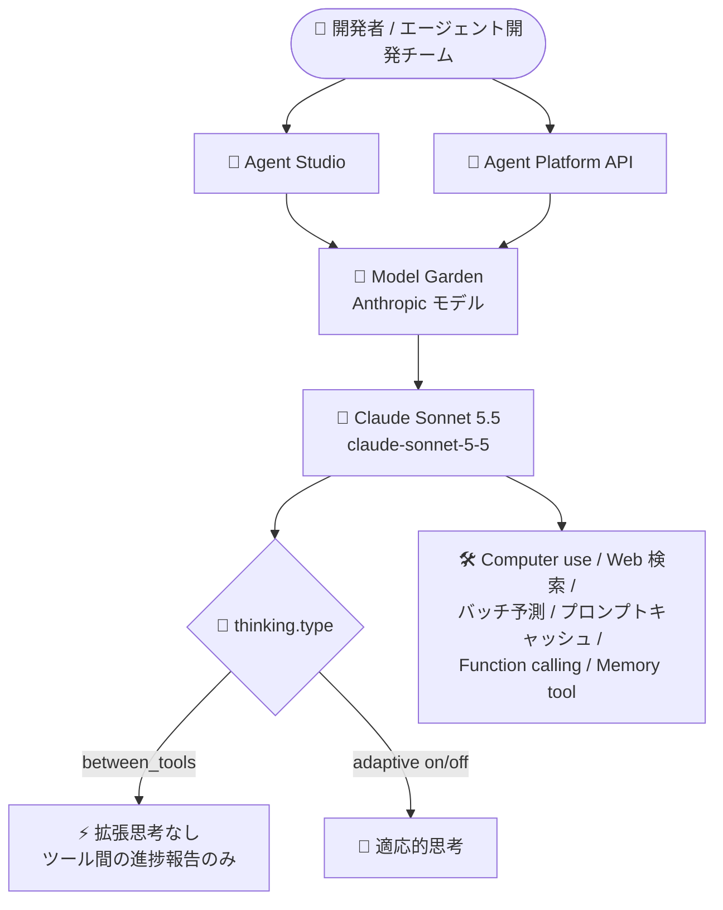

# Gemini Enterprise Agent Platform: Anthropic Claude Sonnet 5.5 が Model Garden で利用可能に

**リリース日**: 2026-09-28

**サービス**: Gemini Enterprise Agent Platform

**機能**: Anthropic Claude Sonnet 5.5 (Model Garden)

**ステータス**: GA (一般提供)

📊 [このアップデートのインフォグラフィックを見る](https://takech9203.github.io/google-cloud-news-summary/20260928-gemini-agent-platform-claude-sonnet-5-5.html)

## 概要

Anthropic の最新モデル **Claude Sonnet 5.5** が、Gemini Enterprise Agent Platform の Model Garden で一般提供 (GA) されました。モデル ID は `claude-sonnet-5-5` で、リリース日は 2026 年 9 月 28 日、廃止日は 2027 年 9 月 28 日以降とされています。コーディング、エージェント、大規模なプロフェッショナルワークに向けて設計されたモデルであり、Claude Sonnet 5 (2026 年 6 月 30 日リリース) の機能をすべて継承しつつ、新しい思考制御オプションが追加されています。

最大の変更点は、`thinking.type` に新しい値 **`between_tools`** が追加されたことです。これは本モデルで利用できる最も低い思考設定であり、拡張思考 (extended thinking) を行わず、ツール呼び出しの間にモデルが書く短い進捗報告が思考ブロックとして返されます。なお、Claude Sonnet 5.5 は `thinking: {"type": "disabled"}` をサポートしていない点に注意が必要です。思考をオフ (またはそれに最も近い状態) にしたい場合は `between_tools` を使用します。適応的思考 (Adaptive thinking) はオン・オフの切り替えが可能です。

入力トークン最大 100 万、出力トークン最大 12.8 万という大容量コンテキストに対応し、Computer use、Web 検索、バッチ予測、プロンプトキャッシュ、Function calling、Memory tool などの機能をサポートします。料金は Claude Sonnet 5 と同水準 (入力 $2.00 / 出力 $10.00 per 100 万トークン) に設定されており、高ボリュームのエージェントワークロードをコスト効率よく運用できます。

**アップデート前の課題**

- Sonnet クラスの最新モデルは Claude Sonnet 5 (2026 年 6 月 30 日 GA) であり、それ以降のモデル改善 (コーディング、エージェント、プロフェッショナルワーク) を Google Cloud 上で利用できなかった
- ツール呼び出し中心のワークロードで思考量を最小限に抑えるための `between_tools` のような専用の思考設定が存在しなかった

**アップデート後の改善**

- Anthropic の最新 Sonnet モデルを Model Garden から GA として直ちに利用可能になった
- 新しい思考設定 `between_tools` により、拡張思考を行わずにツール呼び出し間の短い進捗報告のみを思考ブロックとして受け取る、低思考コストの運用が可能になった
- Claude Sonnet 5 と同じ料金・同じトークン上限 (入力 1M / 出力 128K) で、Provisioned Throughput や Shared Model Lineage Quota にも対応した状態で利用できる

## アーキテクチャ図



Model Garden 経由で Claude Sonnet 5.5 にアクセスし、新しい `between_tools` 思考設定によりツール中心のエージェントワークロードで思考コストを最小化できる構成を示しています。

## サービスアップデートの詳細

### 主要機能

1. **新しい思考設定 `between_tools`**
   - `thinking.type` に追加された、本モデルで利用可能な最も低い思考設定
   - `between_tools` では拡張思考を行わず、ツール呼び出しの間にモデルが書く短い進捗報告が、その更新テキストを含む思考ブロックとして返される (レスポンス形式は変更なし)
   - Claude Sonnet 5.5 は `thinking: {"type": "disabled"}` をサポートしない。思考をオフに近づけたい場合は `between_tools` を使用する
   - 適応的思考 (Adaptive thinking) はオン・オフの切り替えが可能

2. **大容量コンテキストと豊富な機能サポート**
   - 最大入力トークン: 1,000,000 / 最大出力トークン: 128,000
   - 入力: テキスト、画像、PDF / 出力: テキスト
   - サポート機能: Computer use、Web 検索、バッチ予測、プロンプトキャッシュ、Function calling、トークンカウント、Memory tool

3. **エンタープライズ向けの利用形態**
   - Shared Model Lineage Quota と Provisioned Throughput に対応
   - グローバルエンドポイントでは QPM 2,500 / 入力 TPM 25,000,000 / 出力 TPM 2,500,000 と、マルチリージョンの 2 倍のクォータを提供

## 技術仕様

### モデル仕様

| 項目 | 詳細 |
|------|------|
| モデル ID | `claude-sonnet-5-5` |
| ローンチステージ | GA (一般提供) |
| リリース日 | 2026 年 9 月 28 日 |
| 廃止日 | 2027 年 9 月 28 日以降 |
| 入力 | テキスト、画像、PDF |
| 出力 | テキスト |
| 最大入力トークン | 1,000,000 |
| 最大出力トークン | 128,000 |
| サポート機能 | Computer use、Web 検索、バッチ予測、プロンプトキャッシュ、Function calling、トークンカウント、Memory tool |
| 利用形態 | Shared Model Lineage Quota、Provisioned Throughput |

### クォータ上限

| エンドポイント | QPM | 入力 TPM (非キャッシュ + キャッシュ書き込み) | 出力 TPM | コンテキスト長 |
|----------------|-----|-----------------------------------------------|----------|----------------|
| US マルチリージョン | 1,250 | 12,500,000 | 1,250,000 | 1,000,000 |
| EU マルチリージョン | 1,250 | 12,500,000 | 1,250,000 | 1,000,000 |
| グローバルエンドポイント | 2,500 | 25,000,000 | 2,500,000 | 1,000,000 |

### 思考設定の例

```json
{
  "thinking": {
    "type": "between_tools"
  }
}
```

`between_tools` は本モデルで最も低い思考設定です。`{"type": "disabled"}` はサポートされません。

## メリット

### ビジネス面

- **最新 Sonnet モデルの即時利用**: Anthropic の最新 Sonnet クラスモデルを、Google Cloud の請求・セキュリティ・ガバナンスの枠組みの中で GA として利用できる
- **コスト効率**: Claude Sonnet 5 と同水準の料金 (入力 $2.00 / 出力 $10.00 per 100 万トークン) で、バッチ予測 (半額) やプロンプトキャッシュ (キャッシュヒット $0.20) を組み合わせてさらにコストを最適化できる

### 技術面

- **ツール中心ワークロードの思考コスト最小化**: `between_tools` により、拡張思考を行わない低レイテンシ・低コストなエージェント実行が可能
- **高スループット**: グローバルエンドポイントで QPM 2,500、入力 TPM 2,500 万という大きなクォータを利用でき、高ボリュームのエージェントワークロードに対応
- **1M トークンコンテキスト**: 大規模コードベースや長大なドキュメントを扱うワークロードに対応

## デメリット・制約事項

### 制限事項

- `thinking: {"type": "disabled"}` はサポートされない (思考を最小化するには `between_tools` を使用)
- モデル提供リージョンは US マルチリージョン、EU マルチリージョン、グローバルエンドポイントのみ (ML 処理は US / EU マルチリージョンおよび asia-southeast1)
- 廃止日は 2027 年 9 月 28 日以降とされており、モデルのライフサイクル管理が必要

### 考慮すべき点

- `between_tools` ではツール呼び出し間の進捗報告が思考ブロックとして返されるため、思考ブロックを処理するクライアント実装との整合性を確認する
- 既存の Claude Sonnet 5 (`claude-sonnet-5`、廃止日 2026 年 12 月 24 日以降) からの移行計画を検討する

## ユースケース

### ユースケース 1: 高ボリュームのツール実行エージェント

**シナリオ**: 多数のツール呼び出しを伴うエージェントワークフロー (社内業務自動化、カスタマーサポートエージェントなど) を大規模に運用しており、思考トークンのコストとレイテンシを抑えたい。

**実装例**:
```json
{
  "model": "claude-sonnet-5-5",
  "thinking": {
    "type": "between_tools"
  }
}
```

**効果**: 拡張思考を行わずツール間の短い進捗報告のみを受け取ることで、思考コストを最小化しつつエージェントの実行状況を可視化できる。

### ユースケース 2: 大規模コードベースでの開発支援

**シナリオ**: 最大 100 万トークンの入力コンテキストを活用し、大規模コードベース全体を対象としたコーディングエージェントを構築する。

**効果**: Sonnet クラスのコスト・速度バランスで、機能開発・リファクタリング・デバッグなどの日常的な開発作業を大規模に自動化できる。プロンプトキャッシュ (キャッシュヒット $0.20/1M トークン) により繰り返し参照されるコンテキストのコストを大幅に削減できる。

## 料金

Claude Sonnet 5.5 の料金は Claude Sonnet 5 と同水準で、入力トークン数によらず同一の単価が適用されます (200K トークン以下 / 超過とも同額)。

### 料金表 (100 万トークンあたり)

| 項目 | 料金 |
|------|------|
| 入力 | $2.00 |
| 出力 | $10.00 |
| バッチ入力 | $1.00 |
| バッチ出力 | $5.00 |
| キャッシュ書き込み (5 分) | $2.50 |
| キャッシュ書き込み (1 時間) | $4.00 |
| キャッシュヒット | $0.20 |
| バッチキャッシュ書き込み (5 分) | $1.25 |
| バッチキャッシュ書き込み (1 時間) | $2.00 |
| バッチキャッシュヒット | $0.10 |

最新の料金は [Agent Platform の生成 AI 料金ページ](https://cloud.google.com/gemini-enterprise-agent-platform/generative-ai/pricing) を参照してください。

## 利用可能リージョン

**モデル提供 (固定クォータおよび Provisioned Throughput を含む)**

- 米国: マルチリージョン
- 欧州: マルチリージョン
- グローバル: グローバルエンドポイント

**ML 処理**

- 米国: マルチリージョン
- 欧州: マルチリージョン
- アジア太平洋: asia-southeast1

## 関連サービス・機能

- **Model Garden**: Anthropic をはじめとするパートナーモデル・オープンモデルを検索・利用できるモデルカタログ。Claude Sonnet 5.5 はここから利用を開始する
- **Agent Studio**: コンソール上でモデルを試すことができる開発環境 ([Claude Sonnet 5.5 を試す](https://console.cloud.google.com/agent-platform/publishers/anthropic/model-garden/claude-sonnet-5-5))
- **Provisioned Throughput**: ピーク時にも一貫したパフォーマンスを確保するための専用キャパシティ予約。Claude Sonnet 5.5 でサポート
- **Claude Sonnet 5**: 前世代の Sonnet モデル (2026 年 6 月 30 日 GA、廃止日 2026 年 12 月 24 日以降)。Sonnet 5.5 は本モデルの機能を継承
- **プロンプトキャッシュ / バッチ予測**: 繰り返しコンテキストや非同期の大量処理でコストを削減する機能。いずれも Claude Sonnet 5.5 でサポート

## 参考リンク

- 📊 [インフォグラフィック](https://takech9203.github.io/google-cloud-news-summary/20260928-gemini-agent-platform-claude-sonnet-5-5.html)
- [公式リリースノート](https://docs.cloud.google.com/release-notes#September_28_2026)
- [Claude Sonnet 5.5 モデルカードドキュメント](https://docs.cloud.google.com/gemini-enterprise-agent-platform/models/partner-models/claude/sonnet-5-5)
- [Claude モデル概要 (Agent Platform)](https://docs.cloud.google.com/gemini-enterprise-agent-platform/models/partner-models/claude)
- [料金ページ](https://cloud.google.com/gemini-enterprise-agent-platform/generative-ai/pricing)

## まとめ

Anthropic の最新 Sonnet モデルである Claude Sonnet 5.5 が Model Garden で GA となり、Claude Sonnet 5 と同じ料金・トークン上限のまま、ツール中心ワークロード向けの新しい思考設定 `between_tools` が利用可能になりました。高ボリュームのエージェントワークロードやコーディング支援を運用しているチームは、モデルカードとクォータを確認のうえ `claude-sonnet-5-5` への移行検証を始めることを推奨します。特に Claude Sonnet 5 利用者は、`thinking: {"type": "disabled"}` が非サポートである点を踏まえて思考設定の見直しを行ってください。

---

**タグ**: #GeminiEnterpriseAgentPlatform #ModelGarden #Anthropic #Claude #ClaudeSonnet #生成AI #AIエージェント #GA
