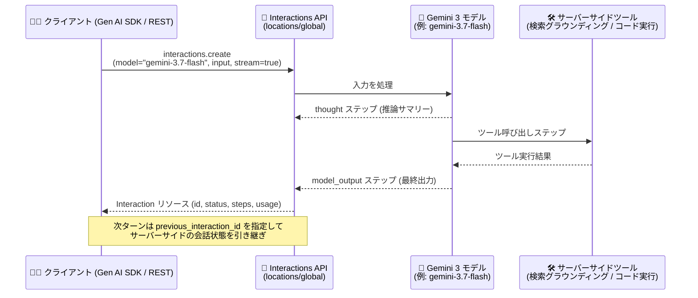

# Gemini Enterprise Agent Platform: Interactions API が Gemini 3 モデルをサポート (Preview)

**リリース日**: 2026-09-28

**サービス**: Gemini Enterprise Agent Platform

**機能**: Interactions API における Gemini 3 モデルのサポート

**ステータス**: Preview

📊 [このアップデートのインフォグラフィックを見る](https://takech9203.github.io/google-cloud-news-summary/20260928-gemini-agent-platform-gemini-3-interactions-api.html)

## 概要

Gemini Enterprise Agent Platform の Interactions API が、Gemini 3 系モデルを Preview でサポートした。Interactions API は、Gemini Enterprise Agent Platform 上でホストされるモデルとエージェントを単一の統合エンドポイントから呼び出せる、ステートフルな API である。今回のアップデートにより、Gemini 3.8 Flash / 3.7 Flash / 3.6 Flash / 3.5 Flash-Lite / 3.1 Pro (Preview) / 3.1 Flash-Lite / Gemini Omni Flash (Preview) といった Gemini 3 系モデルを Interactions API 経由で利用できるようになった。

Interactions API は `Interaction` リソースを中心に設計されており、1 回の会話ターンまたはタスクを `user_input`、`thought`、ツール呼び出し、`model_output` といった実行ステップ (`steps`) の時系列シーケンスとして表現する。`previous_interaction_id` によるサーバーサイドの会話状態管理、デバッグや UI レンダリングに使える実行ステップの可観測性、`background=true` による長時間タスクのバックグラウンド実行といった機能を標準で備えている。

公式ドキュメントでは「今後、新しいモデル、マルチモーダル機能、ツール、エージェント機能はすべて Interactions API 上でサポートされる」と明記されており、生成 AI アプリケーションやエージェンティックワークフローを構築する開発者にとって、Interactions API が今後の中心的なインターフェースとなる。既存の `generateContent` API も引き続き完全にサポートされる。

**アップデート前の課題**

- Interactions API で Gemini 3 系モデルを利用できず、Gemini 3 モデルの呼び出しには従来の `generateContent` API を使う必要があった
- Gemini 3 モデルの利用では、`previous_interaction_id` によるサーバーサイド会話状態管理や実行ステップの可観測性、バックグラウンド実行といった Interactions API 固有の機能を活用できなかった
- モデル呼び出しとエージェント呼び出し (Gemini Deep Research Agent など) で API パターンを使い分ける必要があった

**アップデート後の改善**

- Gemini 3 系モデル (3.8 Flash、3.7 Flash、3.6 Flash、3.5 Flash-Lite、3.1 Pro、3.1 Flash-Lite、Omni Flash) を Interactions API から直接呼び出せるようになった
- Gemini 3 モデルでも、サーバーサイド状態管理・観測可能な実行ステップ・バックグラウンド実行といった Interactions API の機能を利用できるようになった
- 単一の API パターンで、Gemini 3 モデルと専用エージェント (Deep Research Agent、Antigravity、カスタムマネージドエージェント) を統一的に扱えるようになった

## アーキテクチャ図



Gemini 3 モデルを指定した `interactions.create` 呼び出しのフロー。Agent Platform が入力を処理し、思考 (thought)・ツール呼び出し・最終出力 (model_output) を実行ステップとして含む `Interaction` リソースを返す。

## サービスアップデートの詳細

### 主要機能

1. **Gemini 3 系モデルのサポート (Preview)**
   - Gemini 3.8 Flash、3.7 Flash、3.6 Flash、3.5 Flash-Lite、3.1 Pro (Preview)、3.1 Flash-Lite、Gemini Omni Flash (Preview) が Interactions API で利用可能
   - API リファレンスでは `gemini-3.7-flash` が Interactions API のデフォルトモデルとして記載されている
   - コーディング、推論、マルチモーダル理解、エージェンティックワークフロー向けに最適化されたモデル群

2. **モデルとエージェントの統一インターフェース**
   - `model` パラメータで Gemini 3 モデル、`agent` パラメータで専用エージェントを同一エンドポイントから呼び出し
   - 対応エージェント: `antigravity-preview-05-2026` (多段推論・コーディング・ファイル操作・ツール利用向け汎用自律エージェント)、`deep-research-preview-04-2026` (自律的なウェブリサーチと統合)、Agent Platform 上のカスタムマネージドエージェント
   - 会話内でエージェントとモデルのインタラクションを混在させることも可能 (例: Deep Research で調査し、Gemini モデルで要約)

3. **サーバーサイド状態管理と実行の可観測性**
   - デフォルトでリクエストが保存され、`previous_interaction_id` で会話状態をサーバーサイドで引き継ぎ可能 (`store=false` でステートレス動作も選択可)
   - `Interaction` リソースに `user_input`、`thought`、ツール呼び出し/結果、`model_output` の各ステップが時系列で記録される
   - `background=true` で長時間実行タスクをバックグラウンド実行可能

4. **Gemini 3 モデルで利用できる組み込みツールとグラウンディング**
   - Grounding with Google Search / Web Grounding for Enterprise
   - Agent Search と RAG Engine による企業内データストア・ドキュメントリポジトリへのグラウンディング
   - xAI Search、Parallel Search による外部リアルタイム検索
   - コード実行 (サンドボックス環境での Python 実行)、Function calling

## 技術仕様

### API 仕様

| 項目 | 詳細 |
|------|------|
| エンドポイント | `POST https://aiplatform.googleapis.com/v1beta1/projects/{project}/locations/global/interactions` |
| ロケーション | グローバルエンドポイント (`locations/global`) のみサポート |
| 対応 Gemini 3 モデル | `gemini-3.8-flash`, `gemini-3.7-flash` (デフォルト), `gemini-3.6-flash`, `gemini-3.5-flash-lite`, `gemini-3.1-pro-preview`, `gemini-3.1-flash-lite`, `gemini-omni-flash-preview` |
| 状態管理 | デフォルトで保存 (ステートフル)、`store=false` でステートレス |
| ストリーミング | `stream=true` で SSE イベント (`interaction.created`, `step.start`, `interaction.completed` など) |
| 思考制御 | `generation_config.thinking_level` (`minimal` / `low` / `medium` / `high`)、`thinking_summaries` (`auto` / `none`) |
| 構造化出力 | `response_format` (JSON スキーマ) + `response_mime_type` |
| ステータス | `in_progress`, `requires_action`, `completed`, `failed`, `cancelled`, `incomplete` |

### 対応 SDK

| SDK | 要件 |
|-----|------|
| Python | `google-genai` 2.3.0 以降 |
| TypeScript / JavaScript | `@google/genai` 2.3.0 以降 |
| Go | `google.golang.org/genai` |
| Java | `com.google.genai:google-genai` |

レガシー SDK (`google-cloud-aiplatform`、`@google-cloud/vertexai`、`google-generativeai`) は Interactions API をサポートしない。

## 設定方法

### 前提条件

1. Google Cloud プロジェクトと Gemini Enterprise Agent Platform へのアクセス
2. Google Gen AI SDK (Python の場合 `google-genai` 2.3.0 以降) または REST 呼び出し環境

### 手順

#### ステップ 1: Gemini 3 モデルを指定してインタラクションを作成

```bash
curl -X POST \
  -H "Authorization: Bearer $(gcloud auth print-access-token)" \
  -H "Content-Type: application/json" \
  "https://aiplatform.googleapis.com/v1beta1/projects/$PROJECT_ID/locations/global/interactions" \
  -d '{
    "model": "gemini-3.7-flash",
    "input": "Google Cloud のリージョン選定の考慮点を教えて"
  }'
```

`model` に Gemini 3 モデル ID を指定して `interactions.create` を呼び出す。レスポンスとして `id`、`status`、`steps`、`usage` を含む `Interaction` リソースが返る。

#### ステップ 2: 会話状態を引き継いで継続する

```bash
curl -X POST \
  -H "Authorization: Bearer $(gcloud auth print-access-token)" \
  -H "Content-Type: application/json" \
  "https://aiplatform.googleapis.com/v1beta1/projects/$PROJECT_ID/locations/global/interactions" \
  -d '{
    "model": "gemini-3.7-flash",
    "input": "その内容を表形式でまとめて",
    "agent_config": {
      "type": "dynamic",
      "previous_interaction_id": "前回の Interaction の id"
    }
  }'
```

`previous_interaction_id` に前回の `Interaction` の `id` を指定すると、会話履歴をクライアント側で送信し直すことなくサーバーサイドで状態が引き継がれる。

## メリット

### ビジネス面

- **将来の機能追加への追従**: 今後の新モデル・新ツール・エージェント機能はすべて Interactions API 上で提供されるため、早期に移行することで新機能をいち早く活用できる
- **コスト効率**: `previous_interaction_id` によるステートフルな会話継続は暗黙的キャッシュを活用しやすく、パフォーマンス向上とコスト削減につながる (公式ベストプラクティスに記載)

### 技術面

- **統一 API による実装の簡素化**: Gemini 3 モデルとエージェント (Deep Research、Antigravity、カスタムエージェント) を同一のエンドポイント・パターンで呼び出せる
- **実行の可観測性**: `thought` やツール呼び出しが実行ステップとして構造化されて返るため、デバッグやエージェント UI の構築が容易
- **長時間タスク対応**: `background=true` によるバックグラウンド実行と SSE ストリーミング (イベント ID による再開含む) で、エージェンティックな長時間ワークフローを扱える

## デメリット・制約事項

### 制限事項

- Preview 機能であり、Pre-GA Offerings Terms の対象。「現状有姿 (as is)」での提供となり、サポートが限定される場合がある
- Preview 期間中は FedRAMP および CMEK (顧客管理暗号鍵) をサポートせず、DoD IL5 や ITAR 要件にも準拠しない
- データレジデンシーはサポートされず、セッションストレージに関するコミットメントもない
- グローバルエンドポイント (`locations/global`) のみのサポートで、リージョナルエンドポイントは利用できない
- レガシー SDK (`google-cloud-aiplatform` など) では利用できない

### 考慮すべき点

- VPC Service Controls (VPC-SC) はサポートされるため、境界防御が必要な場合は VPC-SC の利用を検討する
- 手動キャンセルしたインタラクションはキャンセル時点までのトークンが課金される (内部エラーによる失敗は課金されない)
- `generateContent` API は引き続き完全サポートされるため、既存ワークロードの移行は必須ではない

## ユースケース

### ユースケース 1: サーバーサイド状態管理を使ったマルチターン対話アプリ

**シナリオ**: 社内向けチャットアシスタントで、会話履歴の管理をクライアント側で持たずに Gemini 3 モデルとのマルチターン対話を実現したい。

**実装例**:
```python
from google import genai

client = genai.Client()

# 1 ターン目
first = client.interactions.create(
    model="gemini-3.7-flash",
    input="Cloud Run のオートスケーリングについて教えて",
)

# 2 ターン目: previous_interaction_id で状態を引き継ぐ
followup = client.interactions.create(
    model="gemini-3.7-flash",
    input="最小インスタンス数の設定方法は?",
    previous_interaction_id=first.id,
)
```

**効果**: 会話履歴の再送信が不要になり、暗黙的キャッシュの活用によるパフォーマンス向上とコスト削減が期待できる。

### ユースケース 2: エージェントとモデルを組み合わせたリサーチワークフロー

**シナリオ**: Deep Research Agent で市場調査を実行し、その結果を Gemini 3 モデルで要約・整形するパイプラインを構築する。

**効果**: 単一の Interactions API 内で `agent` 呼び出しと `model` 呼び出しを `previous_interaction_id` で連結でき、調査から要約までを統一的なパターンで実装できる。

## 料金

Interactions API の利用はトークン消費量に基づいて課金される。

- 手動キャンセル: キャンセル時点までに消費されたトークンが課金対象
- 内部システムエラーやバックエンド障害による失敗リクエスト: 課金されない

モデルごとの単価は料金ページを参照: https://docs.cloud.google.com/gemini-enterprise-agent-platform/pricing

## 利用可能リージョン

Preview 期間中はグローバルエンドポイント (`locations/global`) のみをサポートする。リージョナルエンドポイントおよびデータレジデンシーには対応していない。

## 関連サービス・機能

- **Gemini Deep Research Agent**: Interactions API の `agent` パラメータから呼び出せる、自律的なウェブリサーチと統合を行うエージェント
- **Agent Search / RAG Engine**: Gemini 3 モデルの応答を企業内データストアやドキュメントリポジトリにグラウンディングするために Interactions API から利用可能
- **Grounding with Google Search / Web Grounding for Enterprise**: リアルタイムのウェブ情報によるグラウンディング。Interactions API の組み込みツールとしてサポート
- **VPC Service Controls**: Interactions API の境界防御に利用可能 (Preview でもサポート)
- **generateContent API**: 従来のモデル呼び出し API。引き続き完全サポートされるが、新機能は今後 Interactions API 上で提供される

## 参考リンク

- 📊 [インフォグラフィック](https://takech9203.github.io/google-cloud-news-summary/20260928-gemini-agent-platform-gemini-3-interactions-api.html)
- [公式リリースノート](https://docs.cloud.google.com/release-notes#September_28_2026)
- [Interactions API overview](https://docs.cloud.google.com/gemini-enterprise-agent-platform/models/capabilities/interactions)
- [Interactions API リファレンス](https://docs.cloud.google.com/gemini-enterprise-agent-platform/reference/models/interactions-api)
- [料金ページ](https://docs.cloud.google.com/gemini-enterprise-agent-platform/pricing)

## まとめ

Gemini 3 系モデルが Interactions API で利用可能になったことで、サーバーサイド状態管理・観測可能な実行ステップ・バックグラウンド実行を備えた統一 API から最新モデルを扱えるようになった。今後の新モデル・新機能は Interactions API 上で提供されると明言されているため、生成 AI アプリケーションやエージェンティックワークフローを構築するチームは、Google Gen AI SDK (2.3.0 以降) を使った Interactions API への移行検証を Preview 段階から始めることを推奨する。

---

**タグ**: `Gemini Enterprise Agent Platform`, `Interactions API`, `Gemini 3`, `Preview`, `生成 AI`, `エージェント`
