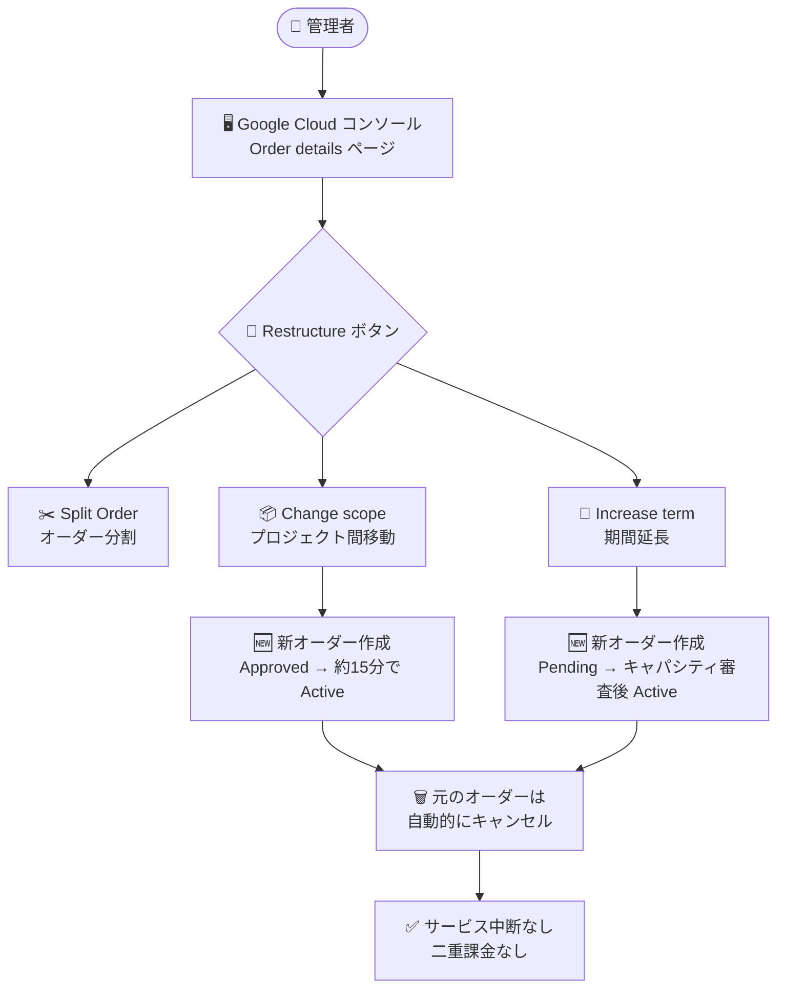

# Gemini Enterprise Agent Platform: Provisioned Throughput のオーダー再構成 (スコープ変更・期間延長) がセルフサービスコンソールに対応

**リリース日**: 2026-09-28

**サービス**: Gemini Enterprise Agent Platform

**機能**: Provisioned Throughput - Restructure an order (スコープ変更・期間延長)

**ステータス**: 一般提供 (GA)

📊 [このアップデートのインフォグラフィックを見る](https://takech9203.github.io/google-cloud-news-summary/20260928-gemini-agent-platform-provisioned-throughput-restructure.html)

## 概要

Gemini Enterprise Agent Platform の Provisioned Throughput において、既存オーダーの「スコープ変更 (Change scope)」と「期間延長 (Increase term)」が、セルフサービスの Google Cloud コンソールから直接実行できるようになりました。これらの操作は、既存のオーダーを新しいオーダーで置き換える「supersede and replace (代替・置換)」方式で処理され、サービスの中断や二重課金なしにオーダーを再構成できます。

Provisioned Throughput は、生成 AI モデルのスループットを GSU (Generative AI Scale Unit) 単位で予約する固定期間・固定料金のサブスクリプションです。今回のアップデートにより、コンソールの「Order details」ページに追加された **Restructure** ボタンから、「Split Order (オーダー分割)」「Change scope (スコープ変更)」「Increase term (期間延長)」の 3 つの再構成操作を選択できます。

本番環境でエージェントや生成 AI ワークロードを運用し、プロジェクト構成の変更やコミットメント期間の見直しを行いたい組織にとって、運用の柔軟性が大きく向上するアップデートです。

**アップデート前の課題**

- オーダーのプロジェクト間移動 (スコープ変更) やコミットメント期間の延長は、セルフサービスコンソールから直接実行できなかった
- Provisioned Throughput は期間途中でキャンセルできないコミットメントであるため、オーダー構成を変更したい場合の選択肢が限られていた
- コンソールからの既存の変更操作は、GSU の増減、自動更新の有効化/無効化、モデル/モデルバージョンの変更、リージョンの変更などに限られていた

**アップデート後の改善**

- **スコープ変更**: アクティブなオーダーを、同じモデル・GSU 数・リージョン・更新ポリシー・期間・終了日を維持したまま、別のプロジェクトへコンソールから移動できるようになった
- **期間延長**: アクティブなオーダーの期間を、同じモデル・GSU 数・リージョン・更新ポリシーを維持したまま延長できるようになった
- いずれの操作もサービスの中断 (loss in service) や課金の増加・二重課金なしに完了する

## アーキテクチャ図



コンソールの Restructure ボタンから 3 種類の再構成操作を選択でき、Change scope と Increase term では新オーダーが元のオーダーを supersede and replace (代替・置換) する形で処理されます。

## サービスアップデートの詳細

### 主要機能

1. **Change scope (スコープ変更)**
   - アクティブな Google モデルの Provisioned Throughput オーダーを、あるプロジェクトから別のプロジェクトへ移動できる
   - モデル、GSU 数、リージョン、更新ポリシー、期間、終了日はすべて維持される
   - 新しいオーダーは Approved ステータスで作成され、約 15 分以内に Active に移行し、元のオーダーは自動的にキャンセルされる
   - サービスの中断や課金の増加は発生しない

2. **Increase term (期間延長)**
   - アクティブな Google モデルの Provisioned Throughput オーダーの期間を延長できる
   - モデル、GSU 数、リージョン、更新ポリシーは維持される
   - 新しいオーダーは Pending ステータスで作成され、キャパシティ審査を経て Approved になった後、Active に移行し、元のオーダーはキャンセルされる
   - サービスの中断や二重課金は発生しない

3. **Split Order (オーダー分割)**
   - アクティブなオーダーを、同じモデル・リージョン・期間・有効期限・更新ポリシーを維持したまま 2 つのオーダーに分割できる (部分的な移行に活用可能)
   - Restructure ボタンから Split Order を選択し、移動する GSU 数を指定する
   - 約 10 分以内に分割オーダーが Active になり、元のオーダーの GSU 数が減少する

## 技術仕様

### 再構成操作の比較

| 項目 | Change scope | Increase term | Split Order |
|------|--------------|---------------|-------------|
| 操作内容 | 別プロジェクトへ移動 | コミットメント期間を延長 | 2 つのオーダーに分割 |
| 維持される属性 | モデル、GSU、リージョン、更新ポリシー、期間、終了日 | モデル、GSU、リージョン、更新ポリシー | モデル、リージョン、期間、有効期限、更新ポリシー |
| 新オーダーの初期ステータス | Approved | Pending (キャパシティ審査あり) | Approved |
| Active への移行目安 | 約 15 分 | 審査・承認後 | 約 10 分 |
| 元のオーダー | 自動キャンセル | 自動キャンセル | GSU 数が減少して存続 |
| サービスへの影響 | 中断なし・課金増なし | 中断なし・二重課金なし | 中断なし・課金増なし |

### 必要なロールと権限

Provisioned Throughput の管理には以下のロールが利用できます。

| 項目 | 詳細 |
|------|------|
| ロール | `roles/aiplatform.provisionedThroughputAdmin` |
| 主な権限 | `aiplatform.provisionedThroughputs.create` (新規オーダー作成)、`aiplatform.provisionedThroughputs.update` (オーダー変更)、`aiplatform.provisionedThroughputs.cancel` (保留中オーダー/変更のキャンセル)、`aiplatform.provisionedThroughputs.get` / `list` (参照) |

## 設定方法

### 前提条件

1. 対象のオーダーが **Active** ステータスであること
2. コンソールから発注したオンラインオーダー (Google モデル) であること (オフラインオーダーやオープンモデルのオーダーの変更は Google Cloud アカウント担当者への連絡が必要)
3. 以下の「変更できない条件」に該当しないこと
   - オーダーが変更をサポートしないモデル向けである
   - オーダーの有効期限が 5 日未満で、自動更新が設定されていない
   - 保留中または承認済みの既存の変更リクエストがある

### 手順

#### ステップ 1: Order details ページを開く

Google Cloud コンソールで **Provisioned Throughput Orders** ページに移動し、対象の **Order ID** をクリックします。

#### ステップ 2: Restructure を選択

Order details ページで **Restructure** ボタンをクリックし、**Change scope**、**Increase term**、**Split Order** のいずれかを選択します。

#### ステップ 3: 変更内容を入力して送信

- **Change scope の場合**: 新しいオーダー名を入力し、Scope セクションで移動先のプロジェクトを選択
- **Increase term の場合**: 新しいオーダー名を入力し、延長後の期間を選択
- **Summary of changes** テーブルで既存オーダーへの影響を確認し、**Submit changes** をクリック

送信後、ページ上部の **view new order** リンクから新しく作成されたオーダーの Order details ページへ移動できます。

## メリット

### ビジネス面

- **組織変更への追従が容易**: プロジェクトの再編や環境の統合時に、コミットメントを無駄にすることなくオーダーを新しいプロジェクトへ移動できる
- **コミットメントの柔軟な延長**: ワークロードの長期利用が確定した際に、より長い期間へセルフサービスで移行できる
- **調整コストの削減**: これらの操作がセルフサービスコンソールで完結するため、手続きにかかる時間を短縮できる

### 技術面

- **無停止での再構成**: いずれの操作もサービスの中断なしに完了するため、本番トラフィックへの影響がない
- **課金の一貫性**: supersede and replace 方式により、二重課金や課金増加が発生しない設計になっている
- **属性の自動引き継ぎ**: モデル、GSU、リージョン、更新ポリシーなどが新オーダーへ自動的に引き継がれ、設定ミスを防げる

## デメリット・制約事項

### 制限事項

- コンソールから変更できるのは、コンソール経由で発注した Google モデルのオンラインオーダーのみ (オフラインオーダーやオープンモデルはアカウント担当者への連絡が必要)
- オーダーが Active ステータスでない場合は変更できない
- 有効期限が 5 日未満で自動更新が未設定のオーダーは変更できない
- 保留中または承認済みの変更リクエストが既に存在する場合は変更できない

### 考慮すべき点

- Increase term はキャパシティ審査を伴うため、新オーダーが Pending から Approved になるまで時間を要する可能性がある
- Change scope では元のオーダーが自動的にキャンセルされるため、移動先プロジェクトの構成 (権限、課金設定など) を事前に確認しておく必要がある
- Provisioned Throughput 自体は期間途中でキャンセルできないコミットメントである点は変わらない

## ユースケース

### ユースケース 1: 組織再編に伴うプロジェクト移行

**シナリオ**: 生成 AI エージェントの本番ワークロードを、組織再編に伴い新しいプロジェクトへ移行する必要がある。Provisioned Throughput のコミットメントが残っており、従来は移行手段が限られていた。

**実装例**:
```text
1. Provisioned Throughput Orders ページで対象の Order ID を選択
2. Restructure → Change scope を選択
3. 新オーダー名と移行先プロジェクトを指定して Submit changes
4. 約 15 分後に新プロジェクトでオーダーが Active になり、元のオーダーは自動キャンセル
```

**効果**: サービスを中断せず、コミットメントと課金の一貫性を保ったままプロジェクト移行を完了できる。

### ユースケース 2: PoC から本番運用への移行に伴う期間延長

**シナリオ**: 短い期間で開始した Provisioned Throughput オーダーについて、ワークロードの本格運用が決定したため、より長期の期間に切り替えてコミットメントを最適化したい。

**効果**: コンソールの Increase term 操作だけで、同じモデル・GSU・リージョン構成のまま期間を延長でき、サービス中断や二重課金なしに長期コミットメントへ移行できる。

## 料金

Provisioned Throughput は GSU 単位・期間単位の固定料金サブスクリプションです。今回の再構成操作自体によって課金が増加したり、二重課金が発生したりすることはありません。オーダー量を超過したスループットは、デフォルトで従量課金 (pay-as-you-go) として処理されます。

詳細は [Provisioned Throughput の料金ページ](https://cloud.google.com/gemini-enterprise-agent-platform/generative-ai/pricing#provisioned-throughput) を参照してください。

## 関連サービス・機能

- **Gemini Enterprise Agent Platform**: Provisioned Throughput が予約するスループットの対象となるエージェント/生成 AI 基盤。オーダー変更はプラットフォームのコンソールから実行する
- **IAM (Identity and Access Management)**: `roles/aiplatform.provisionedThroughputAdmin` ロールにより、オーダーの作成・変更・キャンセル権限を管理する
- **Cloud Quotas**: QPM が 30,000 を超えるワークロードでは、Agent Platform API の「Online prediction requests per minute per region」クォータの引き上げ申請が推奨される

## 参考リンク

- 📊 [インフォグラフィック](https://takech9203.github.io/google-cloud-news-summary/20260928-gemini-agent-platform-provisioned-throughput-restructure.html)
- [公式リリースノート](https://docs.cloud.google.com/release-notes#September_28_2026)
- [ドキュメント: Restructure an order](https://docs.cloud.google.com/gemini-enterprise-agent-platform/models/provisioned-throughput/purchase-provisioned-throughput#restructure-order)
- [ドキュメント: Purchase Provisioned Throughput](https://docs.cloud.google.com/gemini-enterprise-agent-platform/models/provisioned-throughput/purchase-provisioned-throughput)
- [料金ページ](https://cloud.google.com/gemini-enterprise-agent-platform/generative-ai/pricing#provisioned-throughput)

## まとめ

Provisioned Throughput のスコープ変更と期間延長がセルフサービスコンソールから実行可能になり、コミットメント型サブスクリプションの運用柔軟性が大きく向上しました。プロジェクト再編や長期コミットメントへの移行を予定している場合は、Restructure 機能の利用条件 (Active ステータス、有効期限 5 日以上など) を確認したうえで、コンソールからの再構成を検討することをおすすめします。

---

**タグ**: #GeminiEnterpriseAgentPlatform #ProvisionedThroughput #生成AI #GSU #コスト管理 #GA
