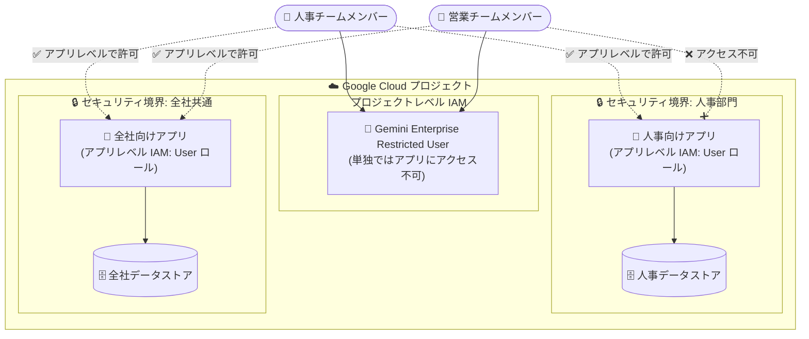

# Gemini Enterprise: アプリとデータストアに対するきめ細かなアクセス制御

**リリース日**: 2026-09-28

**サービス**: Gemini Enterprise

**機能**: アプリ・データストア単位のリソースレベル IAM 権限設定

**ステータス**: 一般提供 (Feature)

📊 [このアップデートのインフォグラフィックを見る](https://takech9203.github.io/google-cloud-news-summary/20260928-gemini-enterprise-granular-access-controls.html)

## 概要

Gemini Enterprise で、管理者がリソースレベルのきめ細かな IAM 権限を設定し、特定のアプリやデータストアへのアクセスを制限できるようになりました。設定は Google Cloud コンソール、gcloud CLI、REST API のいずれからも行えます。プロジェクト全体への権限付与なしに、個別のアプリやデータストアに対して Gemini Enterprise Admin、Viewer、User ロールを付与できます。

これにより、同一の Google Cloud プロジェクト内に複数の Gemini Enterprise アプリやデータストアを展開している組織で、部門やチームごとのデータ分離 (データサイロ) に合わせた権限設計が可能になります。たとえば、人事部門向けアプリと全社向けアプリが同一プロジェクトに存在する場合、営業チームのメンバーには全社向けアプリのみへのアクセスを許可し、人事アプリへのアクセスを防止できます。

また、コンソールのデータストア詳細ページで、構成情報、接続されたアプリ、同期の詳細、ユーザー権限を確認・管理できるようになりました。

**アップデート前の課題**

- IAM 権限は原則プロジェクトレベルで管理されており、プロジェクトレベルで Gemini Enterprise User (`roles/discoveryengine.agentspaceUser`) ロールを付与されたユーザーは、そのプロジェクト内のすべてのアプリにアクセスできた
- 同一プロジェクト内で特定のアプリのみにユーザーのアクセスを制限する手段がなく、部門ごとのデータ分離にはプロジェクト分割などの構成上の工夫が必要だった
- データストアの構成・接続状況・権限をコンソール上でまとめて確認する手段が限られていた

**アップデート後の改善**

- 個別のアプリやデータストアに対して Gemini Enterprise Admin、Viewer、User ロールを付与でき、プロジェクト全体への権限付与が不要になった
- 制限付き管理者・閲覧者・エンドユーザー向けのプロジェクトレベルのカスタムロールにより、プリンシパルは割り当てられたアプリとデータストアのみにアクセスするよう構成できるようになった
- Gemini Enterprise Restricted User (`roles/discoveryengine.agentspaceRestrictedUser`) ロールをプロジェクトレベルで付与し、アプリ単位で Gemini Enterprise User ロールを付与する「最小権限」のアクセスモデルが実現できるようになった
- コンソールのデータストア詳細ページで、構成、接続されたアプリ、同期の詳細、ユーザー権限を管理できるようになった

## アーキテクチャ図



同一プロジェクト内でも、アプリ単位の IAM ポリシーによりセキュリティ境界を定義できます。営業チームメンバーは全社向けアプリのみにアクセスでき、人事向けアプリへのアクセスは拒否されます。

## サービスアップデートの詳細

### 主要機能

1. **リソースレベルの独立した権限付与**
   - 個別のアプリやデータストアに対して Gemini Enterprise Admin、Viewer、User ロールを付与可能
   - プロジェクト全体への権限付与 (プロジェクトワイドアクセス) が不要
   - Google Cloud コンソール、gcloud CLI、REST API (`getIamPolicy` / `setIamPolicy`) で設定可能

2. **制限付きプリンシパル向けのプロジェクトレベルロール**
   - 制限付き管理者・閲覧者・エンドユーザー向けのプロジェクトレベルロールにより、プリンシパルは割り当てられたアプリとデータストアのみにアクセス
   - Gemini Enterprise Restricted User (`roles/discoveryengine.agentspaceRestrictedUser`) は単独ではどのアプリへのアクセスも許可せず、プロジェクトレベルで必要な基本アクセスのみを提供
   - その上でアプリ単位に Gemini Enterprise User ロールを付与して利用範囲を限定

3. **コンソールでのデータストア詳細・権限管理**
   - データストアの構成情報 (configurations) の確認
   - 接続されたアプリ (connected apps) の一覧表示
   - 同期の詳細 (sync details) の確認
   - ユーザー権限 (user permissions) の管理

## 技術仕様

### 関連する IAM ロール

| ロール | ロール ID | 説明 |
|------|------|------|
| Gemini Enterprise Admin | `roles/discoveryengine.agentspaceAdmin` | Gemini Enterprise リソースへの管理者レベルのアクセスを付与。アクセス制御の設定に必要 |
| Gemini Enterprise User | `roles/discoveryengine.agentspaceUser` | ユーザーレベルのアクセスを付与。プロジェクトレベルで付与するとプロジェクト内の全アプリにアクセス可能。アプリ単位で付与すると該当アプリのみ利用可能 |
| Gemini Enterprise Restricted User | `roles/discoveryengine.agentspaceRestrictedUser` | 制限付きユーザーレベルのアクセスを付与。単独ではアプリへのアクセス権を持たず、アプリ単位のロール付与と組み合わせて使用 |
| Discovery Engine Viewer | `roles/discoveryengine.viewer` | Discovery Engine リソースへの読み取りアクセスを付与。アプリの管理・共有を許可する場合に使用 |

### アプリレベル IAM ポリシーの API 仕様

- API は Discovery Engine API (`discoveryengine.googleapis.com`) のエンジンリソースに対する `getIamPolicy` / `setIamPolicy` メソッドを使用 (Gemini Enterprise では「アプリ」と「エンジン」は API 上同義)
- エンドポイントロケーションは `global`、`us`、`eu` のマルチリージョンを指定
- `setIamPolicy` は既存ポリシーを置き換えるため、`getIamPolicy` で取得した `etag` と既存バインディングを含めてリクエストする必要がある
- メンバータイプとして `user`、`group` のほか、Workload Identity Federation の `principal` / `principalSet` に対応

```json
{
  "policy": {
    "etag": "ETAG",
    "bindings": [
      {
        "role": "roles/discoveryengine.agentspaceUser",
        "members": [
          "user:USER_EMAIL",
          "group:GROUP_EMAIL"
        ]
      }
    ]
  }
}
```

## 設定方法

### 前提条件

1. 設定を行う管理者が Gemini Enterprise Admin (`roles/discoveryengine.agentspaceAdmin`) ロールを持っていること
2. 対象ユーザーが有効な Gemini Enterprise ライセンスを保有していること
3. アクセスを制限したいユーザーには、プロジェクトレベルで Gemini Enterprise Restricted User (`roles/discoveryengine.agentspaceRestrictedUser`) ロールが付与されていること

### 手順 (プロジェクトレベルからアプリレベルアクセスへの移行)

#### ステップ 1: プロジェクトレベルのロールを変更

Google Cloud コンソールの IAM ページで、対象ユーザーからプロジェクトレベルの Gemini Enterprise User (`roles/discoveryengine.agentspaceUser`) ロールを削除し、代わりに Gemini Enterprise Restricted User (`roles/discoveryengine.agentspaceRestrictedUser`) ロールを付与します。

#### ステップ 2: アプリの現在の IAM ポリシーを取得

```bash
curl -X GET \
  -H "Authorization: Bearer $(gcloud auth print-access-token)" \
  -H "Content-Type: application/json" \
  "https://ENDPOINT_LOCATION-discoveryengine.googleapis.com/v1/projects/PROJECT_ID/locations/LOCATION/collections/default_collection/engines/APP_ID:getIamPolicy"
```

レスポンスの `etag` 値を控えます。この値はポリシー更新のたびに変化するため、更新のつど再取得が必要です。

#### ステップ 3: アプリの IAM ポリシーを更新してアクセスを付与

```bash
curl -X POST \
  -H "Authorization: Bearer $(gcloud auth print-access-token)" \
  -H "Content-Type: application/json" \
  -d '{
    "policy": {
      "etag": "ETAG",
      "bindings": [
        {
          "role": "roles/discoveryengine.agentspaceUser",
          "members": ["user:USER_EMAIL", "group:GROUP_EMAIL"]
        }
      ]
    }
  }' \
  "https://ENDPOINT_LOCATION-discoveryengine.googleapis.com/v1/projects/PROJECT_ID/locations/LOCATION/collections/default_collection/engines/APP_ID:setIamPolicy"
```

アクセスを取り消す場合は、`members` 配列から該当プリンシパルを削除したポリシーで更新します。

## メリット

### ビジネス面

- **部門間のデータ分離**: 人事・法務・営業など、部門固有のアプリとデータストアを同一プロジェクト内で安全に分離でき、組織のデータガバナンス要件に対応できる
- **プロジェクト分割の削減**: アクセス分離のためだけに Google Cloud プロジェクトを分ける必要がなくなり、運用・管理コストを削減できる
- **最小権限の原則の徹底**: ユーザーに必要なアプリ・データストアのみへのアクセスを付与することで、コンプライアンスと監査要件への対応が容易になる

### 技術面

- **標準 IAM との統合**: `getIamPolicy` / `setIamPolicy` という標準的な IAM ポリシー管理手法をアプリ (エンジン) リソースに適用でき、既存の IAM 運用プロセスに組み込みやすい
- **柔軟なプリンシパル指定**: ユーザー・グループに加えて Workload Identity Federation の `principal` / `principalSet` に対応
- **複数のインターフェース**: Google Cloud コンソール、gcloud CLI、REST API のいずれからも設定可能

## デメリット・制約事項

### 制限事項

- **プロジェクトレベル権限が優先される**: プロジェクトレベルで Gemini Enterprise User ロールを持つユーザーは、アプリレベルのポリシー設定に関係なくプロジェクト内の全アプリにアクセスできる。アクセスを制限するには、プロジェクトレベルのロールを Restricted User に置き換える必要がある
- **アプリレベル権限は管理機能を含まない**: アプリレベルの IAM 権限で付与されるのはユーザーレベルの利用権限であり、管理者機能は含まれない
- **`setIamPolicy` はポリシー全体を置き換える**: 既存の権限を維持するには、保持したいすべてのバインディングをリクエストに含める必要がある
- **IAM 変更の伝播遅延**: IAM ポリシーの変更が完全に反映されるまで数分かかる場合がある

### 考慮すべき点

- `etag` はポリシー更新のたびに変化するため、更新前に必ず `getIamPolicy` で最新の値を取得する運用が必要
- IAM ポリシーが設定されたアプリを削除する場合は、削除前にポリシーからユーザーを削除するのがベストプラクティスとされている
- リソースレベルの IAM に加え、データソース側の ACL (アクセス制御リスト) によるドキュメント単位のアクセス制御も併用でき、両者の役割の違いを理解した設計が必要

## ユースケース

### ユースケース 1: 部門別アプリのアクセス分離

**シナリオ**: 同一プロジェクト内に人事向けアプリと全社向けアプリを運用している企業で、営業チームのメンバーには全社向けアプリのみを利用させたい。

**実装例**:
```
1. 営業チームのグループからプロジェクトレベルの
   roles/discoveryengine.agentspaceUser を削除
2. プロジェクトレベルで roles/discoveryengine.agentspaceRestrictedUser を付与
3. 全社向けアプリの setIamPolicy で
   group:sales-team@example.com に
   roles/discoveryengine.agentspaceUser を付与
```

**効果**: 営業チームは全社向けアプリのみ利用可能になり、人事向けアプリおよびそのデータストアへのアクセスが防止される。

### ユースケース 2: 制限付き管理者によるデータストア運用の委任

**シナリオ**: 各部門の IT 担当者に、自部門のデータストアの構成・同期状況・ユーザー権限の管理のみを委任し、他部門のリソースには触れさせたくない。

**効果**: リソースレベルの Admin ロール付与とコンソールのデータストア詳細ページ (構成、接続されたアプリ、同期の詳細、ユーザー権限) により、部門ごとに管理権限をスコープした運用委任が可能になる。

## 関連サービス・機能

- **Identity and Access Management (IAM)**: 本機能の基盤。リソースレベルの許可ポリシー、カスタムロール、伝播遅延などの IAM の一般的な仕組みが適用される
- **Workload Identity Federation / Workforce Identity Pool**: アプリレベル IAM ポリシーのメンバーとして `principal` / `principalSet` を指定可能。外部 ID プロバイダのユーザーにもスコープしたアクセスを付与できる
- **データソース ACL (アクセス制御)**: Cloud Storage や BigQuery などのデータソース側のアクセス権に基づき、検索結果をドキュメント単位で制御する機能。リソースレベル IAM と組み合わせて多層防御を構成できる
- **Model Armor**: プロンプト入力のサニタイズや機密データの秘匿化など、Gemini Enterprise のエンタープライズ安全性制御を補完するサービス

## 参考リンク

- 📊 [インフォグラフィック](https://takech9203.github.io/google-cloud-news-summary/20260928-gemini-enterprise-granular-access-controls.html)
- [公式リリースノート](https://docs.cloud.google.com/release-notes#September_28_2026)
- [アプリのアクセス制御の構成 (Configure access controls for apps)](https://docs.cloud.google.com/gemini/enterprise/docs/iam-policy-for-apps)
- [Gemini Enterprise のアクセス制御 (IAM ロール一覧)](https://docs.cloud.google.com/gemini/enterprise/docs/access-control)
- [データソースのアクセス制御](https://docs.cloud.google.com/gemini/enterprise/docs/identity)

## まとめ

このアップデートにより、Gemini Enterprise のアクセス制御がプロジェクト単位からアプリ・データストア単位へと細分化され、同一プロジェクト内での部門別データ分離と最小権限運用が実現できるようになりました。複数のアプリやデータストアを運用している組織は、プロジェクトレベルの Gemini Enterprise User ロールを Restricted User ロールへ移行し、リソースレベルでの権限付与に切り替えることを検討してください。

---

**タグ**: #GeminiEnterprise #IAM #AccessControl #Security #DataGovernance #GoogleCloud
