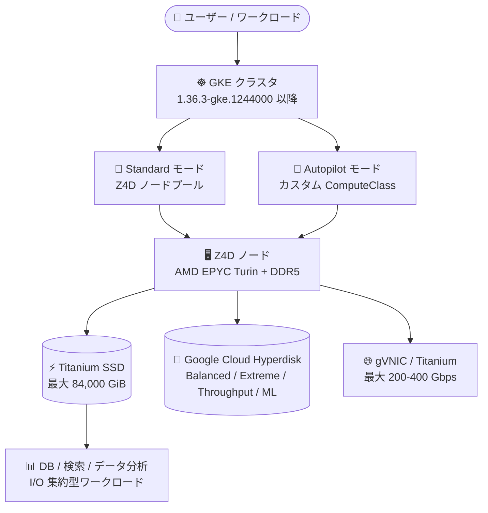

# Google Kubernetes Engine: ストレージ最適化 Z4D マシンシリーズのサポート

**リリース日**: 2026-09-28

**サービス**: Google Kubernetes Engine (GKE)

**機能**: ストレージ最適化 Z4D マシンシリーズの GKE サポート

**ステータス**: Feature (GKE 1.36.3-gke.1244000 以降で利用可能)

📊 [このアップデートのインフォグラフィックを見る](https://takech9203.github.io/google-cloud-news-summary/20260928-gke-z4d-machine-series.html)

## 概要

ストレージ最適化マシンシリーズ Z4D が、バージョン 1.36.3-gke.1244000 以降を実行する GKE クラスタで利用可能になりました。Z4D マシンタイプは GKE の Standard モードと Autopilot モードの両方で使用できます。

Z4D は AMD EPYC Turin プロセッサ、DDR5 メモリ、Titanium オフロードプロセッサを搭載したストレージ最適化マシンシリーズです。Titanium SSD によるローカルストレージを最大 84,000 GiB、メモリを最大 3 TB まで提供し、従来の Z3 シリーズよりも大きな Titanium SSD ディスクサイズを利用できます。SQL / NoSQL / ベクトルデータベース、データ分析・データウェアハウス、検索、AI/ML 向け並列ファイルシステムなど、I/O 集約型ワークロードを Kubernetes 上で実行するユーザーが対象です。

**アップデート前の課題**

- GKE でストレージ最適化マシンファミリーを使う場合、これまでの選択肢は Z3 シリーズ (Titanium SSD 最大 36,000 GiB の VM、72,000 GiB のベアメタル) であり、最新世代の Z4D を GKE ノードとして利用できなかった
- 高 IOPS・大容量ローカルストレージを必要とするコンテナワークロードで、AMD EPYC Turin 世代の性能や Z4D の大容量 Titanium SSD (最大 84,000 GiB) を活用できなかった

**アップデート後の改善**

- GKE 1.36.3-gke.1244000 以降のクラスタで、Z4D マシンタイプを Standard モードのノードプールおよび Autopilot モードで利用できるようになった
- 最大 84,000 GiB の Titanium SSD、最大 3 TB のメモリ、2 物理 NIC 構成で最大 400 Gbps のネットワーク帯域を持つノードで、I/O 集約型のコンテナワークロードを実行できるようになった
- vCPU と Titanium SSD 容量の比率が異なる 2 つのサブタイプ (standardlssd = 1:219、highlssd = 1:438) から、ワークロードのストレージ密度に応じて選択できるようになった

## アーキテクチャ図



GKE クラスタ (Standard / Autopilot) から Z4D ノードをプロビジョニングし、ノードに標準搭載される Titanium SSD と Hyperdisk を組み合わせて I/O 集約型ワークロードを実行する構成を示しています。

## サービスアップデートの詳細

### 主要機能

1. **GKE Standard / Autopilot 両モードでの Z4D サポート**
   - バージョン 1.36.3-gke.1244000 以降の GKE クラスタで Z4D マシンタイプを利用可能
   - Standard モードではノードプールのマシンタイプとして指定、Autopilot モードでも利用可能 (Autopilot とノード自動プロビジョニングでのローカル SSD 利用はカスタム ComputeClass 経由でサポート)

2. **大容量・高性能な Titanium SSD ローカルストレージ**
   - すべての Z4D マシンタイプに Titanium SSD がローカル接続された状態で提供される (インスタンス作成時に自動アタッチ)
   - 最大構成 (84,000 GiB) では読み取り 15,600,000 IOPS / 書き込み 12,288,000 IOPS、読み取りスループット 75,600 MiBps を提供
   - Titanium I/O オフロード処理により、ネットワーク・ストレージ処理をホスト CPU からオフロード

3. **2 種類の vCPU : Titanium SSD 比率のサブタイプ**
   - `standardlssd`: 比率 1:219。vCPU あたりの Titanium SSD 性能が最も高く、中規模データセットの検索・分析向け
   - `highlssd`: 比率 1:438。より大きな Titanium SSD パーティションを提供し、大規模データセットのストレージ集約型ストリーミング・分析向け

4. **Hyperdisk と高帯域ネットワーク**
   - ブロックストレージとして Hyperdisk Balanced / Balanced High Availability / Extreme / Throughput / ML をサポート (NVMe インターフェースのみ)
   - 1 物理 NIC 構成で最大 200 Gbps、2 物理 NIC 構成で最大 400 Gbps のネットワーク帯域 (gVNIC 必須)
   - AVX512 による vector 処理のビルトインアクセラレーションをサポート

## 技術仕様

### Z4D マシンシリーズの概要

| 項目 | 詳細 |
|------|------|
| プロセッサ | AMD EPYC Turin (第 5 世代 AMD EPYC) |
| メモリ | DDR5、最大 3 TB |
| ローカルストレージ | Titanium SSD、最大 84,000 GiB |
| サブタイプ | standardlssd (vCPU:SSD = 1:219)、highlssd (vCPU:SSD = 1:438) |
| ブロックストレージ | Hyperdisk Balanced / Balanced HA / Extreme / Throughput / ML、Titanium SSD (NVMe のみ) |
| ネットワーク | gVNIC 必須、1 NIC で最大 200 Gbps、2 NIC で最大 400 Gbps |
| GKE 要件 | 1.36.3-gke.1244000 以降、Standard / Autopilot 両対応 |

### 代表的な Z4D マシンタイプ (standardlssd)

| マシンタイプ | Titanium SSD 合計 | 読み取り IOPS | 読み取りスループット (MiBps) |
|------|------|------|------|
| z4d-highmem-16-standardlssd | 3,500 GiB | 650,000 | 3,150 |
| z4d-highmem-64-standardlssd | 14,000 GiB | 2,600,000 | 12,600 |
| z4d-highmem-192-standardlssd | 42,000 GiB | 7,800,000 | 37,800 |
| z4d-highmem-384-standardlssd | 84,000 GiB | 15,600,000 | 75,600 |

highlssd サブタイプは z4d-highmem-8-highlssd から z4d-highmem-192-highlssd まで提供され、同じ vCPU 数でより大きな Titanium SSD 容量を持ちます。

## 設定方法

### 前提条件

1. GKE クラスタのバージョンが 1.36.3-gke.1244000 以降であること
2. Z4D が利用可能なリージョン / ゾーンでクラスタまたはノードプールを作成すること
3. OS イメージが IDPF ネットワークドライバをサポートしていること (Z4D は gVNIC / IDPF が必要。Windows イメージは非サポート)

### 手順

#### ステップ 1: Standard モードで Z4D ノードプールを作成

```bash
gcloud container node-pools create z4d-pool \
    --cluster=CLUSTER_NAME \
    --location=LOCATION \
    --machine-type=z4d-highmem-16-standardlssd
```

Z4D マシンタイプには Titanium SSD が標準で付属します。ローカル SSD をエフェメラルストレージや raw ブロックストレージとして使用する構成については、[GKE のローカル SSD ドキュメント](https://docs.cloud.google.com/kubernetes-engine/docs/concepts/local-ssd)を参照してください。

#### ステップ 2: Autopilot / ノード自動プロビジョニングでカスタム ComputeClass を使用

Autopilot クラスタおよびノード自動プロビジョニングでローカル SSD 付きマシンを利用する場合は、カスタム ComputeClass を使用します。ローカル SSD を構成する ComputeClass では `machineFamily` ではなく `machineType` 優先度ルールを使用する必要があります。

```yaml
apiVersion: cloud.google.com/v1
kind: ComputeClass
metadata:
  name: z4d-storage-optimized
spec:
  nodePoolAutoCreation:
    enabled: true
  priorities:
  - machineType: z4d-highmem-16-standardlssd
  whenUnsatisfiable: DoNotScaleUp
```

Pod 側では `nodeSelector` で ComputeClass を指定してスケジューリングします。

## メリット

### ビジネス面

- **最新世代ハードウェアの活用**: AMD EPYC Turin 世代のストレージ最適化マシンを Kubernetes ワークロードでそのまま利用でき、セルフマネージド DB や検索基盤のコンテナ化を高性能なまま実現できる
- **運用モードの選択肢**: Standard モードでの細かなノードプール管理と、Autopilot モードでのノード管理レス運用のどちらでも Z4D を選択できる

### 技術面

- **圧倒的なローカル I/O 性能**: 最大構成で読み取り 15.6M IOPS / 75,600 MiBps という Titanium SSD 性能を GKE ノードで利用可能
- **Z3 からの容量拡大**: VM あたりの Titanium SSD が Z3 の最大 36,000 GiB から Z4D では最大 84,000 GiB に拡大し、メモリも最大 3 TB に増加
- **Titanium オフロード**: ネットワーク・ストレージ処理をホスト CPU からオフロードし、ワークロードに CPU リソースを集中できる

## デメリット・制約事項

### 制限事項

- 詳細な制限事項は「[GKE クラスタでのマシンサポートについて](https://docs.cloud.google.com/kubernetes-engine/docs/concepts/machine-support)」を参照
- Z4D は選択されたゾーン / リージョンでのみ利用可能
- GPU は使用不可。リージョン Persistent Disk も使用不可
- 単一テナンシー (sole tenancy) 非対応、インスタンスのサスペンド不可、カスタムマシンタイプ作成不可
- Windows イメージは非サポート
- ライブマイグレーションは Titanium SSD が 42,000 GiB (GKE ドキュメントでは 41 TiB) 以下の場合のみサポート。それを超える構成ではホストメンテナンス時にデータ永続化を伴って停止する

### 考慮すべき点

- Titanium SSD 上のデータはエフェメラル。Pod やノードの削除・修復・アップグレード時にデータが失われる可能性があるため、永続化が必要なデータは Hyperdisk、Filestore、Cloud Storage などを使用する
- Autopilot とノード自動プロビジョニングでのローカル SSD 利用はカスタム ComputeClass 経由のみサポートされる
- ローカル SSD の設定はノードプール作成後に変更できないため、変更にはノードプールの再作成が必要
- OS イメージが IDPF ドライバをサポートしていない場合、インスタンスに接続できない可能性がある

## ユースケース

### ユースケース 1: GKE 上のセルフマネージド NoSQL / ベクトルデータベース

**シナリオ**: Cassandra、ScyllaDB、ベクトル検索エンジンなど、ローカルディスクの低レイテンシと高 IOPS が性能を左右するステートフルワークロードを GKE で運用する。

**効果**: Titanium SSD の高い IOPS / スループットにより読み書き性能を最大化しつつ、レプリケーションはアプリケーション層で担保する構成を Kubernetes 上で実現できる。

### ユースケース 2: データ分析・検索基盤のホットストレージ層

**シナリオ**: Elasticsearch / OpenSearch などの検索クラスタや分析基盤のホットティアを GKE 上に構築し、大容量データセットへの高速アクセスを提供する。

**効果**: standardlssd / highlssd のサブタイプ選択により、vCPU あたりのストレージ密度をワークロードに合わせて最適化できる。highlssd では同じ vCPU 数でより大きな SSD 容量を確保できる。

## 料金

Z4D のマシンタイプ料金は VM インスタンス料金ページに掲載されています。ディスク使用量とネットワーク使用量はマシンタイプ料金とは別に課金されます。Titanium SSD の料金はストレージ最適化マシンタイプファミリーの料金セクションを参照してください。

- [VM インスタンス料金 (Z4D マシンタイプ)](https://docs.cloud.google.com/compute/vm-instance-pricing#z4d_machine_types)
- [ディスクとイメージの料金](https://cloud.google.com/compute/disks-image-pricing)
- [ネットワーク料金](https://cloud.google.com/vpc/network-pricing)

GKE では上記のコンピュートリソース料金に加えて、クラスタ管理料金 (Autopilot / Standard) が適用されます。

## 利用可能リージョン

Z4D は選択されたゾーン / リージョンで利用可能です。公式ドキュメントのゾーン一覧では、us-central1、us-east4、us-east5 などのゾーンで Z4D の提供が確認できます。最新の提供状況は[リージョンとゾーンのドキュメント](https://docs.cloud.google.com/compute/docs/regions-zones#available)を参照してください。

## 関連サービス・機能

- **Compute Engine (Z4D マシンシリーズ)**: GKE ノードの基盤となるストレージ最適化 VM。Z3 シリーズの後継的な位置づけで、より大容量の Titanium SSD を提供
- **Google Cloud Hyperdisk**: Z4D がサポートする高性能ブロックストレージ。永続データの格納に使用
- **Titanium SSD / ローカル SSD (GKE)**: エフェメラルストレージまたは raw ブロックストレージとして GKE ワークロードから利用可能
- **カスタム ComputeClass**: Autopilot / ノード自動プロビジョニングで Z4D などの特定マシンタイプを宣言的にリクエストする仕組み

## 参考リンク

- 📊 [インフォグラフィック](https://takech9203.github.io/google-cloud-news-summary/20260928-gke-z4d-machine-series.html)
- [公式リリースノート](https://docs.cloud.google.com/release-notes#September_28_2026)
- [GKE クラスタでのマシンサポートについて](https://docs.cloud.google.com/kubernetes-engine/docs/concepts/machine-support)
- [ストレージ最適化マシンファミリー (Z4D / Z3)](https://docs.cloud.google.com/compute/docs/storage-optimized-machines)
- [GKE のローカル SSD について](https://docs.cloud.google.com/kubernetes-engine/docs/concepts/local-ssd)
- [カスタム ComputeClass について](https://docs.cloud.google.com/kubernetes-engine/docs/concepts/about-custom-compute-classes)
- [料金ページ (VM インスタンス料金)](https://docs.cloud.google.com/compute/vm-instance-pricing#z4d_machine_types)

## まとめ

GKE 1.36.3-gke.1244000 以降で、最新世代のストレージ最適化マシンシリーズ Z4D が Standard / Autopilot 両モードで利用可能になりました。最大 84,000 GiB の Titanium SSD と最大 3 TB のメモリにより、データベース・検索・分析などの I/O 集約型コンテナワークロードの性能を大きく引き上げられます。該当ワークロードを GKE で運用しているチームは、対象リージョンでの提供状況とライブマイグレーションなどの制約を確認のうえ、Z4D ノードプールまたはカスタム ComputeClass での採用を検討してください。

---

**タグ**: GKE, Kubernetes, Z4D, ストレージ最適化, Titanium SSD, AMD EPYC Turin, Hyperdisk, Autopilot, ComputeClass
