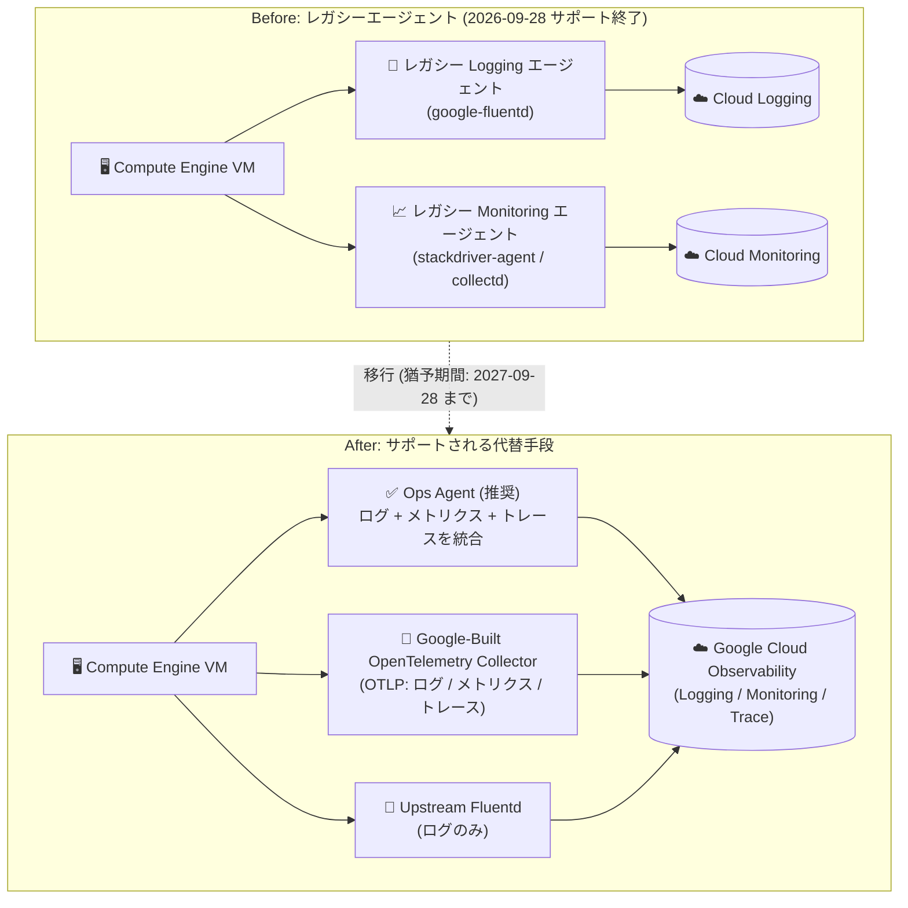

# Cloud Logging / Cloud Monitoring: レガシー Logging エージェントとレガシー Monitoring エージェントがサポート終了 (End of Support)

**リリース日**: 2026-09-28

**サービス**: Cloud Logging / Cloud Monitoring (Google Cloud Observability)

**機能**: レガシー Logging エージェントおよびレガシー Monitoring エージェントのサポート終了

**ステータス**: Deprecated (End of Support)

📊 [このアップデートのインフォグラフィックを見る](https://takech9203.github.io/google-cloud-news-summary/20260928-legacy-logging-monitoring-agents-end-of-support.html)

## 概要

2026 年 9 月 28 日をもって、レガシー Logging エージェント (Fluentd ベースの `google-fluentd`) とレガシー Monitoring エージェント (collectd ベースの `stackdriver-agent`) が正式にサポート終了 (End of Support) を迎えました。両エージェントの新バージョンのリリース、標準的なメンテナンス、および定期的なバグ修正はすべて終了しています。Google はサポートされている代替手段への移行を強く推奨しています。

既存のレガシーエージェントのインストールが即座に停止されることはなく、ログの Cloud Logging へのストリーミングとメトリクスの Cloud Monitoring への送信は引き続き動作します。また、ディストリビューションのダウンロードとインストールも引き続き可能です。ただし、レガシーエージェントを使い続けると、アップデート、バグ修正、新しい OS への対応が受けられず、最終的に Google Cloud Observability との互換性が失われるリスクがあります。

このサポート終了と同時に 12 か月間の移行猶予期間が開始され、この期間中は Cloud カスタマーケアがサポートチケットを通じて移行を支援します。移行支援は 2027 年 9 月 28 日に終了し、それ以降の移行作業はユーザー自身で対応する必要があります。Compute Engine 上の VM でレガシーエージェントを運用しているすべてのユーザーが対象であり、早期の移行計画の策定が求められます。

**アップデート前の課題**

- レガシー Logging エージェント (Fluentd ベース) とレガシー Monitoring エージェント (collectd ベース) は 2 つの別々のエージェントとして提供され、それぞれ個別のインストール・設定・運用管理が必要だった
- レガシーエージェントは非推奨 (Deprecated) 扱いながらもメンテナンスが継続されていたため、移行を先送りしているユーザーが多かった
- レガシー Logging エージェントはマルチコアアーキテクチャを十分に活用できず、Ops Agent と比較してスループットやリソース効率で劣っていた

**アップデート後の改善 (移行による影響)**

- 2026 年 9 月 28 日をもって標準メンテナンスと定期的なバグ修正が完全に終了し、移行の必要性が確定した
- 12 か月間の移行猶予期間 (2027 年 9 月 28 日まで) が開始され、期間中は Cloud カスタマーケアがサポートチケット経由で移行を支援する
- 推奨代替である Ops Agent へ移行することで、ログとメトリクスの収集が単一エージェント・単一の YAML 設定に統合され、高スループットのログ収集、Prometheus / OTLP メトリクスとトレースの収集などの新機能が利用できる

## アーキテクチャ図



サポート終了したレガシー 2 エージェント構成から、Ops Agent (推奨)、Google-Built OpenTelemetry Collector、Upstream Fluentd のいずれかのサポートされる代替手段への移行パスを示しています。

## サービスアップデートの詳細

### 主要なポイント

1. **レガシー Logging エージェントのサポート終了**
   - Fluentd をベースとしたレガシー Logging エージェントの新バージョンのリリース、標準メンテナンス、定期的なバグ修正が 2026 年 9 月 28 日をもって終了
   - 既存のインストールは停止されず、Cloud Logging へのログのストリーミングは継続する
   - ディストリビューションのダウンロードとインストールは引き続き可能だが、使用は非推奨

2. **レガシー Monitoring エージェントのサポート終了**
   - collectd をベースとしたレガシー Monitoring エージェントも同日にサポート終了
   - 既存のインストールからの Cloud Monitoring へのメトリクス送信は継続する
   - アップデートや新 OS 対応が提供されないため、将来的に Google Cloud Observability との互換性が失われるリスクがある

3. **12 か月間の移行猶予期間**
   - 2026 年 9 月 28 日から 2027 年 9 月 28 日までの 12 か月間、Cloud カスタマーケアがサポートチケット経由で移行を支援
   - 2027 年 9 月 28 日以降は、移行作業をユーザー自身で行う必要がある

### 移行先の選択肢

1. **Ops Agent (推奨)**
   - Compute Engine インスタンスからテレメトリーを収集するための主要かつ推奨されるエージェント
   - ログ収集には Fluent Bit、メトリクスとトレースの収集には OpenTelemetry Collector を使用し、単一プロセスに統合
   - YAML ベースの統一された設定、高スループットログ、プロキシ対応、標準的な Linux / Windows ディストリビューションのサポート

2. **Google-Built OpenTelemetry Collector**
   - オープンソースの OpenTelemetry Collector の Google によるプロダクションレディなビルド
   - OpenTelemetry Protocol (OTLP) の相関付けられたトレース・メトリクス・ログを Google Cloud Observability や他のバックエンドに送信可能

3. **Upstream Fluentd (ログのみ)**
   - レガシー Logging エージェントのベースとなったオープンソースのログコレクター
   - Ops Agent に変換できない高度にカスタマイズされた Fluentd 設定を持つ環境向け
   - Google プラットフォームプラグインと組み合わせることで、既存設定を維持しながら Cloud Logging へのログ送信を継続できる

## 技術仕様

### サポート終了スケジュール

| 日付 | 内容 |
|------|------|
| 2026 年 9 月 28 日 | 標準メンテナンスと定期的なバグ修正が終了。12 か月間の移行猶予期間が開始 |
| 2026-09-28 〜 2027-09-28 | 移行猶予期間。Cloud カスタマーケアがサポートチケット経由で移行を支援 |
| 2027 年 9 月 28 日 | Cloud カスタマーケアによる移行支援が終了。以降の移行はユーザー自身で対応 |

### レガシーエージェントと Ops Agent の比較

| 項目 | レガシーエージェント | Ops Agent |
|------|---------------------|-----------|
| 構成 | Logging / Monitoring の 2 エージェント (Fluentd + collectd) | 単一エージェント (Fluent Bit + OpenTelemetry Collector) |
| 設定 | エージェントごとに個別 | 統一された YAML ベース設定 |
| ログ性能 | - | マルチコアを活用した高スループット、効率的なリソース管理 |
| ログ処理 | - | JSON / 正規表現パース、フィールド変更、除外フィルタ、マルチライン結合 (Java / Python / Go) |
| メトリクス | システムメトリクス | システムメトリクス (設定不要) + Prometheus / OTLP / NVIDIA DCGM |
| トレース | 非対応 | OTLP トレースの収集に対応 |
| サポート | 2026-09-28 で終了 | 継続的にサポート |

### Ops Agent との既知の差分 (移行時の注意点)

| メトリクスタイプ | Ops Agent (GA) | レガシー Monitoring エージェント |
|------------------|----------------|----------------------------------|
| `cpu_state` (Windows) | `idle`, `interrupt`, `system`, `user` | `idle`, `used` |
| `disk/bytes_used`, `disk/percent_used` | `device` ラベルにフルパス (例: `/dev/sda15`)。`tmpfs` や `udev` などの仮想デバイスは収集しない | `device` ラベルに `/dev` を除いたパス (例: `sda15`)。仮想デバイスも収集する |

これらのラベル値の違いにより、既存のアラートポリシーやダッシュボードで該当メトリクスを参照している場合は、移行後に修正が必要になることがあります。

## 設定方法

### 前提条件

1. Compute Engine VM 上でレガシー Logging エージェント / Monitoring エージェントが稼働していることを確認する
2. 既存のカスタム設定 (Fluentd 設定、collectd 設定) の内容を把握し、Ops Agent の YAML 設定に変換可能かを評価する (変換できない高度な Fluentd カスタマイズがある場合は Upstream Fluentd への移行を検討)

### 手順 (レガシーエージェントから Ops Agent への移行)

#### ステップ 1: レガシーエージェントのアンインストール

```bash
# レガシー Logging エージェント / Monitoring エージェントをアンインストール
# (公式手順: 各エージェントのアンインストールドキュメントを参照)
```

レガシー Logging エージェントとレガシー Monitoring エージェントをアンインストールします。アンインストール後、Google Cloud コンソールに変更が反映されるまで最大 1 時間かかる場合があります。

#### ステップ 2: Ops Agent のインストール

```bash
# 単一 VM に最新版の Ops Agent をインストール
curl -sSO https://dl.google.com/cloudagents/add-google-cloud-ops-agent-repo.sh
sudo bash add-google-cloud-ops-agent-repo.sh --also-install
```

単一 VM への最新版インストールのほか、複数 VM への一括インストール・管理 (エージェントポリシーなど) も選択できます。

#### ステップ 3: Ops Agent の設定

```bash
# 必要に応じて YAML 設定を編集して再起動
sudo vim /etc/google-cloud-ops-agent/config.yaml
sudo service google-cloud-ops-agent restart
```

必要に応じて Ops Agent の YAML 設定 (ログレシーバー、プロセッサー、メトリクスレシーバーなど) を構成します。

## メリット

### ビジネス面

- **サポートリスクの解消**: サポート終了したソフトウェアの継続利用によるセキュリティ・互換性リスクを回避し、コンプライアンス要件を満たしやすくなる
- **移行支援の活用**: 2027 年 9 月 28 日までの猶予期間中は Cloud カスタマーケアの移行支援を受けられるため、計画的な移行でコストと工数を抑えられる
- **運用の簡素化**: 2 つのエージェントの管理が単一の Ops Agent に統合され、運用負荷が低減する

### 技術面

- **性能向上**: Ops Agent はマルチコアアーキテクチャを活用した高スループットのログ収集と、効率的な CPU / メモリ管理を提供する
- **統一された設定**: 単一の YAML ベース設定でログとメトリクスの両方を管理できる
- **モダンなテレメトリー対応**: Prometheus メトリクス、OTLP メトリクス / トレース、NVIDIA DCGM (GPU) メトリクスの収集など、レガシーエージェントにはない機能が利用できる

## デメリット・制約事項

### 制限事項

- レガシーエージェントの新バージョンのリリース、標準メンテナンス、定期的なバグ修正は 2026 年 9 月 28 日をもって終了している
- Cloud カスタマーケアによる移行支援は 2027 年 9 月 28 日で終了し、以降は自力での移行対応が必要
- 高度にカスタマイズされた Fluentd 設定の中には Ops Agent の設定に変換できないものがある (その場合は Upstream Fluentd + Google プラットフォームプラグインの利用を検討)

### 考慮すべき点

- レガシーエージェントは即座に停止しないが、アップデートやバグ修正、新 OS 対応が提供されないため、放置すると最終的に Google Cloud Observability との互換性が失われる
- Ops Agent とレガシー Monitoring エージェントではメトリクスのラベル値や収集対象に差異があるため (例: `cpu_state` の Windows での値、`disk` メトリクスの `device` ラベル)、移行後に既存のダッシュボードやアラートポリシーの見直しが必要
- レガシーエージェントのアンインストール後、コンソールへの反映に最大 1 時間かかる場合がある

## ユースケース

### ユースケース 1: 標準的な VM フリートの Ops Agent への移行

**シナリオ**: 多数の Compute Engine VM でレガシー Logging / Monitoring エージェントを標準設定 (または軽微なカスタマイズ) で運用している。

**実装例**:
```
1. 対象 VM のインベントリを作成し、レガシーエージェントの設定内容を棚卸し
2. レガシーエージェントをアンインストール
3. Ops Agent をインストール (複数 VM への一括インストール手段も利用可能)
4. YAML 設定でログ / メトリクス収集を構成し、ダッシュボード・アラートを検証
```

**効果**: 2 エージェント構成が単一エージェントに統合され、サポート継続と運用簡素化、ログ収集性能の向上を同時に実現できる。

### ユースケース 2: 高度にカスタマイズされた Fluentd 環境の維持

**シナリオ**: レガシー Logging エージェント上で、Ops Agent に変換できない高度な Fluentd カスタム設定 (独自プラグインや複雑なルーティング) を運用している。

**効果**: Upstream Fluentd と Google プラットフォームプラグインを組み合わせることで、既存の Fluentd 設定を維持したまま Cloud Logging へのログ送信を中断なく継続できる。

### ユースケース 3: OpenTelemetry への標準化

**シナリオ**: アプリケーションを OpenTelemetry SDK で計装しており、ログ・メトリクス・トレースを相関付けて Google Cloud Observability と他のバックエンドの両方に送信したい。

**効果**: Google-Built OpenTelemetry Collector に移行することで、OTLP ベースの相関付けられたテレメトリー収集にベンダー中立な形で標準化できる。

## 料金

このサポート終了自体による料金変更はありません。エージェントが送信するログ・メトリクスの取り込みには、従来どおり Cloud Logging / Cloud Monitoring の料金体系が適用されます。詳細は料金ページを参照してください。

- [Google Cloud Observability の料金](https://cloud.google.com/stackdriver/pricing)

## 関連サービス・機能

- **Ops Agent**: レガシー 2 エージェントの後継となる推奨エージェント。Fluent Bit (ログ) と OpenTelemetry Collector (メトリクス / トレース) を単一プロセスに統合
- **Google-Built OpenTelemetry Collector**: OTLP でトレース・メトリクス・ログを Google Cloud Observability や他バックエンドへ送信できる Google ビルドのコレクター
- **Cloud Logging / Cloud Monitoring**: エージェントが収集したテレメトリーの送信先。レガシーエージェントからの送信自体は当面継続する
- **Cloud Trace**: Ops Agent / OpenTelemetry Collector 移行後に OTLP トレースの収集が可能になる
- **Compute Engine / Bare Metal Solution**: エージェントの稼働対象となるインフラストラクチャ

## 参考リンク

- 📊 [インフォグラフィック](https://takech9203.github.io/google-cloud-news-summary/20260928-legacy-logging-monitoring-agents-end-of-support.html)
- [公式リリースノート (2026 年 9 月 28 日)](https://docs.cloud.google.com/release-notes#September_28_2026)
- [Legacy Monitoring and Logging agents end of support (非推奨のお知らせ)](https://docs.cloud.google.com/stackdriver/docs/deprecations/legacy-agents)
- [Ops Agent の概要](https://docs.cloud.google.com/stackdriver/docs/solutions/agents/ops-agent)
- [レガシーエージェントから Ops Agent への移行](https://docs.cloud.google.com/stackdriver/docs/solutions/agents/ops-agent/transition#migrate_legacy)
- [Google-Built OpenTelemetry Collector の概要](https://docs.cloud.google.com/stackdriver/docs/instrumentation/google-built-otel)
- [レガシー Logging エージェントから Upstream Fluentd への移行](https://docs.cloud.google.com/stackdriver/docs/solutions/agents/logging/migrating-to-fluentd)
- [料金ページ (Google Cloud Observability)](https://cloud.google.com/stackdriver/pricing)

## まとめ

レガシー Logging / Monitoring エージェントは 2026 年 9 月 28 日をもって正式にサポート終了となり、メンテナンスとバグ修正が完全に停止しました。既存環境は当面動作を続けますが、Cloud カスタマーケアによる移行支援が受けられる 2027 年 9 月 28 日までの猶予期間内に、Ops Agent (推奨)、Google-Built OpenTelemetry Collector、または Upstream Fluentd への移行を完了させることを強く推奨します。まずは対象 VM の棚卸しとカスタム設定の変換可否の評価から着手してください。

---

**タグ**: Cloud Logging, Cloud Monitoring, Google Cloud Observability, Ops Agent, OpenTelemetry, Fluentd, サポート終了, Deprecated, 移行, Compute Engine
