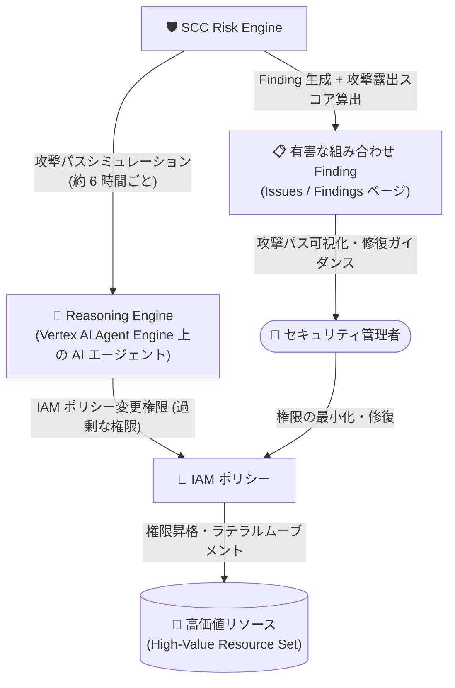

# Security Command Center: Risk Engine による Reasoning Engine の有害な組み合わせ (Toxic Combination) 検出

**リリース日**: 2026-09-28

**サービス**: Security Command Center

**機能**: Risk Engine による Reasoning Engine (AI エージェント) の IAM ポリシー変更・ラテラルムーブメント検出

**ステータス**: 一般提供 (GA)

📊 [このアップデートのインフォグラフィックを見る](https://takech9203.github.io/google-cloud-news-summary/20260928-scc-risk-engine-reasoning-engine-toxic-combinations.html)

## 概要

Security Command Center (SCC) の Risk Engine が、**IAM ポリシーを変更でき、かつラテラルムーブメント (横方向の移動) を実行できる Reasoning Engine を検出してレポートする機能**を提供開始しました。これらの検出結果は「有害な組み合わせ (Toxic Combination)」クラスの Finding として生成されます。

Reasoning Engine は Vertex AI Agent Engine 上にデプロイされる AI エージェントのリソース (`aiplatform.googleapis.com/ReasoningEngine`) です。AI エージェントは IAM プリンシパルとして Google Cloud リソースへのアクセス権限を持つため、過剰な権限が付与されたエージェントは、IAM ポリシーの改変や他のサービスアカウントへの権限昇格を通じて、高価値リソースへの攻撃経路となり得ます。今回のアップデートにより、こうした AI エージェント起点のリスクが Risk Engine の攻撃パスシミュレーションで自動的に可視化されるようになりました。

企業での AI エージェント活用が急速に拡大する中、エージェントのアイデンティティと権限の管理はセキュリティ運用の新たな課題となっています。本機能は、SCC の Premium サービスティアを利用し、Vertex AI Agent Engine 上でエージェントを運用する組織のセキュリティチームにとって重要なアップデートです。

**アップデート前の課題**

- Reasoning Engine (AI エージェント) に付与された IAM 権限が過剰かどうか、およびそれが高価値リソースへの攻撃経路を形成するかどうかを、Risk Engine で自動検出する手段がなかった
- AI エージェントの権限昇格やラテラルムーブメントのリスク評価には、IAM ポリシーの手動レビューが必要だった
- AI エージェント起点の攻撃経路が、他の脆弱性・構成ミスと組み合わさって生じるリスクとして統合的に評価されていなかった

**アップデート後の改善**

- IAM ポリシーを変更でき、かつラテラルムーブメントを実行できる Reasoning Engine が Risk Engine により自動的に検出され、有害な組み合わせ Finding として報告されるようになった
- 攻撃パスシミュレーションに基づく攻撃露出スコア (Attack Exposure Score) により、AI エージェント起点のリスクの深刻度を定量的に優先順位付けできるようになった
- 攻撃パスの可視化により、エージェントから高価値リソースに至る経路と修復ポイントを特定しやすくなった

## アーキテクチャ図

Risk Engine は攻撃パスシミュレーションを通じて、IAM ポリシーを変更できる Reasoning Engine から高価値リソースへ至る攻撃経路を検出し、有害な組み合わせ Finding として報告します。管理者は攻撃パスの可視化と修復ガイダンスに基づいて権限を最小化できます。

## サービスアップデートの詳細

### 主要機能

1. **Reasoning Engine の有害な組み合わせ検出**
   - IAM ポリシーを変更でき、かつラテラルムーブメントを実行できる Reasoning Engine を Risk Engine が検出
   - 検出結果は「有害な組み合わせ (Toxic Combination)」クラスの Finding として生成される
   - 有害な組み合わせは、複数のセキュリティ課題が特定のパターンで組み合わさることで、高価値リソースへの攻撃経路を形成する状態を指す

2. **攻撃露出スコアによる優先順位付け**
   - 検出された有害な組み合わせごとに攻撃露出スコア (Toxic Combination Score) が算出される
   - スコアが 10 以上の場合は重大度 Critical、10 未満の場合は High が割り当てられる
   - スコアは、露出する高価値リソースの数・優先度と、攻撃者が経路を悪用して到達できる可能性から算出される

3. **攻撃パスの可視化と自動クローズ**
   - 有害な組み合わせが形成する攻撃パスを視覚的に表示し、経路上の関連リソースとセキュリティ課題を確認できる
   - 経路上の脆弱性・構成ミスを修復すると、次回のシミュレーション (約 6 時間ごとに実行) で自動的に Finding が `ACTIVE` から `INACTIVE` に変更される

## 技術仕様

### 検出の仕組み

| 項目 | 詳細 |
|------|------|
| 検出エンジン | SCC Risk Engine (攻撃パスシミュレーション) |
| Finding クラス | Toxic combination (有害な組み合わせ) |
| 検出対象 | IAM ポリシーの変更とラテラルムーブメントが可能な Reasoning Engine |
| 重大度 | Critical (攻撃露出スコア ≥ 10) / High (スコア < 10) |
| シミュレーション頻度 | 約 6 時間ごと |
| 必要なサービスティア | Premium / Enterprise (Enterprise は 2027 年 5 月 21 日に廃止予定、Premium に自動移行) |
| アクティベーション要件 | 組織レベルの有効化 (プロジェクトレベルの有効化では攻撃パスシミュレーション非対応) |
| 高価値リソースセット対応 | `aiplatform.googleapis.com/ReasoningEngine` は高価値リソースセットに追加可能 |

### 必要な IAM ロール (攻撃パス閲覧)

| ロール | 用途 |
|------|------|
| `roles/securitycenter.attackPathsViewer` | 攻撃パスの閲覧 |
| `roles/securitycenter.findingsViewer` | 有害な組み合わせなどの Finding / Issue から生成される攻撃パスの閲覧 |
| `roles/securitycenter.assetsViewer` / `roles/securitycenter.valuedResourcesViewer` | 高価値リソースの攻撃パスへのアクセス |

## 設定方法

### 前提条件

1. Security Command Center Premium (または Enterprise) サービスティアを組織レベルで有効化していること
2. 攻撃パスを閲覧するための IAM ロール (上記) が付与されていること
3. 攻撃パスシミュレーションの対象とする高価値リソースセットが定義されていること (未定義の場合はデフォルトの高価値リソースセットが使用される)

### 手順

#### ステップ 1: 有害な組み合わせ Finding の確認

Google Cloud コンソールの [Security Command Center] > [Findings] ページで、Finding クラス「Toxic combination」でフィルタします。優先度の高い有害な組み合わせは、Premium ティアでは [Risk Overview] ページおよび [Issues] ページに Issue として表示されます。

#### ステップ 2: 攻撃パスの確認と修復

1. [Issues] ページで対象の Issue を選択し、説明とエビデンスを確認する
2. Evidence ダイアグラムの [Explore full attack paths] をクリックし、Reasoning Engine から高価値リソースへの攻撃経路の全体像を確認する
3. [How to fix] のガイダンスに従い、経路上の過剰な IAM 権限や構成ミスを修復する
4. 修復後、次回の攻撃パスシミュレーション (約 6 時間ごと) で経路の消滅が確認されると、Finding は自動的に `INACTIVE` になる

#### ステップ 3: Reasoning Engine を高価値リソースセットに追加 (任意)

[Security Command Center] > [設定] > [Attack path simulations] タブ、または Security Command Center API の `resourceValueConfigs` で、`aiplatform.googleapis.com/ReasoningEngine` を高価値リソースセットに追加し、AI エージェント自体を保護対象として優先度を設定できます。

## メリット

### ビジネス面

- **AI エージェント導入リスクの可視化**: AI エージェントの活用拡大に伴う権限管理リスクを定量的に把握でき、ガバナンスを維持しながらエージェント導入を推進できる
- **修復作業の優先順位付け**: 攻撃露出スコアに基づき、最もリスクの高い AI エージェント関連の問題から対処できる

### 技術面

- **自動検出と自動クローズ**: 手動の IAM ポリシーレビューに頼らず、約 6 時間ごとのシミュレーションで検出・修復確認が自動化される
- **攻撃パスの文脈付き分析**: 単一の権限設定ではなく、複数のセキュリティ課題の組み合わせとして高価値リソースへの実際の攻撃経路を評価できる
- **既存の SCC 運用フローに統合**: 有害な組み合わせは既存の Issues / Findings ページ、リスクレポートで一元的に管理できる

## デメリット・制約事項

### 制限事項

- SCC Premium または Enterprise サービスティアが必要 (Standard ティアでは利用不可)
- 攻撃パスシミュレーションは組織レベルの有効化が必要で、プロジェクトレベルの有効化では利用できない
- 攻撃パスの表示にはコンソールビューを組織に設定する必要がある (プロジェクト / フォルダビューではスコアのみ表示)
- 組織のアクティブな Finding が 2 億 5,000 万件、アクティブなアセットが 2,600 万件を超える場合、攻撃パスシミュレーションは実行されない

### 考慮すべき点

- 有害な組み合わせ Finding の修復は、Finding 自体ではなく攻撃パス上の根本原因 (過剰な IAM 権限、構成ミスなど) を修復する必要がある
- リスクを許容する場合は Finding をミュートすることで既定のビューから除外できるが、Finding 自体はアクティブなまま残る
- エージェントの権限を最小化する際は、エージェントの正常動作に必要な権限まで削除しないよう影響範囲の確認が必要

## ユースケース

### ユースケース 1: 本番環境の AI エージェントの権限監査

**シナリオ**: Vertex AI Agent Engine 上で複数の業務エージェントを運用しており、開発時に付与した広範な IAM 権限がそのまま残っている可能性がある。

**効果**: Risk Engine が IAM ポリシー変更とラテラルムーブメントが可能なエージェントを自動検出し、攻撃露出スコア付きで報告する。セキュリティチームは手動監査なしに、最も危険な権限設定から優先的に是正できる。

### ユースケース 2: 高価値データへの AI エージェント経由の攻撃経路遮断

**シナリオ**: BigQuery データセットや Cloud Storage バケットを高価値リソースセットに登録している組織で、AI エージェントを経由した権限昇格による情報漏えいリスクを排除したい。

**効果**: エージェントから高価値リソースに至る攻撃パスが可視化され、経路上のチョークポイントを特定して効率的に遮断できる。修復後はシミュレーションにより自動的に Finding がクローズされ、対応完了を確認できる。

## 料金

有害な組み合わせの検出 (Risk Engine) は Security Command Center の Premium および Enterprise サービスティアで利用できます。追加の従量課金は発表されていません。詳細は料金ページを参照してください。

- [Security Command Center の料金](https://cloud.google.com/security-command-center/pricing)

## 関連サービス・機能

- **Vertex AI Agent Engine (Reasoning Engine)**: 検出対象となる AI エージェントのホスティング基盤。エージェントは `aiplatform.googleapis.com/ReasoningEngine` リソースとしてデプロイされる
- **Identity and Access Management (IAM)**: 有害な組み合わせの根本原因となる権限設定。修復はエージェントに付与された IAM ロールの最小化が中心となる
- **エージェント アイデンティティ (Agent Identity)**: SPIFFE ベースのエージェント固有 ID。エージェントを IAM プリンシパルとして最小権限で管理するための基盤
- **IAM Policy Intelligence (ラテラルムーブメント分析)**: サービスアカウント間の権限借用によるラテラルムーブメントのリスクを分析する補完機能
- **Sensitive Data Protection**: データの機密性分類に基づき、高価値リソースの優先度を自動設定する連携機能

## 参考リンク

- 📊 [インフォグラフィック](https://takech9203.github.io/google-cloud-news-summary/20260928-scc-risk-engine-reasoning-engine-toxic-combinations.html)
- [公式リリースノート](https://docs.cloud.google.com/release-notes#September_28_2026)
- [有害な組み合わせとチョークポイントの概要](https://docs.cloud.google.com/security-command-center/docs/toxic-combinations-overview)
- [有害な組み合わせとチョークポイントの管理](https://docs.cloud.google.com/security-command-center/docs/toxic-combinations-manage)
- [Risk Engine の機能サポート](https://docs.cloud.google.com/security-command-center/docs/attack-exposure-supported-features)
- [攻撃露出スコアと攻撃パス](https://docs.cloud.google.com/security-command-center/docs/attack-exposure-learn)
- [料金ページ](https://cloud.google.com/security-command-center/pricing)

## まとめ

AI エージェントが IAM プリンシパルとして稼働する時代において、エージェントの過剰権限は権限昇格とラテラルムーブメントの新たな起点となります。本アップデートにより、Vertex AI Agent Engine 上の Reasoning Engine 起点の攻撃経路が Risk Engine で自動検出・スコアリングされるようになりました。SCC Premium を利用中で AI エージェントを運用している組織は、Findings ページで「Toxic combination」クラスの Finding を確認し、検出されたエージェントの IAM 権限の最小化を進めることを推奨します。

---

**タグ**: #SecurityCommandCenter #RiskEngine #ToxicCombination #VertexAI #AgentEngine #ReasoningEngine #IAM #AIセキュリティ #攻撃パス分析
