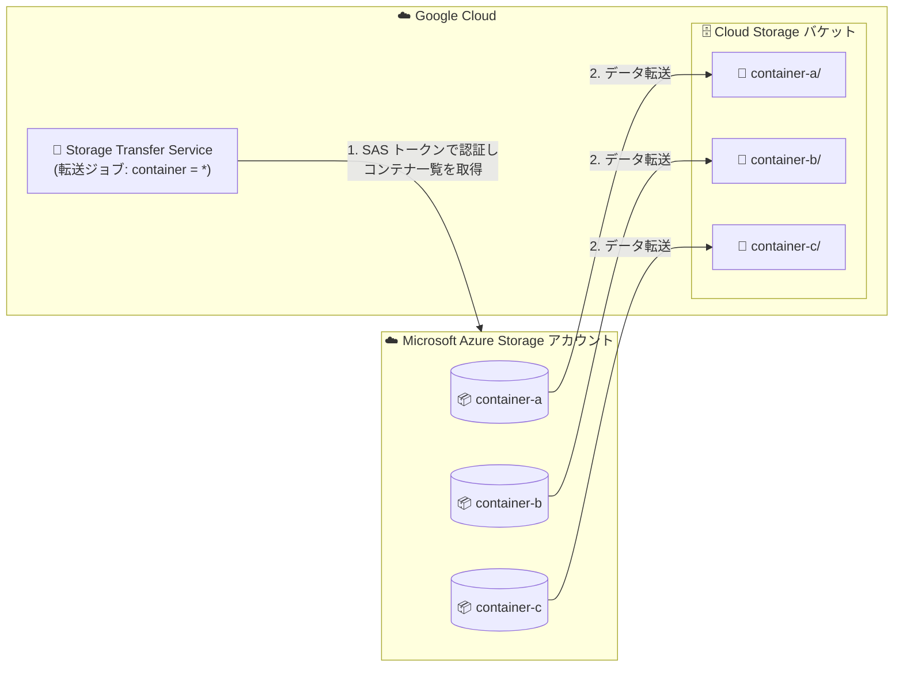

# Storage Transfer Service: Azure Storage アカウント内の複数コンテナを単一ジョブで転送可能に

**リリース日**: 2026-09-28

**サービス**: Storage Transfer Service

**機能**: Azure Storage アカウント内の全コンテナの一括転送

**ステータス**: 提供開始 (Feature)

📊 [このアップデートのインフォグラフィックを見る](https://takech9203.github.io/google-cloud-news-summary/20260928-storage-transfer-service-azure-multi-container.html)

## 概要

Storage Transfer Service が、Microsoft Azure Storage アカウント内の複数のコンテナからのデータ転送を、単一の転送ジョブで実行できるようになりました。転送ジョブの作成時にソースコンテナとしてワイルドカード `*` を指定すると、Storage Transfer Service がまず Azure に問い合わせてストレージアカウント内の全コンテナの最新リストを取得し、見つかった各コンテナに対応するフォルダを転送先 (Cloud Storage バケット) に作成して、コンテナのデータをそのフォルダに転送します。

この機能は、複数のコンテナに分散して保存されているログの取り込みなど、ストレージアカウント全体を対象とするデータ移行・集約のワークフローを簡素化します。Azure Blob Storage から Cloud Storage へのマイグレーションや、マルチクラウド環境でのデータ統合を行う組織にとって、ジョブ管理の負担を大きく軽減するアップデートです。

`includePrefixes` / `excludePrefixes` やマニフェストファイルとの組み合わせにより、転送対象のコンテナやオブジェクトを柔軟にフィルタリングすることも可能です。また、イベントドリブン転送もマルチコンテナ構成に対応しています。

**アップデート前の課題**

- 転送ジョブの作成時にはソースとして単一のコンテナ名を指定する必要があり、複数コンテナのデータを移行するにはコンテナごとに個別の転送ジョブを作成・管理する必要があった
- コンテナ数が多いストレージアカウントでは、ジョブの作成・スケジュール・監視の運用負荷が高かった
- 複数コンテナに分散したログなどを Cloud Storage に集約するワークフローが煩雑だった

**アップデート後の改善**

- ソースコンテナに `*` (ワイルドカード) を指定するだけで、ストレージアカウント内の全コンテナを単一ジョブで転送できるようになった
- ジョブ実行時に Azure から最新のコンテナリストを自動取得するため、コンテナの追加にも自動で追従できる
- コンテナごとに転送先バケット内へ対応するフォルダが自動作成され、コンテナ構造が転送先でも維持される
- プレフィックスフィルタ (`container-b/logs/2025/` や `*/logs/2025/` など) により、コンテナ単位・パス単位の柔軟な絞り込みが可能

## アーキテクチャ図



転送ジョブのソースコンテナに `*` を指定すると、Storage Transfer Service が Azure ストレージアカウント内の全コンテナを列挙し、コンテナごとに対応するフォルダを Cloud Storage バケットに作成してデータを転送します。

## サービスアップデートの詳細

### 主要機能

1. **ワイルドカードによる全コンテナ指定**
   - REST API の `AzureBlobStorageData` オブジェクトで `"container": "*"` を指定
   - gcloud CLI ではソースを `https://AZURE_ACCOUNT_NAME.blob.core.windows.net/*` として指定
   - Google Cloud コンソールではコンテナ名フィールドに `*` を入力

2. **コンテナ構造の自動再現**
   - ジョブ実行時に Azure へ問い合わせて最新のコンテナリストを取得
   - 見つかった各コンテナに対応するフォルダを転送先に作成し、コンテナのデータをそのフォルダに転送

3. **プレフィックス・マニフェストによるフィルタリング**
   - `container` が `*` の場合、`includePrefixes` / `excludePrefixes` の各パスの最初のセグメントがコンテナ名として扱われる
   - `*/PREFIX` 形式で全コンテナ横断のプレフィックス指定が可能 (例: `*/logs/2025/`)
   - マニフェストファイル使用時は、各オブジェクトのパスをコンテナ名から始める (例: `container-a/photos/photo1.jpg`)

4. **イベントドリブン転送のサポート**
   - マルチコンテナ構成でもイベントドリブン転送が利用可能
   - パフォーマンス向上と不要なイベント処理の回避のため、Azure 側でイベントフィルタを構成し、イベントをトリガーするコンテナを指定することが推奨される

## 技術仕様

### 主な仕様と制約

| 項目 | 詳細 |
|------|------|
| ソース指定 | `container` フィールドに `*` (単一のアスタリスク) を指定 |
| 認証 | ストレージアカウントレベルの Azure SAS トークン (Allowed resource types で Service / Container / Object を選択して作成) |
| ソースフォルダ指定 | マルチコンテナ転送ではソースフォルダ・パスの指定は非サポート (代わりにプレフィックスを使用) |
| 転送先の構造 | コンテナごとに対応するフォルダを Cloud Storage バケット内に作成 |
| Azure API クォータ | Azure Storage アカウントのリクエストレート制限は通常約 20,000 リクエスト/秒。コンテナ数が非常に多い場合、制限内に収めるためにリスティング処理がスロットリングされることがある |

### REST API のリクエスト例

```json
{
  "description": "Transfer all containers from my Azure account",
  "projectId": "PROJECT_ID",
  "status": "ENABLED",
  "transferSpec": {
    "azureBlobStorageDataSource": {
      "storageAccount": "AZURE_ACCOUNT_NAME",
      "container": "*",
      "azureCredentials": {
        "sasToken": "AZURE_SAS_TOKEN"
      }
    },
    "gcsDataSink": {
      "bucketName": "GCS_BUCKET_NAME"
    }
  }
}
```

## 設定方法

### 前提条件

1. Azure Storage アカウントレベルの SAS トークンを作成する (Allowed resource types で `Service`、`Container`、`Object` を選択)
2. 転送先の Cloud Storage バケットを用意し、転送を管理するユーザーアカウントと Storage Transfer Service のサービスエージェントに必要な IAM 権限を付与する (`gcloud transfer authorize --add-missing` で自動付与可能)

### 手順

#### ステップ 1: gcloud CLI で全コンテナ転送ジョブを作成

```bash
gcloud transfer jobs create \
  https://AZURE_ACCOUNT_NAME.blob.core.windows.net/* \
  gs://GCS_BUCKET_NAME \
  --source-creds-file="PATH_TO_AZURE_SAS_FILE" \
  --project="PROJECT_ID"
```

ソース URL の末尾に `/*` を指定することで、ストレージアカウント内の全コンテナが転送対象になります。`PATH_TO_AZURE_SAS_FILE` には、アカウントレベルの SAS トークンを記載したローカルファイルのパスを指定します。

#### ステップ 2: (任意) プレフィックスで転送対象を絞り込む

```json
"transferSpec": {
  "azureBlobStorageDataSource": {
    "storageAccount": "my-azure-account",
    "container": "*"
  },
  "objectConditions": {
    "includePrefixes": [
      "container-a",
      "container-b/logs/2025/"
    ]
  }
}
```

この設定では、`container-a` の全オブジェクトと、`container-b` の `logs/2025/` 配下のオブジェクトのみが転送され、他のコンテナはスキップされます。

## メリット

### ビジネス面

- **移行プロジェクトの迅速化**: ストレージアカウント全体の移行を単一ジョブで実行でき、Azure から Google Cloud へのマイグレーション計画がシンプルになる
- **運用コストの削減**: コンテナごとのジョブ作成・監視が不要になり、転送ジョブの管理工数を削減できる

### 技術面

- **ジョブ管理の一元化**: 1 つの転送ジョブで全コンテナをカバーするため、スケジュールや通知、ログの設定が 1 か所で済む
- **動的なコンテナ追従**: ジョブ実行のたびに最新のコンテナリストを取得するため、後から追加されたコンテナも自動的に転送対象になる
- **柔軟なフィルタリング**: プレフィックスやマニフェストと組み合わせて、コンテナ単位・パス単位の細かな制御が可能

## デメリット・制約事項

### 制限事項

- マルチコンテナ転送では、ソースフォルダやパスの指定はサポートされない (プレフィックスフィルタで代替する)
- SAS トークンはストレージアカウントレベルで作成し、Allowed resource types に `Service`、`Container`、`Object` を含める必要がある
- マニフェストファイルを使用する場合、各オブジェクトのパスはコンテナ名から始める必要がある

### 考慮すべき点

- 多数のコンテナからの転送は Azure への API リクエスト数を増加させる。Azure Storage アカウントには通常約 20,000 リクエスト/秒のレート制限があり、コンテナ数が非常に多い場合はリスティング処理がスロットリングされることがある
- イベントドリブン転送を使う場合、フィルタなしではストレージアカウント内の全コンテナの更新でイベントが生成されるため、Azure 側でイベントフィルタを構成して対象コンテナを指定することが推奨される
- SAS トークンには IP 制限を含めないこと (Storage Transfer Service は複数の IP アドレスを使用するため、IP アドレス制限をサポートしない)

## ユースケース

### ユースケース 1: 複数コンテナに分散したログの Cloud Storage への集約

**シナリオ**: アプリケーションログが Azure Storage アカウント内の複数のコンテナに分散して保存されており、BigQuery での分析のために Cloud Storage へ集約したい。

**実装例**:
```json
"transferSpec": {
  "azureBlobStorageDataSource": {
    "storageAccount": "my-azure-account",
    "container": "*"
  },
  "objectConditions": {
    "includePrefixes": ["*/logs/2025/"]
  }
}
```

**効果**: 全コンテナの `logs/2025/` 配下のオブジェクトを単一ジョブで Cloud Storage に集約でき、コンテナごとのジョブ作成が不要になる。

### ユースケース 2: Azure Storage アカウント全体の Google Cloud への移行

**シナリオ**: Azure Blob Storage から Cloud Storage へのマイグレーションで、ストレージアカウント内の全コンテナ (数十〜数百個) を移行する必要がある。

**効果**: ソースに `*` を指定した 1 つの転送ジョブでアカウント全体を移行でき、コンテナ構造も転送先のフォルダとして維持される。移行期間中に追加されたコンテナも、ジョブ再実行時に自動的に転送対象となる。

## 料金

Storage Transfer Service の料金の詳細は、公式の料金ページを参照してください。

- [Storage Transfer Service の料金](https://cloud.google.com/storage-transfer/pricing)

## 関連サービス・機能

- **Cloud Storage**: 転送先として使用するオブジェクトストレージ。コンテナごとにフォルダが作成される
- **Secret Manager**: Azure の SAS トークンや Shared Key を安全に保管し、転送ジョブから参照できる
- **Cloud Monitoring / Cloud Logging**: 転送ジョブのオブジェクト数・転送量・エラーの監視、転送ログの記録に利用できる
- **BigQuery**: Cloud Storage に集約したデータの分析に活用できる

## 参考リンク

- 📊 [インフォグラフィック](https://takech9203.github.io/google-cloud-news-summary/20260928-storage-transfer-service-azure-multi-container.html)
- [公式リリースノート](https://docs.cloud.google.com/release-notes#September_28_2026)
- [Transfer all containers in an Azure Storage account](https://docs.cloud.google.com/storage-transfer/docs/create-transfers/agentless/azure-all-containers)
- [Configure access to a source: Microsoft Azure Storage](https://docs.cloud.google.com/storage-transfer/docs/source-microsoft-azure)
- [Event-driven transfers from Azure Blob Storage](https://docs.cloud.google.com/storage-transfer/docs/event-driven-azure)
- [料金ページ](https://cloud.google.com/storage-transfer/pricing)

## まとめ

Storage Transfer Service が Azure Storage アカウント内の全コンテナを単一の転送ジョブで転送できるようになり、複数コンテナにまたがるデータ移行・ログ集約のワークフローが大幅に簡素化されました。Azure から Google Cloud への移行やマルチクラウドでのデータ統合を検討している場合は、ソースコンテナに `*` を指定するだけで利用できるため、既存のコンテナ単位のジョブ構成の見直しをおすすめします。コンテナ数が多い場合は Azure API のレート制限とイベントフィルタの構成に留意してください。

---

**タグ**: #StorageTransferService #CloudStorage #Azure #マルチクラウド #データ移行
