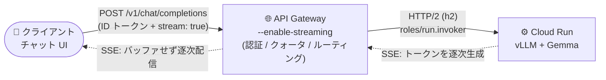

# API Gateway: LLM レスポンスなどのストリーミング構成 (Public Preview)

**リリース日**: 2026-09-29

**サービス**: API Gateway

**機能**: ストリーミング対応ゲートウェイ (LLM レスポンスストリーミング)

**ステータス**: Public Preview

📊 [このアップデートのインフォグラフィックを見る](https://takech9203.github.io/google-cloud-news-summary/20260929-api-gateway-llm-response-streaming.html)

## 概要

API Gateway で、リクエストとレスポンスをバッファリングせずにストリーミングするゲートウェイを作成できるようになりました (Public Preview)。ゲートウェイ作成時に `--enable-streaming` フラグを指定することで、長時間接続の維持とチャンク単位のデータ転送 (リクエスト・レスポンス双方向) が可能になります。

対応するストリーミング方式は、HTTP/2 (DATA フレーム) または HTTP/1.1 チャンク転送エンコーディングによる増分レスポンス配信、Server-Sent Events (SSE)、WebSockets、gRPC 双方向ストリーミングの 4 種類です。代表的なユースケースは大規模言語モデル (LLM) のトークン単位のレスポンスストリーミングで、モデルが回答を生成している最中からクライアントにテキストを表示できます。公式ドキュメントには、Cloud Run 上で vLLM がサービングする Gemma モデルのレスポンスを SSE でストリーミングする完全な手順が掲載されています。

なお、ストリーミングモードはゲートウェイ作成時に固定され、作成後に変更することはできません。既存ゲートウェイでストリーミングを利用するには、新しいゲートウェイを作成する必要があります。

**アップデート前の課題**

- API Gateway はリクエスト・レスポンスをバッファリングして処理するため、LLM のトークン単位のレスポンスなど、生成中のデータを逐次クライアントへ届けることができなかった
- SSE、WebSockets、gRPC 双方向ストリーミングといった長時間接続・逐次配信型のプロトコルをゲートウェイ経由で提供できず、LLM バックエンドなどはゲートウェイを迂回して公開する必要があった

**アップデート後の改善**

- `--enable-streaming` フラグ付きでゲートウェイを作成するだけで、バッファリングなしのストリーミング転送が有効になった
- HTTP/2・HTTP/1.1 チャンク転送、SSE、WebSockets、gRPC 双方向ストリーミングの 4 方式に対応し、LLM のトークン単位配信をゲートウェイの認証・管理機能 (ID トークン認証、API キー、クォータ) と組み合わせられるようになった
- `deadline` フィールドにより、ストリーミング対応ゲートウェイでは最大 3,600 秒までの長時間リクエストを構成できるようになった

## アーキテクチャ図



ストリーミング対応ゲートウェイを Cloud Run 上の vLLM (Gemma モデル) の前段に配置した構成です。バックエンドが生成するトークンを SSE でバッファリングせずにクライアントへ逐次配信し、認証やクォータなどの API 管理機能はゲートウェイで一元的に適用します。

## サービスアップデートの詳細

### 主要機能

1. **4 種類のストリーミングプロトコル対応**
   - 増分レスポンス配信: クライアントとのネゴシエーションに応じて HTTP/2 DATA フレームまたは HTTP/1.1 チャンク転送エンコーディングで配信
   - Server-Sent Events (SSE): サーバーからクライアントへの単方向ストリーミング
   - WebSockets: 単一 TCP 接続上の全二重通信
   - gRPC 双方向ストリーミング: gRPC による全二重ストリーミング

2. **ゲートウェイ作成時のストリーミング指定**
   - `gcloud api-gateway gateways create` に `--enable-streaming` フラグを付与して有効化
   - フラグを省略した場合は、API 構成とプラットフォームデフォルトからモードが解決される (Model Router を構成した API config は常にストリーミングゲートウェイになる)
   - 明示的に無効化するフラグは存在せず、実際のモードは出力専用フィールド `effectiveStreamingMode` で確認する

3. **ストリーム deadline の構成**
   - OpenAPI 仕様の `deadline` フィールドでリクエストの実行時間を制御
   - ストリーミング対応ゲートウェイでは最大 3,600 秒まで設定可能

## 技術仕様

### Gateway リソースのストリーミング関連フィールド

| フィールド | 属性 | 値 |
|------|------|------|
| `streamingMode` | String (IMMUTABLE, OPTIONAL) | `STREAMING_MODE_UNSPECIFIED` (デフォルト: サービスがモードを選択) / `STREAMING_MODE_ENABLED` |
| `effectiveStreamingMode` | String (OUTPUT_ONLY) | `EFFECTIVE_STREAMING_MODE_DISABLED` / `EFFECTIVE_STREAMING_MODE_ENABLED` |

### バックエンドプロトコルの要件

| ストリーミング方式 | バックエンドプロトコル |
|------|------|
| gRPC | HTTP/2 (`h2`) 必須 |
| WebSockets | `http/1.1` 必須 (`Connection: Upgrade` ハンドシェイクのため) |
| SSE / 増分レスポンス配信 | HTTP/1.1 または HTTP/2 (パフォーマンス面から `h2` 推奨) |

### タイムアウトの挙動 (`deadline`)

| 方式 | アイドルタイムアウト (メッセージ間の最大間隔) | リクエストタイムアウト (リクエスト全体の最大時間) |
|------|------|------|
| 非ストリーミング | 適用なし | デフォルト 15 秒。`deadline` で変更可、ストリーミング対応ゲートウェイでは最大 3,600 秒 |
| HTTP ストリーミング (SSE、チャンク転送) | 事実上無制限 (リクエストタイムアウトのみでストリームが終了) | デフォルト 15 秒。`deadline` で変更可、最大 3,600 秒 |
| gRPC / WebSockets ストリーミング | デフォルト 300 秒。`deadline` で変更可、最大 3,600 秒 (WebSockets では 300 秒未満の指定は無視され 300 秒が下限) | 常に 3,600 秒 (変更不可) |

**注意**: gRPC・WebSockets 以外のデフォルトは 15 秒と短く、`deadline` を超えるとデータ送信中でもストリームが切断されるため、ストリーミングエンドポイントには必ず `deadline` を明示的に設定する必要があります。また、バックエンド側のリクエストタイムアウトは `deadline` では変更されません (例: Cloud Run のデフォルト 300 秒のままでは 5 分でストリームが閉じるため、`--timeout 3600` などの設定が必要)。

### OpenAPI 3.x でのバックエンド構成例

```yaml
x-google-api-management:
  backends:
    gemma:
      address: https://my-gemma-service.run.app
      protocol: h2  # WebSockets の場合は 'http/1.1'
      deadline: 3600.0
x-google-backend: gemma
```

## 設定方法

### 前提条件

1. バックエンドサービスが必要なプロトコル (HTTP/2 や WebSockets など) をサポートしていること
2. OpenAPI 仕様でバックエンドの `protocol` と `deadline` を適切に構成していること

### 手順

#### ステップ 1: ストリーミング対応ゲートウェイの作成

```bash
gcloud api-gateway gateways create GATEWAY_ID \
    --api=API_ID \
    --api-config=CONFIG_ID \
    --location=GCP_REGION \
    --enable-streaming
```

`--enable-streaming` フラグでストリーミングモードを指定します。REST API の場合はリクエストボディで `"streamingMode": "STREAMING_MODE_ENABLED"` を指定します。

#### ステップ 2: ストリーミングが有効か確認

```bash
gcloud api-gateway gateways describe GATEWAY_ID \
    --location=GCP_REGION
```

出力の `effectiveStreamingMode` フィールドが `EFFECTIVE_STREAMING_MODE_ENABLED` であればストリーミングが有効です。

## メリット

### ビジネス面

- **LLM アプリケーションの UX 向上**: モデルの回答生成中からトークン単位でテキストを表示でき、体感レイテンシを大幅に削減できる
- **API 管理の一元化**: これまでゲートウェイを迂回する必要があったストリーミング型バックエンドにも、認証・API キー・クォータといった API 管理機能を適用できる

### 技術面

- **多様なプロトコルサポート**: SSE、WebSockets、gRPC 双方向ストリーミング、HTTP チャンク転送を単一のゲートウェイでカバー
- **長時間接続への対応**: `deadline` により最大 3,600 秒のストリーミング接続を構成可能
- **既存ワークフローとの親和性**: OpenAPI 仕様と gcloud CLI という既存の API Gateway の構成方法をそのまま利用できる

## デメリット・制約事項

### 制限事項 (Public Preview 時点)

- **イミュータブル**: 既存ゲートウェイのストリーミングモードは変更不可。有効化するには新しいゲートウェイの作成が必要
- **ホスト名形式の変更**: ストリーミング対応ゲートウェイは `{gateway_id}-{project_number}.{region}.gateway.dev` という非ストリーミングとは異なるホスト名形式になり、クライアントや DNS レコードの更新が必要。先頭ラベルは DNS の 63 文字制限に収まる必要があり、プロジェクト番号が 14 桁以上の場合は短いゲートウェイ ID が必要
- **Terraform 非対応**: Terraform でのストリーミング有効化は未サポート (将来リリースで対応予定)
- **ロードバランシング・カスタムドメイン非対応**: `EFFECTIVE_STREAMING_MODE_ENABLED` のゲートウェイは HTTP(S) Load Balancing や Serverless NEG と互換性がなく、それらに依存するカスタムドメインも Public Preview 中は利用不可
- **MCP エンドポイントは非ストリーミング**: `--enable-streaming` を指定しても Model Context Protocol (MCP) のレスポンスは単一の `application/json` ボディのまま

### 考慮すべき点

- SSE・チャンク転送のデフォルト `deadline` は 15 秒と短いため、ストリーミングエンドポイントごとに明示的な設定が必須
- バックエンド側のタイムアウト (Cloud Run の `--timeout` など) は `deadline` とは独立して接続を終了させるため、両方の整合を取る必要がある

## ユースケース

### ユースケース 1: Cloud Run 上の LLM (vLLM + Gemma) のレスポンスストリーミング

**シナリオ**: Cloud Run 上で vLLM がサービングする Gemma モデルの OpenAI 互換 API (`/v1/chat/completions`) を、認証付きのストリーミングゲートウェイ経由で公開する。

**実装例**:
```bash
# ゲートウェイのサービスアカウントに Cloud Run Invoker を付与
gcloud run services add-iam-policy-binding SERVICE_NAME \
    --region=REGION \
    --member=serviceAccount:SERVICE_ACCOUNT_EMAIL \
    --role=roles/run.invoker

# API config を作成 (バックエンド認証用サービスアカウントを指定)
gcloud api-gateway api-configs create CONFIG_ID \
    --api=API_ID \
    --openapi-spec=gemma-api.yaml \
    --backend-auth-service-account=SERVICE_ACCOUNT_EMAIL

# ストリーミングゲートウェイを作成
gcloud api-gateway gateways create GATEWAY_ID \
    --api=API_ID \
    --api-config=CONFIG_ID \
    --location=GCP_REGION \
    --enable-streaming
```

**効果**: モデルが生成するトークンを SSE でリアルタイムにクライアントへ配信しつつ、Google ID トークンによる認証でバックエンドへのアクセスを制御できる。API キーやクォータを組み合わせることで、GPU コストを消費するリクエストの制限も可能。

### ユースケース 2: gRPC 双方向ストリーミング API の公開

**シナリオ**: チャットやリアルタイムデータ交換など、クライアントとサーバーが同時にメッセージを送り合う gRPC 双方向ストリーミング API をゲートウェイ経由で提供する。

**効果**: バックエンドを HTTP/2 (`h2`) で構成することで、全二重の gRPC ストリーミングを API Gateway の管理下で提供できる (アイドルタイムアウトは `deadline` で最大 3,600 秒まで延長可能)。

## 料金

API Gateway の料金は API 呼び出し数に基づきます。ストリーミング固有の追加料金は料金ページに記載されていません。

### 料金例 (API 呼び出し)

| 月間 API 呼び出し数 (請求先アカウントごと) | 100 万コールあたりの料金 |
|--------|-----------------|
| 0〜200 万 | $0.00 (無料) |
| 200 万〜10 億 | $3.00 |
| 10 億超 | $1.50 |

このほかにデータ転送 (下り) 料金が別途適用されます。詳細は[料金ページ](https://cloud.google.com/api-gateway/pricing)を参照してください。

## 利用可能リージョン

ゲートウェイをデプロイ可能なリージョンは公式ドキュメントの [Deploy an API to a gateway](https://docs.cloud.google.com/api-gateway/docs/deploying-api) を参照してください。

## 関連サービス・機能

- **Cloud Run**: LLM サービング (vLLM など) のバックエンドとして利用。バックエンド側の `--timeout` 設定がストリーム継続時間に影響する
- **Cloud IAM**: ゲートウェイのサービスアカウントに `roles/run.invoker` を付与してバックエンドを保護。ID トークン認証と組み合わせて利用
- **Model Router**: Model Router を構成した API config から作成されるゲートウェイは自動的にストリーミングが有効になる
- **Apigee API Management**: より高度な API 管理が必要な場合の上位サービス

## 参考リンク

- 📊 [インフォグラフィック](https://takech9203.github.io/google-cloud-news-summary/20260929-api-gateway-llm-response-streaming.html)
- [公式リリースノート](https://docs.cloud.google.com/release-notes#September_29_2026)
- [ドキュメント: Configure streaming for LLM responses and other traffic](https://docs.cloud.google.com/api-gateway/docs/streaming-configure)
- [ドキュメント: Deploy an API to a gateway](https://docs.cloud.google.com/api-gateway/docs/deploying-api)
- [料金ページ](https://cloud.google.com/api-gateway/pricing)

## まとめ

API Gateway がストリーミングに対応したことで、LLM のトークン単位レスポンス配信や WebSockets・gRPC 双方向ストリーミングを、認証・クォータといった API 管理機能と組み合わせて提供できるようになりました。ストリーミングモードは作成時に固定され、ホスト名形式やロードバランサ非対応などの Preview 制約もあるため、既存ゲートウェイからの移行は新規作成を前提に計画し、ストリーミングエンドポイントには必ず `deadline` を明示設定することを推奨します。

---

**タグ**: `API Gateway`, `ストリーミング`, `LLM`, `SSE`, `WebSockets`, `gRPC`, `Cloud Run`, `Public Preview`
