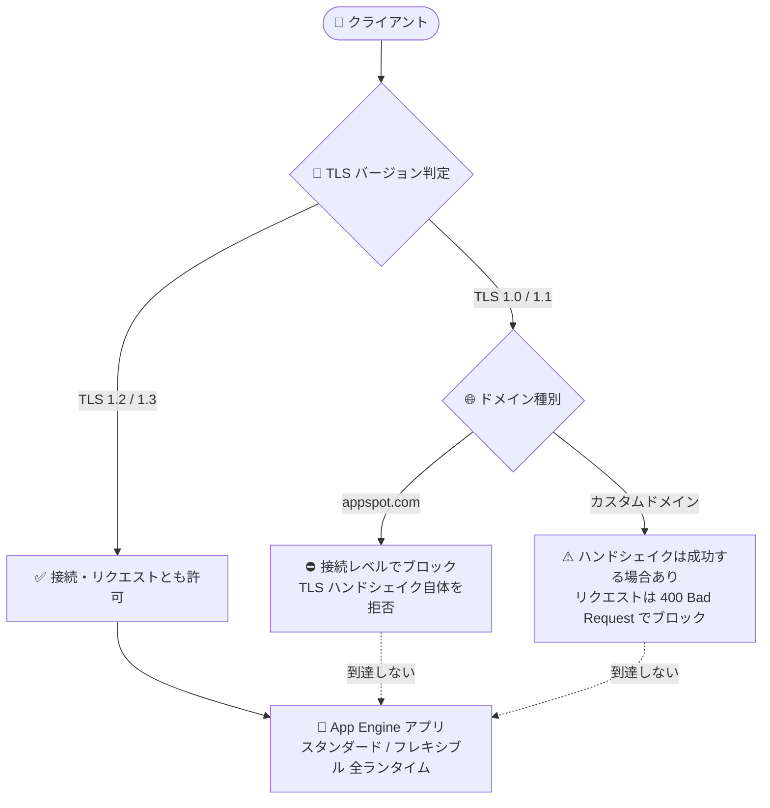

# App Engine: TLS 1.1 以前の非セキュアなトラフィックを恒久的にブロック

**リリース日**: 2026-09-29

**サービス**: App Engine (スタンダード環境・フレキシブル環境の全ランタイム)

**機能**: TLS 1.1 以前の非セキュアなトラフィックの恒久的ブロック

**ステータス**: Feature (セキュリティ強制適用)

📊 [このアップデートのインフォグラフィックを見る](https://takech9203.github.io/google-cloud-news-summary/20260929-app-engine-tls-1-1-block.html)

## 概要

App Engine は、TLS バージョン 1.1 以前を使用する非セキュアなトラフィックを**恒久的にブロック**するようになりました。この措置は、スタンダード環境 (Go、Java、Node.js、PHP、Python、Ruby) とフレキシブル環境 (.NET、Go、Java、Node.js、PHP、Python、Ruby、カスタムランタイム) のすべてのランタイムに同一に適用されます。

ブロックの挙動はドメインの種類によって異なります。`appspot.com` ドメインでは接続レベル (TLS ハンドシェイク自体) でブロックされます。一方、カスタムドメインでは TLS ハンドシェイク (接続) は成功する場合がありますが、その後のリクエストがブロックされます。この違いにより、外部の SSL チェックサイトはハンドシェイクの成功のみを確認して「TLS 1.1 以前がまだサポートされている」と誤って判定する可能性がある点に注意が必要です。

本アップデートは段階的なセキュリティ強化の最終ステップです。2025 年 8 月に TLS 1.1 以前のサポート廃止が発表され、2025 年 10 月に TLS 1.2 以降を強制する設定が GA になり、2026 年 8 月にはアプリケーションが TLS 1.2 以降へ自動オプトインされ (2026 年 8 月末までオプトアウト可能)、そして今回、恒久的なブロックが適用されました。

**アップデート前の課題**

- TLS 1.0 / 1.1 は既知の脆弱性を持つ古いプロトコルであるにもかかわらず、App Engine アプリケーションへの接続に使用できる状態が残っていた
- 2026 年 8 月時点では TLS 1.2 以降への自動オプトインが行われたものの、2026 年 8 月末までオプトアウトが可能であり、非セキュアなトラフィックを受け入れる余地があった
- アプリケーション側で TLS バージョンを強制するには、管理者が明示的に設定 (`--ssl-policy`) を行う必要があった

**アップデート後の改善**

- TLS 1.1 以前を使用するトラフィックが恒久的にブロックされ、すべての App Engine アプリケーションで最低 TLS 1.2 が保証されるようになった
- `appspot.com` ドメインでは TLS ハンドシェイクの時点で接続が拒否され、非セキュアな接続の確立自体が防止される
- 恒久的にブロックされたプロジェクトでは、設定で古い TLS バージョンに戻すことはできなくなり、組織全体でのセキュリティベースラインが強制される (TLS 1.2 以降への移行に追加の時間が必要な場合は、サポートへの問い合わせが必要)

## アーキテクチャ図



TLS 1.2 以降のトラフィックのみが App Engine アプリケーションに到達します。TLS 1.1 以前のトラフィックは、`appspot.com` ドメインでは接続レベルで、カスタムドメインではリクエストレベルでブロックされます。

## サービスアップデートの詳細

### 主要機能

1. **TLS 1.1 以前のトラフィックの恒久的ブロック**
   - App Engine は TLS 1.1 以前を使用する非セキュアなトラフィックを恒久的にブロックする
   - スタンダード環境・フレキシブル環境のすべてのランタイム (カスタムランタイム含む) に適用される
   - 恒久的にブロックされたプロジェクトでは、設定を変更して古い TLS バージョンに戻すことはできない

2. **ドメイン種別ごとのブロック挙動**
   - `appspot.com` ドメイン: TLS ハンドシェイク自体が拒否され、接続レベルでブロックされる
   - カスタムドメイン: TLS ハンドシェイクは成功する場合があるが、リクエストが `400 Bad Request - The request was malformed` エラーでブロックされる (接続は確立されるがリクエストは拒否される)

3. **新規アプリケーションのデフォルト動作**
   - 新規アプリケーションでは、デフォルトで TLS 1.2 以降とサポート対象の暗号スイートによるセキュアなトラフィックのみが許可される
   - デフォルトの暗号スイートで十分な場合、外部アプリケーションロードバランサの構成は不要

4. **移行猶予のためのサポート窓口**
   - プロジェクトが TLS 1.1 以前から恒久的にブロックされ、TLS 1.2 以降への切り替えに追加の時間が必要な場合は、Google Cloud サポートへの問い合わせが必要

## 技術仕様

### サポートされる TLS バージョンと暗号スイート

| TLS バージョン | IANA 値 | 暗号スイート |
|------|------|------|
| TLS v1.3 | 0x1301 | TLS_AES_128_GCM_SHA256 |
| TLS v1.3 | 0x1302 | TLS_AES_256_GCM_SHA384 |
| TLS v1.3 | 0x1303 | TLS_CHACHA20_POLY1305_SHA256 |
| TLS v1.2 | 0xCCA9 | TLS_ECDHE_ECDSA_WITH_CHACHA20_POLY1305_SHA256 |
| TLS v1.2 | 0xCCA8 | TLS_ECDHE_RSA_WITH_CHACHA20_POLY1305_SHA256 |
| TLS v1.2 | 0xC02B | TLS_ECDHE_ECDSA_WITH_AES_128_GCM_SHA256 |
| TLS v1.2 | 0xC02F | TLS_ECDHE_RSA_WITH_AES_128_GCM_SHA256 |
| TLS v1.2 | 0xC02C | TLS_ECDHE_ECDSA_WITH_AES_256_GCM_SHA384 |
| TLS v1.2 | 0xC030 | TLS_ECDHE_RSA_WITH_AES_256_GCM_SHA384 |
| TLS v1.2 | 0xC009 | TLS_ECDHE_ECDSA_WITH_AES_128_CBC_SHA |
| TLS v1.2 | 0xC013 | TLS_ECDHE_RSA_WITH_AES_128_CBC_SHA |
| TLS v1.2 | 0xC00A | TLS_ECDHE_ECDSA_WITH_AES_256_CBC_SHA |
| TLS v1.2 | 0xC014 | TLS_ECDHE_RSA_WITH_AES_256_CBC_SHA |

### これまでの経緯 (リリースノートより)

| 時期 | 内容 |
|------|------|
| 2025-08-07 | TLS 1.1 以前のサポート廃止を発表。TLS 1.2 以降を使用するようアプリケーション設定の更新を案内 (Preview) |
| 2025-10-20 | TLS 1.2 以降とセキュアな暗号スイートのサポートが GA |
| 2026-08-14 | App Engine がアプリケーションを TLS 1.2 以降に自動オプトイン (2026 年 8 月末までオプトアウト可能)。2026 年 9 月以降に恒久ブロックの可能性を告知 |
| 2026-09-29 | TLS 1.1 以前の非セキュアなトラフィックを恒久的にブロック (本アップデート) |

## 設定方法

### 前提条件

1. Google Cloud CLI (`gcloud`) がインストールされていること
2. 対象の App Engine アプリケーションに対する更新権限があること

### 手順

#### ステップ 1: 最低 TLS バージョンの明示的な設定

`--ssl-policy` フラグで最低許可 TLS バージョンを指定します。

```bash
# アプリ作成時に最低 TLS バージョンを設定
gcloud app create --ssl-policy=TLS_VERSION_1_2

# 既存アプリの最低 TLS バージョンを更新
gcloud app update --ssl-policy=TLS_VERSION_1_2
```

`TLS_VERSION_1_2` を指定すると、TLS 1.2 以降とモダンな暗号スイートのみが許可されます。なお、恒久的にブロックされたプロジェクトでは、この設定を使用して古い TLS バージョンに戻すことはできません。

#### ステップ 2 (任意): ロードバランサによる TLS 制御の強化

カスタムドメインで接続レベル (ハンドシェイク) での拒否が必要な場合や、異なる暗号スイートセットが必要な場合は、グローバル外部アプリケーションロードバランサとサーバーレス NEG を構成し、SSL ポリシーで TLS バージョンや暗号スイートを制御します。

```bash
# 例: SSL ポリシーの作成 (最低 TLS 1.2、MODERN プロファイル)
gcloud compute ssl-policies create my-ssl-policy \
    --profile=MODERN \
    --min-tls-version=1.2
```

## メリット

### ビジネス面

- **コンプライアンス対応**: 既知の脆弱性を持つ TLS 1.0 / 1.1 が排除されることで、PCI DSS などモダンな TLS を要求するセキュリティ基準への準拠が容易になる
- **運用負荷ゼロのセキュリティ強化**: プラットフォーム側で強制されるため、アプリケーションごとの個別対応や監視が不要

### 技術面

- **セキュリティベースラインの保証**: すべての App Engine アプリケーションで最低 TLS 1.2 とセキュアな暗号スイートが保証される
- **接続レベルの防御 (appspot.com)**: 非セキュアな接続はハンドシェイク段階で拒否され、アプリケーションに到達しない

## デメリット・制約事項

### 制限事項

- 恒久的にブロックされたプロジェクトでは、`--ssl-policy` 設定を使用して古い TLS バージョンに戻すことはできない (追加の移行時間が必要な場合はサポートへの問い合わせが必要)
- カスタムドメインでは TLS ハンドシェイク自体は成功する場合があり、接続レベル (ハンドシェイク) での拒否が必要な場合はグローバル外部アプリケーションロードバランサの構成が必要
- デフォルトと異なる暗号スイートセットが必要な場合も、グローバル外部アプリケーションロードバランサと SSL ポリシーの利用が推奨される

### 考慮すべき点

- TLS 1.0 / 1.1 のみに対応する古いクライアント (レガシーな組み込み機器、古い OS / ブラウザ、古い HTTP ライブラリなど) からのアクセスは失敗するため、クライアント側の TLS 対応状況の確認が必要
- カスタムドメインではリクエストが `400 Bad Request` で失敗するため、クライアント側では TLS エラーではなく HTTP エラーとして観測される点に注意
- 外部の SSL チェックサイトはハンドシェイクの成功のみを検証し、カスタムドメインで「TLS 1.1 以前がサポートされている」と誤って報告する可能性がある

## ユースケース

### ユースケース 1: レガシークライアントの影響調査と移行

**シナリオ**: カスタムドメインで公開している App Engine アプリケーションに、古い組み込み機器やレガシーシステムからのアクセスがある。TLS 1.1 以前のクライアントは `400 Bad Request` で失敗するようになるため、影響範囲を特定し、クライアント側を TLS 1.2 以降へ更新する。

**実装例**:
```bash
# TLS 1.2 での接続確認 (成功するはず)
curl -v --tls-max 1.2 --tlsv1.2 https://YOUR_APP.appspot.com/

# TLS 1.1 での接続確認 (appspot.com ではハンドシェイクが失敗するはず)
curl -v --tls-max 1.1 https://YOUR_APP.appspot.com/
```

**効果**: 恒久ブロックによる影響を事前に把握し、レガシークライアントの計画的な更新につなげられる。

### ユースケース 2: カスタムドメインでの接続レベル拒否の実現

**シナリオ**: セキュリティ要件として、カスタムドメインでも TLS 1.1 以前をハンドシェイク段階で拒否したい (リクエストレベルの 400 エラーでは不十分)。

**実装例**: グローバル外部アプリケーションロードバランサ + サーバーレス NEG で App Engine にルーティングし、SSL ポリシー (`--min-tls-version=1.2`) を適用する。

**効果**: カスタムドメインでも接続レベルで非セキュアな TLS バージョンを拒否でき、暗号スイートの細かな制御も可能になる。

## 料金

このアップデート自体に追加料金はありません。App Engine の料金体系に変更はありません。なお、カスタムドメインで接続レベルの拒否や暗号スイートのカスタマイズのためにグローバル外部アプリケーションロードバランサを構成する場合は、Cloud Load Balancing の料金が別途発生します。

- [App Engine の料金](https://cloud.google.com/appengine/pricing)
- [Cloud Load Balancing の料金](https://cloud.google.com/vpc/network-pricing)

## 利用可能リージョン

すべての App Engine アプリケーション (スタンダード環境・フレキシブル環境の全ランタイム) に適用されます。

## 関連サービス・機能

- **Cloud Load Balancing (グローバル外部アプリケーションロードバランサ)**: サーバーレス NEG 経由で App Engine にルーティングし、SSL ポリシーで TLS バージョン・暗号スイートを接続レベルで制御できる
- **SSL ポリシー**: ロードバランサで許可する TLS バージョンと暗号スイートのプロファイルを定義する機能
- **App Engine カスタムドメインの SSL 証明書**: カスタムドメインの SSL 証明書の検証・管理。Cloud Load Balancing への移行ガイドも提供されている

## 参考リンク

- 📊 [インフォグラフィック](https://takech9203.github.io/google-cloud-news-summary/20260929-app-engine-tls-1-1-block.html)
- [公式リリースノート](https://docs.cloud.google.com/release-notes#September_29_2026)
- [Secure minimum TLS (スタンダード環境)](https://docs.cloud.google.com/appengine/docs/standard/secure-minimum-tls)
- [Secure minimum TLS (フレキシブル環境)](https://docs.cloud.google.com/appengine/docs/flexible/secure-minimum-tls)
- [SSL ポリシーの概要 (Cloud Load Balancing)](https://docs.cloud.google.com/load-balancing/docs/ssl-policies-concepts)
- [App Engine と外部アプリケーションロードバランサの構成](https://docs.cloud.google.com/load-balancing/docs/https/setting-up-https-serverless)
- [App Engine の料金](https://cloud.google.com/appengine/pricing)

## まとめ

App Engine は 2025 年からの段階的な移行プロセスを経て、TLS 1.1 以前の非セキュアなトラフィックを恒久的にブロックしました。ほとんどのモダンなクライアントには影響ありませんが、レガシークライアントからのアクセスがあるアプリケーションでは、クライアント側の TLS 1.2 以降への対応状況を早急に確認してください。カスタムドメインではブロックが 400 エラーとして観測される点、および接続レベルでの拒否が必要な場合はロードバランサの構成が必要な点に留意が必要です。

---

**タグ**: App Engine, TLS, セキュリティ, スタンダード環境, フレキシブル環境, Cloud Load Balancing, SSL ポリシー
