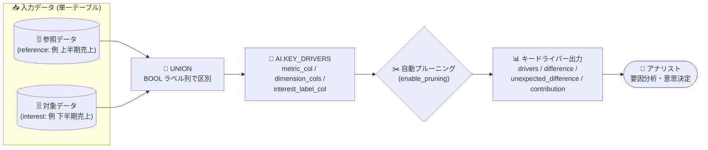

# BigQuery: AI.KEY_DRIVERS 関数が一般提供 (GA) に

**リリース日**: 2026-09-29

**サービス**: BigQuery

**機能**: AI.KEY_DRIVERS 関数 (キードライバー分析)

**ステータス**: GA (一般提供)

📊 [このアップデートのインフォグラフィックを見る](https://takech9203.github.io/google-cloud-news-summary/20260929-bigquery-ai-key-drivers-ga.html)

## 概要

BigQuery の `AI.KEY_DRIVERS` 関数が一般提供 (GA) になりました。`AI.KEY_DRIVERS` は、合計可能な指標 (summable metric) に対して統計的に有意な変化を引き起こしているデータセグメントを特定するための関数です。「売上が先月から増えたのはどの地域・どの商品カテゴリの影響か」といった、指標変動の要因分析 (キードライバー分析 / 寄与分析) を単一の SQL クエリで実行できます。

従来、BigQuery ML で同様の分析を行うには、寄与分析モデル (contribution analysis model) を `CREATE MODEL` で作成し、そのモデルに対して `ML.GET_INSIGHTS` 関数を呼び出す 2 段階の手順が必要でした。`AI.KEY_DRIVERS` はモデルの作成・管理を不要にし、簡素化された構文・高速な結果取得・冗長なインサイトの自動プルーニングを提供します。公式ドキュメントでは、ほとんどのアプリケーションで `AI.KEY_DRIVERS` の使用が推奨されています。

対象ユーザーは、データアナリスト、BI 担当者、データエンジニアなど、指標の変動要因を迅速に特定したいすべての BigQuery ユーザーです。GA となったことで、本番ワークロードでも安心して利用できるようになりました。

**アップデート前の課題**

- 指標変動の要因分析を行うには、`CREATE MODEL` で寄与分析モデルを作成してから `ML.GET_INSIGHTS` を呼び出す 2 ステップが必要で、モデルの作成・管理の手間が発生していた
- `ML.GET_INSIGHTS` はデフォルトですべてのインサイトを返すため、冗長な (重複する) インサイトを手動で取捨選択する必要があった
- `AI.KEY_DRIVERS` 関数自体は Preview (Pre-GA) 提供であり、本番利用にはサポート面の制約があった

**アップデート後の改善**

- `AI.KEY_DRIVERS` が GA となり、SLA を含む本番ワークロードでの利用が可能になった
- モデル管理が不要になり、テーブルまたはクエリ結果を直接指定した単一クエリでキードライバー分析を実行できる
- 冗長なインサイトがデフォルトで自動プルーニングされ (`enable_pruning => TRUE`)、結果の解釈が容易になった
- 寄与分析モデル + `ML.GET_INSIGHTS` と比較して、簡素な構文と高速な結果取得を実現

## アーキテクチャ図



参照 (reference) データと対象 (interest) データを含む単一テーブルを `AI.KEY_DRIVERS` に渡すと、指標変動に寄与しているセグメントが自動プルーニングされた形で返されます。モデルの作成・管理は不要です。

## サービスアップデートの詳細

### 主要機能

1. **単一クエリでのキードライバー分析**
   - テーブル名または GoogleSQL クエリを入力として、合計可能な指標に統計的に有意な変化をもたらしたセグメントを特定
   - 寄与分析モデルの作成 (`CREATE MODEL`) と `ML.GET_INSIGHTS` の呼び出しを 1 つの関数呼び出しに集約
   - モデル管理が一切不要

2. **冗長インサイトの自動プルーニング**
   - `enable_pruning` (デフォルト `TRUE`) により、指標値が等しく、ディメンションが他の行の部分集合となる冗長な行を自動的に除外 (より記述的な行を保持)
   - `min_apriori_support` (デフォルト 0.1) または `top_k` (1〜1,000,000) で出力セグメントを制御可能 (両者は併用不可)

3. **豊富な出力メトリクス**
   - `drivers`: セグメントを構成するディメンション値の配列
   - `metric_interest` / `metric_reference`: 対象・参照データそれぞれでのセグメント指標合計
   - `difference` / `relative_difference`: 差分と相対変化率
   - `unexpected_difference` / `relative_unexpected_difference`: 他セグメントの変化率から推定される期待値との乖離 (「予想外の変化」の検出)
   - `apriori_support` / `contribution`: セグメントの規模と寄与度

## 技術仕様

### 構文

```sql
AI.KEY_DRIVERS(
  { TABLE table_name | (query_statement) },
  metric_col => 'METRIC_COL',
  dimension_cols => DIMENSION_COLS,
  interest_label_col => 'INTEREST_LABEL_COL'
  [, min_apriori_support => MIN_APRIORI_SUPPORT]
  [, top_k => TOP_K]
  [, enable_pruning => ENABLE_PRUNING]
)
```

### 引数と制約

| 項目 | 詳細 |
|------|------|
| `metric_col` | 数値型列の合計可能な指標。`SUM(col)` または `col` 形式のみ。追加の数値計算 (例: `SUM(AVG(col))`) は不可。値は非負が必須 (`min_apriori_support => 0` 指定時を除く) |
| `dimension_cols` | ディメンション列の配列 (`ARRAY<STRING>`)。1〜12 列。データ型は `INT64` / `BOOL` / `STRING`。NULL を含む行は除外される (`ML.IMPUTER` や `IFNULL` での前処理を推奨) |
| `interest_label_col` | 対象 (interest) / 参照 (reference) を区別する `BOOL` 型列の名前 |
| `min_apriori_support` | [0, 1] の `FLOAT64`。閾値未満のセグメントを出力から除外。デフォルト 0.1。`top_k` と併用不可 |
| `top_k` | 1〜1,000,000 の `INT64`。apriori support 上位 K 件のインサイトのみ出力 |
| `enable_pruning` | `BOOL`。冗長インサイトの自動除外。デフォルト `TRUE` |

### AI.KEY_DRIVERS と寄与分析モデル (ML.GET_INSIGHTS) の比較

| AI.KEY_DRIVERS | 寄与分析モデル + ML.GET_INSIGHTS |
|----------------|----------------------------------|
| 最大 12 ディメンション | 12 超のディメンションをサポート |
| summable metric のみ | summable / summable by ratio / summable by category に対応 |
| デフォルトで冗長インサイトをプルーニング | デフォルトで全インサイトを返す |
| 出力のセグメント列は `drivers` | 出力のセグメント列は `contributors` |
| モデル管理不要 | モデルの作成・管理が必要 |

## 設定方法

### 前提条件

1. 分析対象のデータが単一のテーブル (またはクエリ結果) に含まれ、以下を満たすこと
   - 合計可能な数値指標列
   - 各行が対象 (interest) か参照 (reference) かを示す `BOOL` 列
   - `INT64` / `BOOL` / `STRING` 型のディメンション列
2. 偏りを避けるため、summable metric を使う場合は対象と参照の行数をおおむね同数にすることが推奨される

### 手順

#### ステップ 1: 対象データと参照データを準備する

```sql
-- 例: 2024 年上半期 (参照) と下半期 (対象) を BOOL 列で区別
WITH InputData AS (
  SELECT
    CAST(sale_dollars AS BIGNUMERIC) AS sale_dollars,
    city, category_name, vendor_name,
    (date > '2024-07-01') AS IS_H2
  FROM `bigquery-public-data.iowa_liquor_sales.sales`
  WHERE EXTRACT(YEAR FROM date) = 2024
)
SELECT 1
```

期間比較のほか、地域間比較、商品タイプ間比較、キャンペーン間比較などが可能です。別々に作成したテーブルを UNION して 1 テーブルにまとめる方法も使えます。

#### ステップ 2: AI.KEY_DRIVERS を呼び出す

```sql
SELECT * EXCEPT(city, vendor_name, category_name)
FROM AI.KEY_DRIVERS(
  TABLE InputData,
  metric_col => 'sale_dollars',
  dimension_cols => ['city', 'vendor_name', 'category_name'],
  interest_label_col => 'IS_H2',
  min_apriori_support => 0
);
```

出力の `drivers` 列に各セグメント (例: `[category_name=DIAGEO AMERICAS]`) が、`difference` や `unexpected_difference` 列に変化量が返されます。

## メリット

### ビジネス面

- **要因分析の高速化**: 「売上増減の原因はどのセグメントか」を数式やモデル構築なしに SQL 1 本で特定でき、意思決定までの時間を短縮できる
- **予想外の変化の検出**: `unexpected_difference` により、全体トレンドから乖離したセグメント (伸びが期待より小さい・大きい) を定量的に発見できる
- **GA による本番利用**: Pre-GA の制約がなくなり、本番の分析パイプラインや定常レポートに組み込める

### 技術面

- **モデル管理不要**: `CREATE MODEL` によるモデルのライフサイクル管理 (作成・更新・削除) が不要
- **簡素な構文と高速な結果**: 寄与分析モデル + `ML.GET_INSIGHTS` に比べ、シンプルな構文でより速く結果を得られる
- **自動プルーニング**: 冗長なインサイトがデフォルトで除外され、結果の解釈コストが下がる

## デメリット・制約事項

### 制限事項

- ディメンション列は最大 12 列まで (それ以上必要な場合は寄与分析モデル + `ML.GET_INSIGHTS` を使用)
- 指標は summable metric のみ対応 (比率やカテゴリ別の summable metric が必要な場合は寄与分析モデルを使用)
- 指標列の値は非負が必須 (`min_apriori_support => 0` を指定した場合を除く)
- ディメンション列に NULL を含む行は除外される (事前に `ML.IMPUTER` や `IFNULL` での補完が必要)
- `min_apriori_support` と `top_k` は併用できない

### 考慮すべき点

- summable metric 使用時は、結果の偏りを避けるため対象データと参照データの行数をほぼ同数にすることが推奨される
- `metric_col` には追加の数値計算を含められないため、必要な計算は入力クエリ側で行う必要がある

## ユースケース

### ユースケース 1: 期間比較による売上変動の要因分析

**シナリオ**: 小売業で、上半期と下半期の売上を比較し、どの都市・ベンダー・商品カテゴリが売上変動を牽引したかを特定したい。

**実装例**:
```sql
WITH InputData AS (
  SELECT CAST(sale_dollars AS BIGNUMERIC) AS sale_dollars,
         city, category_name, vendor_name,
         (date > '2024-07-01') AS IS_H2
  FROM `bigquery-public-data.iowa_liquor_sales.sales`
  WHERE EXTRACT(YEAR FROM date) = 2024
)
SELECT * FROM AI.KEY_DRIVERS(
  TABLE InputData,
  metric_col => 'sale_dollars',
  dimension_cols => ['city', 'vendor_name', 'category_name'],
  interest_label_col => 'IS_H2'
);
```

**効果**: 「全体売上は 6.3% 増だが、特定ベンダーが $6.9M の増加に寄与し、特定都市では $1.2M 減少している」といったセグメント別の寄与を即座に把握できる (公式ドキュメントの Iowa liquor sales 公開データの例より)。

### ユースケース 2: 新商品投入時の地域別インパクト分析

**シナリオ**: 新商品を投入した際、どの地域で売上が予想外に伸びた (または伸びなかった) かを特定したい。既存商品の売上を参照セット、新商品の売上を対象セットとして比較する。

**効果**: `unexpected_difference` により、他地域の変化率から期待される値との乖離が大きい地域を検出でき、マーケティング施策の重点地域を選定できる。

### ユースケース 3: キャンペーン効果のセグメント別評価

**シナリオ**: 広告キャンペーン実施前後のウェブサイトエンゲージメントを比較し、効果が大きかったユーザーセグメントを特定したい。

**効果**: キャンペーンの投資対効果をセグメント単位で定量化し、次回キャンペーンのターゲティング精度を高められる。

## 料金

`AI.KEY_DRIVERS` は BigQuery のクエリとして実行されます。個別の追加料金体系は今回の情報収集では確認できなかったため、最新の料金は公式の BigQuery 料金ページを参照してください。

- [BigQuery の料金](https://cloud.google.com/bigquery/pricing)

## 関連サービス・機能

- **寄与分析モデル (Contribution Analysis Model)**: `CREATE MODEL` + `ML.GET_INSIGHTS` による従来の分析手法。13 以上のディメンションや比率メトリクスが必要な場合はこちらを使用
- **ML.GET_INSIGHTS 関数**: 寄与分析モデルからインサイトを取得する関数。`AI.KEY_DRIVERS` はこの 2 段階処理を 1 関数に簡素化したもの
- **ML.IMPUTER 関数**: ディメンション列の NULL 値を補完する前処理に利用
- **BigQuery ML**: `AI.KEY_DRIVERS` を含む、BigQuery 上で機械学習・AI 分析を行う機能群

## 参考リンク

- 📊 [インフォグラフィック](https://takech9203.github.io/google-cloud-news-summary/20260929-bigquery-ai-key-drivers-ga.html)
- [公式リリースノート](https://docs.cloud.google.com/release-notes#September_29_2026)
- [AI.KEY_DRIVERS 関数のドキュメント](https://docs.cloud.google.com/bigquery/docs/reference/standard-sql/bigqueryml-syntax-ai-key-drivers)
- [寄与分析モデルの作成 (CREATE MODEL)](https://docs.cloud.google.com/bigquery/docs/reference/standard-sql/bigqueryml-syntax-create-contribution-analysis)
- [ML.GET_INSIGHTS 関数](https://docs.cloud.google.com/bigquery/docs/reference/standard-sql/bigqueryml-syntax-get-insights)
- [BigQuery の料金](https://cloud.google.com/bigquery/pricing)

## まとめ

`AI.KEY_DRIVERS` の GA により、指標変動の要因分析がモデル管理不要の単一 SQL クエリで本番利用できるようになりました。売上・エンゲージメントなどの変動要因を定常的に監視したいチームは、既存の寄与分析モデル + `ML.GET_INSIGHTS` ワークフローからの移行を検討する価値があります。まずは公開データセットを使った公式ドキュメントの例で、出力メトリクス (`difference` / `unexpected_difference` など) の解釈に慣れることをおすすめします。

---

**タグ**: BigQuery, BigQuery ML, AI.KEY_DRIVERS, キードライバー分析, 寄与分析, GA, データ分析, SQL
