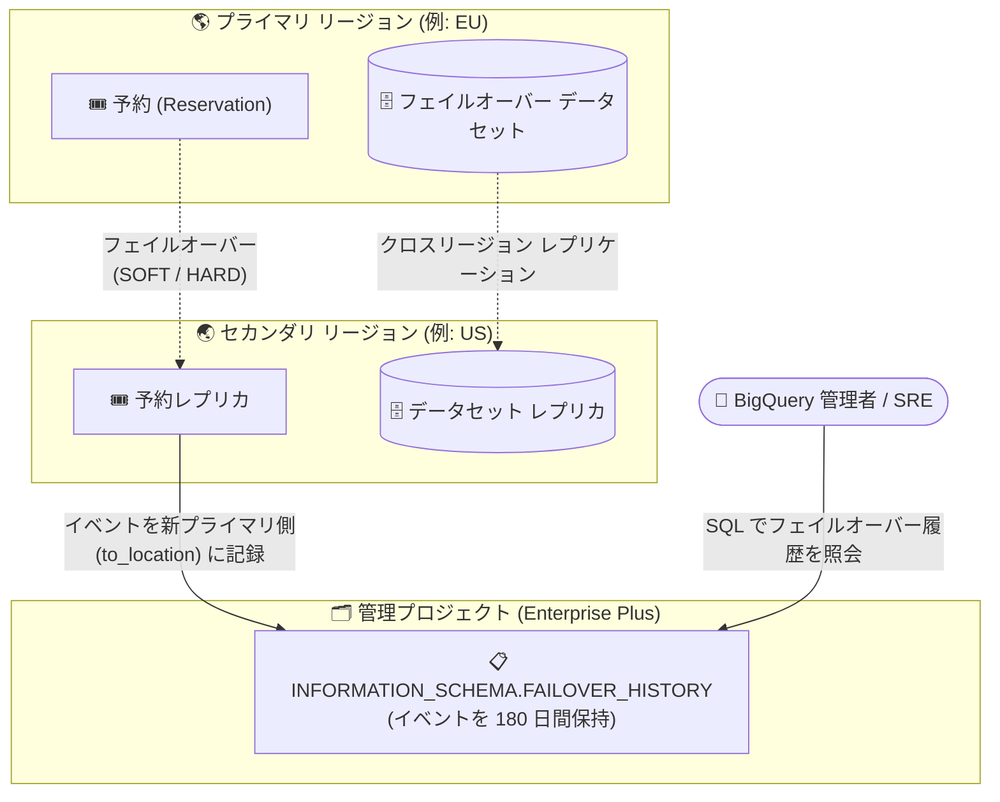

# BigQuery: INFORMATION_SCHEMA.FAILOVER_HISTORY ビュー (Preview)

**リリース日**: 2026-09-29

**サービス**: BigQuery

**機能**: INFORMATION_SCHEMA.FAILOVER_HISTORY ビューによるフェイルオーバーイベントの照会

**ステータス**: Preview

📊 [このアップデートのインフォグラフィックを見る](https://takech9203.github.io/google-cloud-news-summary/20260929-bigquery-failover-history-view-preview.html)

## 概要

BigQuery に `INFORMATION_SCHEMA.FAILOVER_HISTORY` ビューが Preview として追加されました。このビューを照会することで、マネージド ディザスタリカバリ (managed disaster recovery) を使用している管理プロジェクト (administration project) 内の予約 (Reservation) について、フェイルオーバーイベントのほぼリアルタイムな一覧を取得できます。各行は 1 つの予約に対する 1 回のフェイルオーバーイベントを表します。

BigQuery のマネージド ディザスタリカバリは、リージョン全体の障害に備えてコンピュート (スロット) とストレージのフェイルオーバーを制御する Enterprise Plus エディション向けの機能です。今回のアップデートにより、いつ・どの予約が・どのリージョン間で・どのモード (ハード / ソフト) でフェイルオーバーしたかを SQL で監査・追跡できるようになり、DR 運用の可視性が大きく向上します。

対象ユーザーは、Enterprise Plus エディションでマネージド ディザスタリカバリを運用する BigQuery 管理者や、DR 訓練・監査対応を担当する SRE / プラットフォームチームです。

**アップデート前の課題**

- `INFORMATION_SCHEMA.RESERVATIONS` ビューにはフェイルオーバーの詳細が含まれておらず、予約のフェイルオーバーイベントを SQL で一覧化する手段がなかった
- フェイルオーバーの実施履歴 (実施日時、方向、モード、完了状態) を体系的に追跡・監査する仕組みが INFORMATION_SCHEMA には存在しなかった

**アップデート後の改善**

- `INFORMATION_SCHEMA.FAILOVER_HISTORY` ビューへのクエリだけで、管理プロジェクト内の予約のフェイルオーバーイベントをほぼリアルタイムに一覧取得できるようになった
- フェイルオーバーのモード (`SOFT` / `HARD`)、状態 (`STARTED` / `COMPLETED`)、移行元・移行先ロケーション、開始・完了時刻を構造化データとして取得できるようになった
- イベントは 180 日間保持されるため、DR 訓練の記録や監査対応に活用できるようになった

## アーキテクチャ図



マネージド ディザスタリカバリで予約がフェイルオーバーすると、そのイベントが新しいプライマリ ロケーション (`to_location`) 側のリージョンに記録され、管理者は `FAILOVER_HISTORY` ビューを SQL で照会して履歴を確認できます。

## サービスアップデートの詳細

### 主要機能

1. **フェイルオーバーイベントのほぼリアルタイムな一覧取得**
   - 管理プロジェクト内のマネージド ディザスタリカバリを使用する予約について、フェイルオーバーイベントを 1 行 = 1 イベントとして照会できる
   - ビュー名 `INFORMATION_SCHEMA.FAILOVER_HISTORY` と `INFORMATION_SCHEMA.FAILOVER_HISTORY_BY_PROJECT` は同義で、どちらも使用可能

2. **フェイルオーバーの詳細情報の構造化**
   - フェイルオーバーモード (`SOFT` / `HARD`)、状態 (`STARTED` / `COMPLETED`)、移行元 (`from_location`)・移行先 (`to_location`)・元々のプライマリ (`original_primary_location`)、開始時刻・完了時刻を取得できる
   - ソフト フェイルオーバーは完了時に `state` が `COMPLETED` になり `end_time` が記録される

3. **180 日間のデータ保持**
   - フェイルオーバーイベントは 180 日間ビューに保持され、その後削除される
   - DR 訓練の実施記録や監査証跡として活用できる

### ビューのスキーマ

| カラム名 | データ型 | 内容 |
|------|------|------|
| `project_id` | STRING | 予約を含む管理プロジェクトの ID |
| `project_number` | INTEGER | 管理プロジェクトの番号 |
| `reservation_name` | STRING | ユーザーが指定した予約名 |
| `start_time` | TIMESTAMP | フェイルオーバーが開始された時刻 |
| `original_primary_location` | STRING | 予約が最初に作成されたロケーション |
| `from_location` | STRING | フェイルオーバー前のプライマリ ロケーション (フェイルオーバー後はセカンダリになる) |
| `to_location` | STRING | フェイルオーバー前のセカンダリ ロケーション (フェイルオーバーを開始した側。フェイルオーバー後はプライマリになる) |
| `end_time` | TIMESTAMP | ソフト フェイルオーバーが完了した時刻。進行中は `NULL`、ハード フェイルオーバーでは常に `NULL` |
| `failover_mode` | STRING | フェイルオーバーの種類。`SOFT` または `HARD` |
| `state` | STRING | フェイルオーバーの状態。`STARTED` (ソフト フェイルオーバー進行中、またはハード フェイルオーバー) または `COMPLETED` (ソフト フェイルオーバー完了後) |

スキーマ変更に対する安定性のため、ワイルドカード (`SELECT *`) ではなくカラムを明示的に指定してクエリすることが推奨されています。

## 技術仕様

### スコープと構文

| 項目 | 詳細 |
|------|------|
| ビュー名 | `[PROJECT_ID.]` `` `region-REGION` `` `.INFORMATION_SCHEMA.FAILOVER_HISTORY[_BY_PROJECT]` |
| リソース スコープ | プロジェクト レベル (管理プロジェクト) |
| リージョン スコープ | リージョン修飾子が必須。クエリの実行ロケーションはビューのリージョンと一致する必要がある |
| データ保持期間 | 180 日 |
| 前提機能 | マネージド ディザスタリカバリ (Enterprise Plus エディションが必要) |

### 必要なロール・権限

- ビューの照会には `bigquery.reservations.list` 権限が必要
- 事前定義ロールでは **BigQuery Resource Viewer** (`roles/bigquery.resourceViewer`) をプロジェクトに付与することで照会可能 (カスタムロールや他の事前定義ロールでも取得可能)

## 設定方法

### 前提条件

1. Enterprise Plus エディションの予約でマネージド ディザスタリカバリを構成していること
2. 管理プロジェクトに対して `bigquery.reservations.list` 権限 (例: `roles/bigquery.resourceViewer`) を持っていること

### 手順

#### ステップ 1: フェイルオーバー履歴を照会する

```sql
SELECT
  project_id,
  reservation_name,
  failover_mode,
  state,
  original_primary_location,
  from_location,
  to_location,
  start_time,
  end_time
FROM
  `reservation-admin-project.region-us`.INFORMATION_SCHEMA.FAILOVER_HISTORY
WHERE
  reservation_name = 'my-reservation'
ORDER BY
  start_time DESC;
```

`region-us` (フェイルオーバーの移行先 `to_location` が US だったイベントが記録されるリージョン) で、特定の予約のフェイルオーバーイベントを新しい順に取得する例です。出力例は以下のようになります。

```
+---------------+------------------+---------------+-----------+---------------------------+---------------+-------------+---------------------+---------------------+
| project_id    | reservation_name | failover_mode | state     | original_primary_location | from_location | to_location | start_time          | end_time            |
+---------------+------------------+---------------+-----------+---------------------------+---------------+-------------+---------------------+---------------------+
| my-admin-proj | my-reservation   | SOFT          | COMPLETED | US                        | EU            | US          | 2026-03-15 14:20:00 | 2026-03-15 14:31:05 |
| my-admin-proj | my-reservation   | HARD          | STARTED   | US                        | EU            | US          | 2026-02-10 08:15:30 | NULL                |
+---------------+------------------+---------------+-----------+---------------------------+---------------+-------------+---------------------+---------------------+
```

#### ステップ 2: 双方向のフェイルオーバー履歴を確認する

フェイルオーバーイベントは新しいプライマリになるリージョン (`to_location`) 側に記録されます。プライマリとセカンダリの間で双方向のイベントを確認するには、両方のリージョンでそれぞれビューを照会します。

```sql
-- US → EU のフェイルオーバーは region-eu 側に記録される
SELECT reservation_name, failover_mode, state, from_location, to_location, start_time
FROM `reservation-admin-project.region-eu`.INFORMATION_SCHEMA.FAILOVER_HISTORY
ORDER BY start_time DESC;
```

## メリット

### ビジネス面

- **監査対応・コンプライアンスの強化**: フェイルオーバーの実施履歴が 180 日間構造化データとして保持されるため、DR 訓練の実施証跡や障害対応の記録として利用できる
- **DR 運用の透明性向上**: いつ・誰の管理プロジェクトの予約が・どのリージョン間でフェイルオーバーしたかを明確に把握でき、DR 態勢の説明責任を果たしやすくなる

### 技術面

- **SQL による一元的な追跡**: 使い慣れた INFORMATION_SCHEMA の枠組みで、追加ツールなしにフェイルオーバーイベントを照会できる
- **ほぼリアルタイムの反映**: フェイルオーバーの実施状況 (進行中の `STARTED` / 完了した `COMPLETED`) をほぼリアルタイムに確認でき、ソフト フェイルオーバーの完了確認に利用できる
- **既存ビューの補完**: `INFORMATION_SCHEMA.RESERVATIONS` ビューにはフェイルオーバー詳細が含まれないという既存の制限を補完する

## デメリット・制約事項

### 制限事項

- 予約のフェイルオーバーイベントのみを含み、個々のデータセットのフェイルオーバーイベントは含まれない
- 各フェイルオーバーイベントは新しいプライマリ ロケーション (`to_location`) 側のリージョンに記録される。双方向のイベントを確認するには、各リージョンで個別にビューを照会する必要がある
- ハード フェイルオーバーはセカンダリ ロケーションでの完了確認を待たないため、完了シグナルがない。ハード フェイルオーバーのイベントは、フェイルオーバーが有効になった後も `state` が `STARTED` のまま、`end_time` が `NULL` のままとなる
- イベントの保持期間は 180 日間で、それを過ぎたイベントはビューから削除される

### 考慮すべき点

- Preview 段階の機能であり、Pre-GA Offerings Terms が適用され、サポートが限定される可能性がある
- マネージド ディザスタリカバリ自体が Enterprise Plus エディションでのみサポートされるため、本ビューの活用も実質的に Enterprise Plus 利用者向けとなる
- クエリの実行ロケーションはビューのリージョン修飾子と一致している必要がある

## ユースケース

### ユースケース 1: DR 訓練の実施記録と完了確認

**シナリオ**: 四半期ごとの DR 訓練でソフト フェイルオーバーを実施し、切り替えの開始・完了時刻を記録して所要時間を報告する必要がある。

**実装例**:
```sql
SELECT
  reservation_name,
  failover_mode,
  state,
  start_time,
  end_time,
  TIMESTAMP_DIFF(end_time, start_time, SECOND) AS failover_duration_seconds
FROM
  `reservation-admin-project.region-us`.INFORMATION_SCHEMA.FAILOVER_HISTORY
WHERE
  failover_mode = 'SOFT'
  AND state = 'COMPLETED'
ORDER BY
  start_time DESC;
```

**効果**: ソフト フェイルオーバーの所要時間を SQL で集計でき、DR 訓練のエビデンスとしてそのままレポート化できる。

### ユースケース 2: 障害対応後の監査・振り返り

**シナリオ**: リージョン障害時にハード フェイルオーバーを実施した後、いつ・どの予約が・どの方向に切り替わったかを整理し、事後レビューや監査に備える。

**効果**: `failover_mode = 'HARD'` のイベントを照会することで、緊急時の切り替え履歴 (開始時刻、移行元・移行先) を正確に把握でき、事後レビューでの事実確認が容易になる。

## 料金

このビュー自体に追加料金はありませんが、INFORMATION_SCHEMA ビューへのクエリには通常の BigQuery クエリ料金が適用されます。

- オンデマンド料金のプロジェクト: INFORMATION_SCHEMA ビューへのクエリは、処理バイト数が 10 MB 未満でも最低 10 MB 分の処理料金が課金される
- 容量ベース (エディション) 料金のプロジェクト: 購入済みの BigQuery スロットを消費する
- INFORMATION_SCHEMA クエリはキャッシュされないため、同一クエリでも実行のたびに課金される
- INFORMATION_SCHEMA ビューに対するストレージ料金は発生しない

詳細は [BigQuery の料金ページ](https://cloud.google.com/bigquery/pricing) を参照してください。

## 関連サービス・機能

- **BigQuery マネージド ディザスタリカバリ**: 本ビューの前提となる機能。Enterprise Plus エディションの予約でコンピュートとストレージのフェイルオーバーを管理する
- **クロスリージョン データセット レプリケーション**: マネージド ディザスタリカバリのストレージ フェイルオーバーの基盤となるデータセット複製機能
- **INFORMATION_SCHEMA.SCHEMATA_REPLICAS ビュー**: データセット レプリカの状態 (レプリケーション完了状況など) を照会するビュー。FAILOVER_HISTORY は予約側のイベントを補完する
- **INFORMATION_SCHEMA.RESERVATIONS ビュー**: 予約の一覧を照会するビュー。フェイルオーバー詳細は含まれないため、FAILOVER_HISTORY と組み合わせて使用する
- **Cloud Monitoring**: レプリケーション レイテンシ (RPO の目安) やネットワーク Egress バイト数などのレプリケーション メトリクスを監視できる

## 参考リンク

- 📊 [インフォグラフィック](https://takech9203.github.io/google-cloud-news-summary/20260929-bigquery-failover-history-view-preview.html)
- [公式リリースノート](https://docs.cloud.google.com/release-notes#September_29_2026)
- [FAILOVER_HISTORY view (ドキュメント)](https://docs.cloud.google.com/bigquery/docs/information-schema-failover-history)
- [マネージド ディザスタリカバリ (ドキュメント)](https://docs.cloud.google.com/bigquery/docs/managed-disaster-recovery)
- [INFORMATION_SCHEMA の概要](https://docs.cloud.google.com/bigquery/docs/information-schema-intro)
- [料金ページ](https://cloud.google.com/bigquery/pricing)

## まとめ

`INFORMATION_SCHEMA.FAILOVER_HISTORY` ビューの登場により、これまで SQL で追跡できなかった BigQuery マネージド ディザスタリカバリのフェイルオーバーイベントを、ほぼリアルタイムかつ 180 日間の履歴付きで照会できるようになりました。Enterprise Plus エディションで DR を運用しているチームは、DR 訓練の記録や監査対応、フェイルオーバー完了確認のワークフローに本ビューを組み込むことを推奨します。ハード フェイルオーバーには完了シグナルがない (`state` が `STARTED` のまま) 点に注意しつつ、Preview 段階から評価を始めるとよいでしょう。

---

**タグ**: BigQuery, INFORMATION_SCHEMA, ディザスタリカバリ, フェイルオーバー, Enterprise Plus, Preview
