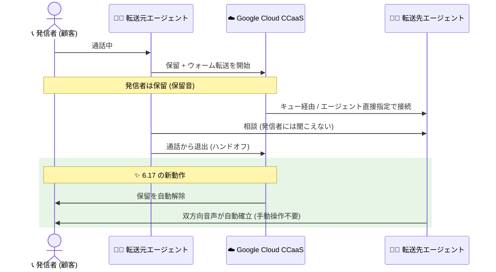

# Google Cloud CCaaS: プレリリースノート 6.17 (ウォーム転送の自動保留解除)

**リリース日**: 2026-09-29 (プレリリースノート公開日)

**サービス**: Google Cloud Contact Center as a Service (CCaaS)

**機能**: バージョン 6.17 プレリリースノート — ウォーム転送の自動保留解除 (Warm transfers auto-resume) ほか

**ステータス**: Announcement (プレリリースノート / **未リリース**)

📊 [このアップデートのインフォグラフィックを見る](https://takech9203.github.io/google-cloud-news-summary/20260929-ccaas-6-17-prerelease-notes.html)

> **注意: これはプレリリース (未リリース) のアナウンスです。** 本内容は次期バージョンとして予定されている Google Cloud CCaaS 6.17 のプレリリースノートであり、実際にリリースされるバージョンは 6.17 より大きい番号になる可能性があると公式に明記されています。記載された機能は、リリース時点で変更される可能性があります。

## 概要

Google Cloud CCaaS (Contact Center as a Service) の次期バージョンと見込まれる 6.17 のプレリリースノートが公開されました。目玉となる新機能は **「ウォーム転送の自動保留解除 (Warm transfers auto-resume)」** です。エージェントがウォーム転送を実行した際、転送元エージェントが通話から退出すると同時に、発信者 (顧客) の保留が自動的に解除され、転送先エージェントと発信者の双方向音声が手動操作なしで確立されるようになります。

エージェント同士が相談している間は発信者は保留のままとなるため、エージェント間の会話のプライバシーは維持されます。この動作は、**キュー経由でルーティングされるウォーム転送**と、**特定のエージェントへ直接送られるウォーム転送**の両方に適用されます。これにより、転送のハンドオフ後に発信者が保留されたまま無音状態になるという従来の問題が解消されます。

このほか、通話終了カードの通話時間表示の問題など、3 件の不具合修正が含まれる予定です。コンタクトセンターを運用する管理者や、エージェントの通話オペレーションを設計している担当者にとって、顧客体験とエージェントの操作負荷の両面で改善が見込まれるアップデートです。

**アップデート前の課題**

- 従来のウォーム転送では、転送先エージェントが通話に参加した後も発信者は保留のままであり、公式ドキュメントに記載のとおり、エージェントが **Hold を再度クリックして手動で保留を解除する必要**があった
- 転送元エージェントが退出した後、保留解除の操作が行われるまで発信者が保留されたままとなり、**ハンドオフ後に無音 (沈黙) が発生**していた
- 通話終了カード (Call ended card) で通話時間が 00:00 と表示される問題があった
- 仮想エージェントからキューへの遷移中に発信者が切断した場合、通話がライブダッシュボード上に残り続ける問題があった
- クレジットカードのトークン化 (credit card tokenization) のハンドバック後に、Virtual Agent Session Variables セクションが表示されない問題があった

**アップデート後の改善**

- 転送元エージェントが通話から退出すると、**発信者の保留が自動的に解除**され、転送先エージェントとの双方向音声が手動操作なしで確立される
- エージェント間の相談中は発信者が保留のまま維持されるため、**相談内容のプライバシーは引き続き保護**される
- キュー経由のウォーム転送と、特定エージェントへの直接のウォーム転送の**両方に適用**される
- 上記 3 件の不具合 (通話時間 00:00 表示、ライブダッシュボードの通話残留、Virtual Agent Session Variables の非表示) が修正される

## アーキテクチャ図

ウォーム転送のフローを示すシーケンス図です。6.17 では、転送元エージェントが退出した時点で CCaaS が発信者の保留を自動解除し、転送先エージェントとの双方向音声を即座に確立します。従来はこの時点でエージェントによる手動の保留解除操作が必要でした。

## サービスアップデートの詳細

### 主要機能

1. **ウォーム転送の自動保留解除 (Warm transfers auto-resume)**
   - 転送元エージェントが通話から退出すると同時に、発信者の保留が自動的に解除される
   - 転送先エージェントと発信者の間に双方向音声が手動操作なしで確立される
   - エージェント間の相談中は発信者が保留のままとなり、会話のプライバシーが保たれる
   - キュー経由のウォーム転送と、特定エージェントへ直接送るウォーム転送の両方に適用される

2. **不具合修正 (Fixed)**
   - 通話終了カード (Call ended card) で通話時間が 00:00 と表示される問題を修正
   - 仮想エージェントからキューへの遷移中に発信者が切断した場合に、通話がライブダッシュボードに残り続ける問題を修正
   - クレジットカードのトークン化のハンドバック後に Virtual Agent Session Variables セクションが表示されない問題を修正

## 技術仕様

### ウォーム転送の動作 (公式ドキュメントより)

| 項目 | 詳細 |
|------|------|
| ウォーム転送 | 発信者が回線に留まったまま、転送完了前に次のエージェントと転送元エージェントが会話できる転送方式 |
| 従来の保留解除 | 転送先エージェント参加後も発信者は保留のままで、Hold を再度クリックして解除する必要があった |
| 6.17 の保留解除 | 転送元エージェントの退出と同時に自動解除 (手動操作不要) |
| 適用範囲 | キュー経由のウォーム転送、特定エージェントへの直接のウォーム転送 |
| Overcapacity Deflection | ウォーム転送では発動しない (コールド転送のみ対象) |
| 通話優先度 | 転送された通話は、デフォルトで通常のインバウンド通話より高い優先度を持つ |
| 通話時間 (Call Duration) | 最初の通話ピックアップから起算され、転送が行われてもリセットされない |

## メリット

### ビジネス面

- **顧客体験の向上**: ハンドオフ後に発信者が保留のまま無音で待たされる時間がなくなり、転送時の顧客のストレスを軽減できる
- **プライバシーの維持**: エージェント間の相談中は発信者が保留のままとなるため、引き継ぎ内容の会話が顧客に聞こえることはない

### 技術面

- **エージェントの操作負荷軽減**: 転送先エージェントが手動で保留を解除する操作が不要になり、操作忘れによる保留放置を防止できる
- **一貫した動作**: キュー経由・エージェント直接指定のどちらのウォーム転送でも同じ自動解除の動作が適用される
- **運用監視の正確性向上**: ライブダッシュボードに通話が残留する不具合や通話時間の表示不具合の修正により、リアルタイム監視・レポートの信頼性が向上する

## デメリット・制約事項

### 考慮すべき点

- **未リリースのプレリリースノートである**: 本内容は次期バージョンの予定機能であり、リリース時に内容が変わる可能性がある。また、実際のバージョン番号が 6.17 より大きくなる可能性があると公式に明記されている
- **エージェントのオペレーション変更**: 転送元エージェントの退出と同時に発信者と転送先エージェントの音声が自動確立されるため、従来「退出後に保留解除する」前提で組まれていたエージェントの応対フロー・トレーニング資料は見直しが必要になる可能性がある
- チームへの通話転送は現時点でサポートされておらず、エージェントの割り当てはキューに基づく (チーム専用のキューを設定することで代替可能)

## ユースケース

### ユースケース 1: 一次受付から専門チームへのエスカレーション

**シナリオ**: 一次受付のエージェントが技術的な問い合わせを受け、専門チームのキューへウォーム転送する。転送元エージェントは転送先エージェントに問い合わせ内容を口頭で引き継いだ後、通話から退出する。

**効果**: 従来は退出後も発信者が保留のままで、転送先エージェントが保留解除を忘れると顧客が無音で待たされていた。6.17 では退出と同時に双方向音声が自動確立されるため、顧客はスムーズに専門エージェントとの会話を開始できる。

### ユースケース 2: 特定の担当エージェントへの直接転送

**シナリオ**: 顧客の担当者が決まっている案件で、受付エージェントが特定のエージェントを指名してウォーム転送を行う。

**効果**: エージェント直接指定のウォーム転送でも自動保留解除が適用されるため、キュー経由と同じく手動操作なしでシームレスに引き継ぎが完了する。

## 料金

CCaaS (CCAI Platform) のインスタンスは月次で課金され、インスタンスに割り当てられた課金モデルに応じて以下のいずれかで請求されます (公式ドキュメントより)。

- **Concurrent agents**: 月内に同時にサインインしたエージェントロールのユーザーの最大数
- **Named agents**: 月内にエージェントロールを持ったインスタンス内ユーザーの最大数
- **Minutes used**: エージェントロールのユーザーがサインインしていた分数

テレフォニー料金は使用量に応じて別途課金されます。トライアルや開発用の非本番インスタンスは、テレフォニー費用を除き無償で利用できます (本番トラフィックでの利用は不可)。今回のアップデート自体による追加料金の記載はありません。

## 利用可能リージョン

CCAI Platform が利用可能な国と Google Cloud リージョンは、公式の [Locations ページ](https://docs.cloud.google.com/contact-center/ccai-platform/docs/localities)を参照してください。

## 関連サービス・機能

- **CCAI Platform (Gemini Enterprise for Customer Experience)**: CCaaS は Google Cloud 上にネイティブに構築されたコンタクトセンタープラットフォームで、音声・デジタルチャネルを横断したルーティングを提供する
- **仮想エージェント (Virtual Agent)**: 今回の修正には、仮想エージェントからキューへの遷移時の不具合や、Virtual Agent Session Variables の表示不具合の修正が含まれる
- **ライブダッシュボード**: リアルタイムの通話監視機能。今回の修正で切断済み通話が残留する問題が解消される

## 参考リンク

- 📊 [インフォグラフィック](https://takech9203.github.io/google-cloud-news-summary/20260929-ccaas-6-17-prerelease-notes.html)
- [公式リリースノート](https://docs.cloud.google.com/release-notes#September_29_2026)
- [CCAI Platform リリースノート](https://docs.cloud.google.com/contact-center/ccai-platform/docs/release-notes)
- [ドキュメント: Warm transfers (通話の転送)](https://docs.cloud.google.com/contact-center/ccai-platform/docs/call-adapter-transfer#warm-transfer)
- [ドキュメント: CCAI Platform の概要](https://docs.cloud.google.com/contact-center/ccai-platform/docs)
- [ドキュメント: 課金モデル (Get started)](https://docs.cloud.google.com/contact-center/ccai-platform/docs/get-started)

## まとめ

Google Cloud CCaaS の次期バージョン 6.17 のプレリリースノートでは、ウォーム転送時のハンドオフ後の無音を解消する「自動保留解除」が予告されました。転送体験の改善はコンタクトセンターの顧客満足度に直結するため、CCaaS を運用中のチームはエージェントの応対フローへの影響を事前に確認しておくことを推奨します。なお、**本内容は未リリースのプレリリース情報**であり、正式リリース時に内容やバージョン番号が変わる可能性がある点に注意してください。

---

**タグ**: #GoogleCloud #CCaaS #CCAIPlatform #ContactCenter #WarmTransfer #Prerelease #Announcement
