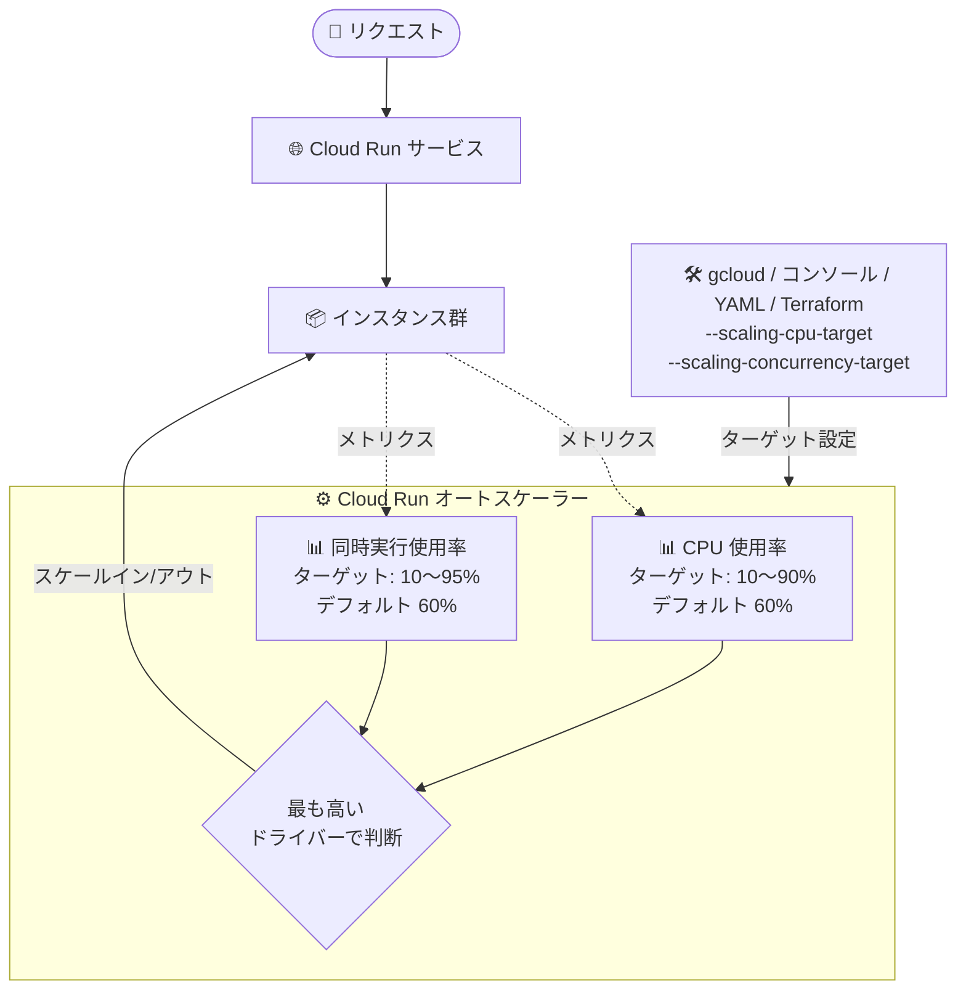

# Cloud Run: スケーリングコントロールによるカスタムターゲット CPU / 同時実行使用率の指定が GA

**リリース日**: 2026-09-29

**サービス**: Cloud Run

**機能**: スケーリングコントロール (カスタムターゲット CPU / 同時実行使用率)

**ステータス**: GA (一般提供)

📊 [このアップデートのインフォグラフィックを見る](https://takech9203.github.io/google-cloud-news-summary/20260929-cloud-run-scaling-controls-ga.html)

## 概要

Cloud Run のスケーリングコントロール (scaling controls) を使用して、カスタムのターゲット CPU 使用率およびターゲット同時実行 (concurrency) 使用率を指定する機能が一般提供 (GA) になりました。Cloud Run サービスはデフォルトで CPU と同時実行の両方について 60% の使用率ターゲットでインスタンス数を自動スケーリングしますが、この機能により、どのスケーリング要因を使うか (例: CPU のみ) を選択し、使用率ターゲットをワークロードの要件に合わせてカスタマイズできます。

スケーリングコントロールにより、オーバースケーリングを防いでコストを最適化したり、逆にターゲットを低く設定して積極的にスケールアウトさせることで急激なトラフィックスパイクに備えたりと、サービスのスケーリング挙動を自分の要件に応じてコントロールできます。コスト効率と予測可能性の両立を求める本番ワークロードの運用者に有用なアップデートです。

**アップデート前の課題**

- Preview 段階では、設定に `gcloud beta run services update` コマンドや YAML の `run.googleapis.com/launch-stage: BETA` アノテーションが必要で、Pre-GA 利用規約の下での限定的なサポートしか受けられなかった
- スケーリングコントロールが導入される以前は、CPU / 同時実行の使用率ターゲットは 60% 固定で、ユーザーが調整する手段がなかった
- スケーリングのトリガーとなる要因 (CPU か同時実行か) を選択できず、ワークロード特性に合わせた自動スケーリングの調整が困難だった

**アップデート後の改善**

- GA となり、本番ワークロードで正式サポートの下で利用可能になった
- `gcloud run services update` (beta 不要)、Google Cloud コンソール、YAML、Terraform (`google_cloud_run_v2_service`) のいずれからも設定できるようになった
- ターゲット CPU 使用率 (10〜90%)、ターゲット同時実行使用率 (10〜95%) を個別にカスタマイズ、または片方のスケーリングドライバーを無効化 (両方の無効化は不可) できる

## アーキテクチャ図



Cloud Run のオートスケーラーは CPU 使用率と同時実行使用率の 2 つのドライバーを監視し、値が高い方に基づいてインスタンス数を決定します。GA により、各ドライバーのターゲット値のカスタマイズや片方の無効化を gcloud / コンソール / YAML / Terraform から設定できます。

## サービスアップデートの詳細

### 主要機能

1. **カスタム使用率ターゲットの設定**
   - ターゲット CPU 使用率: 0.1〜0.90 (10〜90%)、小数点以下 2 桁まで指定可能
   - ターゲット同時実行使用率: 0.1〜0.95 (10〜95%)、小数点以下 2 桁まで指定可能
   - 設定変更のたびに新しいリビジョンが作成され、以降のリビジョンにも設定が引き継がれる

2. **スケーリングドライバーの無効化**
   - CPU または同時実行のどちらか一方のターゲットを `disabled` に設定し、そのメトリクスをスケーリング判断から除外できる (例: CPU のみでスケーリング)
   - 両方を同時に無効化することはできず、常に少なくとも 1 つのスケーリングドライバーが有効である必要がある

3. **強化されたスケーリング挙動へのオプトイン**
   - デフォルトの 60% ターゲットを維持する場合でも、明示的にターゲットを設定することで、インスタンス数が少ないサービスでも設定したターゲットに忠実に応答する改善されたオートスケーラー挙動を利用できる

4. **デフォルト値への復元**
   - `--scaling-cpu-target=default` / `--scaling-concurrency-target=default` を指定するか、YAML からアノテーションを削除することで、デフォルトの 60% ターゲットに戻せる

## 技術仕様

### 設定可能な範囲

| スケーリングドライバー | デフォルト | 最小 | 最大 |
|------|------|------|------|
| CPU ターゲット使用率 | 60% | 10% | 90% |
| 同時実行ターゲット使用率 | 60% | 10% | 95% |

### 設定インターフェース

| 方法 | 設定内容 |
|------|------|
| Google Cloud コンソール | サービスの「Scaling」タブ →「Customize autoscaling factors」 |
| gcloud CLI | `--scaling-cpu-target` / `--scaling-concurrency-target` フラグ |
| YAML | `run.googleapis.com/scaling-cpu-target` / `run.googleapis.com/scaling-concurrency-target` アノテーション |
| Terraform | `google_cloud_run_v2_service` の `template.scaling.cpu_utilization` / `concurrency_utilization` (0 で無効化) |

### YAML 設定例

```yaml
apiVersion: serving.knative.dev/v1
kind: Service
metadata:
  name: SERVICE
spec:
  template:
    metadata:
      annotations:
        run.googleapis.com/scaling-cpu-target: '0.7'
        run.googleapis.com/scaling-concurrency-target: '0.8'
```

### 補足事項

- カスタム同時実行ターゲットを設定した場合や CPU ベースのスケーリングを無効化した場合でも、Adaptive Concurrency Tuning (ACT) は有効なまま動作する
- 低いターゲット (例: 10%) を設定すると早期にスケールアウトしてアイドル容量のバッファを確保できる一方、インスタンス数の増加により課金が増える可能性がある
- 高いターゲットを設定するとスケーリングの許容範囲 (トレランス) が広がり、スケーリングが滑らかな曲線ではなく一斉に発生する挙動になる場合がある

## 設定方法

### 前提条件

1. Cloud Run サービスがデプロイ済みであること (設定変更は新しいリビジョンのデプロイとして適用される)

### 手順

#### ステップ 1: 現在のスケーリング要因を特定する

```bash
# Metrics Explorer で run.googleapis.com/scaling/recommended_instances メトリクスを
# Unaggregated で確認し、スケーリングドライバー別の推奨インスタンス数を確認する
```

値が最も高いドライバーが現在サービスのインスタンス数を決めている要因です。優先させたいドライバーやスケーリングの積極性に応じてターゲットを調整します。

#### ステップ 2: カスタムターゲットを設定する

```bash
# CPU ターゲット 70%、同時実行ターゲット 80% に設定
gcloud run services update SERVICE \
  --scaling-cpu-target=0.7 \
  --scaling-concurrency-target=0.8
```

#### ステップ 3: (必要に応じて) 片方のドライバーを無効化する

```bash
# CPU のみでスケーリングする (同時実行ターゲットを無効化)
gcloud run services update SERVICE --scaling-concurrency-target=disabled

# 同時実行のみでスケーリングする (CPU ターゲットを無効化)
gcloud run services update SERVICE --scaling-cpu-target=disabled
```

#### ステップ 4: 設定を確認する

```bash
gcloud run services describe SERVICE
# 出力の Target CPU utilization: / Target concurrency utilization: を確認
```

## メリット

### ビジネス面

- **コスト最適化**: ターゲット使用率を高めに設定してオーバースケーリングを防ぎ、必要以上のインスタンス起動による課金を抑制できる
- **本番利用の安心感**: GA となり正式サポートの対象になったため、本番ワークロードに安心して適用できる

### 技術面

- **スケーリングの予測可能性向上**: オートスケーラーが設定ターゲットに忠実に応答するため、インスタンス数が少ないサービスでもスケーリング挙動が予測しやすくなる
- **ワークロード特性への適合**: CPU バウンドなワークロードは CPU のみ、リクエスト処理主体のワークロードは同時実行のみ、といったドライバーの選択が可能
- **IaC 対応**: Terraform (`google_cloud_run_v2_service`) で宣言的に管理できる

## デメリット・制約事項

### 制限事項

- CPU ターゲットは 10〜90%、同時実行ターゲットは 10〜95% の範囲でのみ設定可能 (小数点以下 2 桁まで)
- CPU と同時実行の両方のスケーリングドライバーを同時に無効化することはできない
- 設定変更のたびに新しいリビジョンが作成される

### 考慮すべき点

- 低い使用率ターゲット (例: 10%) は可用性とスパイク耐性を高める一方、アイドルインスタンスが増えてコストが増加し、スケーリング判断もより頻繁になる
- 高い使用率ターゲットはトレランスが広がるため、スケーリングが一斉に発生する挙動になり得る
- ターゲットは段階的に調整し、変更後は数分待ってパフォーマンスへの影響を観察することが推奨される
- 新しいターゲットの検証にはトラフィック分割を使い、一部のトラフィックのみを新リビジョンに向けてからロールアウトするのがベストプラクティス

## ユースケース

### ユースケース 1: コスト重視のバックエンド API のオーバースケーリング抑制

**シナリオ**: 内部向け API サービスで、多少のレイテンシ増加は許容できるためインスタンス数を抑えてコストを削減したい。

**実装例**:
```bash
gcloud run services update internal-api \
  --scaling-cpu-target=0.85 \
  --scaling-concurrency-target=0.9
```

**効果**: 使用率ターゲットを高く設定することで各インスタンスをより高い使用率まで活用し、インスタンス数と課金を抑制できる。

### ユースケース 2: CPU バウンドなワークロードの CPU のみによるスケーリング

**シナリオ**: 画像処理などリクエスト数よりも CPU 負荷がボトルネックになるサービスで、同時実行数に左右されず CPU 使用率だけでスケーリングさせたい。

**実装例**:
```bash
gcloud run services update image-processor \
  --scaling-cpu-target=0.6 \
  --scaling-concurrency-target=disabled
```

**効果**: 同時実行メトリクスがスケーリング判断から除外され、CPU 使用率のみに基づいた一貫性のあるスケーリング挙動が得られる。

### ユースケース 3: スパイクの激しいサービスの可用性向上

**シナリオ**: トラフィックスパイクが突発的に発生するユーザー向けサービスで、レイテンシ悪化を避けるために早めにスケールアウトさせたい。

**実装例**:
```bash
gcloud run services update spiky-frontend \
  --scaling-cpu-target=0.3 \
  --scaling-concurrency-target=0.3
```

**効果**: 低いターゲットにより早期にスケールアウトしてアイドル容量のバッファを確保し、突発的なスパイクをレイテンシ悪化なしに吸収できる (その分コストは増加するためバランスの検討が必要)。

## 料金

スケーリングコントロール自体に追加料金はありませんが、設定する使用率ターゲットによって起動されるインスタンス数が変わるため、Cloud Run の課金額に直接影響します。低いターゲットはインスタンス数が増えて課金が増加し、高いターゲットはインスタンス数を抑えて課金を削減する方向に働きます。

詳細は [Cloud Run 料金ページ](https://cloud.google.com/run/pricing) を参照してください。

## 関連サービス・機能

- **Cloud Run インスタンス自動スケーリング**: スケーリングコントロールの基盤となる機能。デフォルトの自動スケーリング挙動や Adaptive Concurrency Tuning (ACT) について解説されている
- **Cloud Run 最大/最小インスタンス数設定**: `max-instances` / `min-instances` と組み合わせて、スケーリングの上限・下限とターゲット使用率の両面から挙動を制御できる
- **Cloud Run 最大同時リクエスト数 (concurrency) 設定**: インスタンスあたりの同時リクエスト上限。同時実行使用率ターゲットはこの設定値に対する使用率として機能する
- **Cloud Monitoring (Metrics Explorer)**: `run.googleapis.com/scaling/recommended_instances` メトリクスでスケーリングドライバー別の推奨インスタンス数を確認し、ターゲット調整の判断材料にできる
- **Terraform (google_cloud_run_v2_service)**: `template.scaling` ブロックでスケーリングコントロールを宣言的に管理できる

## 参考リンク

- 📊 [インフォグラフィック](https://takech9203.github.io/google-cloud-news-summary/20260929-cloud-run-scaling-controls-ga.html)
- [公式リリースノート](https://docs.cloud.google.com/release-notes#September_29_2026)
- [ドキュメント: Configure custom scaling controls for services](https://docs.cloud.google.com/run/docs/configuring/scaling-controls)
- [ドキュメント: About instance autoscaling in Cloud Run services](https://docs.cloud.google.com/run/docs/about-instance-autoscaling)
- [料金ページ](https://cloud.google.com/run/pricing)

## まとめ

Cloud Run のスケーリングコントロールが GA となり、CPU / 同時実行の使用率ターゲットのカスタマイズやスケーリングドライバーの選択を、本番ワークロードで gcloud / コンソール / YAML / Terraform から正式に利用できるようになりました。まずは Metrics Explorer の `run.googleapis.com/scaling/recommended_instances` メトリクスで現在のスケーリング要因を把握し、トラフィック分割を活用しながら段階的にターゲットを調整することを推奨します。

---

**タグ**: Cloud Run, オートスケーリング, スケーリングコントロール, GA, サーバーレス, コスト最適化
