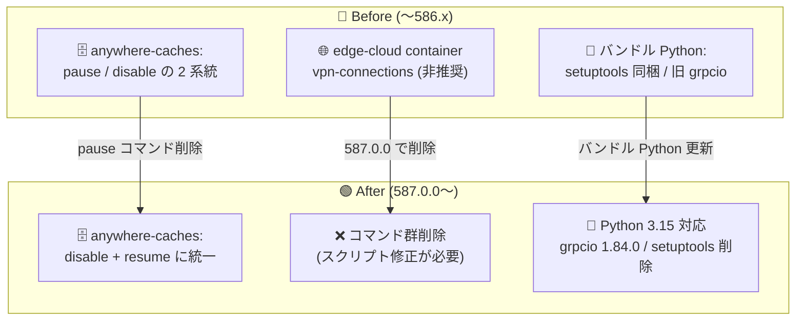

# Cloud SDK (gcloud CLI): 587.0.0 リリース — Anywhere Cache pause コマンド削除・Edge VPN コマンド群削除などの破壊的変更と Python 3.15 対応

**リリース日**: 2026-09-29

**サービス**: Cloud SDK (gcloud CLI)

**機能**: バージョン 587.0.0 — 破壊的変更 (Breaking Changes)、Python 3.15 対応、主要な GA 昇格

**ステータス**: Breaking Change (一部 GA 昇格を含む)

📊 [このアップデートのインフォグラフィックを見る](https://takech9203.github.io/google-cloud-news-summary/20260929-cloud-sdk-587-breaking-changes.html)

## 概要

2026 年 9 月 29 日、Cloud SDK (gcloud CLI) バージョン 587.0.0 がリリースされました。このリリースには 2 件の破壊的変更が含まれています。(1) Cloud Storage の `gcloud storage buckets anywhere-caches pause` コマンドの削除、(2) Distributed Cloud Edge (Distributed Cloud connected) の非推奨だった `gcloud edge-cloud container vpn-connections` コマンド群の削除です。これらのコマンドをスクリプトや運用手順で使用している場合は修正が必要です。

ランタイム面では、gcloud CLI が Python 3.15 をサポートし、Linux / Windows のバンドル Python では grpcio が 1.84.0 に更新され、setuptools が削除されました。バンドル Python 内の setuptools に依存するカスタムスクリプトがある場合は注意が必要です。

機能面では、AlloyDB の IAM グループユーザータイプの GA 昇格、Cloud Dataplex の `gcloud dataplex dbt` の GA 昇格、Cloud Run のスケーリングフラグ (`--scaling-cpu-target` / `--scaling-concurrency-target`) とエフェメラルディスクボリュームの GA 昇格、Cloud Run インスタンスへの SSH 接続 (beta) など、注目すべきアップデートが多数含まれています。なお、Cloud Run の `--scaling-cpu-target` は最大許容値が 0.95 から 0.90 に変更されており、既存スクリプトへの影響に注意が必要です。

**アップデート前の課題**

- Cloud Storage Anywhere Cache には `pause` (一時停止) と `disable` (無効化) という 2 つの類似した停止系コマンドが存在し、運用上の使い分けが分かりにくかった
- Distributed Cloud Edge の `vpn-connections` コマンド群は非推奨のまま CLI に残っており、廃止予定機能への依存が温存されやすい状態だった
- AlloyDB の IAM グループ認証は Preview 段階であり、本番環境での利用にはリスクがあった。IAM ユーザーを個別にクラスタへ追加する運用ではオンボーディング/オフボーディングの管理負荷が高かった
- Cloud Run のスケーリング調整フラグ (`--scaling-cpu-target` など) やエフェメラルディスクボリュームは GA 前のトラックでのみ利用可能で、本番ワークロードへの適用がためらわれた
- 実行中の Cloud Run インスタンスに対話的にシェル接続してデバッグする標準的な手段が CLI になかった

**アップデート後の改善**

- Anywhere Cache の停止操作は `disable` に整理され、`resume` で復帰させる運用に統一された (`resume` は Paused / Disabled 両状態からの復帰に対応)
- 非推奨の Edge VPN コマンド群が削除され、CLI サーフェスが整理された
- AlloyDB で IAM グループをクラスタに追加するだけでメンバー全員が認証を継承できる運用が GA として本番利用可能になった
- Cloud Run の `--scaling-cpu-target` / `--scaling-concurrency-target` とエフェメラルディスクボリューム (`type=ephemeral-disk`) が GA に昇格し、SLA のもとで利用可能になった
- `gcloud beta run services ssh` / `gcloud beta run instances ssh` により、Cloud Run インスタンスへの対話的なシェル接続が可能になった
- Python 3.15 対応と grpcio 1.84.0 への更新により、最新の Python ランタイム環境での動作が保証された

## アーキテクチャ図



gcloud CLI 587.0.0 における 3 系統の変更 (Anywhere Cache コマンド整理、Edge VPN コマンド群削除、バンドル Python 更新) を Before/After で示しています。

## サービスアップデートの詳細

### 破壊的変更 (Breaking Changes)

1. **`gcloud storage buckets anywhere-caches pause` コマンドの削除 (Cloud Storage)**
   - Anywhere Cache インスタンスを一時停止する `pause` コマンドが削除された
   - 587.0.0 以降、`anywhere-caches` コマンド群は `create` / `describe` / `disable` / `list` / `resume` / `update` で構成される
   - キャッシュの停止には `disable` を使用する。`resume` コマンドは Paused / Disabled いずれの状態からも RUNNING / CREATING 状態へ復帰できる

2. **`gcloud edge-cloud container vpn-connections` コマンド群の削除 (Distributed Cloud Edge)**
   - 非推奨となっていた VPN 接続管理コマンド群 (create / list / describe / delete など) が削除された
   - Distributed Cloud connected クラスタと VPC ネットワーク間の VPN 接続を CLI で管理していたスクリプトは修正が必要
   - 既存の VPN 接続リソースの扱いは Distributed Cloud connected のドキュメントを参照

### Google Cloud CLI 本体の変更

1. **Python 3.15 サポート**
   - gcloud CLI が Python 3.15 に対応した
2. **バンドル Python の更新 (Linux / Windows)**
   - grpcio を 1.84.0 にアップグレード
   - setuptools がバンドル Python から削除された。バンドル Python 環境で setuptools に依存する処理がある場合は個別対応が必要

### 主要な GA 昇格・機能追加

1. **AlloyDB**: IAM グループユーザータイプ (`--type=IAM_GROUP`) が GA に昇格。IAM グループをクラスタに追加するとメンバー全員が認証を継承し、初回サインイン時にアカウントが自動作成される
2. **Cloud Dataplex**: `gcloud dataplex dbt` が GA に昇格
3. **Cloud Run**:
   - `--scaling-cpu-target` / `--scaling-concurrency-target` フラグが GA に昇格 (`gcloud run deploy` / `gcloud run services update`)。ただし `--scaling-cpu-target` の最大許容値が 0.95 から 0.90 に変更 (Cloud Run API と整合)
   - `--add-volume` の `type=ephemeral-disk` が GA に昇格 (deploy / jobs / worker-pools / services 系コマンド)
   - `gcloud beta run services ssh` / `gcloud beta run instances ssh` が追加され、Cloud Run インスタンスへの対話的シェル接続が可能に
   - `gcloud run instances deploy` に `--[no-]use-http2` フラグが追加
   - `gcloud beta run deploy` の `--domain` フラグでカスタム URL をサポート
4. **BigQuery**: `bq update --connection` で AWS / Azure クロスクラウド接続の `serviceDirectoryService` を `--service_directory_service=''` でクリア可能に (空の場合、Cross-Cloud Interconnect ではなくパブリックインターネット経由でクエリ)
5. **AI Platform**: `gcloud ai semantic-governance-policies create/update` に `--agent-response-denial-message` フラグが追加され、ポリシーがリクエストを拒否した際にエンドユーザーへ表示するカスタムメッセージを設定可能に
6. **Agent Registry**: `gcloud agent-registry bindings create` の `--source-identifier` がオプションに変更
7. **Cloud Dataproc**: `--multizone` フラグが追加され、リージョン内の複数ゾーンにまたがるマルチゾーナルクラスタを作成可能に
8. **Cloud Managed Lustre**: `gcloud lustre instances directory-policies` コマンド群が GA に昇格。`--target-version` フラグも GA コマンドに追加
9. **Compute Engine**: スナップショット作成の `--kms-key` フラグが v1 (GA) に昇格、`gcloud compute interconnects set-name` が GA に昇格
10. **Cloud Tasks**: `gcloud alpha|beta tasks batch-create` が追加され、JSON / YAML ファイルから複数タスクを一括作成可能に。タスク単位のリトライフラグ (`--max-attempts` など) も追加
11. **IAP**: `gcloud beta iap tcp` に IAM ポリシー管理コマンド (get/set-iam-policy、add/remove-iam-policy-binding) が追加され、Cloud Run トンネルリソースを含む IAP TCP リソースの IAM 管理が可能に
12. **Network Security**: `gcloud network-security rate-limit-policies` が beta に昇格
13. **Cloud Build**: `gcloud builds submit` / `worker-pools create/update` に `--worker-release` フラグが追加

## 技術仕様

### 破壊的変更・注意すべき変更の一覧

| 項目 | 影響 | ステータス |
|------|------|-----------|
| `gcloud storage buckets anywhere-caches pause` | コマンド実行不可。`disable` へ移行 | 587.0.0 で削除済み |
| `gcloud edge-cloud container vpn-connections` | コマンド群全体が実行不可 | 587.0.0 で削除済み (非推奨からの削除) |
| バンドル Python の setuptools | バンドル Python 内で setuptools が利用不可 | 587.0.0 で削除済み (Linux / Windows) |
| Cloud Run `--scaling-cpu-target` | 0.90 超の値を指定するとエラー | 最大値 0.95 → 0.90 に変更 |

### Anywhere Cache コマンドの整理 (587.0.0 以降)

| 操作 | コマンド | 説明 |
|------|---------|------|
| 作成 | `anywhere-caches create` | バケットにキャッシュインスタンスを作成 |
| 停止 | `anywhere-caches disable` | キャッシュを無効化 (`pause` の代替) |
| 復帰 | `anywhere-caches resume` | Paused / Disabled 状態から RUNNING / CREATING へ復帰 |
| 更新 / 確認 | `update` / `describe` / `list` | 設定変更・状態確認 |

### AlloyDB IAM グループ認証 (GA) の主な仕様

| 項目 | 詳細 |
|------|------|
| ユーザー作成 | `gcloud alloydb users create GROUP_EMAIL --type=IAM_GROUP` |
| 必要なフラグ | インスタンスで `alloydb.iam_authentication` と `alloydb.iam_group_authentication` を有効化 |
| 必要なロール | グループに `alloydb.databaseUser` と `serviceusage.serviceUsageConsumer` |
| グループ数上限 | クラスタあたり最大 200 グループ |
| 権限付与 | `GRANT SELECT ON table TO "group@example.com";` のようにグループ単位で DB 権限を付与 |
| メンバー管理 | グループメンバーは初回サインイン時にアカウントが自動作成される |

## 設定方法

### 前提条件

1. `gcloud version` で現在のバージョンを確認し、スクリプト・CI/CD パイプラインで `anywhere-caches pause`、`edge-cloud container vpn-connections`、Cloud Run の `--scaling-cpu-target` を使用している箇所を洗い出す
2. バンドル Python (Linux / Windows) 環境で setuptools に依存する処理がないか確認する

### 手順

#### ステップ 1: Anywhere Cache 停止処理の修正

```bash
# 587.0.0 以降: pause は削除されたため disable を使用
gcloud storage buckets anywhere-caches disable my-bucket/my-cache-id

# 復帰は resume (Paused / Disabled 両状態から復帰可能)
gcloud storage buckets anywhere-caches resume my-bucket/my-cache-id
```

`pause` を使用していた運用スクリプトは `disable` に置き換えます。

#### ステップ 2: Cloud Run スケーリングフラグの値を確認

```bash
# GA 昇格後: 最大値は 0.90 (0.95 は指定不可)
gcloud run deploy my-service \
  --image=us-docker.pkg.dev/my-project/repo/app \
  --scaling-cpu-target=0.90 \
  --scaling-concurrency-target=80
```

`--scaling-cpu-target` に 0.90 を超える値を指定しているスクリプトは修正が必要です。

#### ステップ 3: AlloyDB IAM グループユーザーの作成 (GA)

```bash
# グループに必要なロールを付与したうえで、クラスタにグループユーザーを作成
gcloud alloydb users create my-group@example.com \
  --cluster=my-cluster \
  --region=asia-northeast1 \
  --type=IAM_GROUP
```

グループメンバーは個別追加不要で、初回サインイン時にアカウントが自動作成されます。

#### ステップ 4: gcloud CLI の更新

```bash
gcloud components update
gcloud version
```

## メリット

### ビジネス面

- **アクセス管理の効率化**: AlloyDB の IAM グループ認証 GA により、データベースユーザーの入退社・異動対応がグループメンバーシップの管理だけで完結し、監査対応も簡素化される
- **本番適用の後押し**: Cloud Run のスケーリング調整・エフェメラルディスクなどが GA となり、SLA のもとで本番ワークロードに適用できる

### 技術面

- **CLI サーフェスの整理**: 重複していた Anywhere Cache の停止系コマンドと非推奨の Edge VPN コマンド群が削除され、コマンド体系が明確になった
- **最新ランタイム対応**: Python 3.15 サポートと grpcio 1.84.0 への更新により、最新の OS / Python 環境での互換性が確保される
- **デバッグ性の向上**: `gcloud beta run services ssh` により、実行中の Cloud Run インスタンスへ対話的に接続して障害調査ができる

## デメリット・制約事項

### 制限事項

- `anywhere-caches pause` と `edge-cloud container vpn-connections` は 587.0.0 時点で削除済みのため、猶予期間なしで既存スクリプトが失敗する
- Cloud Run の `--scaling-cpu-target` は 0.90 を超える値を受け付けなくなった (従来の最大値 0.95 を指定していた場合はエラー)
- バンドル Python から setuptools が削除されたため、gcloud のバンドル Python 環境で setuptools を前提としたカスタム処理は動作しない
- AlloyDB IAM グループ認証にはグループ数上限 (クラスタあたり 200)、グループ名 63 文字制限などの制約がある (詳細は公式ドキュメントを参照)

### 考慮すべき点

- CI/CD パイプラインで gcloud CLI を自動更新している場合、587.0.0 への更新タイミングで削除コマンドに依存したジョブが突然失敗する可能性があるため、事前に依存箇所を修正すること
- BigQuery のクロスクラウド接続で `--service_directory_service=''` を指定すると、Cross-Cloud Interconnect ではなくパブリックインターネット経由のクエリになるため、ネットワーク要件 (セキュリティ・帯域) を確認したうえで使用すること
- AlloyDB で既存の個別 IAM ユーザー (`ALLOYDB_IAM_USER`) はグループの権限を継承しないため、グループ認証へ移行する場合は個別ユーザーの削除と再サインインが必要

## ユースケース

### ユースケース 1: Anywhere Cache 運用スクリプトの修正

**シナリオ**: 夜間バッチの前後で Anywhere Cache を `pause` / `resume` していた運用チームが、587.0.0 への更新でスクリプトが失敗するようになった。

**実装例**:
```bash
# 修正後: pause の代わりに disable を使用
gcloud storage buckets anywhere-caches disable analytics-bucket/asia-northeast1-b

# バッチ完了後に復帰
gcloud storage buckets anywhere-caches resume analytics-bucket/asia-northeast1-b
```

**効果**: 削除されたコマンドへの依存を解消し、disable / resume の 2 コマンドに運用を統一できる。

### ユースケース 2: AlloyDB のユーザー管理をグループベースに移行

**シナリオ**: 数十名の分析チームメンバーを AlloyDB クラスタに個別登録していた組織が、IAM グループ認証の GA を機にグループベースの管理へ移行する。

**実装例**:
```bash
gcloud alloydb users create analytics-team@example.com \
  --cluster=prod-cluster --region=asia-northeast1 --type=IAM_GROUP
```
```sql
-- グループ単位で DB 権限を付与
GRANT SELECT ON sales_data TO "analytics-team@example.com";
```

**効果**: メンバーの追加・削除は Google グループの管理だけで完結し、データベース側のユーザー管理作業が不要になる。

### ユースケース 3: Cloud Run コンテナの対話的デバッグ

**シナリオ**: 本番相当環境の Cloud Run サービスで再現する不具合を、実行中のインスタンスに接続して調査したい。

**実装例**:
```bash
gcloud beta run services ssh my-service --region=asia-northeast1
```

**効果**: コンテナを再ビルドせずに実行中インスタンスの状態 (ファイル、環境変数、プロセス) を直接確認でき、調査時間を短縮できる。

## 料金

gcloud CLI 自体は無料で利用できます。本アップデートによる料金への直接の影響はありません。各コマンドで操作するサービス (Cloud Storage Anywhere Cache、AlloyDB、Cloud Run など) の料金は、それぞれのサービスの料金体系に従います。

- [Google Cloud の料金](https://cloud.google.com/pricing)

## 利用可能リージョン

gcloud CLI はクライアントサイドツールのため、リージョンの制約はありません。バージョン 587.0.0 は 2026 年 9 月 29 日よりすべてのプラットフォーム (Linux、macOS、Windows) で利用可能です。

## 関連サービス・機能

- **Cloud Storage Anywhere Cache**: バケットのゾーン内 SSD キャッシュ機能。587.0.0 で CLI の停止操作が `disable` に統一された
- **Distributed Cloud Edge (Distributed Cloud connected)**: エッジロケーションで GKE クラスタを実行するサービス。VPN 接続管理の CLI コマンド群が削除された
- **AlloyDB for PostgreSQL**: IAM グループ認証が GA に昇格。Cloud Identity のグループと連携したデータベースアクセス管理が可能
- **Cloud Run**: スケーリングフラグ・エフェメラルディスクの GA 昇格、SSH 接続 (beta) など多数の CLI 機能強化
- **BigQuery Omni (クロスクラウド接続)**: AWS / Azure 接続の Service Directory 設定を CLI からクリア可能に
- **Cloud Dataplex**: dbt 連携コマンドが GA に昇格

## 参考リンク

- 📊 [インフォグラフィック](https://takech9203.github.io/google-cloud-news-summary/20260929-cloud-sdk-587-breaking-changes.html)
- [公式リリースノート](https://docs.cloud.google.com/release-notes#September_29_2026)
- [gcloud CLI リリースノート](https://docs.cloud.google.com/sdk/docs/release-notes)
- [gcloud storage buckets anywhere-caches リファレンス](https://docs.cloud.google.com/sdk/gcloud/reference/storage/buckets/anywhere-caches)
- [AlloyDB IAM 認証の管理](https://docs.cloud.google.com/alloydb/docs/database-users/manage-iam-auth)
- [AlloyDB IAM 認証の概要と制限事項](https://docs.cloud.google.com/alloydb/docs/database-users/iam-authentication)
- [Distributed Cloud connected の VPN 接続](https://docs.cloud.google.com/distributed-cloud/connected/latest/docs/vpn-connections)

## まとめ

gcloud CLI 587.0.0 は、Anywhere Cache の `pause` コマンド削除と Distributed Cloud Edge の VPN コマンド群削除という、猶予期間のない破壊的変更を含むリリースです。該当コマンドを使用しているスクリプトは速やかに修正し、Cloud Run の `--scaling-cpu-target` の最大値変更 (0.95 → 0.90) にも注意してください。一方で、AlloyDB IAM グループ認証や Cloud Run スケーリングフラグの GA 昇格など本番適用を後押しする昇格も多く、これを機にグループベースのデータベースアクセス管理や Cloud Run の細かなスケーリング調整の導入を検討することを推奨します。

---

**タグ**: #CloudSDK #gcloudCLI #BreakingChange #CloudStorage #AnywhereCache #DistributedCloudEdge #AlloyDB #CloudRun #Python315 #BigQuery #Dataplex
