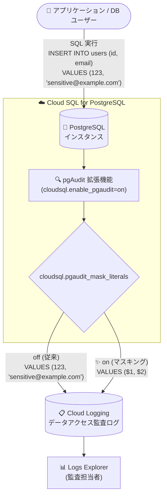

# Cloud SQL for PostgreSQL: pgAudit によるログ内の機密リテラルのマスキング

**リリース日**: 2026-09-29

**サービス**: Cloud SQL for PostgreSQL

**機能**: pgAudit 拡張機能による監査ログ内のリテラル値マスキング

**ステータス**: Changed

📊 [このアップデートのインフォグラフィックを見る](https://takech9203.github.io/google-cloud-news-summary/20260929-cloud-sql-postgresql-pgaudit-sensitive-data-filtering.html)

## 概要

Cloud SQL for PostgreSQL で、pgAudit 拡張機能を使用して、パスワードやシークレットなどの機密情報を示す可能性のある文字列リテラルがログクエリ結果に表示されるのを防止できるようになりました。`cloudsql.pgaudit_mask_literals` データベースフラグを有効にすると、監査ログに記録される SQL 文内のリテラル値 (文字列定数、数値など) が位置プレースホルダ (`$1`, `$2` など) に置換されます。

この機能により、クエリの構造と実行された操作は監査できる一方で、クエリに埋め込まれた機密性の高いデータ値そのものはログに残らなくなります。政府機関、金融、ISO 認証などのコンプライアンス要件で SQL 操作の監査ログが求められる組織にとって、監査可能性とデータプライバシーを両立できる重要な機能強化です。

なお、今回のリリースには前バージョンに対するマイナーなバグ修正も含まれています。この pgAudit 拡張機能の機能は、メンテナンスバージョン `[PostgreSQL version].R20260712.01_RC31` 以降でサポートされます。

**アップデート前の課題**

- pgAudit のセッション監査ログには実行された SQL 文がそのまま記録されるため、クエリに埋め込まれたパスワード、個人情報、シークレットなどのリテラル値が Cloud Logging の監査ログにそのまま残るリスクがあった
- 機密データがログに混入することを避けるには、監査対象の操作クラス (`pgaudit.log`) を絞り込むなどの回避策しかなく、監査の網羅性とデータプライバシーがトレードオフになっていた
- ログに機密データが含まれると、ログの閲覧権限管理やデータプライバシーに関するコンプライアンス・規制要件への対応が難しくなっていた

**アップデート後の改善**

- `cloudsql.pgaudit_mask_literals` フラグを `on` に設定するだけで、pgAudit がログ書き込み前に SQL 文内のリテラル値を位置プレースホルダに置換するようになった
- クエリの構造 (どのテーブルにどの操作が行われたか) は引き続き監査できるため、監査の網羅性を維持したままログへの機密データ流出を防止できる
- データプライバシーに関するコンプライアンス・規制要件への対応が容易になった

## アーキテクチャ図



pgAudit 拡張機能は SQL 文を Cloud Logging のデータアクセス監査ログへ書き込む前に処理し、`cloudsql.pgaudit_mask_literals` フラグが `on` の場合はリテラル値を位置プレースホルダに置換してから記録します。

## サービスアップデートの詳細

### 主要機能

1. **リテラル値の自動マスキング**
   - `cloudsql.pgaudit_mask_literals` フラグを `on` に設定すると、pgAudit がログ書き込み前に SQL 文を処理し、識別したリテラル値 (文字列定数、数値など) を位置プレースホルダに置換する
   - 例: 元の文 `INSERT INTO users (id, email) VALUES (123, 'sensitive@example.com');` は、監査ログ上では `INSERT INTO users (id, email) VALUES ($1, $2);` として記録される

2. **監査の網羅性の維持**
   - マスキングされるのはリテラル値のみで、クエリの構造 (コマンド、対象テーブル・カラム) は引き続き記録される
   - 実行された操作の監査を維持しながら、機密性の高いデータ値のログ流出を防げる

3. **マイナーなバグ修正**
   - 今回のリリースには、pgAudit 拡張機能の前バージョンに対するマイナーなバグ修正が含まれる

## 技術仕様

### 要件

| 項目 | 詳細 |
|------|------|
| 対象サービス | Cloud SQL for PostgreSQL |
| PostgreSQL バージョン | `cloudsql.pgaudit_mask_literals` フラグは PostgreSQL 14 以降でサポート |
| メンテナンスバージョン | `[PostgreSQL version].R20260712.01_RC31` 以降 |
| 前提フラグ | `cloudsql.enable_pgaudit=on` (デフォルトは off) が必要 |
| マスキングフラグ | `cloudsql.pgaudit_mask_literals` (on / off) |
| マスキング対象 | SQL 文内の文字列定数・数値などのリテラル値 → 位置プレースホルダ (`$1`, `$2`, ...) に置換 |
| ログの出力先 | Cloud Logging のデータアクセス監査ログ (`cloudaudit.googleapis.com/data_access`) |

### マスキングの動作例

```sql
-- 元の SQL 文
INSERT INTO users (id, email) VALUES (123, 'sensitive@example.com');

-- マスキング有効時に監査ログへ記録される SQL 文
INSERT INTO users (id, email) VALUES ($1, $2);
```

## 設定方法

### 前提条件

1. Cloud SQL for PostgreSQL 14 以降のインスタンスで、対象のメンテナンスバージョン (`R20260712.01_RC31` 以降) が適用されていること
2. `cloudsql.enable_pgaudit` フラグを `on` に設定し、pgAudit 拡張機能を作成済みであること (フラグ変更時にインスタンスが再起動される点に注意)

### 手順

#### ステップ 1: pgAudit を有効化して拡張機能を作成

```bash
# pgAudit を有効化 (インスタンスが再起動される)
gcloud sql instances patch INSTANCE_NAME \
  --database-flags cloudsql.enable_pgaudit=on,pgaudit.log=all
```

その後、psql クライアントで拡張機能を作成します (Terraform での作成はサポートされません)。

```sql
CREATE EXTENSION pgaudit;
```

#### ステップ 2: リテラルマスキングを有効化

```bash
gcloud sql instances patch INSTANCE_NAME \
  --database-flags cloudsql.enable_pgaudit=on,pgaudit.log=all,cloudsql.pgaudit_mask_literals=on
```

`gcloud sql instances patch` の `--database-flags` は既存のフラグを上書きするため、維持したいフラグをすべて指定します。無効化する場合は `cloudsql.pgaudit_mask_literals=off` を設定します。

#### ステップ 3: 監査ログの確認

Logs Explorer で以下のクエリを使用して pgAudit ログを確認できます (プロジェクトでデータアクセス監査ログの有効化が必要です)。

```
resource.type="cloudsql_database"
logName="projects/<your-project-name>/logs/cloudaudit.googleapis.com%2Fdata_access"
protoPayload.request.@type="type.googleapis.com/google.cloud.sql.audit.v1.PgAuditEntry"
```

## メリット

### ビジネス面

- **コンプライアンス対応の強化**: データプライバシーに関するコンプライアンス・規制要件への対応に役立つ。監査ログの要件 (政府、金融、ISO 認証など) と機密データ保護の両立が容易になる
- **情報漏えいリスクの低減**: クエリに埋め込まれたパスワード、個人情報、シークレットが監査ログ経由で漏えいするリスクを低減できる

### 技術面

- **フラグ 1 つで有効化**: `cloudsql.pgaudit_mask_literals=on` を設定するだけで、アプリケーション側の変更なしにマスキングが適用される
- **監査構造の維持**: クエリの構造や操作の種類は記録され続けるため、監査の目的 (誰がどのテーブルにどの操作をしたか) は損なわれない

## デメリット・制約事項

### 制限事項

- `cloudsql.pgaudit_mask_literals` フラグは Cloud SQL for PostgreSQL 14 以降でのみサポートされる
- 今回の pgAudit 拡張機能の機能はメンテナンスバージョン `R20260712.01_RC31` 以降が必要
- 前提となる `cloudsql.enable_pgaudit` フラグはデフォルトで無効であり、値を変更するとインスタンスが再起動される

### 考慮すべき点

- マスキングを有効にすると、監査ログからリテラル値 (実際に投入・検索された値) を確認できなくなるため、値の内容まで追跡したい調査用途とのトレードオフを検討する必要がある
- pgAudit の監査ログは Cloud Logging へ送信される前に一時的にインスタンスのディスクに書き込まれる。ディスク容量への影響を考慮し、pgAudit 使用時はストレージの自動増量の有効化が推奨される
- 明示的な `CREATE ROLE` コマンドで作成されたデータベースユーザーには監査設定を変更する権限がなく、Google Cloud コンソールまたは gcloud で作成されたユーザーのみが変更できる

## ユースケース

### ユースケース 1: 金融システムのデータベース監査

**シナリオ**: 金融規制により全 DML 操作の監査ログが必須だが、顧客の個人情報や口座情報がクエリのリテラル値としてログに残ることは避けたい。

**実装例**:
```bash
gcloud sql instances patch finance-db \
  --database-flags cloudsql.enable_pgaudit=on,pgaudit.log=read,write,cloudsql.pgaudit_mask_literals=on
```

**効果**: 読み取り・書き込み操作の監査を網羅しながら、監査ログには `VALUES ($1, $2)` のようにマスキングされた文のみが記録され、個人情報のログ流出を防止できる。

### ユースケース 2: 監査ログの閲覧権限を広く付与する運用

**シナリオ**: 開発チームやセキュリティチームなど複数の関係者が Logs Explorer で監査ログを参照する運用をしているが、ログ内に機密データが含まれると閲覧権限の管理が複雑になる。

**効果**: リテラル値がマスキングされるため、ログ閲覧者に実データが露出せず、クエリ構造ベースの監査・調査を広いメンバーで安全に実施できる。

## 料金

このアップデート自体に追加料金はありません。pgAudit で生成された監査ログは Cloud Logging のデータアクセス監査ログとして送信されるため、Cloud Logging の取り込み量に応じた料金が発生します。詳細は各料金ページを参照してください。

- [Cloud SQL の料金](https://cloud.google.com/sql/pricing)
- [Cloud Logging の料金](https://cloud.google.com/stackdriver/pricing)

## 利用可能リージョン

リージョン固有の制限はリリースノートに記載されていません。メンテナンスバージョン `R20260712.01_RC31` 以降が適用されたインスタンスで利用できます。

## 関連サービス・機能

- **Cloud Logging**: pgAudit のログはデータアクセス監査ログとして Cloud Logging に送信され、Logs Explorer で参照できる
- **Cloud Audit Logs**: pgAudit が SQL コマンド・クエリの監査を担うのに対し、Cloud SQL インスタンスに対する管理・メンテナンス操作の監査には Cloud Audit Logs を使用する
- **Cloud SQL データベースフラグ**: `cloudsql.enable_pgaudit` や `cloudsql.pgaudit_mask_literals` などのフラグは、コンソール・gcloud CLI・Cloud SQL Admin API から設定できる

## 参考リンク

- 📊 [インフォグラフィック](https://takech9203.github.io/google-cloud-news-summary/20260929-cloud-sql-postgresql-pgaudit-sensitive-data-filtering.html)
- [公式リリースノート](https://docs.cloud.google.com/release-notes#September_29_2026)
- [ドキュメント: Audit for PostgreSQL using pgAudit](https://docs.cloud.google.com/sql/docs/postgres/pg-audit)
- [ドキュメント: Configure database flags](https://cloud.google.com/sql/docs/postgres/flags)
- [料金ページ](https://cloud.google.com/sql/pricing)

## まとめ

Cloud SQL for PostgreSQL の pgAudit リテラルマスキングは、「監査ログの網羅性」と「機密データの保護」というこれまでトレードオフになりがちだった 2 つの要件を、フラグ 1 つで両立できるアップデートです。pgAudit を利用してコンプライアンス対応をしているチームは、インスタンスのメンテナンスバージョン (`R20260712.01_RC31` 以降) と PostgreSQL バージョン (14 以降) を確認のうえ、`cloudsql.pgaudit_mask_literals` フラグの有効化を検討することを推奨します。

---

**タグ**: Cloud SQL, PostgreSQL, pgAudit, 監査ログ, セキュリティ, コンプライアンス, Cloud Logging, データプライバシー
