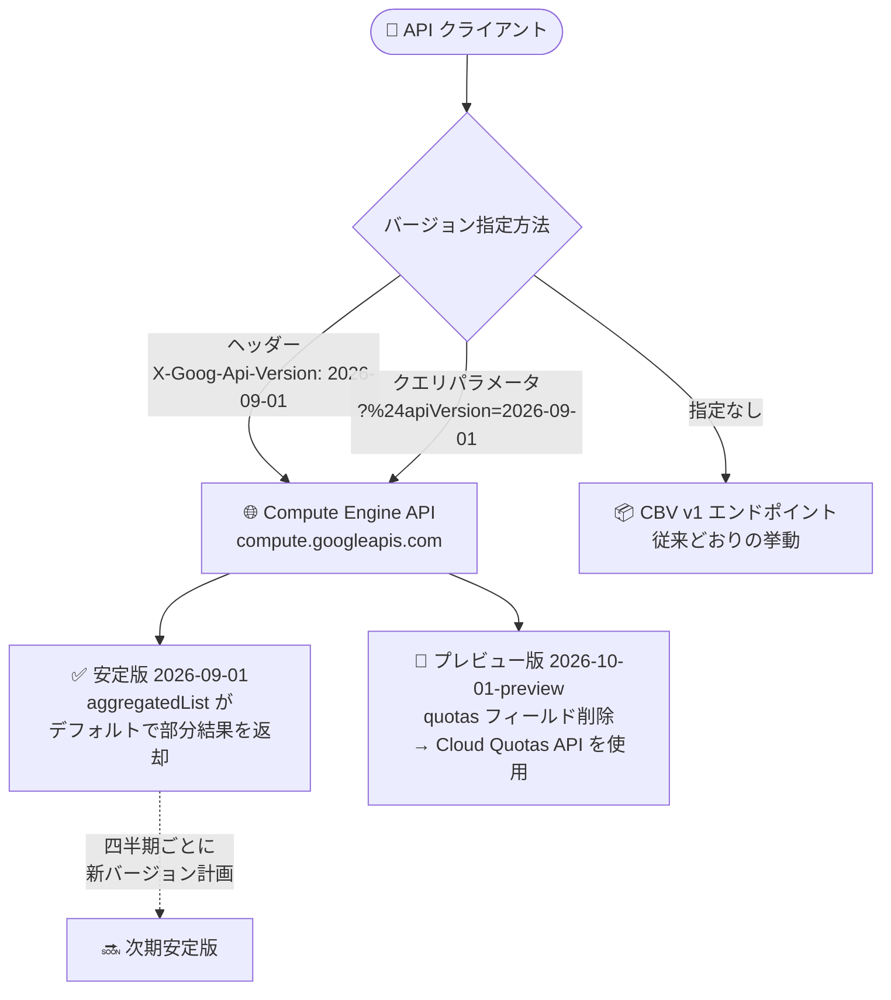

# Compute Engine: API インターフェースベースバージョニング (IBV) GA と日付ベース API バージョンの提供開始

**リリース日**: 2026-09-29

**サービス**: Compute Engine

**機能**: API インターフェースベースバージョニング (IBV) / API バージョン 2026-09-01 / API バージョン 2026-10-01-preview

**ステータス**: GA (IBV、API バージョン 2026-09-01) / Preview (API バージョン 2026-10-01-preview)

📊 [このアップデートのインフォグラフィックを見る](https://takech9203.github.io/google-cloud-news-summary/20260929-compute-engine-api-interface-based-versioning.html)

## 概要

Compute Engine API のインターフェースベースバージョニング (IBV: Interface-based versioning) が一般提供 (GA) になりました。IBV では、リクエストで日付ベースの特定 API バージョン (例: `2026-09-01`) を指定することで、API の変更を自分のスケジュールで採用できます。従来のチャネルベースバージョニング (CBV: Channel-based versioning、`v1` / `beta` / `alpha`) は引き続き利用可能で、既存の実装には影響しません。

あわせて、最初の安定版となる Compute Engine API バージョン **2026-09-01** が GA になりました。このバージョンでは、`aggregatedList` メソッドがスコープに到達できない場合にデフォルトで部分的な結果 (partial results) を返すようになり、`returnPartialSuccess` クエリパラメータは `aggregatedList` および `list` メソッドから廃止されました。

さらに、プレビュー版の API バージョン **2026-10-01-preview** も提供開始されました。このバージョンでは、`projects.get`、`regions.get`、`regions.list` メソッドのレスポンスから `quotas` フィールドが削除され、クォータ情報の確認・管理には Cloud Quotas API を使用します。

**アップデート前の課題**

- 従来の CBV では `v1` / `beta` / `alpha` のリリースが長期間存続し、インプレース更新が行われるため、API の挙動やレスポンスペイロードが利用者の意図しないタイミングで変化する可能性があった
- API の破壊的変更への追従タイミングを利用者側でコントロールする仕組みがなかった
- `aggregatedList` の部分的な結果の返却はオプトイン (`returnPartialSuccess` のデフォルトは `false`) であり、一部スコープへの到達失敗がリクエスト全体の失敗につながり得た

**アップデート後の改善**

- リクエストに日付ベースの API バージョンを指定することで、API とそのリクエスト/レスポンスペイロードの挙動が意図したバージョンに準拠することを保証できるようになった
- 新しいサービス機能へのアップグレードを利用者自身のスケジュールで行えるようになった
- API バージョン 2026-09-01 では、スコープに到達できない場合でも `aggregatedList` がデフォルトで部分的な結果を返すようになり、可用性が向上した
- 安定版バージョンは標準の Google Cloud 非推奨ポリシーのもとで永続的に維持され、本番システムの信頼性を確保できる

## アーキテクチャ図



IBV では、クライアントが `X-Goog-Api-Version` ヘッダーまたは `$apiVersion` クエリパラメータで日付ベースのバージョンを指定し、指定がない場合は従来の CBV `v1` エンドポイントの挙動となります。

## サービスアップデートの詳細

### 主要機能

1. **インターフェースベースバージョニング (IBV) の GA**
   - 個々のインターフェース・メソッド・リソースがバージョニングされ、段階的かつ独立して進化できる方式
   - リクエストで `$apiVersion` クエリパラメータまたは `X-Goog-Api-Version` ヘッダーにより対象バージョンを指定 (AIP-184 に準拠)
   - IBV は CBV に取って代わる (supersede) 位置づけだが、既存の CBV 実装は影響を受けず、継続利用が可能
   - バージョンを指定しないリクエストは CBV `v1` エンドポイントの挙動がデフォルトとなる
   - Google Cloud コンソールでの有効化作業は不要 (Compute Engine API でデフォルト有効)

2. **API バージョン 2026-09-01 (GA / 安定版)**
   - スコープに到達できない場合、`aggregatedList` メソッドがデフォルトで部分的な結果を返す
   - `returnPartialSuccess` クエリパラメータは `aggregatedList` および `list` メソッドから廃止
   - 安定版は AIP-180 で定義される厳格な互換性を維持し、同一バージョンの新しい安定版リリースが既存機能を破壊したりコードの書き換えを要求したりしない

3. **API バージョン 2026-10-01-preview (Preview)**
   - `projects.get`、`regions.get`、`regions.list` メソッドのレスポンスから `quotas` フィールドが削除
   - クォータ情報の表示・管理には Cloud Quotas API を使用する
   - プレビュー版は最新の安定版のすべての機能に加えて、新たに追加された実験的機能を含む

## 技術仕様

### バージョニング方式の比較

| 項目 | CBV (チャネルベース) | IBV (インターフェースベース) |
|------|---------------------|------------------------------|
| バージョン識別子 | `v1` / `beta` / `alpha` | 日付形式 `YYYY-MM-DD` (例: `2026-09-01`)、プレビューは `-preview` 付き (例: `2026-10-01-preview`) |
| 更新方法 | 長期存続のリリースにインプレース更新 | インターフェース・メソッド・リソース単位で独立して進化 |
| バージョン指定 | URL パス (`/compute/v1/...`) | `$apiVersion` クエリパラメータまたは `X-Goog-Api-Version` ヘッダー |
| サポート期間 | 既存実装は影響なく継続利用可能 | 安定版は標準の Google Cloud 非推奨ポリシーのもとで永続的に維持 |
| リリース頻度 | - | 安定版は四半期ごとのリリースを計画、プレビュー版は随時 |
| 新機能へのアクセス | IBV で提供される新機能にはアクセス不可 | 新バージョンの採用タイミングを利用者が制御 |

### IBV バージョンポリシー

| バージョン種別 | 特徴 |
|---------------|------|
| 安定版 (Stable) | `YYYY-MM-DD` 形式。AIP-180 に基づく厳格な互換性を維持。長期サポートされ、日常的なタスクには単一の安定版の利用で十分 |
| プレビュー版 (Preview) | 日付に `-preview` タグを付加。最新安定版の全機能 + 実験的機能を含む。過去・将来リリースとの互換性は保証されず、ミッションクリティカルな本番環境での利用は非推奨。安定版への昇格時に機能が変更・削除される可能性あり |

### リクエストでのバージョン指定例

**クエリパラメータで指定** (シェルでは `$` を `%24` に URL エンコードすることが推奨):

```bash
curl -X POST -H "Authorization: Bearer [OAUTH_TOKEN]" \
  -H "Content-Type: application/json" \
  "https://compute.googleapis.com/compute/v1/projects/PROJECT_ID/zones/ZONE/instances?%24apiVersion=2026-09-01" \
  -d '{ ... }'
```

**ヘッダーで指定**:

```bash
curl -X POST -H "Authorization: Bearer [OAUTH_TOKEN]" \
  -H "Content-Type: application/json" \
  -H "X-Goog-Api-Version: 2026-09-01" \
  "https://compute.googleapis.com/compute/v1/projects/PROJECT_ID/zones/ZONE/instances" \
  -d '{ ... }'
```

### ツール・クライアントライブラリでの扱い

| ツール | IBV での扱い |
|--------|-------------|
| Cloud Client Libraries | 各ライブラリリリースが特定の日付ベース API バージョンに直接対応。新機能を利用するにはパッケージを最新リリースに更新。安定版/プレビュー版の API リリースにあわせてライブラリも公開される |
| gcloud CLI | 標準コマンド (例: `gcloud compute instances create`) は安定版 API バージョンを対象。早期アクセス機能は `gcloud preview compute ...` の preview グループで提供され、契約変更の可能性を示す警告が表示される |
| Terraform | Google Cloud Terraform Provider がバージョニングを抽象化。手動のバージョンヘッダー設定は不要。プレビュー機能には `google-beta` プロバイダーを使用 |
| Cloud Audit Logs | API バージョンは `protoPayload.requestMetadata.callerSuppliedUserAgent` およびリクエストヘッダー/クエリパラメータに記録される |

## 設定方法

### 前提条件

1. Compute Engine API が有効なプロジェクト (IBV はデフォルトで有効、追加の有効化作業は不要)
2. 認証設定 (gcloud CLI または OAuth トークン)

### 手順

#### ステップ 1: 利用する API バージョンを選択する

[Compute Engine versioning guide](https://docs.cloud.google.com/compute/docs/api/how-tos/api-versioning-guide) と各バージョンの REST リファレンス ([2026-09-01](https://cloud.google.com/compute/docs/reference/rest/2026-09-01)、[2026-10-01-preview](https://cloud.google.com/compute/docs/reference/rest/2026-10-01-preview)) を確認し、本番環境には安定版、実験には プレビュー版を選択します。

#### ステップ 2: リクエストにバージョンを指定する

```bash
# ヘッダーで指定する例 (インスタンス一覧の取得)
curl -H "Authorization: Bearer $(gcloud auth print-access-token)" \
  -H "X-Goog-Api-Version: 2026-09-01" \
  "https://compute.googleapis.com/compute/v1/projects/PROJECT_ID/zones/ZONE/instances"
```

`X-Goog-Api-Version` ヘッダーまたは `%24apiVersion` クエリパラメータで対象バージョンを指定します。指定しない場合は CBV `v1` の挙動になります。

#### ステップ 3: バージョン固有の挙動変更にコードを対応させる

2026-09-01 を採用する場合は、`aggregatedList` がデフォルトで部分結果を返すこと、および `returnPartialSuccess` パラメータが利用できなくなったことを前提にエラーハンドリングを見直します。2026-10-01-preview を試す場合は、`quotas` フィールドの参照箇所を Cloud Quotas API に置き換えます。

## メリット

### ビジネス面

- **変更採用の主導権**: どのバージョンでリクエストを処理するかを利用者が選択できるため、新機能へのアップグレードを自社のリリース計画にあわせて実施できる
- **本番システムの安定稼働**: 安定版は長期間サポートされ、実行中のアプリケーションを意図しない API 変更から保護できる

### 技術面

- **挙動の予測可能性**: API の挙動とリクエスト/レスポンスペイロードが指定したバージョンに準拠することを保証できる
- **部分結果によるレジリエンス向上**: 2026-09-01 では一部スコープに到達できなくても `aggregatedList` が取得可能な結果を返すため、全体失敗を回避できる
- **移行の強制なし**: 既存の CBV `v1` リクエストはこれまでどおり動作し、段階的な移行が可能

## デメリット・制約事項

### 制限事項

- CBV (`v1`) のまま利用を続ける場合、IBV API で提供される新機能にはアクセスできない
- プレビュー版は過去・将来リリースとの互換性が保証されず、安定版への昇格時に機能が変更・削除される可能性がある
- 2026-09-01 では `returnPartialSuccess` クエリパラメータが `aggregatedList` / `list` メソッドで利用できなくなるため、同パラメータに依存するコードは修正が必要
- 2026-10-01-preview では `projects.get` / `regions.get` / `regions.list` のレスポンスに `quotas` フィールドが含まれないため、クォータ参照は Cloud Quotas API への移行が必要

### 考慮すべき点

- シェルから `$apiVersion` クエリパラメータを使う場合、`$` がシェル変数として展開されるため、ダブルクォート内では `%24` に URL エンコードすることが推奨される
- プレビュー版はミッションクリティカルな本番環境での使用が推奨されない
- 新しい安定版 IBV バージョンは四半期ごとのリリースが計画されており、継続的なバージョン追従の運用プロセスを検討する必要がある

## ユースケース

### ユースケース 1: 本番ワークロードを API 変更から保護しつつ計画的に移行

**シナリオ**: Compute Engine API を直接呼び出す社内のインフラ自動化ツールを運用しており、API の挙動変更によるリグレッションを避けたい。

**実装例**:
```bash
# すべての API 呼び出しに安定版バージョンを明示
curl -H "Authorization: Bearer $(gcloud auth print-access-token)" \
  -H "X-Goog-Api-Version: 2026-09-01" \
  "https://compute.googleapis.com/compute/v1/projects/PROJECT_ID/aggregated/instances"
```

**効果**: API の挙動が指定バージョンに固定され、新バージョンへの移行はテストを経て任意のタイミングで実施できる。

### ユースケース 2: マルチリージョン環境でのインベントリ収集の耐障害性向上

**シナリオ**: `aggregatedList` で全リージョンの VM インベントリを定期収集しているが、一部スコープへの到達失敗で収集ジョブ全体が失敗することがあった。

**効果**: API バージョン 2026-09-01 ではスコープ到達不能時にデフォルトで部分結果が返るため、`returnPartialSuccess` を個別指定することなく、到達可能なスコープの結果で処理を継続できる。

### ユースケース 3: クォータ管理の Cloud Quotas API への移行検証

**シナリオ**: `regions.get` のレスポンスに含まれる `quotas` フィールドでリージョンクォータを監視しているが、将来の API 変更に備えたい。

**効果**: 2026-10-01-preview を検証環境で試用し、`quotas` フィールドが削除された状態での動作を確認したうえで、クォータ参照を Cloud Quotas API ベースの実装に移行できる。

## 関連サービス・機能

- **Cloud Quotas API**: API バージョン 2026-10-01-preview で `quotas` フィールドが削除されたことに伴う、クォータ情報の表示・管理の移行先
- **Cloud Client Libraries**: 各リリースが特定の日付ベース API バージョンに対応し、REST 呼び出しの構築・パースを抽象化
- **gcloud CLI**: 安定版コマンドと `gcloud preview compute` グループで安定版/プレビュー版 API に対応
- **Terraform (Google Cloud Provider)**: API バージョニングを抽象化し、プレビュー機能は `google-beta` プロバイダーで提供
- **Cloud Audit Logs**: リクエストで指定した API バージョンが監査ログに記録される

## 参考リンク

- 📊 [インフォグラフィック](https://takech9203.github.io/google-cloud-news-summary/20260929-compute-engine-api-interface-based-versioning.html)
- [公式リリースノート](https://docs.cloud.google.com/release-notes#September_29_2026)
- [Compute Engine versioning guide: APIs, client libraries, and tools](https://docs.cloud.google.com/compute/docs/api/how-tos/api-versioning-guide)
- [Creating API requests and handling responses](https://docs.cloud.google.com/compute/docs/api/how-tos/api-requests-responses)
- [Compute Engine API 2026-09-01 REST リファレンス](https://cloud.google.com/compute/docs/reference/rest/2026-09-01)
- [Compute Engine API 2026-10-01-preview REST リファレンス](https://cloud.google.com/compute/docs/reference/rest/2026-10-01-preview)
- [Cloud Quotas の概要](https://cloud.google.com/docs/quotas/overview)

## まとめ

Compute Engine API の IBV GA により、日付ベースのバージョン指定で API の挙動を固定し、変更の採用タイミングを利用者が完全にコントロールできるようになりました。Compute Engine API を直接利用しているチームは、まず安定版 2026-09-01 の採用を検討し、`returnPartialSuccess` 依存コードの見直しと、将来に向けた Cloud Quotas API への移行準備を進めることを推奨します。

---

**タグ**: #ComputeEngine #API #Versioning #IBV #GA #Preview #CloudQuotas
