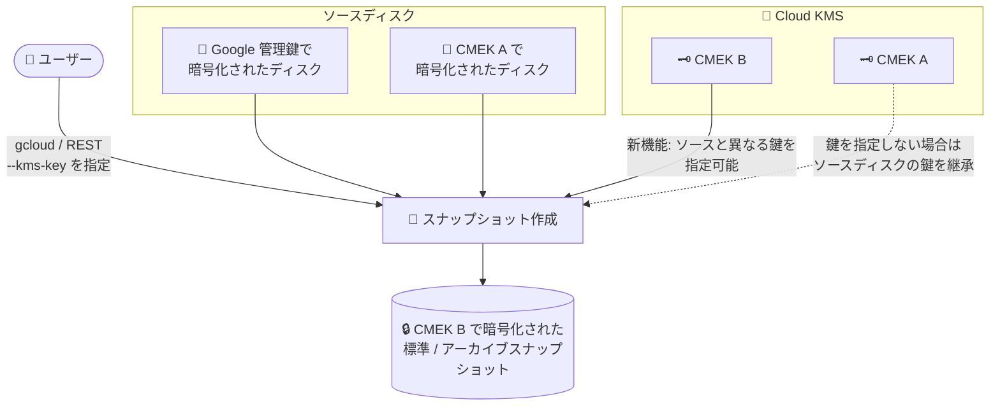

# Compute Engine: CMEK 暗号化スナップショットの柔軟な作成 (GA)

**リリース日**: 2026-09-29

**サービス**: Compute Engine

**機能**: ソースディスクと異なる鍵構成での CMEK 暗号化スナップショット作成

**ステータス**: GA (一般提供)

📊 [このアップデートのインフォグラフィックを見る](https://takech9203.github.io/google-cloud-news-summary/20260929-compute-engine-cmek-snapshots-ga.html)

## 概要

Compute Engine で、ディスクの標準スナップショットまたはアーカイブスナップショットを作成する際に、ソースディスクの暗号化構成に依存せず顧客管理の暗号鍵 (CMEK) で保護できる機能が一般提供 (GA) になりました。ソースディスクが CMEK で保護されていない場合 (Google 所有・管理鍵で暗号化されている場合) でも、スナップショットを CMEK で暗号化できます。

さらに、ソースディスクが CMEK で保護されている場合は、ソースディスクとは**異なる CMEK** を指定して新しいスナップショットを暗号化することも可能です。CMEK を指定しない場合は、従来どおりソースディスクと同じ鍵でスナップショットが自動的に暗号化されます。

このアップデートは、コンプライアンス要件により鍵管理の統制が求められる金融・医療・公共分野の組織や、プロジェクト移行・鍵の世代管理の過程でバックアップデータの暗号鍵をディスクと分離して運用したい組織にとって重要な機能強化です。

**アップデート前の課題**

- CMEK で暗号化されたスナップショットを作成するには、ソースディスク自体が CMEK で保護されている必要があり、Google 所有・管理鍵で暗号化されたディスクのスナップショットを CMEK で保護できなかった
- CMEK で保護されたディスクのスナップショットは、ソースディスクと同じ鍵構成に依存しており、バックアップデータに別の鍵を適用する柔軟性がなかった
- ディスクの暗号化構成を変更せずにバックアップだけ鍵統制の対象にする、といった段階的な CMEK 導入が難しかった

**アップデート後の改善**

- ソースディスクが CMEK で保護されていなくても、標準 / アーカイブスナップショットを CMEK で暗号化できるようになった
- ソースディスクが CMEK で保護されている場合、ソースディスクとは異なる CMEK を指定してスナップショットを暗号化できるようになった
- 既存ディスクの暗号化構成を変更することなく、バックアップ (スナップショット) から段階的に CMEK による鍵統制を導入できるようになった

## アーキテクチャ図



ソースディスクが Google 管理鍵・CMEK のどちらで暗号化されていても、Cloud KMS 上の任意の CMEK を指定してスナップショットを暗号化できます。鍵を指定しない場合は、ソースディスクの鍵構成が継承されます。

## サービスアップデートの詳細

### 主要機能

1. **非 CMEK ディスクからの CMEK スナップショット作成**
   - Google 所有・管理鍵で暗号化されたディスクから、CMEK で保護された標準 / アーカイブスナップショットを作成できる
   - ただし、ソースディスクが顧客指定の暗号鍵 (CSEK) で保護されている場合は、CMEK スナップショットを作成できない

2. **ソースディスクと異なる CMEK の指定**
   - ソースディスクが CMEK で暗号化されている場合、同じ CMEK または別の CMEK を選択してスナップショットを暗号化できる
   - `--kms-key` フラグを指定しない場合は、ソースディスクの鍵で自動的に暗号化される

3. **標準 / アーカイブ両スナップショットタイプに対応**
   - `--snapshot-type` で `STANDARD` または `ARCHIVE` を選択可能 (未指定時は標準スナップショット)
   - CMEK で暗号化されたディスクのスナップショットも増分 (インクリメンタル) 方式で作成される

4. **スナップショットの CMEK の変更・ローテーション**
   - 既存の標準 / アーカイブスナップショットの CMEK は、`gcloud compute snapshots update-kms-key` コマンドまたは REST API で別の CMEK に変更できる
   - 変更時はデータ暗号鍵 (DEK) が新しい鍵で再暗号化されるため、ダウンタイムや実行中ワークロードへの性能影響はない

## 技術仕様

### 機能の要点

| 項目 | 詳細 |
|------|------|
| 対象スナップショットタイプ | 標準スナップショット、アーカイブスナップショット |
| ソースディスクの条件 | CSEK (顧客指定鍵) で保護されたディスク以外の任意のディスク |
| 異なる CMEK の指定方法 | gcloud CLI または REST のみ (Google Cloud コンソールは不可) |
| コンソールでの動作 | ソースディスクと同じ鍵で自動的に暗号化される |
| 鍵のロケーション | グローバルスコープのスナップショットは任意のロケーションの鍵で暗号化可能 (リソースと同じロケーションの鍵の使用を推奨) |
| 鍵の作成方法 | Cloud KMS で手動作成、または Cloud KMS Autokey による自動プロビジョニング |

### 必要な権限

| 権限 | 対象 |
|------|------|
| `compute.snapshots.create` | プロジェクト |
| `compute.disks.createSnapshot` | ソースディスク |

## 設定方法

### 前提条件

1. Cloud KMS でキーリングと鍵を作成済みであること (または Cloud KMS Autokey を構成済みであること)
2. ソースディスクが CSEK (顧客指定の暗号鍵) で保護されていないこと
3. `compute.snapshots.create` および `compute.disks.createSnapshot` 権限を持っていること

### 手順

#### ステップ 1: CMEK を指定してスナップショットを作成

```bash
gcloud compute snapshots create SNAPSHOT_NAME \
    --source-disk-zone=SOURCE_ZONE \
    --source-disk=SOURCE_DISK_NAME \
    --snapshot-type=SNAPSHOT_TYPE \
    --kms-key=projects/KMS_PROJECT_ID/locations/KEY_REGION/keyRings/KEY_RING/cryptoKeys/SNAPSHOT_KEY
```

- `SNAPSHOT_TYPE`: `STANDARD` または `ARCHIVE` (未指定時は `STANDARD`)
- `--kms-key`: スナップショットの暗号化に使用する Cloud KMS 鍵。ソースディスクの鍵と異なる鍵を指定できる
- ソースディスクが CMEK で暗号化されていて `--kms-key` を省略した場合、ソースディスクと同じ鍵で暗号化される

#### ステップ 2: (必要に応じて) 保存先ストレージロケーションを指定

```bash
gcloud compute snapshots create SNAPSHOT_NAME \
    --source-disk-zone=SOURCE_ZONE \
    --source-disk=SOURCE_DISK_NAME \
    --snapshot-type=SNAPSHOT_TYPE \
    --storage-location=STORAGE_LOCATION \
    --kms-key=projects/KMS_PROJECT_ID/locations/KEY_REGION/keyRings/KEY_RING/cryptoKeys/SNAPSHOT_KEY
```

スナップショット設定で定義されたデフォルトロケーションを上書きしたい場合のみ `--storage-location` を指定します。

#### ステップ 3: (必要に応じて) 既存スナップショットの CMEK を変更

```bash
gcloud compute snapshots update-kms-key SNAPSHOT_NAME \
    --kms-key=projects/KEY_PROJECT_ID/locations/global/keyRings/KEY_RING/cryptoKeys/NEW_KEY_NAME
```

すでに保護に使用している鍵と同じ CMEK を指定した場合は、その鍵のプライマリバージョンへのローテーションが実行されます。

## メリット

### ビジネス面

- **コンプライアンス対応の柔軟性**: バックアップデータ (スナップショット) に対して、ディスクとは独立した鍵統制を適用できるため、監査・規制要件への対応がしやすくなる
- **段階的な CMEK 導入**: 既存ディスクの暗号化構成を変更する大掛かりな移行をせずに、まずスナップショットから CMEK 保護を開始できる
- **プロジェクト移行・組織変更への対応**: 移行先の鍵ポリシーに合わせた鍵でスナップショットを暗号化でき、鍵変更もダウンタイムなしで実施できる

### 技術面

- **鍵の分離**: ディスク用とバックアップ用で鍵を分離することで、鍵の侵害時の影響範囲 (ブラスト半径) を限定できる
- **増分スナップショットの維持**: CMEK で暗号化しても、スナップショットは増分方式で作成されるため、ストレージ効率は維持される
- **Cloud KMS Autokey との併用**: Autokey を使用すれば、キーリング・鍵・サービスアカウントの事前プロビジョニングなしで CMEK を利用開始できる

## デメリット・制約事項

### 制限事項

- ソースディスクが CSEK (顧客指定の暗号鍵) で保護されている場合、CMEK スナップショットは作成できない
- ソースディスクと異なる CMEK でスナップショットを作成する操作、および CMEK の変更・ローテーションは gcloud CLI または REST のみで、Google Cloud コンソールでは実行できない (コンソールではソースディスクと同じ鍵で自動的に暗号化される)
- CMEK で暗号化されたスナップショットを Google 所有・管理鍵に戻すことはできない (新しいディスクを作成し、そのディスクのスナップショットを作成する必要がある)
- Terraform provider for Google Cloud で作成・管理している CMEK 暗号化ディスク / スナップショットでは、CMEK の変更・ローテーションを行えない (gcloud CLI や REST での変更も行うべきではない)
- リージョンスコープのスナップショット (Preview) を CMEK 暗号化ディスクから作成する場合は、スナップショットと同じロケーションのリージョン CMEK が必要

### 考慮すべき点

- CMEK の利用には Cloud KMS の鍵管理コスト (鍵バージョンの保持、暗号化オペレーション) が別途発生する
- Cloud KMS 鍵を無効化・破棄すると、その鍵で暗号化されたスナップショットからの復元ができなくなるため、鍵のライフサイクル管理 (IAM、ローテーションポリシー) を整備する必要がある
- 鍵はリソースと同じロケーションに配置することが推奨される (レイテンシ低減と、複数の障害ドメインへの依存回避のため)

## ユースケース

### ユースケース 1: 既存の非 CMEK 環境における鍵統制付きバックアップの導入

**シナリオ**: 金融機関が、Google 管理鍵で運用中の既存 VM ディスクはそのままに、監査要件を満たすためバックアップ (スナップショット) のみを自社管理の鍵で保護したい。

**実装例**:
```bash
gcloud compute snapshots create audit-backup-20260929 \
    --source-disk-zone=asia-northeast1-a \
    --source-disk=prod-db-disk \
    --snapshot-type=ARCHIVE \
    --kms-key=projects/security-project/locations/asia-northeast1/keyRings/backup-ring/cryptoKeys/backup-key
```

**効果**: ディスクの再作成や移行なしに、長期保存用のアーカイブスナップショットへ CMEK による鍵統制を適用でき、監査対応を迅速に開始できる。

### ユースケース 2: プロジェクト移行時のバックアップ鍵の切り替え

**シナリオ**: 組織再編に伴い、CMEK A で暗号化されたディスクのバックアップを、移行先組織の鍵ポリシーに準拠した CMEK B で保護する必要がある。

**効果**: スナップショット作成時に `--kms-key` で移行先の CMEK を指定するだけで、ソースディスクの暗号化構成を変更せずに新しい鍵ポリシーに準拠したバックアップを作成できる。既存スナップショットも `update-kms-key` でダウンタイムなしに鍵を変更できる。

## 料金

この機能自体に追加料金はありませんが、以下のコストが発生します。

- **スナップショットのストレージ料金**: 標準 / アーカイブスナップショットのサイズに応じた料金。詳細は [ディスクとイメージの料金ページ](https://cloud.google.com/compute/disks-image-pricing#disk-snapshot-pricing) を参照
- **Cloud KMS の料金**: 鍵バージョンの保持および暗号化オペレーションに応じた料金。詳細は [Cloud KMS の料金ページ](https://cloud.google.com/kms/pricing) を参照
- **ネットワーク料金**: ソースディスクと異なるリージョンにスナップショットを作成・復元する場合に発生

## 利用可能リージョン

スナップショットはデフォルトでグローバルリソースであり、グローバルスコープのスナップショットは任意のロケーションの Cloud KMS 鍵で暗号化できます。レイテンシ低減のため、保護対象リソースと同じロケーションの鍵の使用が推奨されています。

## 関連サービス・機能

- **Cloud KMS**: CMEK の作成・管理を行う鍵管理サービス。キーリング・鍵の手動作成のほか、Autokey による自動プロビジョニングにも対応
- **Cloud KMS Autokey**: Compute Engine リソース作成時にキーリング・鍵・サービスアカウントをオンデマンドで自動生成し、CMEK 運用を簡素化
- **スナップショット設定 (Snapshot Settings)**: スナップショットのデフォルト保存先ロケーションをプロジェクト単位で定義
- **スナップショットスケジュール**: 標準スナップショットの定期的な自動作成 (アーカイブスナップショットはスケジュール非対応)

## 参考リンク

- 📊 [インフォグラフィック](https://takech9203.github.io/google-cloud-news-summary/20260929-compute-engine-cmek-snapshots-ga.html)
- [公式リリースノート](https://docs.cloud.google.com/release-notes#September_29_2026)
- [ドキュメント: CMEK で暗号化されたスナップショットの作成](https://docs.cloud.google.com/compute/docs/disks/customer-managed-encryption)
- [ドキュメント: ディスクスナップショットについて](https://docs.cloud.google.com/compute/docs/disks/snapshots)
- [料金ページ (ディスクとイメージ)](https://cloud.google.com/compute/disks-image-pricing#disk-snapshot-pricing)
- [料金ページ (Cloud KMS)](https://cloud.google.com/kms/pricing)

## まとめ

ソースディスクの暗号化構成に縛られずにスナップショットへ CMEK を適用できるようになったことで、バックアップデータの鍵統制を柔軟かつ段階的に導入できるようになりました。コンプライアンス要件で CMEK の適用範囲拡大を検討している組織は、まずアーカイブ / 標準スナップショットから CMEK 保護を開始し、Cloud KMS の鍵ライフサイクル管理 (IAM・ローテーション) と併せて運用設計を進めることを推奨します。

---

**タグ**: #ComputeEngine #CMEK #CloudKMS #スナップショット #バックアップ #セキュリティ #GA
