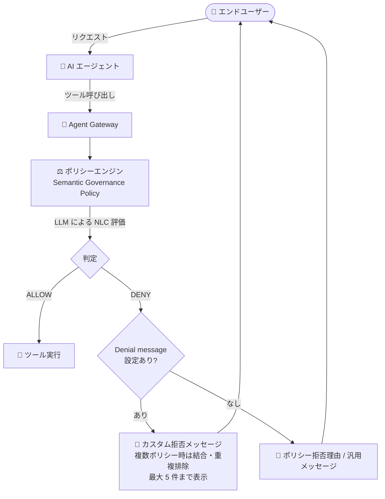

# Gemini Enterprise Agent Platform: セマンティックガバナンスポリシーのカスタム拒否メッセージ

**リリース日**: 2026-09-29

**サービス**: Gemini Enterprise Agent Platform

**機能**: セマンティックガバナンスポリシーのカスタム拒否メッセージ (Denial message)

**ステータス**: Feature

📊 [このアップデートのインフォグラフィックを見る](https://takech9203.github.io/google-cloud-news-summary/20260929-gemini-agent-platform-semantic-governance-denial-messages.html)

## 概要

Gemini Enterprise Agent Platform のセマンティックガバナンスポリシー (Semantic governance policy) に、固定の**カスタム拒否メッセージ (Denial message)** を設定できるようになりました。ポリシーがリクエストを拒否 (DENY) した際、ポリシーエンジンが生成する拒否理由 (rationale) の代わりに、管理者が設定した最大 1,000 文字の固定メッセージをエンドユーザーに表示できます。

セマンティックガバナンスポリシーは、AI エージェントのツール呼び出しやスキル実行が、ユーザーの意図と組織のビジネスルールに沿っているかを LLM でランタイム評価する保護サービスです。従来、ポリシーがアクションをブロックすると、制約 (Natural Language Constraint) の詳細を引用した拒否理由がエンドユーザーに提示される可能性があり、情報漏えいリスク (Information exposure risk) として公式ドキュメントでも注意喚起されていました。今回のアップデートにより、内部のビジネスルールを露出させずに、ユーザーフレンドリーな拒否メッセージを返せるようになります。

設定は Google Cloud コンソールのポリシー作成・編集ページのほか、REST API ではポリシーリソースの `agentResponseCustomization.denialMessage` フィールド、gcloud CLI では `gcloud beta ai semantic-governance-policies create` / `update` の `--agent-response-denial-message` フラグで行えます。エージェントの管理者、セキュリティ・コンプライアンス担当者が対象のアップデートです。

**アップデート前の課題**

- ポリシーがリクエストを拒否すると、制約の詳細を引用した拒否理由 (例: 「リクエストされた返金額は、許可されている上限 $100 を超えています」) がエンドユーザーに表示される可能性があり、制約に含まれる社内ルールや上限値などの情報が露出するリスクがあった
- 拒否理由の露出を防ぐには、エージェントのアプリケーションコード側で拒否レスポンスをインターセプトし、理由文を編集・置換するロジックを自前で実装する必要があった
- エンドユーザーに表示される拒否時のメッセージ内容をポリシー単位で制御する手段がなかった

**アップデート後の改善**

- ポリシーごとに最大 1,000 文字の固定拒否メッセージを設定でき、拒否理由の代わりにエンドユーザーへ表示されるようになった
- コンソール、REST API (`agentResponseCustomization.denialMessage`)、gcloud CLI (`--agent-response-denial-message`) のいずれからも設定・更新が可能になった
- 1 つのリクエストが複数ポリシーで拒否された場合も、ポリシーエンジンが各ポリシーの拒否メッセージを結合・重複排除し、メッセージ未設定のポリシーには汎用メッセージでフォールバックするため、一貫したユーザー体験を提供できるようになった

## アーキテクチャ図



エージェントのツール呼び出しは Agent Gateway 経由でポリシーエンジンに評価され、DENY 判定時には拒否メッセージが設定されていればその固定メッセージが、未設定であれば従来どおりの拒否理由 (または汎用メッセージ) がエンドユーザーに返されます。

## サービスアップデートの詳細

### 主要機能

1. **ポリシー単位の固定拒否メッセージ**
   - ポリシーの拒否理由 (rationale) の代わりにエンドユーザーへ表示する固定メッセージを、ポリシーごとに最大 1,000 文字で設定可能 (オプション)
   - 制約の詳細がユーザーに露出することを防ぎ、情報漏えいリスクを軽減

2. **複数の設定方法**
   - Google Cloud コンソール: ポリシーの作成・編集ページの「Denial message」フィールド
   - REST API: ポリシーリソースの `agentResponseCustomization.denialMessage` を設定
   - gcloud CLI: `gcloud beta ai semantic-governance-policies create` / `update` の `--agent-response-denial-message` フラグ

3. **複数ポリシー拒否時のメッセージ結合**
   - 1 つのリクエストが複数ポリシーで拒否された場合、各ポリシーの拒否メッセージを空行区切りで結合して表示
   - 重複するメッセージは 1 回のみ表示 (重複排除)
   - メッセージ未設定のポリシーが含まれる場合は、汎用メッセージ「This request was denied due to another business policy.」を末尾に追加
   - 1 リクエストあたり最大 5 件の拒否メッセージを表示 (超過分は省略)

## 技術仕様

### 拒否メッセージの仕様

| 項目 | 詳細 |
|------|------|
| 最大文字数 | 1,000 文字 |
| 設定単位 | セマンティックガバナンスポリシーごと (オプション) |
| REST API フィールド | `agentResponseCustomization.denialMessage` |
| gcloud フラグ | `--agent-response-denial-message` (create / update) |
| 複数ポリシー拒否時 | 空行区切りで結合、重複排除、最大 5 件表示 |
| 未設定ポリシーのフォールバック | 汎用メッセージ「This request was denied due to another business policy.」 |
| 制約 (NLC) の最大文字数 | 5,000 文字 (参考: ポリシー本体の仕様) |

### LLM によるポリシー帰属 (attribution) に関する注意

セマンティックガバナンスポリシーは LLM を使用して拒否を特定のポリシーに帰属させるため、すべてのリクエストで帰属が得られるとは限りません。拒否メッセージが設定されたポリシーが該当していても、帰属が得られない場合は汎用メッセージが返されます。また、LLM は最初の数ポリシーで拒否と判断した場合、すべてのポリシーを評価しないことがあります。

汎用メッセージのみが返された場合のトラブルシューティング:

- **エンドユーザー**: リクエストを再送信する (LLM は非決定的なため、再評価で特定ポリシーへの帰属と設定済みメッセージが返される場合がある)
- **ポリシー管理者**: ポリシー評価ログを確認する (各ログエントリにはポリシーごとの判定と理由が含まれるため、帰属が表示されない場合でもどのポリシーが拒否したかを特定できる)

## 設定方法

### 前提条件

1. Gemini Enterprise Agent Platform でセマンティックガバナンスポリシーエンジンがプロビジョニング済みで、Agent Gateway に接続されていること
2. ポリシーの対象となるエージェントが Agent Registry に登録されていること

### 手順

#### 方法 1: Google Cloud コンソール

1. Google Cloud コンソールで「Semantic governance policies」ページに移動
2. 「+ Add Policy」をクリック (既存ポリシーの場合は編集ページを開く)
3. 名前、対象エージェント、アクセスターゲット、制約 (最大 5,000 文字) を設定
4. **Denial message** フィールドに、拒否時にユーザーへ表示するメッセージ (最大 1,000 文字) を入力
5. 「Create」をクリック

#### 方法 2: gcloud CLI

```bash
# リージョナル API エンドポイントを設定
gcloud config set api_endpoint_overrides/aiplatform \
  https://LOCATION-aiplatform.googleapis.com/

# 拒否メッセージ付きでポリシーを作成
gcloud beta ai semantic-governance-policies create POLICY_ID \
  --location=LOCATION \
  --display-name="Semantic governance policy for ShippingAgent-1" \
  --agent=projects/PROJECT_ID/locations/LOCATION/agents/AGENT_ID \
  --natural-language-constraint="Always use UPS as the shipping provider for shipments within the USA. Always use DHL as the shipping provider for shipments within the EU." \
  --agent-response-denial-message="Sorry, I can only book shipments through the approved carriers for your region." \
  --project=PROJECT_ID
```

既存ポリシーには `gcloud beta ai semantic-governance-policies update` で `--agent-response-denial-message` を追加・変更できます。

#### 方法 3: REST API

ポリシーリソースに `agentResponseCustomization.denialMessage` を設定します。

```json
{
  "agentResponseCustomization": {
    "denialMessage": "Sorry, I can only book shipments through the approved carriers for your region."
  }
}
```

## メリット

### ビジネス面

- **情報漏えいリスクの軽減**: 拒否理由が制約の詳細 (社内ルール、金額上限など) を引用してユーザーに露出するリスクを、固定メッセージで置き換えることで回避できる
- **ブランドに沿ったユーザー体験**: 拒否時にユーザーへ表示する文言を組織のトーンやポリシーに合わせて統一できる

### 技術面

- **自前実装の削減**: 従来必要だった、エージェントアプリケーションコード側での拒否レスポンスのインターセプト・編集ロジックが不要になる
- **複数ポリシー拒否時の自動整形**: メッセージの結合・重複排除・フォールバックをポリシーエンジンが自動処理するため、一貫した応答を実装なしで実現できる

## デメリット・制約事項

### 制限事項

- 拒否メッセージは 1 ポリシーあたり最大 1,000 文字
- 1 リクエストあたり表示される拒否メッセージは最大 5 件 (超過分は省略)
- LLM による帰属が得られない場合、設定済みメッセージではなく汎用メッセージが返されることがある (LLM は非決定的)

### 考慮すべき点

- 拒否理由を非表示にするため、エンドユーザーが「なぜ拒否されたか」の詳細を得られなくなる。管理者はポリシー評価ログで判定・理由を確認する運用を整備する必要がある
- 拒否メッセージ未設定のポリシーが混在する場合、英語の汎用メッセージが末尾に追加されるため、全ポリシーへの設定を検討するとメッセージの一貫性が保てる
- ポリシー (制約) 自体は Service Data であり、ポリシーエンジンが理由中に制約やパラメータを引用する可能性があるため、拒否メッセージを設定しない場合は制約に機密情報を含めないことが引き続き推奨される

## ユースケース

### ユースケース 1: 返金上限ポリシーの拒否理由の秘匿

**シナリオ**: カスタマーサポートエージェントに「$100 を超える返金は承認しない」という制約を設定している。従来は拒否時に「返金額が上限 $100 を超えています」のような理由が表示され、社内の上限値がユーザーに露出していた。

**実装例**:
```bash
gcloud beta ai semantic-governance-policies update refund-limit-policy \
  --location=LOCATION \
  --agent-response-denial-message="申し訳ありませんが、このリクエストは承認できません。詳細はサポート窓口までお問い合わせください。" \
  --project=PROJECT_ID
```

**効果**: 社内の返金上限値を露出させずに、丁寧な固定メッセージでユーザーに拒否を伝えられる。

### ユースケース 2: 複数の配送ポリシーが同時に拒否した場合の一貫した応答

**シナリオ**: 配送エージェントに、地域ごとの承認済みキャリア制限など複数のセマンティックガバナンスポリシーを設定しており、1 つのリクエストが複数ポリシーに同時に抵触することがある。

**効果**: ポリシーエンジンが各ポリシーの拒否メッセージを空行区切りで結合し、重複を排除して最大 5 件まで表示するため、個別の後処理なしで整理された拒否応答をユーザーに返せる。

## 料金

このアップデート (拒否メッセージ設定) 自体に関する追加料金の公式情報は、リリースノートおよび参照ドキュメントでは確認できませんでした。Gemini Enterprise Agent Platform の料金は公式ページを参照してください。

- [Gemini Enterprise 料金ページ](https://cloud.google.com/gemini-enterprise/pricing)

## 関連サービス・機能

- **Agent Gateway**: セマンティックガバナンスポリシーエンジンは Agent Gateway に接続され、エージェントのツール呼び出しトラフィックを評価する
- **Agent Registry**: ポリシーの対象エージェントは Agent Registry に登録されたエージェントから選択する
- **Cloud Logging (ポリシー評価ログ)**: ポリシーごとの判定 (verdict) と理由 (rationale) がログに記録され、拒否メッセージの帰属が得られない場合のトラブルシューティングに使用できる
- **ドライランモード (DRY_RUN)**: ポリシーを強制せずに判定のみをログに記録する監査モード。本番強制前の制約検証に推奨される

## 参考リンク

- 📊 [インフォグラフィック](https://takech9203.github.io/google-cloud-news-summary/20260929-gemini-agent-platform-semantic-governance-denial-messages.html)
- [公式リリースノート](https://docs.cloud.google.com/release-notes#September_29_2026)
- [Configure a semantic governance policy](https://docs.cloud.google.com/gemini-enterprise-agent-platform/govern/policies/configure-semantic-governance)
- [Semantic governance policy overview (Information exposure risk)](https://docs.cloud.google.com/gemini-enterprise-agent-platform/govern/policies/semantic-governance-overview)

## まとめ

セマンティックガバナンスポリシーのカスタム拒否メッセージにより、制約に含まれる社内ルールの露出を防ぎつつ、ユーザーフレンドリーな拒否応答を実現できるようになりました。エージェント側でのレスポンス加工の自前実装が不要になるため、セマンティックガバナンスポリシーを利用中の組織は、情報露出リスクのある制約を持つポリシーから優先的に拒否メッセージを設定することを推奨します。設定時は、複数ポリシー拒否時の結合動作と LLM 帰属の非決定性を踏まえ、ポリシー評価ログでの運用確認も合わせて行ってください。

---

**タグ**: #GeminiEnterprise #AgentPlatform #SemanticGovernance #AIエージェント #ガバナンス #セキュリティ
