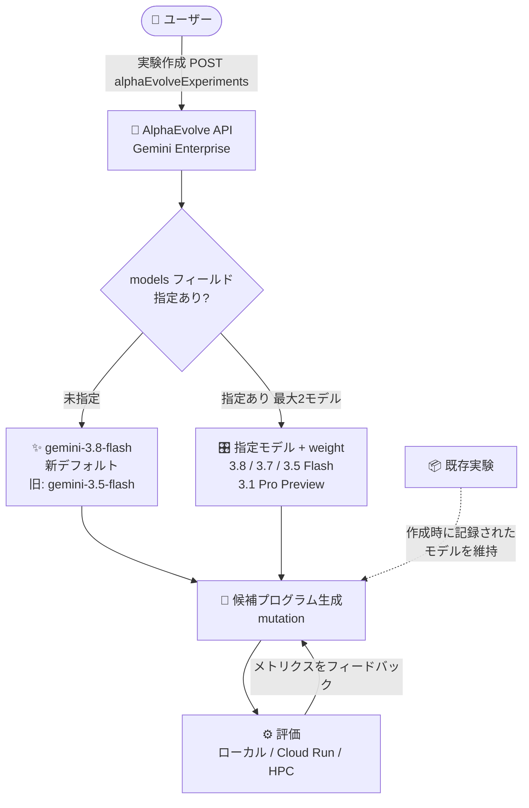

# Gemini Enterprise: AlphaEvolve のデフォルトモデルが Gemini 3.8 Flash に

**リリース日**: 2026-09-29

**サービス**: Gemini Enterprise

**機能**: AlphaEvolve のデフォルトモデル変更 (Gemini 3.8 Flash) と Gemini 3.7 Flash / 3.8 Flash 対応

**ステータス**: Feature

📊 [このアップデートのインフォグラフィックを見る](https://takech9203.github.io/google-cloud-news-summary/20260929-gemini-enterprise-alphaevolve-gemini-3-8-flash.html)

## 概要

Gemini Enterprise の AlphaEvolve において、候補プログラムの生成に **Gemini 3.7 Flash** と **Gemini 3.8 Flash** が利用可能になりました。あわせて、モデルを明示的に指定しない場合に AlphaEvolve が使用するデフォルトモデルが、従来の Gemini 3.5 Flash から **Gemini 3.8 Flash** に変更されました。

AlphaEvolve は、進化的手法 (evolutionary methods) を用いてアルゴリズム探索・数理探索・組合せ最適化を解く特化型 AI コーディングエージェントです。候補プログラムの生成 (mutation) には Gemini モデルが使われるため、デフォルトモデルの世代交代は、実験を新規作成するすべてのユーザーの生成品質に直接影響します。

デフォルト以外のモデルを使いたい場合は、実験設定の `generationSettings` 内の `models` フィールドで使用するモデルを指定します。なお、デフォルトモデルは**実験の作成時点**で解決されるため、今回の変更前に作成された実験は、構成に記録されたモデル (例: Gemini 3.5 Flash) をそのまま使い続けます。既存の実験を Gemini 3.8 Flash に移行するには、`models` で明示的に指定するか、新しい実験を作成する必要があります。

**アップデート前の課題**

- AlphaEvolve の候補プログラム生成で Gemini 3.7 Flash / 3.8 Flash を選択できなかった
- モデル未指定時のデフォルトは Gemini 3.5 Flash であり、より新しい世代のモデルを使うには明示的な指定が必要だった

**アップデート後の改善**

- Gemini 3.7 Flash と Gemini 3.8 Flash で候補プログラムを生成できるようになった
- モデル未指定時のデフォルトが Gemini 3.8 Flash になり、新規実験では自動的に最新の推奨モデルが使われる
- 既存実験は構成に記録されたモデルを維持するため、意図しないモデル変更による実験結果のブレが発生しない

## アーキテクチャ図



実験作成時に `models` フィールドが未指定の場合、AlphaEvolve は新デフォルトの Gemini 3.8 Flash を構成に記録して候補プログラムの生成 → 評価 → フィードバックの進化ループを回します。既存実験は作成時に記録されたモデルをそのまま使用します。

## サービスアップデートの詳細

### 主要機能

1. **Gemini 3.8 Flash が新しいデフォルトモデルに**
   - `models` を省略した場合、AlphaEvolve は実験作成時点で Google が AlphaEvolve でのコード生成に推奨する Gemini モデルをデフォルトとして選択する
   - 2026 年 9 月 29 日時点のデフォルトは `gemini-3.8-flash` (従来は `gemini-3.5-flash`)

2. **Gemini 3.7 Flash / 3.8 Flash による候補プログラム生成に対応**
   - サポートモデルに `gemini-3.7-flash` と `gemini-3.8-flash` が追加された
   - `generationSettings.models` で名前と重み (weight) を指定して利用できる

3. **既存実験のモデルは維持される**
   - デフォルトモデルは実験作成時に解決・記録されるため、変更前に作成された実験は記録済みのモデルを使い続ける
   - 既存実験を Gemini 3.8 Flash に移行するには、`models` で明示指定するか、新しい実験を作成する

## 技術仕様

### サポートモデル (AlphaEvolve 候補プログラム生成)

| モデル名 | 提供リージョン | 備考 |
|------|------|------|
| `gemini-3.8-flash` | `global`, `us`, `eu` | デフォルト (今回変更) |
| `gemini-3.7-flash` | `global`, `us`, `eu` | 今回追加 |
| `gemini-3.5-flash` | `global`, `us`, `eu` | 旧デフォルト |
| `gemini-3.1-pro-preview` | `global` | Preview |

- 1 つの実験で組み合わせられるモデルは**最大 2 つ**まで
- サポート外のモデル名、またはリクエストしたリージョンで利用できないモデルを指定すると、実験作成時に `INVALID_ARGUMENT` が返される
- `weight` は比率であり、合計が 1 になる必要はない (0 や負値、非有限値は不可)
- `temperature` を指定する場合は `[0.0, 2.0]` の範囲

### generationSettings.models の指定例

```json
{
  "generationSettings": {
    "models": [
      { "name": "gemini-3.8-flash", "weight": 0.9 },
      { "name": "gemini-3.1-pro-preview", "weight": 0.1 }
    ]
  }
}
```

この例では、生成呼び出しの約 9 割が Gemini 3.8 Flash に、残りが Gemini 3.1 Pro Preview に送られます。

## 設定方法

### 前提条件

1. Gemini Enterprise 環境が構成済みで、AlphaEvolve API (Discovery Engine API `v1alpha`) にアクセスできること
2. 実験のロケーションは `global`、`us`、`eu` のいずれか (それ以外は `FAILED_PRECONDITION`)

### 手順

#### ステップ 1: デフォルトモデル (Gemini 3.8 Flash) で新規実験を作成する

```bash
# models を省略すると、作成時点のデフォルト (gemini-3.8-flash) が記録される
curl -X POST \
  -H "Authorization: Bearer $(gcloud auth print-access-token)" \
  -H "Content-Type: application/json" \
  "https://discoveryengine.googleapis.com/v1alpha/projects/PROJECT_ID/locations/global/collections/COLLECTION/engines/ENGINE/sessions/SESSION/alphaEvolveExperiments" \
  -d '{
    "config": {
      "title": "Sorting Optimization Campaign",
      "problemDescription": "Optimize the custom_heuristic function.",
      "programLanguage": "python",
      "runSettings": { "maxPrograms": 250, "concurrency": 8 }
    }
  }'
```

`generationSettings.models` を省略した場合、実験作成時のデフォルトである `gemini-3.8-flash` が構成に記録されます。

#### ステップ 2: モデルを明示的に指定 (固定) する

```bash
# 毎回同じモデルを使いたい場合は models を明示指定してピン留めする
  -d '{
    "config": {
      ...
      "generationSettings": {
        "models": [ { "name": "gemini-3.8-flash", "weight": 1.0 } ]
      }
    }
  }'
```

デフォルトの推奨モデルは新モデルのリリースに応じて変わるため、再現性を重視する場合は `models` を明示的に指定してモデルを固定することが推奨されます。

## メリット

### ビジネス面

- **設定不要で最新モデルの恩恵**: 新規実験ではモデル指定なしで最新の推奨モデル (Gemini 3.8 Flash) が使われ、候補プログラム生成の品質向上が期待できる
- **既存実験の安定性**: 変更前の実験は記録済みモデルを維持するため、実行中・比較中の実験結果が突然変わるリスクがない

### 技術面

- **モデルミックスの柔軟性**: Flash 系 (3.5 / 3.7 / 3.8) と Pro Preview を最大 2 つまで weight 付きで組み合わせ、コストと探索品質のバランスを調整できる
- **作成時解決による再現性**: デフォルトモデルは実験作成時に構成へ記録されるため、実験のライフサイクル中はモデルが一貫する

## デメリット・制約事項

### 制限事項

- 1 実験で組み合わせられるモデルは最大 2 つ (重複エントリ不可)
- `gemini-3.1-pro-preview` は `global` ロケーションのみで提供
- サポート外のモデル名や、リージョンで提供されないモデルの指定は `INVALID_ARGUMENT` になる
- AlphaEvolve 実験は `global` / `us` / `eu` のみで作成可能で、1 プロジェクトあたり各ロケーション 30 件の同時アクティブ実験数の上限がある

### 考慮すべき点

- 既存実験は自動的には Gemini 3.8 Flash に切り替わらない。移行するには `models` で明示指定するか、新規実験を作成する必要がある
- デフォルトの推奨モデルは今後も新モデルのリリースに伴い変わるため、モデル間の厳密な比較検証を行う場合は `models` の明示指定によるピン留めが必要

## ユースケース

### ユースケース 1: 新規最適化実験を最新モデルで開始する

**シナリオ**: 組合せ最適化 (例: 巡回セールスマン問題のヒューリスティック改善) の実験を新たに開始する。

**実装例**:
```json
{
  "config": {
    "title": "TSP Heuristic Optimization",
    "problemDescription": "Evolve the tour construction heuristic.",
    "programLanguage": "python",
    "runSettings": { "maxPrograms": 500, "concurrency": 10 }
  }
}
```

**効果**: `models` を省略するだけで Gemini 3.8 Flash による候補プログラム生成が行われ、追加設定なしで最新モデルの生成品質を利用できる。

### ユースケース 2: 既存実験を Gemini 3.8 Flash に移行して品質を比較する

**シナリオ**: Gemini 3.5 Flash で作成済みの実験があり、新デフォルトの Gemini 3.8 Flash でどの程度改善するかを検証したい。

**効果**: 既存実験は記録済みモデルを維持するため、`models` に `gemini-3.8-flash` を明示指定した新しい実験を作成して並行実行することで、同一の評価メトリクスでモデル間の性能を公平に比較できる。

## 利用可能リージョン

AlphaEvolve は `global`、`us`、`eu` ロケーションで利用できます。今回追加された `gemini-3.8-flash` と `gemini-3.7-flash` はいずれも `global` / `us` / `eu` の全ロケーションで提供されます (`gemini-3.1-pro-preview` は `global` のみ)。

## 関連サービス・機能

- **Gemini Enterprise Agent Platform**: AlphaEvolve が使用する Gemini モデル (3.8 Flash / 3.7 Flash など) のモデルカードと提供リージョンを管理するプラットフォーム
- **AlphaEvolve HPC ソリューション**: Cluster Toolkit・Batch・Pub/Sub を用いた分散評価基盤。評価に特殊ハードウェア (GPU/TPU) や大規模並列性が必要な場合に利用
- **Cloud Run**: コンテナ化した評価器 (evaluator) をリモート実行する際の実行環境
- **Cloud Storage**: HPC ソリューション利用時に候補プログラムや評価メトリクスなどの実験アーティファクトを保存

## 参考リンク

- 📊 [インフォグラフィック](https://takech9203.github.io/google-cloud-news-summary/20260929-gemini-enterprise-alphaevolve-gemini-3-8-flash.html)
- [公式リリースノート](https://docs.cloud.google.com/release-notes#September_29_2026)
- [AlphaEvolve API リファレンス (Generation settings / Supported models)](https://docs.cloud.google.com/gemini/enterprise/docs/alphaevolve/reference-guide/api-reference)
- [AlphaEvolve 概要](https://docs.cloud.google.com/gemini/enterprise/docs/alphaevolve/developer-guide/overview)
- [AlphaEvolve を使ってみる](https://docs.cloud.google.com/gemini/enterprise/docs/alphaevolve/developer-guide/use-alphaevolve)
- [Gemini 3.8 Flash モデルカード](https://docs.cloud.google.com/gemini-enterprise-agent-platform/models/gemini/3-8-flash)

## まとめ

AlphaEvolve のデフォルトモデルが Gemini 3.5 Flash から Gemini 3.8 Flash へ世代交代し、Gemini 3.7 Flash / 3.8 Flash による候補プログラム生成が可能になりました。新規実験は追加設定なしで最新モデルの恩恵を受けられる一方、既存実験は記録済みモデルを維持するため、移行には `generationSettings.models` での明示指定または新規実験の作成が必要です。再現性が重要な実験では、モデルを明示的にピン留めする運用を推奨します。

---

**タグ**: Gemini Enterprise, AlphaEvolve, Gemini 3.8 Flash, Gemini 3.7 Flash, 進化的最適化, コード最適化, generationSettings, Feature
