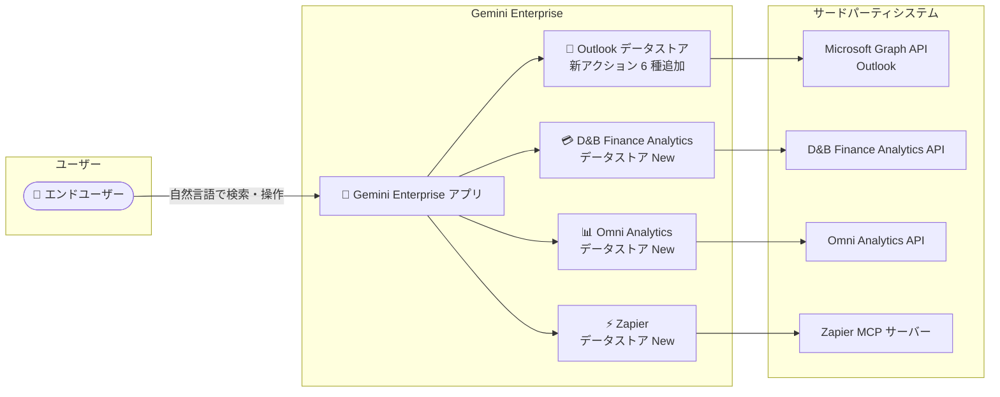

# Gemini Enterprise: Microsoft Outlook の新アクションと新データストア (D&B Finance Analytics / Omni Analytics / Zapier)

**リリース日**: 2026-09-29

**サービス**: Gemini Enterprise

**機能**: Microsoft Outlook データストアの新アクション追加、および D&B Finance Analytics / Omni Analytics / Zapier データストアの追加

**ステータス**: Public Preview

📊 [このアップデートのインフォグラフィックを見る](https://takech9203.github.io/google-cloud-news-summary/20260929-gemini-enterprise-outlook-actions-new-data-stores.html)

## 概要

Gemini Enterprise のサードパーティデータソース連携に関する 2 つのアップデートが Public Preview として発表されました。1 つ目は、Microsoft Outlook データストアにおける新しいアクションのサポートです。「添付ファイル追加 (Add attachments)」「メッセージ作成 (Create message)」「メール転送 (Forward mail)」「メール移動 (Move mail)」「メッセージ返信 (Reply to message)」「メッセージ更新 (Update message)」の 6 つのアクションが利用可能になり、エンドユーザーは Gemini Enterprise 上の自然言語コマンドで Outlook のメール操作をより広範に実行できるようになりました。

2 つ目は、新しいデータストアとして D&B Finance Analytics、Omni Analytics、Zapier の 3 つが追加されたことです。D&B Finance Analytics は与信・ポートフォリオ管理ワークフロー、Omni Analytics は BI プラットフォームのモデル・ダッシュボード検索、Zapier は数千の SaaS アプリに接続する自動化アクションの検索・実行をそれぞれ自然言語で行えるようにします。

これらのアップデートは、Gemini Enterprise を導入している組織の情報システム管理者と、日常業務でメール処理・与信判断・BI 分析・業務自動化を行うエンドユーザーが対象です。Gemini Enterprise が単なる検索基盤から、外部システムに対して実際に「操作 (アクション)」を実行できるエージェント基盤へと拡張されていく流れを示すアップデートです。

**アップデート前の課題**

- Microsoft Outlook データストアでは、メール送信 (Send mail) やイベント作成などのアクションは利用できたものの、下書きメッセージの作成・更新、既存メールへの返信・転送、添付ファイルの追加、フォルダ間のメール移動といった操作は Gemini Enterprise から実行できなかった
- D&B Finance Analytics のデータ (企業与信レポート、支払スコア、UCC ファイリングなど) を参照するには、Gemini Enterprise とは別に D&B のコンソールを開いて操作する必要があった
- Omni Analytics のモデル・トピック・ダッシュボード・ドキュメントは Gemini Enterprise の検索対象外だった
- Zapier の自動化アクションを Gemini Enterprise の会話から呼び出す公式コネクタが存在しなかった

**アップデート後の改善**

- Outlook データストアで下書き作成から添付・更新・返信・転送・フォルダ移動まで、メール処理の一連の操作を自然言語で実行できるようになった
- D&B Finance Analytics コネクタにより、企業・与信レポートの照会やポートフォリオ内企業の検索・比較、与信申請の作成・処理などの操作が Gemini Enterprise から直接行えるようになった
- Omni Analytics コネクタにより、モデル、トピック、ダッシュボード、ドキュメントを自然言語で検索・参照できるようになった
- Zapier コネクタにより、Zapier MCP トークンを使って接続した各種アプリケーションのコンテンツ・アクション・スキルを自然言語で検索・利用できるようになった

## アーキテクチャ図



Gemini Enterprise アプリにデータストア (コネクタ) を関連付けることで、ユーザーの自然言語クエリが各サードパーティ API にフェデレーテッド検索・アクションとして送信され、結果が Gemini Enterprise 上で統合表示されます。

## サービスアップデートの詳細

### 主要機能

1. **Microsoft Outlook データストアの新アクション (Public Preview)**
   - 以下の 6 アクションが追加された
     - **Add attachments**: 既存の下書きメールに 1 つ以上の添付ファイルを追加
     - **Create message**: サインインユーザーのメールボックスに新しい下書きメッセージを作成
     - **Forward mail**: 既存のメールを 1 人以上の宛先に転送
     - **Move mail**: メールをメールボックス内の別フォルダに移動
     - **Reply to message**: 既存のメールへ返信を送信
     - **Update message**: 既存の下書きメッセージを更新
   - 既存のアクション (Send mail、Create event、Create contact、Download attachments、Excel/Word/PowerPoint 操作など) と組み合わせて利用できる
   - Outlook データストアは Microsoft Graph API v1.0 (IDP 統合) をサポート

2. **D&B Finance Analytics データストア (Public Preview)**
   - 自然言語で与信・ポートフォリオワークフローを実行できるフェデレーテッドコネクタ
   - 企業・与信レポート、財務サマリー、支払・延滞スコア、UCC ファイリング、タックスリーエン、判決、企業の資本関係 (ファミリーツリー) の照会に対応
   - ポートフォリオ・フォルダ・ウォッチリスト内の企業の検索・フィルタ・集計・比較が可能
   - 与信申請の作成・処理、与信判断 (credit decisioning) の実行、フォルダと企業の管理などの書き込み操作にも対応
   - データは Gemini Enterprise に取り込み (インデックス) されず、クエリ時に D&B アカウントの権限に基づいてライブで回答される
   - Google 管理の OAuth を使用するため、独自の OAuth アプリケーション作成やクライアント ID / シークレットの提供は不要

3. **Omni Analytics データストア (Public Preview)**
   - Omni Analytics インスタンスのデータクエリ、モデル・トピックの検索、ダッシュボード・ドキュメントへのアクセスを自然言語で実行できる
   - 検索対象エンティティ: models、topics、dashboards、documentation
   - Google 管理の OAuth を使用。Sensitive Data Protection ポリシーのアタッチにも対応

4. **Zapier データストア (Public Preview)**
   - 接続済みアプリケーション全体にわたる Zapier のコンテンツ・アクション・スキルを自然言語で検索・発見・参照できる
   - 接続には Zapier アカウントの個人用 MCP トークンを使用 (接続 URL: `https://mcp.zapier.com/api/v1/connect?token=TOKEN`)
   - 検索対象エンティティ: Actions

## 技術仕様

### 新データストアの共通仕様

| 項目 | 詳細 |
|------|------|
| 連携方式 | フェデレーテッド検索 (データの取り込み・インデックスなし) |
| 対応ロケーション | global、us、eu |
| 認証 (D&B / Omni) | Google 管理の OAuth (独自 OAuth アプリ不要) |
| 認証 (Zapier) | Zapier MCP トークン |
| 暗号化 | Google 管理キーまたは Cloud KMS キー (CMEK、us / eu の場合) |
| 静的 IP エグレス | 対応 (Advanced options で有効化し、送信元 IP を固定して許可リスト登録が可能) |
| VPC Service Controls | 既存データストアへの境界適用は不可 (削除して再作成が必要) |

### Microsoft Outlook アクションに必要な権限 (Microsoft Graph API、Delegated)

| 権限 | 用途 |
|------|------|
| Mail.Send | ユーザーとしてのメール送信 |
| Mail.ReadWrite | メッセージの作成・読み取り・更新・移動・削除、添付ファイル追加。**Add attachments / Create message / Update message / Move mail アクションに必須** |
| Calendars.ReadWrite | カレンダーイベントの作成・読み取り・更新・削除 |
| Contacts.ReadWrite | 連絡先の作成・読み取り・更新・削除 |
| User.Read | サインインユーザーのプロファイル読み取り |

## 設定方法

### 前提条件

1. Gemini Enterprise のライセンスとサブスクリプションがあること
2. データストアを作成するユーザーに Discovery Engine 編集者ロール (`roles/discoveryengine.editor`) が付与されていること
3. (Outlook のデータ取り込みモードの場合) Microsoft Entra ID に登録したアプリケーションのクライアント ID、クライアントシークレット、テナント ID を取得していること
4. (Zapier の場合) Zapier アカウントの個人用 MCP トークンを取得していること

### 手順

#### ステップ 1: データストアの作成

Google Cloud コンソールの Gemini Enterprise ページで以下を実施します。

```text
1. ナビゲーションメニューで [Data stores] をクリック
2. [Create data store] をクリック
3. Source セクションで対象のデータソース
   (例: D&B Finance Analytics / Omni Analytics / Zapier / Microsoft Outlook) を検索して [Select]
4. Data セクションで検索対象エンティティを選択
   - D&B Finance Analytics: Portfolios
   - Omni Analytics: models / topics / dashboards / documentation
   - Zapier: MCP トークンを入力後、Actions を選択
5. Configuration セクションでマルチリージョン (global / us / eu)、コネクタ名、
   暗号化設定 (us / eu の場合) を設定
6. Billing セクションで General pricing または Configurable pricing を選択して [Create]
```

#### ステップ 2: Outlook アクションの有効化

Outlook データストアの作成フロー、または作成後の [Actions] ページでアクションを有効化します。

```text
1. データストアを選択し、ナビゲーションメニューから [Actions] を選択
2. [Enable actions] をクリック
3. 有効化するアクション (Add attachments、Create message、Forward mail、
   Move mail、Reply to message、Update message など) を選択
4. (データ取り込みモードの場合) 認証設定でクライアント ID / シークレット /
   テナント ID を入力し、Microsoft アカウントでログインして認可
5. [Enable actions] をクリック
```

#### ステップ 3: アプリへの接続とユーザー認可

```text
1. 作成したデータストアを既存の Gemini Enterprise アプリに接続
   (または新規アプリを作成して接続)
2. エンドユーザーがクエリを実行する前に、Gemini Enterprise から
   各サードパーティサービスへのアクセスを認可
```

## メリット

### ビジネス面

- **メール業務の効率化**: 下書き作成・返信・転送・フォルダ整理まで Gemini Enterprise の会話内で完結し、Outlook との往復作業を削減できる
- **与信業務の迅速化**: D&B Finance Analytics の与信レポート照会や与信申請処理を自然言語で実行でき、金融・審査部門のワークフローを短縮できる
- **ツール横断の自動化**: Zapier コネクタにより、Zapier が接続する多数の SaaS アプリのアクションを Gemini Enterprise から利用できる

### 技術面

- **フェデレーテッド方式によるデータ鮮度と権限整合性**: D&B Finance Analytics などはデータを取り込まずクエリ時にライブで回答するため、結果は常にソース側の最新データとユーザー権限を反映する
- **Google 管理 OAuth による導入の容易さ**: D&B Finance Analytics と Omni Analytics は独自の OAuth アプリケーション登録が不要
- **エンタープライズ統制との統合**: CMEK (Cloud KMS)、静的 IP エグレス、Sensitive Data Protection ポリシー (Omni Analytics) などの統制機能を利用できる

## デメリット・制約事項

### 制限事項

- 本アップデートの機能はすべて Public Preview であり、Pre-GA Offerings Terms が適用される ("as is" 提供、サポートが限定される場合がある)
- 新データストア (D&B Finance Analytics / Omni Analytics / Zapier) は global、us、eu ロケーションのみサポート
- 既存データストアへの VPC Service Controls 境界の適用は不可 (削除して再作成が必要)
- アプリ作成時またはデータストア追加時は、1 つのコネクタタイプのアクションを持つデータストアを 1 つだけ関連付けることが推奨されている
- Gemini Enterprise でのファイルアップロード・ダウンロードの最大サイズは 25 MB (Outlook の添付ファイル操作に影響)

### 考慮すべき点

- フェデレーテッド検索では、クエリ文字列 (検索リクエストや会話履歴の一部を含む場合がある) がサードパーティの検索バックエンドに送信され、サードパーティがクエリをユーザーの身元と関連付ける可能性がある。送信後のデータはサードパーティの利用規約・プライバシーポリシーに従う
- 精度向上のため LLM がクエリを書き換えて送信することがあり、セッションのクエリ履歴の一部が外部 API に送られる可能性がある
- 複数のフェデレーテッド検索データソースを有効にしている場合、クエリはすべての有効なバックエンドに送信され得る
- Outlook のアクションには Mail.ReadWrite などの Delegated 権限が必要であり、Entra ID 側での権限設計とガバナンスの検討が必要
- D&B Finance Analytics で与信レポートに課金エンドースメントが必要な場合、アカウントの現在のデフォルトエンドースメントが使用される

## ユースケース

### ユースケース 1: 営業担当者のメール処理の自動化

**シナリオ**: 営業担当者が顧客からの問い合わせメールに対し、Gemini Enterprise 上で「この問い合わせに見積書を添付して返信して」と指示する。

**実装例**:
```text
1. Outlook データストアで Reply to message / Add attachments アクションを有効化
2. ユーザーが自然言語で返信内容と添付ファイルを指示
3. Gemini Enterprise が下書きを作成・添付し、返信を送信
```

**効果**: Outlook とナレッジ検索の間を往復することなく、問い合わせ対応が会話内で完結する。

### ユースケース 2: 与信審査ワークフローの迅速化

**シナリオ**: 審査担当者が新規取引先について「X 社の与信レポートと支払スコア、タックスリーエンの有無を教えて。問題なければ与信申請を作成して」と Gemini Enterprise に依頼する。

**効果**: D&B Finance Analytics コンソールを開かずに、与信情報の照会から与信申請の作成までを自然言語で実行でき、審査リードタイムを短縮できる。

### ユースケース 3: BI ダッシュボードの横断検索

**シナリオ**: データアナリストが「売上予測に関する Omni のダッシュボードとモデル定義を探して」と検索し、社内ドキュメントの検索結果とブレンドして確認する。

**効果**: Omni Analytics 内のモデル・トピック・ダッシュボード・ドキュメントが他の社内データソースと統合された検索結果として得られ、分析資産の発見性が向上する。

## 料金

Gemini Enterprise はエディション (Business / Standard / Plus / Pay-as-you-go / Frontline) ごとのサブスクリプション + ライセンスモデルで提供されます。データストア作成時には General pricing または Configurable pricing を選択します。サードパーティコネクタ自体の個別料金は Release Notes およびドキュメントには記載されていないため、詳細は以下を参照してください。

- [Gemini Enterprise のライセンス](https://docs.cloud.google.com/gemini/enterprise/docs/licenses)
- [Gemini Enterprise のエディション比較](https://docs.cloud.google.com/gemini/enterprise/docs/editions)

なお、D&B Finance Analytics、Omni Analytics、Zapier などのサードパーティサービス側のアカウント・契約は別途必要です。

## 利用可能リージョン

- D&B Finance Analytics / Omni Analytics / Zapier データストア: **global、us、eu** のマルチリージョンのみサポート

## 関連サービス・機能

- **Microsoft Entra ID コネクタ**: Outlook のデータ取り込みモードで使用する OAuth アプリケーションの登録基盤。ID 連携のコネクタとしても GA 提供
- **Cloud KMS (CMEK)**: us / eu ロケーションのサードパーティコネクタでは単一リージョンキーを登録して顧客管理の暗号鍵を利用可能
- **VPC Service Controls**: データストアをセキュリティ境界で保護可能 (既存データストアへの適用は再作成が必要)
- **Sensitive Data Protection**: Omni Analytics データストアで取得データの検査・匿名化ポリシーをアタッチ可能
- **Custom MCP Server コネクタ**: Zapier コネクタと同様に MCP ベースで任意のシステムを接続する汎用手段。標準コネクタがないシステムの連携に利用

## 参考リンク

- 📊 [インフォグラフィック](https://takech9203.github.io/google-cloud-news-summary/20260929-gemini-enterprise-outlook-actions-new-data-stores.html)
- [公式リリースノート](https://docs.cloud.google.com/release-notes#September_29_2026)
- [Connect a third-party data source](https://docs.cloud.google.com/gemini/enterprise/docs/connectors/connect-third-party-data-source)
- [Microsoft Outlook コネクタ](https://docs.cloud.google.com/gemini/enterprise/docs/connectors/ms-outlook)
- [D&B Finance Analytics コネクタ](https://docs.cloud.google.com/gemini/enterprise/docs/connectors/d_b_finance_analytics)
- [Omni Analytics コネクタ](https://docs.cloud.google.com/gemini/enterprise/docs/connectors/omni_analytics)
- [Zapier コネクタ](https://docs.cloud.google.com/gemini/enterprise/docs/connectors/zapier)
- [アクションの管理](https://docs.cloud.google.com/gemini/enterprise/docs/manage-actions)
- [Gemini Enterprise のライセンス](https://docs.cloud.google.com/gemini/enterprise/docs/licenses)

## まとめ

Gemini Enterprise のサードパーティ連携が、Outlook のメール操作アクション 6 種の追加と、D&B Finance Analytics / Omni Analytics / Zapier の 3 つの新データストアによって大きく拡張されました。検索だけでなく「操作」まで自然言語で実行できる範囲が広がっており、Gemini Enterprise を導入済みの組織は、まずは影響の大きい Outlook アクションの有効化と権限設計の検討から始めることを推奨します。Public Preview のため、本番ワークフローへの適用前に Pre-GA の提供条件とフェデレーテッド検索のデータ取り扱い (クエリの外部送信) を確認してください。

---

**タグ**: Gemini Enterprise, Microsoft Outlook, D&B Finance Analytics, Omni Analytics, Zapier, コネクタ, データストア, アクション, Public Preview, フェデレーテッド検索, MCP
