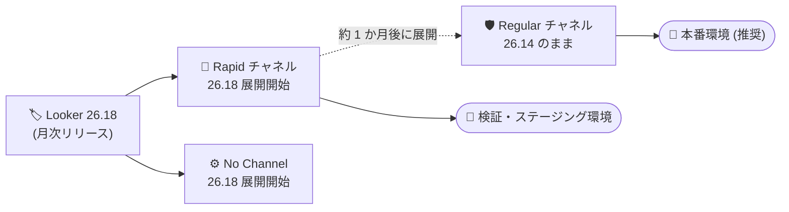

# Looker (Google Cloud core): Looker 26.18 のリリースチャネル展開開始

**リリース日**: 2026-09-29

**サービス**: Looker (Google Cloud core)

**機能**: リリースチャネルにおける Looker 26.18 の展開開始

**ステータス**: Announcement

📊 [このアップデートのインフォグラフィックを見る](https://takech9203.github.io/google-cloud-news-summary/20260929-looker-core-26-18-release-channels.html)

## 概要

Looker (Google Cloud core) の各リリースチャネルにおいて、最新バージョンの展開が開始された。Rapid チャネルおよび No Channel (チャネル未登録) のインスタンスには **Looker 26.18** の展開が始まり、Regular チャネルは **Looker 26.14** に留まる。

なお、公式リリースノートによると、2026 年 9 月 24 日時点で Rapid / No Channel 向けに展開が始まっていた Looker 26.16 は Looker (Google Cloud core) には展開されないことになり、代わりに 2026 年 9 月 29 日から Looker 26.18 の展開が開始された。26.16 系のインスタンスを待っていた管理者は、この変更に留意する必要がある。

リリースチャネル機能 (Preview) は、新機能・アップデートがインスタンスに適用されるタイミングを制御・予測可能にする仕組みであり、検証環境には Rapid チャネル、本番環境には Regular チャネルの利用が推奨されている。

## アーキテクチャ図

新バージョンはまず Rapid チャネルと No Channel に展開され、Regular チャネルには約 1 か月遅れて展開される。今回の展開では Rapid / No Channel が 26.18 に更新され、Regular は 26.14 に留まる。

## サービスアップデートの詳細

### 各チャネルの最新バージョン

| リリースチャネル | 最新バージョン | 状況 |
|------------------|----------------|------|
| Rapid | Looker 26.18 | 展開開始 |
| No Channel | Looker 26.18 | 展開開始 |
| Regular | Looker 26.14 | 変更なし |

### Looker 26.18 の主な変更点

公式リリースノートで確認できる Looker 26.18 の変更は、主に不具合修正である。

1. **Looker (Google Cloud core) のみの修正**
   - セルフサービス分析における BigQuery / Snowflake への CSV・Excel アップロードで、複数行ヘッダー、先頭の数値文字、UTF-8 BOM マーカー、特殊文字を含むファイルが失敗またはデータ破損する問題を修正
   - カスタムコンテンツテーマのフォントが Look 編集モードバーに不適切に適用される問題を修正

2. **Looker (Google Cloud core) と Looker (original) 共通の修正 (抜粋)**
   - スケジュール配信がワーカースレッド間で誤ってキャッシュされたユーザー権限により `Cannot send all results` などの権限エラーで断続的に失敗する問題を修正
   - タイトルのないダッシュボード要素がある場合に CSV / ZIP ダウンロードが 500 エラーになる問題を修正
   - LookML の `link` パラメータでラベル未指定のリンクが 500 エラーを返す問題を修正
   - ピボットされた Cartesian チャートで系列を Y 軸間でドラッグすると Explore ページがクラッシュする問題を修正
   - ダッシュボードフィルタトークンやポップオーバーメニューがカスタムテーマのフォントを継承しない問題を修正

### リリースチャネルの特性 (Preview)

| 項目 | Rapid | Regular | No Channel |
|------|-------|---------|------------|
| 主な用途 | 新機能への最速アクセス | 安定性と予測可能な更新 | 従来のリリースプロセス |
| 推奨環境 | 非本番・ステージング・検証 | 本番環境 (推奨) | - |
| バージョン提供時期 | 月次で最速提供 | Rapid の 1 か月後 | 月次 (従来通り) |
| メンテナンスウィンドウ / 拒否期間 | 設定不可 | 設定可 | 設定可 |
| SLA | 対象外 | 標準 SLA の対象 | 標準 SLA の対象 |

## デメリット・制約事項

### 考慮すべき点

- リリースチャネル機能自体は Preview であり、Pre-GA Offerings Terms が適用される
- Rapid チャネルのインスタンスはメンテナンスウィンドウおよび拒否期間 (deny maintenance period) を設定できず、Looker (Google Cloud core) の SLA 対象外となる
- 更新はローリング方式で数週間かけて適用される。メンテナンスウィンドウ未設定の場合、バージョンロールアウトから 2 週間以内に更新が適用される
- 2026 年 3 月のアナウンスによると、Looker SDK および API の `/login` エンドポイントは Looker 26.18 リリースに合わせて URL クエリパラメータでの認証情報の受け渡しを廃止し、HTTP リクエストボディのみを受け付けるよう変更される予定とされている。該当するスクリプト・アプリケーションを利用している場合は、SDK を 26.4 以降にアップグレードし、認証情報をリクエストボディで渡すよう修正しておくことが推奨される

## 関連サービス・機能

- **Looker (original)**: 26.18 の修正には Looker (original) と共通のものが含まれる。今回のチャネル展開アナウンス自体は Looker (Google Cloud core) のみが対象
- **メンテナンス設定**: Regular / No Channel のインスタンスではメンテナンスウィンドウや拒否期間を設定して更新タイミングを制御できる

## 参考リンク

- 📊 [インフォグラフィック](https://takech9203.github.io/google-cloud-news-summary/20260929-looker-core-26-18-release-channels.html)
- [公式リリースノート (2026-09-29)](https://docs.cloud.google.com/release-notes#September_29_2026)
- [Looker リリースノート](https://docs.cloud.google.com/looker/docs/release-notes)
- [Looker (Google Cloud core) のリリースプロセスとリリースチャネル](https://docs.cloud.google.com/looker/docs/looker-core-release-process)

## まとめ

Looker (Google Cloud core) の Rapid / No Channel インスタンスに、不具合修正を中心とした Looker 26.18 の展開が開始された (26.16 はスキップ)。Regular チャネルの本番環境は 26.14 のままであり、Rapid チャネルの検証環境で 26.18 の動作を事前に確認しておくとよい。あわせて、26.18 で予定されている `/login` エンドポイントの認証情報受け渡し方式の変更に備え、Looker SDK やカスタムスクリプトの対応状況を確認しておくことを推奨する。

---

**タグ**: Looker, Looker (Google Cloud core), リリースチャネル, バージョンアップ, Announcement
