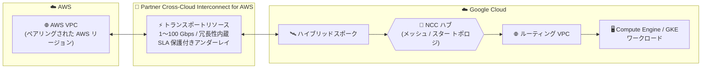

# Network Connectivity Center: Partner Cross-Cloud Interconnect for AWS サポートが GA

**リリース日**: 2026-09-29

**サービス**: Network Connectivity Center

**機能**: Partner Cross-Cloud Interconnect for AWS サポート

**ステータス**: GA (一般提供)

📊 [このアップデートのインフォグラフィックを見る](https://takech9203.github.io/google-cloud-news-summary/20260929-network-connectivity-center-partner-cross-cloud-interconnect-aws-ga.html)

## 概要

Network Connectivity Center (NCC) における Partner Cross-Cloud Interconnect for Amazon Web Services (AWS) のサポートが一般提供 (GA) になりました。Partner Cross-Cloud Interconnect for AWS は、Google Cloud と AWS の間のマルチクラウド接続を提供するサービスで、対応するペアリングされたロケーション間で Google Cloud と AWS のリソースをプライベートに接続できます。今回の GA により、この接続 (トランスポートリソース) を NCC ハブに接続するハイブリッドスポークとして本番環境で利用できるようになりました。

Partner Cross-Cloud Interconnect for AWS は、物理的なネットワークコンポーネントを手動でセットアップすることなく、オンデマンドで信頼性の高いクロスクラウド接続を確立できるのが特徴です。接続はリージョン間トランスポートとして表現され、AWS と協調して構築された SLA 保護付きのアンダーレイをオンデマンドでセットアップし、需要に応じて帯域幅をサイズアップ・サイズダウンできます。分散リージョンでワークロードを運用するユーザー、低帯域幅のニーズを持つユーザー、ネットワークの専門知識を持たないアプリケーションオーナー、物理インフラを管理せずにクロスクラウド接続を実現したいユーザーが主な対象です。

なお、Partner Cross-Cloud Interconnect for AWS の課金は、GA 後 30 日以内に開始される予定です。最新の課金情報は Network Connectivity Center の料金ページで確認してください。

**アップデート前の課題**

- NCC の Partner Cross-Cloud Interconnect for AWS ハイブリッドスポークは Preview 段階であり、Pre-GA Offerings Terms が適用されるため、本番環境での利用にはサポートやサービスレベルの面で制約があった
- 従来の Cross-Cloud Interconnect で AWS と接続する場合、物理的なプロビジョニング (ポート・アタッチメントの購入) が必要で、プロビジョニングに 1〜4 週間を要した
- 従来の Cross-Cloud Interconnect では接続増分が 10 Gbps または 100 Gbps に限られ、低帯域幅のユースケースには過剰だった
- 従来の Cross-Cloud Interconnect では冗長構成 (プライマリ + 冗長接続) を利用者自身が手動で構成・管理する必要があった

**アップデート後の改善**

- NCC ハブに Partner Cross-Cloud Interconnect for AWS のトランスポートリソースを接続する構成が GA となり、本番環境で安心して利用できるようになった
- 物理プロビジョニング不要で、数分でクロスクラウド接続をプロビジョニングできる
- 1 Gbps から 100 Gbps までの事前承認されたきめ細かな速度から帯域幅を選択でき、オンデマンドで変更可能
- 冗長性がサービスレベルで製品に組み込まれており、利用者が複雑な冗長構成を設定する必要がない
- 接続の開始を Google Cloud 側・AWS 側のどちらからでも行える (双方向)

## アーキテクチャ図

AWS VPC と Google Cloud の VPC を、Partner Cross-Cloud Interconnect for AWS のトランスポートリソース経由で NCC ハブに接続する構成です。トランスポートリソースはハイブリッドスポークとして NCC ハブに接続され、ルート交換は 2 つのクラウド間で自動的に処理されます。

## サービスアップデートの詳細

### 主要機能

1. **NCC ハブへのトランスポートリソース接続が GA**
   - Partner Cross-Cloud Interconnect for AWS のトランスポートリソースを NCC ハブに接続する構成が一般提供になった
   - NCC のハイブリッドスポークの一種として、Router appliance、HA VPN、各種 Cloud Interconnect VLAN アタッチメントと並ぶ接続オプションとなる

2. **オンデマンドかつ高速なプロビジョニング**
   - 物理リンクの敷設待ちや複雑なプロビジョニングプロセスが不要で、数分で接続を確立できる
   - Google Cloud が事前構築したクロスクラウド接続インフラを利用するため、リードタイムが最小限

3. **冗長性・信頼性のフルマネージド化**
   - API がリソースの基盤に冗長性を直接組み込んでおり、利用者による冗長構成の設定が不要
   - Google と AWS がそれぞれの部分に SLA を提供するが、両側でフルマネージドかつ抽象化され、統一されたシンプルな信頼性体験を提供

4. **柔軟な帯域幅オプション**
   - 1 Gbps から 100 Gbps までの事前承認されたきめ細かな速度に対応 (従来の Cross-Cloud Interconnect は 10 Gbps / 100 Gbps 単位)
   - 需要に応じたオンデマンドでのサイズアップ・サイズダウンが可能

5. **双方向の接続開始**
   - Google Cloud 側から開始する場合はアクティベーションキーが生成され、それを使って AWS アカウント側で接続を作成
   - AWS 側から開始する場合は AWS で取得したアクティベーションキーを使って Google Cloud 側のトランスポートリソースを作成

## 技術仕様

### Cross-Cloud Interconnect との比較

| 項目 | Cross-Cloud Interconnect | Partner Cross-Cloud Interconnect for AWS |
|------|--------------------------|------------------------------------------|
| 概要 | OCI、AWS、Azure、Alibaba などとの専用接続 | AWS との専用接続 |
| 物理プロビジョニング | 必要 | 不要 |
| 物理アタッチメント・ポート | 必要 | 不要 |
| 接続増分 | 10 Gbps または 100 Gbps | 1 Gbps〜100 Gbps の事前承認されたきめ細かな速度 |
| プロビジョニング時間 | 1〜4 週間 | 数分 |
| 接続の開始 | Google Cloud 側からのみ | 双方向 (Google Cloud / AWS どちらからでも可) |
| 冗長性 | 手動で構成が必要 | 製品に組み込み済み |

### NCC で接続する際の考慮事項

| 項目 | 詳細 |
|------|------|
| デフォルトトポロジ | メッシュトポロジ |
| スタートポロジ利用時 | ハイブリッドスポークはセンターグループに追加される (エッジグループは非サポート) |
| スポークの受け入れ | プロジェクト内で自動承認される |
| ルーティング VPC | NCC は最大 40 のルーティング VPC をサポートするが、スポークとして追加できるのはそのうち 1 つのみ |
| Private Service Connect 伝播 | PSC 接続伝播を有効にする場合、同一 NCC ハブに他のハイブリッドスポークを接続できない (逆も同様) |
| クォータ | トランスポートリソースはプロジェクト・リージョンごとのクォータで制御され、デフォルトは 1 リージョンあたり 1 リソース |
| モニタリング | トランスポートリソースのトラフィックメトリクスを Cloud Monitoring で確認可能 |

## 設定方法

### 前提条件

1. AWS アカウントを持っていること
2. NCC ハブを作成済みであること (トランスポートリソースの接続先)
3. Network Connectivity API を有効化していること
4. 必要な IAM ロール (`roles/networkconnectivity.transportAdmin` に加え、`roles/networkconnectivity.groupAdmin` または `roles/networkconnectivity.hubAdmin` のいずれか) が付与されていること
5. VPC Service Controls を有効にしている場合はサポートに問い合わせること

### 手順

#### ステップ 1: ペアリングされたロケーションの選択

Google Cloud リージョンは特定の AWS リージョンとペアリングされています。リソースを作成する Google Cloud リージョンを選択したら、対応する AWS リージョンを選択します。

#### ステップ 2: トランスポートリソースの作成 (AWS のアクティベーションキーがある場合)

Google Cloud コンソールで次の操作を行います。

1. 「Partner Cross-Cloud Interconnect」ページで「Create transport」をクリック
2. 「Connection start point」で「Remote Cloud Service Provider (e.g. AWS)」を選択し、AWS から取得したアクティベーションキーを入力して検証
3. トランスポートプロファイル (リージョン) と AWS アカウント ID (Remote ID) を指定
4. トランスポート名、帯域幅 (例: 1G、AWS 側でキー作成時に選択した値と一致させる)、IP スタックタイプ (IPv4) を設定
5. 「Connection」で「Network Connectivity Center」を選択し、接続先の NCC ハブを選択 (未作成の場合はこのフローから作成可能)
6. 「Create」をクリックし、「View transport details」で接続ステータスを確認

Google Cloud 側から開始する場合は、リージョン内の利用可能なプロファイルを一覧表示してトランスポートリソースを作成し、生成されたアクティベーションキーを使って AWS アカウント側で接続を作成します。

**注意**: トランスポートリソースの IP アドレススタックタイプは作成後に変更できません。

## メリット

### ビジネス面

- **リードタイムの大幅短縮**: 物理接続で 1〜4 週間かかっていたプロビジョニングが数分で完了するため、マルチクラウドプロジェクトの立ち上げが迅速化する
- **コスト最適化の可能性**: 1 Gbps からのきめ細かな帯域幅選択により、大容量リンクが不要なユースケースで必要な分だけの帯域幅を購入できる
- **運用負荷の削減**: 物理インフラの問題対応やサードパーティとの調整が不要で、Google Cloud が基盤インフラの責任を負う

### 技術面

- **冗長性の組み込み**: サービスレベルでフォールトトレランスが設計されており、複雑な冗長構成の設定・管理が不要
- **自動ルート交換**: 2 つのクラウド間のルート交換が自動的に処理され、リソース情報のコピー & ペーストや大規模な設定の維持が不要
- **NCC によるハブ & スポーク統合**: 既存の NCC ハブに AWS 接続をハイブリッドスポークとして統合し、他の接続 (VPC スポーク、HA VPN など) と一元的に管理できる

## デメリット・制約事項

### 制限事項

- トランスポートリソースはデフォルトでプロジェクトごと・リージョンごとに 1 つに制限される (クォータ)
- スタートポロジ使用時、Partner Cross-Cloud Interconnect for AWS のハイブリッドスポークはセンターグループのみに追加でき、エッジグループはサポートされない
- スポークとして追加できるルーティング VPC は 1 つのみ
- Private Service Connect 接続伝播を使用する場合、同じ NCC ハブに他のハイブリッドスポークを接続できない
- トランスポートリソースの IP アドレススタックタイプは作成後に変更できない
- 接続はペアリングされたロケーション (Google Cloud リージョンと対応する AWS リージョンの組み合わせ) でのみ利用可能

### 考慮すべき点

- 課金は GA 後 30 日以内に開始されるため、Preview 期間から継続利用しているユーザーはコストの発生タイミングと金額を料金ページで確認する必要がある
- 帯域幅は AWS 側でキー作成時に選択した値と Google Cloud 側の設定を一致させる必要がある
- VPC Service Controls を有効にしている環境ではサポートへの問い合わせが必要
- トランスポートリソースのトラフィックメトリクス (Cloud Monitoring) は本記事執筆時点のドキュメントでは Preview 扱いとなっている

## ユースケース

### ユースケース 1: マルチクラウド構成のワークロード間プライベート接続

**シナリオ**: 分析基盤を Google Cloud (BigQuery、GKE) に、既存の業務システムを AWS に配置している企業が、両クラウド間でデータをプライベートかつ安定的に転送したい。

**実装例**: NCC ハブを作成し、Partner Cross-Cloud Interconnect for AWS のトランスポートリソースをハイブリッドスポークとして接続。ルーティング VPC をスポークとして追加し、AWS VPC 内のリソースと Google Cloud のワークロードを接続する。

**効果**: インターネットを経由しないプライベート接続を数分でプロビジョニングでき、冗長性はサービスに組み込み済みのため運用負荷を最小化できる。

### ユースケース 2: ネットワーク専門知識のないチームによるクロスクラウド接続

**シナリオ**: アプリケーションチームが AWS 上のサービスと Google Cloud 上のサービスを連携させたいが、BGP や物理回線などのネットワーク構成の専門知識がない。

**効果**: ルート交換が自動的に処理されるため、複雑なネットワーク設定を維持することなく、コンソール操作でリージョン間のクロスクラウド接続をデプロイできる。

### ユースケース 3: 低帯域幅・変動する帯域幅ニーズへの対応

**シナリオ**: クロスクラウドのトラフィック量が少なく、10 Gbps 単位の専用線はコスト過剰。ただし繁忙期には帯域幅を増やしたい。

**効果**: 1 Gbps からのきめ細かな帯域幅を選択し、需要に応じてオンデマンドでサイズアップ・サイズダウンできるため、コストを最適化しながら柔軟に対応できる。

## 料金

Partner Cross-Cloud Interconnect for AWS の課金は、GA 後 30 日以内に開始される予定です。最新の課金情報は以下の料金ページを参照してください。

- [Network Connectivity Center の料金](https://cloud.google.com/network-connectivity/docs/network-connectivity-center/pricing)

## 利用可能リージョン

接続はペアリングされたロケーション (Google Cloud リージョンと対応する AWS リージョンの組み合わせ) で利用できます。最新の対応ロケーションは以下を参照してください。

- [ペアリングされたロケーションの選択](https://docs.cloud.google.com/network-connectivity/docs/interconnect/how-to/partner-cci-for-aws/paired-locations)

## 関連サービス・機能

- **Network Connectivity Center (NCC)**: トランスポートリソースをハイブリッドスポークとして接続するハブ & スポークモデルのネットワーク管理サービス。今回の GA の対象
- **VPC Network Peering**: NCC の代わりに VPC ネットワークピアリングでトランスポートリソースへ接続する方法もある (ただし Private Service Connect 経由の Google API アクセスは不可)
- **Cross-Cloud Interconnect**: 10 Gbps / 100 Gbps 単位の物理専用接続。大容量が必要な場合の選択肢
- **Cloud Monitoring**: トランスポートリソースのトラフィックメトリクスを確認可能
- **Private Service Connect**: NCC 経由の PSC 接続伝播と組み合わせて利用可能 (制約あり)

## 参考リンク

- 📊 [インフォグラフィック](https://takech9203.github.io/google-cloud-news-summary/20260929-network-connectivity-center-partner-cross-cloud-interconnect-aws-ga.html)
- [公式リリースノート](https://docs.cloud.google.com/release-notes#September_29_2026)
- [Partner Cross-Cloud Interconnect for AWS の概要](https://docs.cloud.google.com/network-connectivity/docs/interconnect/concepts/partner-cci-for-aws-overview)
- [プロビジョニングの概要](https://docs.cloud.google.com/network-connectivity/docs/interconnect/how-to/partner-cci-for-aws/provisioning-overview)
- [NCC を使用した接続の作成 (Google Cloud から開始)](https://docs.cloud.google.com/network-connectivity/docs/interconnect/how-to/partner-cci-for-aws/create-ncc-connectivity-gcp-to-aws)
- [NCC を使用した接続の作成 (AWS から開始)](https://docs.cloud.google.com/network-connectivity/docs/interconnect/how-to/partner-cci-for-aws/create-ncc-connectivity-aws-to-gcp)
- [Network Connectivity Center の概要](https://docs.cloud.google.com/network-connectivity/docs/network-connectivity-center/concepts/overview)
- [料金ページ](https://cloud.google.com/network-connectivity/docs/network-connectivity-center/pricing)

## まとめ

NCC の Partner Cross-Cloud Interconnect for AWS サポートが GA となり、物理プロビジョニング不要・数分で確立できる Google Cloud と AWS 間のマネージドなクロスクラウド接続を、NCC のハブ & スポークモデルに統合して本番環境で利用できるようになりました。マルチクラウド構成を検討している場合は、ペアリングされたロケーションと帯域幅要件を確認し、従来の Cross-Cloud Interconnect との比較検討を推奨します。課金は GA 後 30 日以内に開始されるため、Preview から継続利用しているユーザーは料金ページの確認が必要です。

---

**タグ**: Network Connectivity Center, NCC, Partner Cross-Cloud Interconnect, AWS, マルチクラウド, Cloud Interconnect, GA, ネットワーキング
