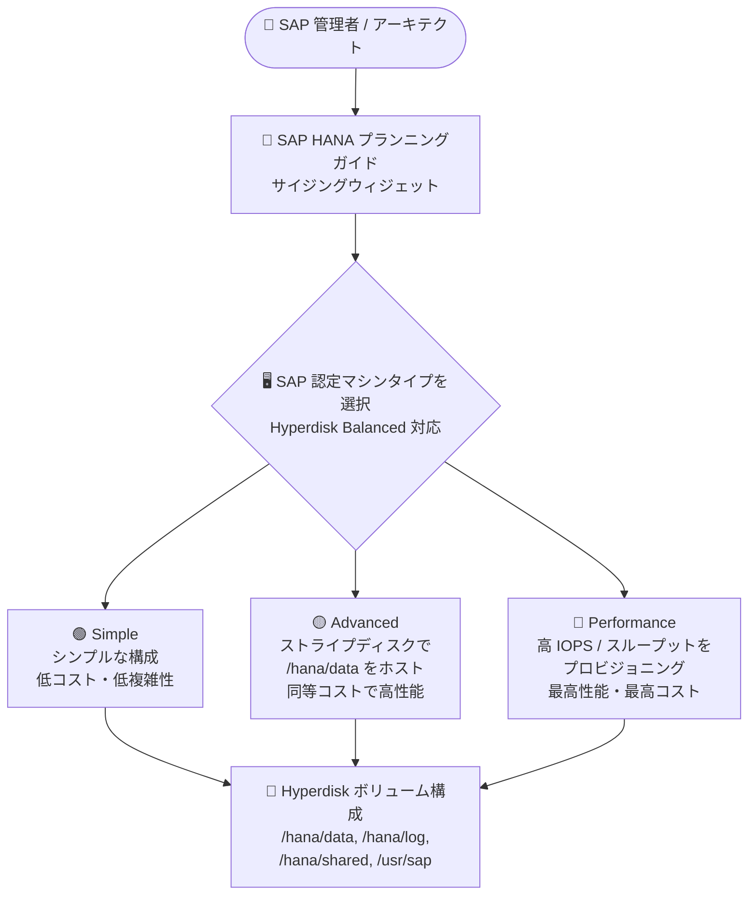

# SAP on Google Cloud: SAP HANA 向け Hyperdisk サイジングウィジェット

**リリース日**: 2026-09-29

**サービス**: SAP on Google Cloud

**機能**: SAP HANA 向け Hyperdisk サイジングウィジェット

**ステータス**: 発表 (Announcement)

📊 [このアップデートのインフォグラフィックを見る](https://takech9203.github.io/google-cloud-news-summary/20260929-sap-hana-hyperdisk-sizing-widget.html)

## 概要

SAP HANA プランニングガイドの「Minimum sizes for SSD-based Persistent Disk or Hyperdisk volumes」セクションに、Hyperdisk ベースのディスク構成を確認できるサイジングウィジェットが追加されました。このウィジェットでは、Hyperdisk Balanced の利用をサポートする SAP 認定マシンタイプを選択すると、Google Cloud が推奨する最大 3 つのディスク構成 (Simple / Advanced / Performance) が表示されます。

SAP HANA のディスクサイジングでは、`/hana/data`、`/hana/log`、`/hana/shared`、`/usr/sap` の各ボリュームについて、ストレージ容量要件だけでなくパフォーマンス要件 (IOPS、スループット) も考慮する必要があります。特に Hyperdisk はディスクサイズとパフォーマンスが独立しており、IOPS とスループットを個別にプロビジョニングするため、構成の選択肢が多く設計が複雑になりがちでした。このウィジェットにより、SAP HANA のサイズ要件とパフォーマンス要件の両方を満たす具体的な構成を、マシンタイプを選ぶだけで簡単に確認できるようになります。

対象ユーザーは、Google Cloud 上で SAP HANA の新規導入やディスク構成の見直し (Persistent Disk から Hyperdisk への移行を含む) を計画している Solutions Architect やインフラ担当者です。

**アップデート前の課題**

- SAP HANA の各ボリュームのサイズを、メモリベースの計算式 (`/hana/data` = 1 x メモリ、`/hana/log` = 0.5 x メモリまたは 512 GB の小さい方など) に基づいて手動で計算する必要があった
- Hyperdisk はディスクサイズとは独立して IOPS・スループットをプロビジョニングするため、SAP HANA の最小要件 (Hyperdisk Balanced では集約プロビジョニング IOPS 3,000、スループット 400 MiB/s 以上) を満たす構成をマシンタイプごとに個別に検討する必要があった
- パフォーマンス・デプロイの複雑さ・コストのトレードオフを比較検討するための、体系的にまとまった構成例がドキュメント上になかった

**アップデート後の改善**

- SAP 認定マシンタイプを選択するだけで、Google Cloud が推奨する最大 3 つの Hyperdisk ベースのディスク構成をウィジェット上で確認できるようになった
- Simple / Advanced / Performance の 3 構成が提示され、パフォーマンス・デプロイの複雑さ・コストの観点から自ワークロードに合った構成を選びやすくなった
- SAP HANA の最小ストレージ要件とパフォーマンス要件を満たすことを前提とした構成が提示されるため、サイジングミスのリスクを低減できる

## アーキテクチャ図

ウィジェットで SAP 認定マシンタイプを選択すると、Simple / Advanced / Performance の 3 つの推奨ディスク構成が提示され、要件に合った Hyperdisk ボリューム構成を選択できます。

## サービスアップデートの詳細

### 主要機能

1. **マシンタイプベースの構成提示**
   - Hyperdisk Balanced の利用をサポートする SAP 認定マシンタイプを選択すると、そのマシンタイプに合わせた最大 3 つのディスク構成が表示される
   - 提示される構成はいずれも SAP HANA の最小ストレージ要件とパフォーマンス要件を満たすように設計されている

2. **Simple / Advanced / Performance の 3 構成**
   - **Simple**: シンプルな構成。Advanced とほぼ同等のコストだが、性能は Advanced が上回る
   - **Advanced**: ストライプディスクで `/hana/data` ボリュームをホストすることで、Simple とほぼ同等のコストでより高い性能を実現。ただしストライプディスクの利用により、デプロイと保守運用の複雑さが増す
   - **Performance**: 高い IOPS とスループットをプロビジョニングすることで、ストライプディスク保守の複雑さなしに最大性能を実現する構成。多くの場合、3 構成の中で最もコストが高い

3. **スケールアップ / スケールアウト両対応の考え方**
   - ウィジェットが提示するディスク構成はスケールアップシステム向け
   - スケールアウトシステムでも `/hana/shared` 以外の計算は同じ。`/hana/shared` はワーカーノード 4 台ごとに「1 x メモリまたは 1 TB の小さい方」を加算する

## 技術仕様

### SAP HANA ボリュームのサイズ計算式 (スケールアップ)

| ボリューム | 最小サイズの目安 |
|------|------|
| `/hana/data` | 1 x メモリ |
| `/hana/log` | 0.5 x メモリ または 512 GB の小さい方 |
| `/hana/shared` | 1 x メモリ または 1,024 GB の小さい方 |
| `/usr/sap` | 32 GB |
| `/hanabackup` | 2 x メモリ (オプション) |

### Hyperdisk のパフォーマンス特性

| 項目 | 詳細 |
|------|------|
| パフォーマンスの決定要因 | ディスクサイズではなく、プロビジョニングした IOPS / スループット |
| Hyperdisk Balanced の SAP HANA 最小要件 | 集約プロビジョニング IOPS 3,000、スループット 400 MiB/s |
| Hyperdisk Extreme の IOPS 目安 (データ / ログ個別ディスク時) | max(10,000, ディスクサイズ GB x 2) |
| 推奨 SAP HANA 設定 (global.ini) | `fileio` セクションで `num_completion_queues = 12`、`num_submit_queues = 12` |
| 推奨 SAP HANA 設定 (indexserver.ini) | `parallel` セクションで `tables_preloaded_in_parallel = 32`、`global` セクションで `load_table_numa_aware = true` |

## 設定方法

### 前提条件

1. Hyperdisk Balanced の利用をサポートする SAP 認定マシンタイプを利用対象としていること
2. Persistent Disk のみをサポートするレガシーマシンタイプの場合は、従来どおり「Disk sizes for legacy machine and disk types」の表を参照すること

### 手順

#### ステップ 1: プランニングガイドのウィジェットにアクセス

[SAP HANA プランニングガイド](https://docs.cloud.google.com/sap/docs/sap-hana-planning-guide#hana-minimum-pd-sizes-ssd-balanced)の「Minimum sizes for SSD-based Persistent Disk or Hyperdisk volumes」セクションを開きます。

#### ステップ 2: マシンタイプを選択して構成を比較

ウィジェットで SAP 認定マシンタイプを選択し、表示される Simple / Advanced / Performance の各構成を、パフォーマンス・デプロイの複雑さ・コストの観点で比較して、要件に合う構成を選択します。

#### ステップ 3: ワークロードのサイジングと検証

提示される構成はあくまで初期推奨値のため、実際のワークロードでサイジングと検証を行い、最適なパフォーマンスが得られることを確認します。

## メリット

### ビジネス面

- **設計工数の削減**: マシンタイプを選択するだけで推奨ディスク構成を確認でき、SAP HANA 導入時のストレージ設計にかかる時間を短縮できる
- **コスト最適化の判断材料**: コスト・性能・運用複雑性のトレードオフが 3 構成として明示されるため、要件に応じた過不足のない投資判断がしやすくなる

### 技術面

- **サイジングミスの防止**: 提示される構成はいずれも SAP HANA の最小ストレージ要件・パフォーマンス要件を満たすよう設計されており、性能不足の構成を選んでしまうリスクを低減できる
- **Hyperdisk 移行の後押し**: Persistent Disk から Hyperdisk への移行を検討する際に、移行先の具体的な構成の目安を簡単に得られる

## デメリット・制約事項

### 制限事項

- ウィジェットが対象とするのは、Hyperdisk Balanced の利用をサポートする SAP 認定マシンタイプのみ。Persistent Disk のみ対応のレガシーマシンタイプは従来の表を参照する必要がある
- ウィジェットが提示するディスク構成はスケールアップシステム向け。スケールアウトシステムでは `/hana/shared` のサイズをワーカーノード数に応じて調整する必要がある

### 考慮すべき点

- 提示される構成はあくまで初期推奨値であり、Google Cloud はワークロードのサイジングと検証を実施して最適なパフォーマンスを確認することを強く推奨している
- Advanced 構成はストライプディスクを使用するため、デプロイと保守運用の複雑さが増す。Advanced 構成で示されるディスク数は必要最小限であり、ディスクを追加すればコストも増加する

## ユースケース

### ユースケース 1: SAP HANA の新規導入時のストレージ設計

**シナリオ**: Google Cloud 上に SAP HANA スケールアップシステムを新規導入するにあたり、選定したマシンタイプに対する適切な Hyperdisk 構成を短時間で決定したい。

**効果**: ウィジェットでマシンタイプを選択するだけで、要件を満たす 3 つの構成が提示されるため、手計算による設計とレビューの工数を削減し、要件超過や性能不足を避けた構成を選択できる。

### ユースケース 2: Persistent Disk から Hyperdisk への移行計画

**シナリオ**: SSD Persistent Disk (`pd-ssd`) で稼働中の SAP HANA を、より高い IOPS・スループットを提供する Hyperdisk へ移行する計画を立てたい。

**効果**: 移行先の Hyperdisk 構成 (ディスクサイズ、IOPS、スループット) の目安をウィジェットから取得でき、[Persistent Disk から Hyperdisk への移行ガイド](https://docs.cloud.google.com/sap/docs/migrate-hana-pd-to-hyperdisk)と組み合わせて移行計画を具体化できる。

## 料金

サイジングウィジェット自体はドキュメント上のツールであり、利用に料金は発生しません。提示される構成の Hyperdisk 費用は、プロビジョニングする容量・IOPS・スループットに応じて課金されます。詳細は [Compute Engine ディスクの料金ページ](https://cloud.google.com/compute/disks-image-pricing)を参照してください。

## 関連サービス・機能

- **Compute Engine Hyperdisk (Balanced / Extreme)**: SAP HANA の `/hana/data`、`/hana/log` などのボリュームをホストするブロックストレージ。ディスクサイズとは独立して IOPS・スループットをプロビジョニングできる
- **Compute Engine SAP 認定マシンタイプ**: ウィジェットの選択対象。マシンタイプごとにメモリ容量が異なり、それに応じて必要なディスクサイズが変わる
- **SAP HANA 用 Terraform デプロイ自動化**: Google Cloud が提供する Terraform 構成を使用すると、`/hana/data`、`/hana/log`、`/hana/shared`、`/usr/sap` の各ディスクが自動的にプロビジョニングされる

## 参考リンク

- 📊 [インフォグラフィック](https://takech9203.github.io/google-cloud-news-summary/20260929-sap-hana-hyperdisk-sizing-widget.html)
- [公式リリースノート](https://docs.cloud.google.com/release-notes#September_29_2026)
- [SAP HANA プランニングガイド (サイジングウィジェット)](https://docs.cloud.google.com/sap/docs/sap-hana-planning-guide#hana-minimum-pd-sizes-ssd-balanced)
- [About Hyperdisk](https://docs.cloud.google.com/compute/docs/disks/hyperdisks)
- [Hyperdisk のプロビジョニングパフォーマンス](https://docs.cloud.google.com/compute/docs/disks/hyperdisk-performance)
- [SAP HANA Persistent Disk ボリュームの Hyperdisk への移行](https://docs.cloud.google.com/sap/docs/migrate-hana-pd-to-hyperdisk)
- [料金ページ (Compute Engine ディスク)](https://cloud.google.com/compute/disks-image-pricing)

## まとめ

SAP HANA プランニングガイドに追加されたサイジングウィジェットにより、SAP 認定マシンタイプを選ぶだけで、SAP HANA のサイズ・パフォーマンス要件を満たす Hyperdisk 構成 (Simple / Advanced / Performance) を簡単に比較検討できるようになりました。Google Cloud で SAP HANA の新規導入や Hyperdisk への移行を計画している場合は、まずこのウィジェットで初期構成の目安を確認し、その上で実ワークロードでのサイジング検証を行うことを推奨します。

---

**タグ**: SAP on Google Cloud, SAP HANA, Hyperdisk, Compute Engine, ストレージ, サイジング
