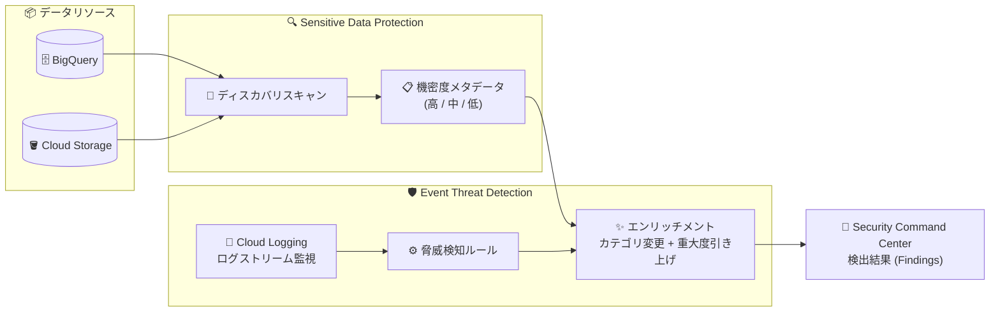

# Security Command Center: Event Threat Detection と Sensitive Data Protection の統合による機密データエンリッチメント

**リリース日**: 2026-09-29

**サービス**: Security Command Center

**機能**: Event Threat Detection の Sensitive Data Protection 統合 (Sensitive data enrichment)

**ステータス**: Feature (リリース)

📊 [このアップデートのインフォグラフィックを見る](https://takech9203.github.io/google-cloud-news-summary/20260929-scc-etd-sensitive-data-protection-enrichment.html)

## 概要

Security Command Center の脅威検知サービスである Event Threat Detection が、Sensitive Data Protection と統合され、機密リソースに影響する検出結果 (Finding) を自動的にエンリッチ (強化) できるようになりました。Sensitive Data Protection のディスカバリスキャンを有効化し、その結果を Security Command Center に送信するよう構成している場合、Event Threat Detection は BigQuery と Cloud Storage リソースの機密度メタデータを利用して検出結果を調整します。

具体的には、Sensitive Data Protection によって「高」または「中」の機密度と判定されたリソースに脅威が影響する場合、検出結果のカテゴリが機密リソースへの影響を示す専用カテゴリ (例: `Initial Access: Leaked Service Account Key Affecting Sensitive Data`) に変更されます。さらに、検出結果のデフォルト重大度が High 未満 (Low または Medium) の場合、重大度が 1 段階引き上げられます (例: Medium から High)。

このアップデートは、SOC チームやセキュリティ運用担当者が大量のアラートの中から「機密データに実際に影響する脅威」を優先的にトリアージできるようにするもので、データ中心のセキュリティ運用 (Data-Centric Security) を強化します。

**アップデート前の課題**

- Event Threat Detection の検出結果は、影響を受けたリソースに機密データが含まれているかどうかに関わらず、同じカテゴリ・同じデフォルト重大度で報告されていた
- 機密データを含むリソースへの脅威を優先するには、Sensitive Data Protection のデータプロファイルや観測結果 (Observation findings) をアナリストが手動で突き合わせる必要があった
- Low / Medium 重大度の検出結果に埋もれた「機密データに影響する脅威」を見逃すリスクがあった

**アップデート後の改善**

- 機密度が「高」または「中」のリソースに影響する脅威は、カテゴリ名に `Affecting Sensitive Data` が付与され、一目で機密リソースへの影響を識別できるようになった
- デフォルト重大度が Low / Medium の検出結果は自動的に 1 段階引き上げられ (Low → Medium、Medium → High)、トリアージの優先順位付けが自動化された
- Sensitive Data Protection のディスカバリ結果と Event Threat Detection の脅威検知が自動連携し、手動での突き合わせ作業が不要になった

## アーキテクチャ図

Sensitive Data Protection のディスカバリスキャンが BigQuery / Cloud Storage リソースの機密度を判定し、Event Threat Detection がその機密度メタデータを使って脅威検出結果のカテゴリ変更と重大度の引き上げを行い、Security Command Center に報告します。

## サービスアップデートの詳細

### 主要機能

1. **カテゴリの変更 (Category changes)**
   - Sensitive Data Protection によって機密度「高」または「中」と判定されたリソースに脅威が影響する場合、検出結果のカテゴリが機密リソースへの影響を示す専用カテゴリに更新される
   - 例: 漏洩したサービスアカウントキーが機密データを含むバケットへのアクセスに使用された場合、カテゴリが `Initial Access: Leaked Service Account Key Used` から `Initial Access: Leaked Service Account Key Affecting Sensitive Data` に変更される

2. **重大度の引き上げ (Severity upgrades)**
   - 検出結果のデフォルト重大度が High 未満 (Low または Medium) の場合、重大度が 1 段階引き上げられる
   - 例: Medium → High、Low → Medium
   - デフォルト重大度がすでに High の検出結果は、カテゴリのみ変更され重大度は変わらない

3. **BigQuery / Cloud Storage の機密度メタデータの活用**
   - Sensitive Data Protection のディスカバリスキャンが生成する BigQuery と Cloud Storage リソースの機密度メタデータを利用する
   - ディスカバリスキャンの結果を Security Command Center に送信するよう構成しておく必要がある

## 技術仕様

### 機密データエンリッチメントに対応する主な Event Threat Detection ルール

公式ドキュメントに記載されている、エンリッチメント適用時のカテゴリと重大度の変化の例です。

| エンリッチメント後のカテゴリ | 重大度の変化 |
|------|------|
| Initial Access: Leaked Service Account Key Affecting Sensitive Data | 変更なし (デフォルト High) |
| Initial Access: Dormant Service Account Action taken Affecting Sensitive Data | 変更なし (デフォルト High) |
| Initial Access: Successful API call made from a TOR proxy IP Affecting Sensitive Data | 変更なし (デフォルト High) |
| Privilege Escalation: Anomalous Impersonation of Service Account for Admin Activity Affecting Sensitive Data | Medium → High |
| Privilege Escalation: Anomalous Service Account Impersonator for Admin Activity Affecting Sensitive Data | Medium → High |
| Privilege Escalation: Anomalous Service Account Impersonator for Data Access Affecting Sensitive Data | Medium → High |
| Privilege Escalation: Anomalous Multistep Service Account Delegation for Admin Activity Affecting Sensitive Data | Medium → High |
| Privilege Escalation: Anomalous Multistep Service Account Delegation for Data Access Affecting Sensitive Data | Medium → High |
| Persistence: New API Method Affecting Sensitive Data | Low → Medium |
| Discovery: Information Gathering Tool Affecting Sensitive Data | Low → Medium |
| Discovery: AI Agent Unauthorized Service Account API Call Affecting Sensitive Data | Low → Medium |
| Resource Development: Offensive Security Distro Activity Affecting Sensitive Data | Low → Medium |

対応ルールの完全なリストは [Event Threat Detection のデフォルトルール](https://docs.cloud.google.com/security-command-center/docs/concepts-event-threat-detection-overview#rules) を参照してください。

## 設定方法

### 前提条件

1. Security Command Center Premium ティアが有効であること (Event Threat Detection は Premium ティアの組み込みサービス)
2. Sensitive Data Protection のディスカバリスキャンが有効であること
3. ディスカバリスキャンの結果を Security Command Center に送信するよう構成されていること

### 手順

#### ステップ 1: 機密データディスカバリを有効化する

Security Command Center Premium を組織レベルで有効化している場合、組織レベルの Sensitive Data Protection ディスカバリサービスのサブスクリプションが含まれており、組織またはフォルダレベルでのディスカバリ実行に追加料金は発生しません。組織レベルでデフォルト設定のディスカバリを有効化する手順は、[機密データディスカバリの有効化](https://docs.cloud.google.com/security-command-center/docs/activate-sensitive-data-discovery) を参照してください。

#### ステップ 2: ディスカバリ結果の Security Command Center への送信を確認する

ディスカバリスキャンの構成で、結果 (データプロファイル) を Security Command Center に送信する設定が有効になっていることを確認します。これにより、BigQuery / Cloud Storage リソースの機密度メタデータが Event Threat Detection から参照可能になります。

#### ステップ 3: 検出結果を確認する

エンリッチメントが適用されると、対象の検出結果は `... Affecting Sensitive Data` カテゴリとして Security Command Center に表示されます。既存の通知や自動化 (Pub/Sub エクスポートなど) でカテゴリ名や重大度をフィルタ条件にしている場合は、新しいカテゴリ名を考慮して条件を見直してください。

## メリット

### ビジネス面

- **リスクベースの優先順位付け**: 機密データに影響する脅威が自動的に可視化・格上げされるため、ビジネスインパクトの大きいインシデントへの対応を最優先できる
- **コンプライアンス対応の強化**: 個人情報や機密情報を含むリソースへの脅威を明確に識別できるため、規制対応やインシデント報告の判断材料が充実する

### 技術面

- **トリアージの自動化**: アナリストが Sensitive Data Protection のデータプロファイルと脅威検出結果を手動で突き合わせる作業が不要になる
- **アラート疲れの軽減**: カテゴリ名 (`Affecting Sensitive Data`) と重大度で機械的にフィルタリングでき、SOAR や通知パイプラインでの自動振り分けが容易になる
- **既存機能との統合**: Sensitive Data Protection の観測結果を利用した高価値リソース指定 (攻撃パスシミュレーション) と組み合わせ、データ機密度を軸とした一貫したセキュリティ運用が可能

## デメリット・制約事項

### 制限事項

- エンリッチメントに利用される機密度メタデータは BigQuery と Cloud Storage リソースが対象
- Sensitive Data Protection のディスカバリスキャンを有効化し、結果を Security Command Center に送信するよう構成していない場合、エンリッチメントは行われない
- すべての Event Threat Detection ルールが対応しているわけではなく、対応ルールは公式ドキュメントのルール一覧で確認する必要がある

### 考慮すべき点

- カテゴリ名が変更されるため、既存の検出結果カテゴリに依存した通知フィルタ、ミュートルール、SOAR プレイブックは新カテゴリ (`... Affecting Sensitive Data`) を考慮した更新が必要
- 重大度の自動引き上げにより High 重大度の検出結果が増加する可能性があるため、エスカレーションフローへの影響を事前に評価するとよい
- Security Command Center のティアやアクティベーションレベル (組織 / プロジェクト) によって、ディスカバリの課金体系が異なる (Premium の組織レベル有効化ではディスカバリ費用が含まれるが、プロジェクトレベルのディスカバリは別途課金)

## ユースケース

### ユースケース 1: 漏洩したサービスアカウントキーによる機密バケットへのアクセス検知

**シナリオ**: 外部に漏洩したサービスアカウントキーが使用され、Sensitive Data Protection によって機密度「高」と判定された Cloud Storage バケットにアクセスされた。

**効果**: 検出結果のカテゴリが `Initial Access: Leaked Service Account Key Affecting Sensitive Data` となり、通常のキー漏洩アラートと区別して、機密データ流出リスクのあるインシデントとして即時にエスカレーションできる。

### ユースケース 2: 機密データを含む BigQuery データセットへの異常なサービスアカウント権限昇格の検知

**シナリオ**: 異常なサービスアカウントのなりすまし (Impersonation) によって、機密度の高い BigQuery データセットへのデータアクセスが行われた。

**効果**: `Privilege Escalation: Anomalous Service Account Impersonator for Data Access Affecting Sensitive Data` として重大度が Medium から High に引き上げられ、SOC の優先対応キューに自動的に入る。データ持ち出しの初期段階で対処できる可能性が高まる。

## 料金

このエンリッチメント機能自体に関する個別の料金情報はリリースノートに記載されていません。前提となるサービスの料金は以下のとおりです。

- Event Threat Detection は Security Command Center Premium ティアの組み込みサービス
- Security Command Center Premium を組織レベルで有効化している場合、組織・フォルダレベルの機密データディスカバリはサブスクリプションに含まれる (プロジェクトレベルのディスカバリは [Sensitive Data Protection のデータプロファイリング料金](https://cloud.google.com/sensitive-data-protection/pricing#data_profiling_pricing) が別途適用)

詳細は [Security Command Center の料金ページ](https://cloud.google.com/security-command-center/pricing) を参照してください。

## 関連サービス・機能

- **Sensitive Data Protection**: ディスカバリサービスが BigQuery / Cloud Storage のデータプロファイルを生成し、機密度・データリスクレベルを判定する。本アップデートのエンリッチメントの情報源
- **Cloud Logging**: Event Threat Detection が脅威検知のために監視するログストリーム (Cloud Audit Logs、VPC Flow Logs、Cloud DNS ログなど) の基盤
- **攻撃パスシミュレーション (Attack Path Simulation)**: データ機密度に基づいてリソースの優先度値を自動設定でき、本機能と合わせてデータ中心のリスク評価を実現
- **Google Security Operations (Google SecOps)**: 組織レベルで Premium を有効化している場合、検出結果の詳細調査に利用可能

## 参考リンク

- 📊 [インフォグラフィック](https://takech9203.github.io/google-cloud-news-summary/20260929-scc-etd-sensitive-data-protection-enrichment.html)
- [公式リリースノート](https://docs.cloud.google.com/release-notes#September_29_2026)
- [Sensitive data enrichment (Event Threat Detection の概要)](https://docs.cloud.google.com/security-command-center/docs/concepts-event-threat-detection-overview#sdp-enrichment)
- [機密データディスカバリの有効化](https://docs.cloud.google.com/security-command-center/docs/activate-sensitive-data-discovery)
- [Event Threat Detection のデフォルトルール](https://docs.cloud.google.com/security-command-center/docs/concepts-event-threat-detection-overview#rules)
- [料金ページ (Security Command Center)](https://cloud.google.com/security-command-center/pricing)

## まとめ

Event Threat Detection と Sensitive Data Protection の統合により、機密データに影響する脅威が専用カテゴリと引き上げられた重大度で自動的に可視化されるようになり、データ中心の脅威トリアージが大幅に効率化されます。Security Command Center Premium を利用している組織は、機密データディスカバリの有効化とディスカバリ結果の Security Command Center への送信設定を確認し、既存の通知フィルタや自動化を新しい `Affecting Sensitive Data` カテゴリに対応させることを推奨します。

---

**タグ**: #SecurityCommandCenter #EventThreatDetection #SensitiveDataProtection #セキュリティ #脅威検知 #DLP #BigQuery #CloudStorage
