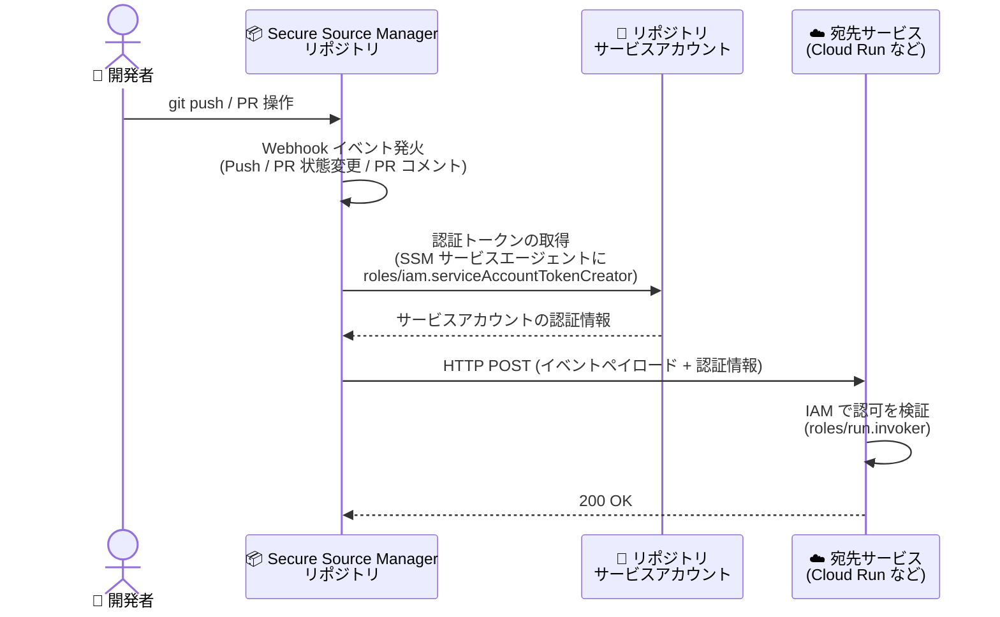

# Secure Source Manager: Webhook のサービスアカウント認可サポート

**リリース日**: 2026-09-29

**サービス**: Secure Source Manager

**機能**: Webhook のサービスアカウント認可 (Service Account Authorization)

**ステータス**: Feature

📊 [このアップデートのインフォグラフィックを見る](https://takech9203.github.io/google-cloud-news-summary/20260929-secure-source-manager-webhook-service-account-auth.html)

## 概要

Secure Source Manager の Webhook が、サービスアカウントによる認可 (Service Account Authorization) をサポートしました。Secure Source Manager の Webhook は、リポジトリ内のイベント (Push、Pull Request の状態変更、Pull Request コメント) をトリガーとして、指定した URL に HTTP リクエストを送信する機能です。今回のアップデートにより、Webhook リクエストの認証手段として、従来の機密クエリ文字列 (Sensitive Query String) に加えて、リポジトリのサービスアカウントを利用した IAM ベースの認可が選択できるようになりました。

これにより、Cloud Run などの IAM で保護された宛先サービスに対して、URL に秘密情報 (キーやシークレット) を埋め込むことなく、サービスアカウントの権限に基づいて安全に Webhook を配信できます。CI/CD パイプラインのトリガーやイベント通知を、Google Cloud の IAM モデルに統合された形で構成したい組織に有用なアップデートです。

**アップデート前の課題**

- Webhook の認証手段は機密クエリ文字列 (`key=...&secret=...` 形式) のみで、ターゲット URL に付与するトークンやシークレットの管理が必要だった
- IAM で保護された Cloud Run サービスなどを宛先にする場合、シークレットベースの検証を独自に実装するか、宛先を公開 URL にする必要があった
- シークレットのローテーションや漏えいリスクへの対応を利用者側で行う必要があった

**アップデート後の改善**

- Webhook 作成時に「サービスアカウント認証」を選択できるようになり、リポジトリのサービスアカウントを使った IAM ベースの認可が可能になった
- IAM で保護された宛先 (Cloud Run など) に対して、`roles/run.invoker` を付与するだけで認証付きの Webhook 配信ができるようになった
- URL 中のキーやシークレットの管理・ローテーションが不要になり、認可の管理を IAM ロールの付与に一元化できるようになった

## アーキテクチャ図



サービスアカウント認可を有効にした Webhook では、Secure Source Manager がリポジトリのサービスアカウントとして認証情報を取得し、認証付きリクエストを宛先サービスに送信します。宛先が Cloud Run の場合は、サービスアカウントに `roles/run.invoker` を付与することで IAM による認可検証が行われます。

## サービスアップデートの詳細

### 主要機能

1. **サービスアカウントによる Webhook 認可**
   - Webhook の認証方式として、従来の機密クエリ文字列に加えてサービスアカウント認証を選択可能
   - リポジトリのサービスアカウントを利用して、Webhook リクエストに認証情報を付与
   - Web インターフェイスでは「Enable service account authentication」を選択して有効化

2. **REST API での構成 (`serviceAccountAuth`)**
   - `hooks.create` メソッドのリクエストボディに `"serviceAccountAuth": true` を指定して作成可能
   - 機密クエリ文字列と異なり、ターゲット URI にキーやシークレットを含める必要がない

3. **IAM で保護された宛先への配信**
   - 宛先が Cloud Run の場合、リポジトリのサービスアカウントに `roles/run.invoker` を付与することで認証付き配信が可能
   - 認可の管理を Google Cloud の IAM ロール付与に統一できる

## 技術仕様

### サービスアカウント認可に必要なロール

| ロール | 付与対象 | 用途 |
|------|------|------|
| `roles/iam.serviceAccountUser` (Service Account User) | Secure Source Manager リポジトリのサービスアカウント | Webhook を構成するユーザーがサービスアカウントを利用するために必要 |
| `roles/iam.serviceAccountTokenCreator` (Service Account Token Creator) | Secure Source Manager リポジトリのサービスアカウント (SSM サービスエージェントに付与) | サービスアカウントとして認証トークンを生成するために必要 |
| `roles/run.invoker` (Cloud Run Invoker) | 宛先サービス (宛先が Cloud Run の場合のみ必要) | 認証付きリクエストで Cloud Run サービスを呼び出すために必要 |

参考: 従来の機密クエリ文字列による認証では、リポジトリに対する `roles/securesourcemanager.repoAdmin` と、インスタンスに対する `roles/securesourcemanager.instanceAccessor` が必要です。

### Webhook のトリガーイベント

| イベント | 説明 |
|------|------|
| Push | リポジトリへの push で発火 (Git refs のグロブパターンによるブランチフィルタ可能) |
| Pull request state changed | Pull Request のオープン、クローズ、再オープン、編集で発火 |
| Pull request comment | Pull Request へのコメントの追加、編集、削除で発火 |

### REST API での作成例

```bash
curl -X POST \
  -H "Authorization: Bearer $(gcloud auth print-access-token)" \
  -H "Content-Type: application/json" \
  -d '{
    "targetUri": "https://${SERVICE_NAME}.app/webhook",
    "events": ["PUSH"],
    "serviceAccountAuth": true
  }' \
  "https://securesourcemanager.googleapis.com/v1/projects/${PROJECT_ID}/locations/${LOCATION}/repositories/${REPOSITORY}/hooks?hook_id=${HOOK_ID}"
```

## 設定方法

### 前提条件

1. Secure Source Manager インスタンスが作成済みであること
2. Secure Source Manager リポジトリが作成済みであること
3. リポジトリのサービスアカウントに、前述の「サービスアカウント認可に必要なロール」が付与されていること

### 手順 (Web インターフェイス)

#### ステップ 1: Webhook の作成画面を開く

Secure Source Manager の Web インターフェイスで対象リポジトリに移動し、**Settings** > **Webhooks** > **Add webhook** をクリックします。

#### ステップ 2: Webhook を構成する

1. **Hook ID** に Webhook の ID を入力する (小文字・数字・ハイフンのみ、先頭は英字、作成後は変更不可)
2. **Target URL** に宛先 URL を入力する
3. **Trigger on** でトリガーイベント (Push / Pull request state changed など) を選択する

#### ステップ 3: サービスアカウント認証を有効化する

1. リポジトリのサービスアカウントに必要な IAM ロールが付与されていることを確認する
2. **Enable service account authentication** を選択する
3. **Add webhook** をクリックして作成する

#### ステップ 4: Webhook をテストする

作成した Webhook のページ下部にある **Test delivery** をクリックすると、プレースホルダーイベントが配信キューに追加されます。**Recent deliveries** セクションでリクエストとレスポンスの内容を確認できます。

## メリット

### ビジネス面

- **セキュリティ姿勢の向上**: URL に埋め込むシークレットが不要になり、シークレット漏えいやローテーション漏れのリスクを低減できる
- **ガバナンスの一元化**: Webhook の認可を IAM ロールの付与として管理でき、既存の Google Cloud のアクセス管理プロセスに統合できる

### 技術面

- **IAM 保護された宛先への直接配信**: Cloud Run などの認証必須のエンドポイントを、公開設定にせず Webhook の宛先にできる
- **構成のシンプル化**: REST API では `"serviceAccountAuth": true` を指定するだけで有効化でき、機密クエリ文字列の組み立てが不要

## デメリット・制約事項

### 考慮すべき点

- サービスアカウント認可を利用するには、リポジトリのサービスアカウントに対する複数の IAM ロール (`roles/iam.serviceAccountUser`、`roles/iam.serviceAccountTokenCreator`) の事前設定が必要
- 宛先が Cloud Run の場合は、宛先サービスへの `roles/run.invoker` の付与が別途必要
- Hook ID は作成後に変更できないため、命名規則を事前に決めておく必要がある

## ユースケース

### ユースケース 1: 認証必須の Cloud Run サービスへの CI/CD トリガー

**シナリオ**: Secure Source Manager リポジトリへの push をトリガーに、IAM 認証を必須にした Cloud Run 上のビルドトリガーサービスを呼び出したい。従来はシークレット付き URL と公開エンドポイントが必要だった。

**実装例**:
```bash
# リポジトリのサービスアカウントに Cloud Run Invoker を付与
gcloud run services add-iam-policy-binding ${SERVICE_NAME} \
  --member="serviceAccount:${REPO_SERVICE_ACCOUNT}" \
  --role="roles/run.invoker" \
  --region=${REGION}

# サービスアカウント認証を有効にした Webhook を作成
curl -X POST \
  -H "Authorization: Bearer $(gcloud auth print-access-token)" \
  -H "Content-Type: application/json" \
  -d '{"targetUri": "https://${SERVICE_NAME}.app/webhook", "events": ["PUSH"], "serviceAccountAuth": true}' \
  "https://securesourcemanager.googleapis.com/v1/projects/${PROJECT_ID}/locations/${LOCATION}/repositories/${REPOSITORY}/hooks?hook_id=build-trigger"
```

**効果**: 宛先サービスを未認証アクセス不可のまま維持でき、シークレット管理なしで push イベントからビルドを起動できる。

### ユースケース 2: シークレットベース Webhook からの移行

**シナリオ**: 機密クエリ文字列で運用している既存の Webhook について、シークレットのローテーション運用の負荷を削減し、IAM ベースの認可に統一したい。

**効果**: 認可の設定・剥奪を IAM ロールの付与・削除で管理でき、シークレットの定期ローテーションや漏えい時の再発行作業が不要になる。

## 関連サービス・機能

- **Cloud Run**: サービスアカウント認可の代表的な宛先。`roles/run.invoker` の付与により認証付きで Webhook を受信できる
- **IAM (Identity and Access Management)**: サービスアカウントへのロール付与により Webhook の認可を管理する基盤
- **Cloud Build**: Webhook ペイロードのデータを Cloud Build YAML の代入変数として利用し、ビルドトリガーと連携可能
- **Jenkins**: Webhook のターゲット URL に Jenkins のトリガー URL を指定して、外部 CI とも連携可能

## 参考リンク

- 📊 [インフォグラフィック](https://takech9203.github.io/google-cloud-news-summary/20260929-secure-source-manager-webhook-service-account-auth.html)
- [公式リリースノート](https://docs.cloud.google.com/release-notes#September_29_2026)
- [Webhooks overview](https://docs.cloud.google.com/secure-source-manager/docs/webhooks-overview)
- [Set up webhooks](https://docs.cloud.google.com/secure-source-manager/docs/set-up-webhooks)

## まとめ

Secure Source Manager の Webhook にサービスアカウント認可が追加され、URL 埋め込みのシークレットに依存せず、IAM ベースで安全に Webhook を配信できるようになりました。特に Cloud Run など IAM で保護されたサービスを宛先とする CI/CD パイプラインを構築している場合は、機密クエリ文字列からの移行を検討することを推奨します。まずはリポジトリのサービスアカウントへの必要ロールの付与と、テスト配信での動作確認から始めるとよいでしょう。

---

**タグ**: #SecureSourceManager #Webhook #ServiceAccount #IAM #CloudRun #セキュリティ #CICD
