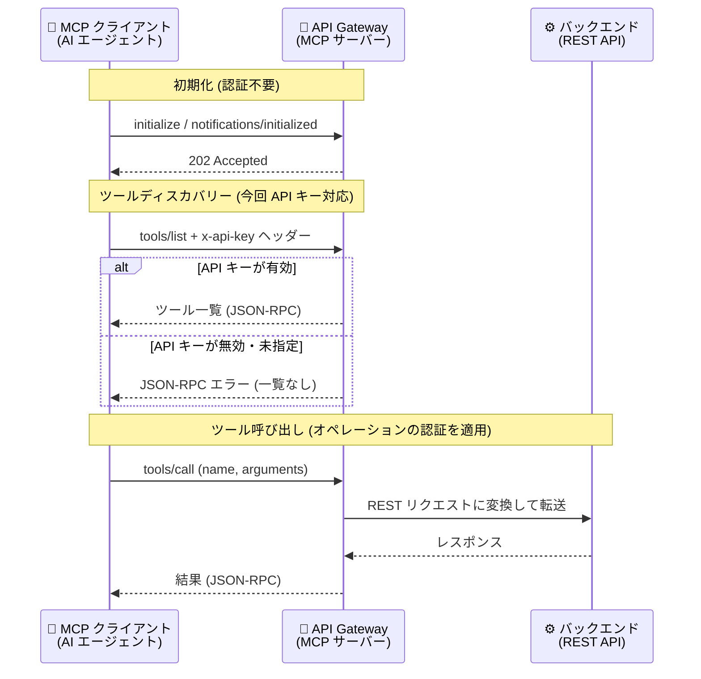

# API Gateway: MCP tools/list メソッドの API キー認証サポート

**リリース日**: 2026-09-30

**サービス**: API Gateway

**機能**: Model Context Protocol (MCP) tools/list メソッドの API キー認証

**ステータス**: Preview

📊 [このアップデートのインフォグラフィックを見る](https://takech9203.github.io/google-cloud-news-summary/20260930-api-gateway-mcp-tools-list-api-key-auth.html)

## 概要

API Gateway の Model Context Protocol (MCP) 機能において、ツール一覧を列挙する `tools/list` メソッドに対する API キー認証がサポートされました。OpenAPI 3.x 仕様の `x-google-api-management/mcp` 配下にある `tools-list.security` で、従来の JWT セキュリティスキームに加えて API キーセキュリティスキームを指定できるようになります。

API Gateway を MCP サーバーとして構成すると、既存の REST API を AI エージェントのツールとして公開できます (2026 年 9 月 11 日に Public Preview として発表)。`tools/list` はエージェントが利用可能なツールを発見するためのメソッドで、デフォルトでは認証なしで呼び出せるため、公式ドキュメントではセキュリティのベストプラクティスとして `tools-list.security` による認証の有効化が強く推奨されています。今回のアップデートにより、JWT の発行基盤を持たない環境でも API キーだけでツールディスカバリーを保護できるようになりました。

API キーを使用する場合、クライアントはキーを `x-api-key` HTTP ヘッダーで送信する必要があります。`tools/list` はクエリパラメータからの API キー読み取りには対応していません。有効なキーがないリクエストには JSON-RPC エラーが返され、ツール一覧は取得できません。

**アップデート前の課題**

- `tools/list` メソッドはデフォルトで認証なしのため、保護するには `tools-list.security` の設定が必要だったが、指定できるのは JWT セキュリティスキームのみだった
- JWT を使う場合はトークン発行基盤 (ID プロバイダ) が必要で、API キーのみで運用している API では `tools/list` だけのために JWT 構成を追加する必要があった
- ツール呼び出し (`tools/call`) は API キー認証に対応している一方、ツールディスカバリーは API キーで保護できず、認証方式を統一できなかった

**アップデート後の改善**

- `tools-list.security` に API キーセキュリティスキーム (`type: apiKey`) を指定できるようになり、JWT と API キーのどちらでも `tools/list` を保護できるようになった
- API キー運用のみの API でも、追加の認証基盤なしでツールディスカバリーを保護可能になった
- `tools/call` (基盤となるオペレーションの API キー要件を適用) と `tools/list` の両方を API キーで統一的に保護できるようになった

## アーキテクチャ図



MCP クライアントが `tools/list` を呼び出す際、`x-api-key` ヘッダーで API キーを提示します。API Gateway がキーを検証し、有効な場合のみツール一覧を返却します。

## サービスアップデートの詳細

### 主要機能

1. **`tools-list.security` での API キースキーム指定**
   - `x-google-api-management/mcp/tools-list/security` に、`components.securitySchemes` で定義した API キースキームを指定可能
   - 従来サポートされていた JWT スキームに加えての選択肢となる
   - 指定できるセキュリティスキームはちょうど 1 つ (JWT または API キー)

2. **`x-api-key` ヘッダーによるキー送信**
   - クライアントは API キーを `x-api-key` HTTP ヘッダーで送信する
   - `tools/list` はクエリパラメータからの API キー読み取りには対応していない
   - 有効なキーがないリクエストには JSON-RPC エラーが返され、ツール一覧は取得できない

3. **MCP メソッドごとの認証モデル**
   - `initialize` / `notifications/initialized`: 認証不要
   - `tools/list`: デフォルトは認証なし。`tools-list.security` で JWT または API キーによる認証を有効化可能 (有効化を強く推奨)
   - `tools/call`: OpenAPI 仕様で基盤オペレーションに定義された認証ポリシー (API キーまたは JWT) をそのまま適用

## 技術仕様

### 認証モデルの比較

| MCP メソッド | デフォルト | 設定可能な認証 |
|------|------|------|
| `initialize` / `notifications/initialized` | 認証なし | なし (常に認証不要) |
| `tools/list` | 認証なし | JWT または **API キー (今回追加)** |
| `tools/call` | オペレーションの認証を適用 | 基盤 REST オペレーションと同じ API キー / JWT 要件 |

### 設定バリデーション (セキュリティ関連)

| 項目 | 内容 |
|------|------|
| スキーム数 | `tools-list.security` にはちょうど 1 つのセキュリティスキームを指定する |
| スキーム定義場所 | `components.securitySchemes` 配下に定義されている必要がある |
| スキーム種別 | JWT スキームまたは API キースキーム |
| JWT の場合の追加要件 | 仕様のトップレベル `security` 要件にも同じスキームを指定する必要がある |
| API キーの送信方法 | `x-api-key` HTTP ヘッダー (クエリパラメータ不可) |
| OpenAPI バージョン | OpenAPI 3.x のみ (OpenAPI 2.0 は MCP 非対応) |

### API キー認証の設定例

```yaml
x-google-api-management:
  mcp:
    tools-list:
      security:
        api_key: []
components:
  securitySchemes:
    api_key:
      type: apiKey
      name: x-api-key
      in: header
```

## 設定方法

### 前提条件

1. 有効な OpenAPI 3.x 仕様があること (MCP は OpenAPI 2.0 非対応)
2. API Gateway の基本概念を理解していること
3. API キーを作成済みであること ([Use API keys](https://docs.cloud.google.com/api-gateway/docs/authenticate-api-keys) を参照)

### 手順

#### ステップ 1: OpenAPI 仕様に API キースキームと tools-list.security を追加

```yaml
openapi: 3.0.3
info:
  title: Bookstore API
  version: 1.0.0
x-google-api-management:
  mcp:
    tools-list:
      security:
        api_key: []
components:
  securitySchemes:
    api_key:
      type: apiKey
      name: x-api-key
      in: header
```

`mcp` 拡張をオブジェクトとして構成すると、対象となるすべてのオペレーションで MCP がグローバルに有効化される点に注意してください。`tools/list` のセキュリティのみ設定し、一部のオペレーションを公開したくない場合は、該当オペレーションに `x-google-mcp-tool: false` を明示的に設定してオプトアウトします。

#### ステップ 2: API config を作成しゲートウェイにデプロイ

アノテーションを追加した仕様から API config を作成し、通常のフローでゲートウェイにデプロイします。詳細は [Deploying an API to a gateway](https://docs.cloud.google.com/api-gateway/docs/deploying-api) を参照してください。

#### ステップ 3: API キー付きで tools/list を検証

```bash
curl -X POST https://my-gateway-12345.uc.a.run.app/mcp \
  -H "Content-Type: application/json" \
  -H "MCP-Protocol-Version: 2025-11-25" \
  -H "x-api-key: YOUR_API_KEY" \
  -d '{"jsonrpc": "2.0", "id": 2, "method": "tools/list"}'
```

有効なキーが提示された場合のみツール一覧が返却されます。キーがない、または無効な場合は JSON-RPC エラーが返り、ツール一覧は取得できません。

## メリット

### ビジネス面

- **ツール情報の漏えいリスク低減**: 認証なしのツールディスカバリーを放置せず、API キーという軽量な手段で API の機能一覧 (ツール名、説明、パラメータスキーマ) の露出を防げる
- **導入ハードルの低下**: JWT の発行基盤を持たない組織でも、MCP サーバーのセキュリティベストプラクティス (tools/list の保護) を即座に適用できる

### 技術面

- **認証方式の統一**: API キーで保護している既存 REST API では、`tools/call` と `tools/list` を同じ API キー体系で保護でき、構成がシンプルになる
- **既存の API キー管理との統合**: Google Cloud の API キー作成・管理フローをそのまま利用できる

## デメリット・制約事項

### 制限事項

- MCP 機能自体が Preview (Pre-GA) であり、Pre-GA Offerings Terms が適用される
- `tools-list.security` に指定できるセキュリティスキームは 1 つのみ (JWT と API キーの併用指定は不可)
- API キーは `x-api-key` HTTP ヘッダーでのみ受け付け、クエリパラメータでは送信できない
- MCP は OpenAPI 3.x 仕様のみ対応 (OpenAPI 2.0 は非対応)

### 考慮すべき点

- `mcp` 拡張をオブジェクト形式で構成すると、対象オペレーションすべてで MCP がグローバル有効化されるため、公開したくないオペレーションは `x-google-mcp-tool: false` で明示的にオプトアウトが必要
- API キーは JWT と比べて利用者の識別やクレームベースの制御ができないため、要件に応じて JWT との使い分けを検討する
- `tools/call` の認証は基盤オペレーションの設定に従うため、`tools/list` の保護とあわせて各オペレーションの認証設定も確認する

## ユースケース

### ユースケース 1: API キー運用の既存 API を MCP ツールとして安全に公開

**シナリオ**: API キーで保護された社内向け REST API を AI エージェントのツールとして公開したいが、JWT の発行基盤がなく、ツールディスカバリーを無認証のまま公開することは避けたい。

**実装例**:
```yaml
x-google-api-management:
  mcp:
    tools-list:
      security:
        api_key: []
components:
  securitySchemes:
    api_key:
      type: apiKey
      name: x-api-key
      in: header
```

**効果**: 追加の認証基盤を構築することなく、既存の API キー管理のまま `tools/list` と `tools/call` の両方を保護し、許可されたエージェントのみがツール一覧を取得できる。

### ユースケース 2: エージェント基盤へのツール提供時のディスカバリー制御

**シナリオ**: MCP クライアント (AI エージェント基盤) に自社 API のツール群を提供するにあたり、契約済みのクライアントにのみ API キーを配布し、ツールの存在やパラメータスキーマを第三者から参照できないようにしたい。

**効果**: API キーを持つクライアントのみが `tools/list` でツール定義を取得でき、API の機能構成の不要な露出を防止できる。

## 料金

API Gateway の料金は API 呼び出し数に基づく従量課金で、MCP の API キー認証に固有の追加料金は現時点で案内されていません。

### 料金例 (API 呼び出し)

| 月間 API 呼び出し数 (課金アカウントごと) | 100 万回あたりの料金 |
|--------|-----------------|
| 0 - 200 万回 | 無料 ($0.00) |
| 200 万 - 10 億回 | $3.00 |
| 10 億回超 | $1.50 |

このほか、ネットワーク料金が別途発生します。詳細は[料金ページ](https://cloud.google.com/api-gateway/pricing)を参照してください。

## 利用可能リージョン

リージョン別の提供状況は公式ドキュメントで確認してください: [API Gateway ドキュメント](https://docs.cloud.google.com/api-gateway/docs)

## 関連サービス・機能

- **API Gateway MCP サーバー機能 (2026-09-11 発表)**: 今回のアップデートの基盤となる機能。OpenAPI 3.x 仕様へのアノテーションで既存 REST API を MCP ツールとして公開できる
- **API キー (Use API keys)**: `tools-list.security` で使用する API キーの作成・管理。API Gateway の標準的な API キー認証と共通
- **Cloud Monitoring / Cloud Logging**: MCP リクエストは標準の API Gateway メトリクスとログに記録され、リクエストパス (通常 `/mcp` で終わる) で REST トラフィックと区別可能

## 参考リンク

- 📊 [インフォグラフィック](https://takech9203.github.io/google-cloud-news-summary/20260930-api-gateway-mcp-tools-list-api-key-auth.html)
- [公式リリースノート](https://docs.cloud.google.com/release-notes#September_30_2026)
- [Configure Model Context Protocol](https://docs.cloud.google.com/api-gateway/docs/mcp-configure)
- [Model Context Protocol overview](https://docs.cloud.google.com/api-gateway/docs/mcp-overview)
- [Use API keys](https://docs.cloud.google.com/api-gateway/docs/authenticate-api-keys)
- [料金ページ](https://cloud.google.com/api-gateway/pricing)

## まとめ

MCP のツールディスカバリー (`tools/list`) を API キーで保護できるようになり、JWT 基盤を持たない環境でも API Gateway の MCP サーバー機能をセキュアに運用しやすくなりました。API Gateway で MCP を利用中・検討中の場合は、無認証のまま運用せず、`tools-list.security` に API キーまたは JWT スキームを設定してツールディスカバリーを保護することを推奨します。

---

**タグ**: API Gateway, MCP, Model Context Protocol, API キー, 認証, セキュリティ, AI エージェント, Preview
